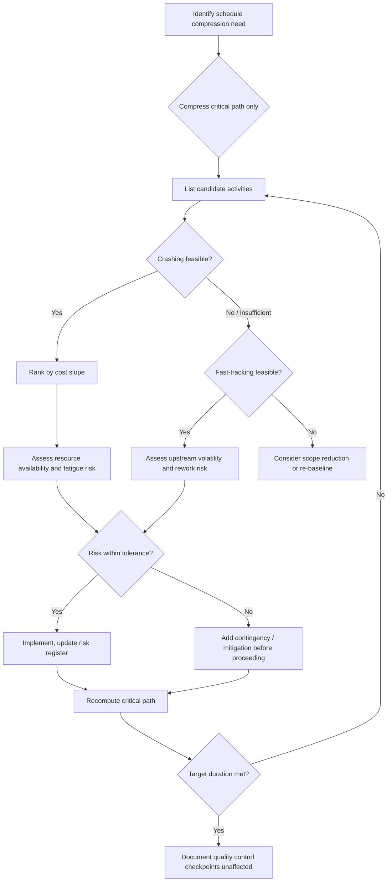

## Balancing Compression Against Risk and Quality

### Overview

Schedule compression techniques (crashing and fast-tracking) reduce project duration but introduce risk, cost, and quality trade-offs that must be systematically evaluated. Balancing compression against risk and quality means applying a disciplined decision framework rather than compressing schedules reactively, ensuring that time savings do not create disproportionate exposure to cost overruns, rework, safety incidents, or scope failure.

**Key Points**

- Compression is not free — every technique trades time for cost, risk, or quality
- Decisions must be evaluated on the critical path, since compressing non-critical activities wastes resources
- Risk and quality impacts often surface later in the schedule (or after handover), making them harder to detect than immediate cost impacts

---

### The Core Trade-off Triangle

Schedule compression sits at the intersection of three constraints. Pulling on the "time" lever transmits force to the other two.

$$\text{Time} \downarrow \Rightarrow \text{Cost} \uparrow \text{ or } \text{Risk} \uparrow \text{ or } \text{Quality} \downarrow$$

<svg xmlns="http://www.w3.org/2000/svg" viewBox="0 0 500 460" font-family="sans-serif">
<text x="250" y="28" font-size="16" font-weight="bold" text-anchor="middle" fill="#1a1a1a">Compression Trade-off Triangle (svg_diagram)</text>

<polygon points="250,70 90,370 410,370" fill="none" stroke="#2c3e50" stroke-width="2.5" />

<circle cx="250" cy="70" r="8" fill="#c0392b" />
<text x="250" y="55" font-size="14" font-weight="bold" text-anchor="middle" fill="#c0392b">TIME</text>
<text x="250" y="48" font-size="11" text-anchor="middle" fill="#555">(compressed)</text>
<circle cx="90" cy="370" r="8" fill="#2980b9" />
<text x="90" y="395" font-size="14" font-weight="bold" text-anchor="middle" fill="#2980b9">COST</text>
<text x="90" y="412" font-size="11" text-anchor="middle" fill="#555">(crashing)</text>
<circle cx="410" cy="370" r="8" fill="#27ae60" />
<text x="410" y="395" font-size="14" font-weight="bold" text-anchor="middle" fill="#27ae60">SCOPE / QUALITY</text>
<text x="410" y="412" font-size="11" text-anchor="middle" fill="#555">(fast-tracking)</text>

<circle cx="250" cy="270" r="55" fill="#f9e6e6" stroke="#c0392b" stroke-width="1.5" stroke-dasharray="4,3" />
<text x="250" y="265" font-size="13" font-weight="bold" text-anchor="middle" fill="#8e2418">RISK</text>
<text x="250" y="282" font-size="11" text-anchor="middle" fill="#8e2418">exposure zone</text>

<line x1="250" y1="100" x2="250" y2="215" stroke="#c0392b" stroke-width="1.5" marker-end="url(#arrow1)" />
<line x1="120" y1="345" x2="220" y2="295" stroke="#2980b9" stroke-width="1.5" marker-end="url(#arrow2)" />
<line x1="380" y1="345" x2="280" y2="295" stroke="#27ae60" stroke-width="1.5" marker-end="url(#arrow3)" />
<text x="250" y="440" font-size="11" text-anchor="middle" fill="#555" font-style="italic">Every unit of time removed pushes force toward cost, risk, or quality</text>

</svg>

---

### Compression Techniques and Their Primary Risk Vectors

| Technique | Mechanism | Primary Cost | Primary Risk | Primary Quality Impact |
| --- | --- | --- | --- | --- |
| Crashing | Add resources to critical path activities | Direct cost increase (overtime, extra crews, expedited procurement) | Diminishing returns; coordination overhead; resource burnout | Minimal if properly resourced, but rushed inspection/testing can slip |
| Fast-tracking | Perform sequential activities in parallel | Indirect cost increase (rework potential) | Rework risk from incomplete predecessor information; interface risk | Higher — design changes upstream can invalidate downstream work already in progress |
| Scope reduction | Remove low-priority deliverables | Possible cost saving | Stakeholder/contractual risk | Direct — reduced scope may mean reduced quality or functionality |
| Resource reallocation | Shift resources from non-critical to critical activities | Opportunity cost on donor activities | Risk of creating a new critical path | Depends on donor activity's slack consumption |

---

### Crashing: Cost-Risk Analysis

Crashing shortens activity duration by adding resources, following the classic cost-slope model:

$$\text{Crash Cost Slope} = \frac{\text{Crash Cost} - \text{Normal Cost}}{\text{Normal Duration} - \text{Crash Duration}}$$

**Decision rule:** Always crash the activity (or combination of parallel critical activities) with the lowest cost slope first, and recompute the critical path after each iteration — crashing can create a new critical path or parallel critical paths, changing which activities are candidates next.

**Risk considerations specific to crashing:**

- **Diminishing returns**: Beyond a certain point (Brooks's Law-type effects in labor-intensive work), adding resources increases coordination overhead faster than it increases output
- **Resource fatigue and safety risk**: Overtime and extended shifts correlate with increased error rates and safety incidents in construction and manufacturing contexts [Inference — the direction of this relationship is well documented in industrial safety literature, though the magnitude varies by industry and context]
- **Resource market risk**: Crash resources (specialized labor, expedited materials) may not be available at any price on short notice
- **Quality control time compression**: Crashing an activity's execution time does not automatically compress inspection, curing, testing, or approval time — these are often fixed-duration constraints that can become the new bottleneck

---

### Fast-Tracking: Risk and Quality Analysis

Fast-tracking overlaps activities normally performed in sequence (e.g., beginning construction before design is fully finalized).

**Primary risk mechanisms:**

1. **Information risk**: Downstream work proceeds on incomplete or preliminary upstream deliverables
2. **Rework risk**: If upstream information later changes, downstream work already completed must be redone
3. **Interface/coordination risk**: Increased need for communication between teams working concurrently on interdependent scope
4. **Quality degradation risk**: Reduced opportunity for sequential quality gates; defects may propagate before detection

**Rework risk exposure** can be approximated conceptually as a function of the overlap percentage and the volatility of the upstream deliverable:

$$\text{Expected Rework Cost} = P(\text{change}) \times \text{Cost}_{\text{downstream work completed}} \times \text{Overlap}\%$$

This is a simplified heuristic model, not a standardized industry formula [Speculation] — in practice, organizations often use qualitative risk registers or Monte Carlo simulation rather than a single closed-form equation, since $P(\text{change})$ is difficult to estimate precisely.

**Guideline for safe fast-tracking:**

- Only overlap activities where the upstream deliverable has low volatility (e.g., codes/standards-driven design elements) rather than high volatility (e.g., client-preference-driven design elements)
- Prefer overlapping activities with weak logical dependency (finish-to-start with lag) over those with strong technical dependency
- Build in a "reconciliation" or design-freeze checkpoint before downstream work becomes too costly to unwind

---

### Structured Decision Framework

**Decision criteria to apply at each risk gate:**

- Does the compressed activity still meet minimum quality control durations (curing, testing, inspection, approval cycles)?
- Is the residual risk documented and does it fall within the project's risk appetite/threshold?
- Has the critical path been recalculated after this change (since compression can shift the critical path)?
- Are contractual or regulatory constraints (e.g., mandatory inspection holds) violated by the compression?

---

### Quantifying the Trade-off: Time-Cost-Risk Optimization

For formal optimization, organizations often construct a **time-cost curve** supplemented with a **risk-adjusted cost** overlay:

$$\text{Risk-Adjusted Cost}(t) = \text{Direct Cost}(t) + \text{Indirect Cost}(t) + E[\text{Risk Cost}(t)]$$

Where:

- $\text{Direct Cost}(t)$ increases as duration $t$ decreases (crashing cost)
- $\text{Indirect Cost}(t)$ decreases as duration $t$ decreases (reduced overhead, financing cost, penalty avoidance)
- $E[\text{Risk Cost}(t)]$ typically increases nonlinearly as duration decreases below a threshold, reflecting rework probability and quality-failure probability

The optimal compressed duration $t^*$ is the point minimizing total risk-adjusted cost, not simply the point minimizing direct crash cost alone. Plotting all three curves typically reveals that the "cheapest" schedule (ignoring risk) is more compressed than the "optimal" schedule (including risk).

---

### Integration with Earned Value Management (EVM)

Schedule compression decisions should be informed by EVM performance data, not made in isolation:

- **SPI (Schedule Performance Index)** below 1.0 signals a compression candidate, but the **CPI (Cost Performance Index)** must be checked simultaneously — compressing further when CPI is already below 1.0 compounds cost risk
- **TCPI (To-Complete Performance Index)** indicates the cost efficiency required for remaining work; if crashing pushes required efficiency beyond what has historically been achievable, the compression plan carries elevated risk of cost/quality failure

$$TCPI = \frac{BAC - EV}{BAC - AC}$$

**Practical rule:** If $TCPI$ after a proposed crash exceeds approximately 1.1–1.2 relative to demonstrated team performance, treat the compression plan as high-risk and require additional mitigation (buffer, phased approval, or scope adjustment) before committing.

---

### Quality Safeguards During Compression

**Example**

A commissioning phase originally scheduled for 10 days (including a mandatory 72-hour equipment burn-in test) is targeted for crashing to 6 days.

- Adding technicians can compress *setup and connection* work
- The 72-hour burn-in is a fixed physical/regulatory constraint and **cannot** be crashed by adding labor
- Correct compression: crash setup activities to 3 days, retain the full 72-hour (3-day) burn-in — net savings of 4 days without violating the quality gate
- Incorrect compression: reducing burn-in to 24 hours to hit the 6-day target — this removes a quality/safety control, not just schedule float

**Common quality safeguards to preserve under compression pressure:**

- Statistical/mandatory inspection hold points (do not compress or waive)
- Peer review and design-check cycles for fast-tracked design deliverables
- Testing and commissioning durations governed by physical/chemical processes (curing, cooling, stabilization)
- Regulatory or contractual approval lead times

---

### Risk Mitigation Techniques When Compression Is Unavoidable

- **Buffer/contingency insertion**: Place schedule buffers (per Critical Chain Project Management principles) after high-risk compressed sequences rather than distributing safety margin within each activity
- **Phased/rolling wave commitment**: Commit to fast-tracked overlap only as upstream information solidifies, rather than overlapping the entire remaining scope at once
- **Increased review cadence**: Shorten reporting/inspection intervals during compressed phases to catch quality or rework issues earlier
- **Risk reserve allocation**: Tie contingency reserve explicitly to the specific compression decisions made, rather than a single undifferentiated project reserve
- **Reversibility assessment**: Before fast-tracking, evaluate how costly it would be to reverse the downstream work if the upstream input changes — low-reversibility work should not be fast-tracked against volatile inputs

---

### Common Pitfalls

- Crashing non-critical or near-critical activities without recomputing the critical path, wasting cost on activities that do not reduce project duration
- Treating fast-tracking as "free" schedule compression since it appears to add no direct cost, while ignoring embedded rework and interface risk
- Compressing to meet a milestone date without re-validating quality control hold times
- Applying compression uniformly across the schedule rather than targeting only critical-path activities with favorable cost slopes and manageable risk
- Failing to update the risk register and stakeholder communications after a compression decision, leaving downstream teams unaware of elevated rework probability

---

**Next Steps**

- Critical Path Method (CPM) recalculation after schedule changes
- Time-cost trade-off analysis and crash cost slope calculation
- Monte Carlo schedule risk simulation
- Critical Chain Project Management (CCPM) buffer management
- EVM forecasting: TCPI, VAC, and EAC under schedule compression scenarios
- Resource leveling versus resource smoothing conflicts under compression
- Contractual and regulatory constraints on mandatory inspection/hold points