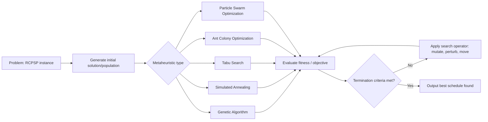

## Schedule Optimization Algorithms

### Overview

Schedule optimization algorithms are computational methods used to determine activity sequencing, resource assignments, and timing decisions that minimize (or maximize) an objective function — typically project duration, cost, or resource utilization — subject to precedence, resource, and calendar constraints. These algorithms extend beyond manual CPM/EVM calculations into the domain of combinatorial optimization, since the general Resource-Constrained Project Scheduling Problem (RCPSP) is NP-hard.

**Key Points**

- CPM alone only solves the unconstrained (infinite-resource) scheduling problem; optimization algorithms are needed once resource constraints, multiple objectives, or uncertainty are introduced
- Most real-world scheduling optimization problems are NP-hard, meaning exact solutions become computationally impractical at scale — heuristics and metaheuristics dominate practice
- Algorithm choice depends on problem size, whether the objective is single or multi-criteria, and whether the environment is deterministic or stochastic

---

### Problem Classification

Before selecting an algorithm, the scheduling problem must be classified:

| Dimension | Variants |
| --- | --- |
| Constraint type | Time-constrained vs. resource-constrained |
| Resource nature | Renewable (labor, equipment) vs. non-renewable (budget) vs. doubly-constrained |
| Objective | Single-objective (minimize makespan) vs. multi-objective (time-cost-quality-risk) |
| Determinism | Deterministic durations vs. stochastic/probabilistic durations |
| Structure | Single-project vs. multi-project (resource sharing across projects) |

The foundational formal problem is the **Resource-Constrained Project Scheduling Problem (RCPSP)**:

$$\text{Minimize } C_{\max} = \max_{i \in V} (S_i + d_i)$$

Subject to:

$$S_j \geq S_i + d_i \quad \forall (i,j) \in E \text{ (precedence constraints)}$$

$$\sum_{i \in A_t} r_{ik} \leq R_k \quad \forall k, \forall t \text{ (resource constraints)}$$

Where $S_i$ is the start time of activity $i$, $d_i$ its duration, $A_t$ the set of activities active at time $t$, $r_{ik}$ the demand of activity $i$ for resource $k$, and $R_k$ the availability of resource $k$.

---

### Category 1: Exact Algorithms

**Characteristics**: Guarantee optimal solutions but scale poorly (exponential worst-case time complexity for RCPSP).

- **Branch and Bound**: Systematically explores the schedule solution tree, pruning branches whose lower bound exceeds the best known solution. Effective for small-to-medium instances (typically under ~60-100 activities depending on resource complexity) [Inference — exact thresholds vary significantly by problem structure and available computing power]
- **Integer Linear Programming (ILP) / Mixed-Integer Programming (MIP)**: Formulates scheduling as a set of linear constraints with integer/binary decision variables (e.g., binary variable $x_{it}=1$ if activity $i$ starts at time $t$), solved via commercial solvers (CPLEX, Gurobi) or open-source solvers (CBC, SCIP)
- **Dynamic Programming**: Applicable to specific structured subproblems (e.g., single-resource scheduling) but suffers from state-space explosion in general RCPSP

**When to use**: Small projects, or as a benchmark to validate heuristic solution quality on reduced-scale test instances.

---

### Category 2: Heuristic Algorithms (Priority-Rule Based)

Heuristics construct a schedule using simple, fast decision rules rather than searching the full solution space. These are the algorithms most embedded in commercial scheduling software's default resource-leveling engines.

**Serial Schedule Generation Scheme (SSGS)**: Activities are scheduled one at a time, in an order determined by a priority rule, each placed at the earliest feasible time given precedence and resource constraints.

**Parallel Schedule Generation Scheme (PSGS)**: Time is advanced incrementally; at each decision point, all eligible activities compete for available resources simultaneously.

**Common priority rules:**

- **Minimum Slack First (MSLK)**: Prioritize activities with the least total float
- **Shortest Processing Time (SPT)**: Prioritize shorter-duration activities to reduce work-in-progress
- **Most Immediate Successors (MIS)**: Prioritize activities unlocking the most downstream work
- **Greatest Resource Demand (GRD)**: Schedule resource-intensive activities early while resource availability is highest
- **Latest Finish Time (LFT)**: Prioritize activities with the earliest late-finish date from the CPM backward pass

**Trade-off**: Heuristics run in polynomial time and scale to thousands of activities, but solution quality is not guaranteed — typically 10-30% above optimal for complex resource-constrained cases [Inference — this range is commonly cited in scheduling literature but is highly dependent on instance characteristics, priority rule choice, and problem structure].

---

### Category 3: Metaheuristics

Metaheuristics search the solution space more thoroughly than simple priority rules, trading computation time for improved solution quality, and are the standard approach for large-scale, complex RCPSP instances in both research and advanced commercial tools.

**Genetic Algorithms (GA)**

- Encode candidate schedules as chromosomes (typically activity-list representations respecting precedence)
- Apply selection, crossover, and mutation operators across generations
- Well-suited to multi-objective scheduling (e.g., NSGA-II for simultaneous time-cost-quality optimization)

**Simulated Annealing (SA)**

- Accepts worse solutions probabilistically based on a decreasing "temperature" parameter, allowing escape from local optima early in the search
- Acceptance probability: $P(\text{accept}) = e^{-\Delta E / T}$, where $\Delta E$ is the objective degradation and $T$ is the current temperature
- Simpler to implement than GA; effective for single-objective problems

**Tabu Search**

- Maintains a "tabu list" of recently visited solutions/moves to prevent cycling back to previously explored regions
- Strong performance on RCPSP benchmark instances, often competitive with GA [Inference — relative performance is instance-dependent and an active area of comparative research]

**Ant Colony Optimization (ACO) / Particle Swarm Optimization (PSO)**

- Population-based methods inspired by collective behavior; construct solutions iteratively while reinforcing good partial solutions ("pheromone" trails in ACO, velocity/position updates in PSO)
- Applied particularly to multi-mode RCPSP (where activities have multiple duration-resource trade-off options)

---

### Category 4: Optimization Under Uncertainty

Deterministic algorithms assume fixed durations; real projects require handling variability.

**Monte Carlo Simulation**

- Runs thousands of schedule iterations, sampling activity durations from probability distributions (Beta, Triangular, PERT)
- Produces a probability distribution of project completion dates rather than a single deterministic date
- Identifies "criticality index" — the percentage of simulation runs in which an activity lies on the critical path — highlighting near-critical risk that classical CPM float calculations miss

$$\text{Criticality Index}_i = \frac{\text{Number of iterations where activity } i \text{ is critical}}{\text{Total iterations}} \times 100\%$$

**PERT (Program Evaluation and Review Technique)**

- Classical three-point estimation approach, computing expected duration via a weighted average:

$$t_e = \frac{t_o + 4t_m + t_p}{6}$$

Where $t_o$, $t_m$, $t_p$ are optimistic, most likely, and pessimistic durations. Variance is estimated as:

$$\sigma^2 = \left(\frac{t_p - t_o}{6}\right)^2$$

**Critical Chain Project Management (CCPM)**

- Reframes optimization around resource contention and buffer placement rather than pure logic-driven float
- Removes individual task-level safety margins and consolidates them into project buffers and feeding buffers at merge points

---

### Category 5: Multi-Project and Portfolio-Level Optimization

When scheduling spans multiple concurrent projects sharing a resource pool:

- **Multi-Project RCPSP (MRCPSP)**: Extends single-project RCPSP with cross-project resource competition
- **Priority-based portfolio scheduling**: Projects ranked by strategic priority, ROI, or contractual penalty exposure, then resources allocated top-down
- **Rolling horizon / dynamic rescheduling**: Portfolio schedules are re-optimized periodically as new projects enter and actual progress deviates from plan, rather than solved once statically

---

### Algorithm Selection Framework

| Project Size | Objective Complexity | Recommended Approach |
| --- | --- | --- |
| Small (<50 activities) | Single objective | Exact (ILP/Branch & Bound) or manual CPM with resource leveling |
| Medium (50-500 activities) | Single objective | Priority-rule heuristics (SSGS/PSGS) or Tabu Search |
| Medium-Large | Multi-objective | Genetic Algorithm (NSGA-II) or hybrid metaheuristics |
| Large (500+ activities) | Any | Metaheuristics with problem decomposition, or commercial solver heuristics |
| Any size, high uncertainty | Any | Monte Carlo simulation layered on top of a base deterministic schedule |

**Example**

A construction program with 800 activities, three shared resource pools (crane crews, electrical crews, inspectors), and a contractual liquidated-damages clause requires: (1) an initial CPM pass to establish logic and float, (2) a resource-leveling heuristic (e.g., MSLK priority rule) to produce a resource-feasible baseline, (3) Monte Carlo simulation to quantify confidence in the contractual completion date, and (4) periodic re-optimization via rolling-horizon rescheduling as actual progress data (via EVM) reveals deviations.

---

### Integration with EVM

Optimization algorithms typically operate on the schedule network, but their outputs feed directly into EVM baselines:

- The resource-leveled/optimized schedule becomes the basis for the **Performance Measurement Baseline (PMB)**, from which Planned Value (PV) is time-phased
- Re-optimization triggered by schedule variance (SV) or SPI deviations should be treated as a formal **replanning event**, requiring baseline change control rather than ad hoc adjustment
- Monte Carlo criticality indices help prioritize which behind-schedule activities warrant corrective action first, complementing SPI's aggregate (but non-activity-specific) signal

---

### Common Pitfalls

- Applying exact algorithms to large-scale instances, resulting in impractical runtimes rather than switching to heuristics/metaheuristics
- Treating a single heuristic run as "the optimal schedule" without benchmarking against alternative priority rules or acknowledging heuristic suboptimality
- Ignoring resource constraints entirely and presenting a CPM-only (unconstrained) schedule as if it were resource-feasible
- Running deterministic optimization once and never revisiting it as a static artifact, rather than treating scheduling as a continuous re-optimization process
- Conflating "optimized" with "compressed" — optimization can also apply to resource smoothing or cost minimization objectives unrelated to shortening duration

---

**Related Topics**

- Resource-Constrained Project Scheduling Problem (RCPSP) formulations and benchmark libraries (PSPLIB)
- Genetic Algorithm encoding schemes for project scheduling (activity-list, priority-rule based representations)
- Monte Carlo schedule risk analysis and criticality index interpretation
- Critical Chain Project Management (CCPM) buffer sizing methods
- Multi-mode RCPSP (time-cost-resource trade-off per activity)
- Rolling-horizon and dynamic rescheduling in multi-project environments
- Commercial scheduling software resource-leveling engine internals (Primavera P6, Microsoft Project)