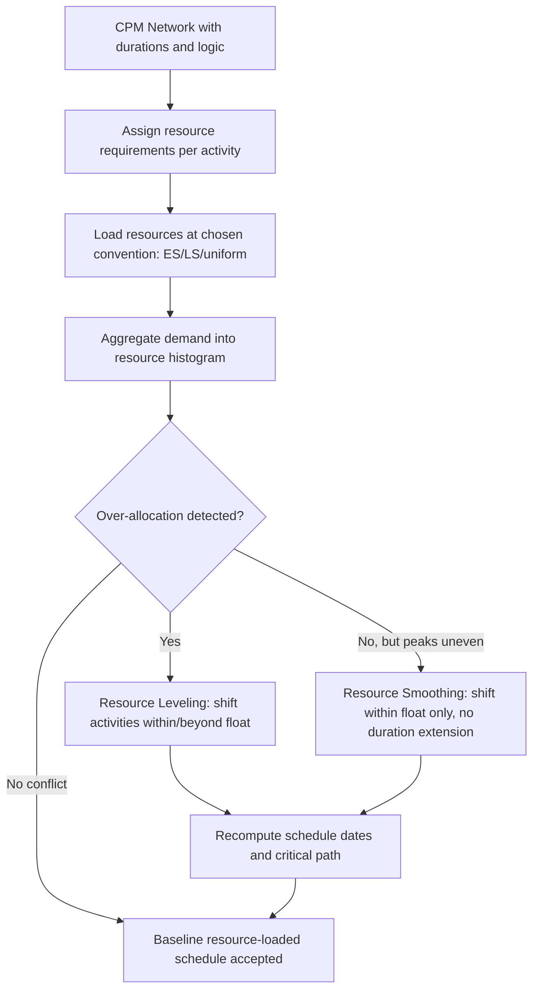

## Resource Loading and Allocation

### Overview

Resource loading and allocation is the process of assigning specific resources (labor, equipment, materials, budget) to scheduled activities and quantifying resource demand over time. It transforms a logic-only CPM network into a resource-aware schedule, exposing periods of over-allocation, under-utilization, and resource conflicts that pure time-based scheduling cannot reveal.

**Key Points**

- Resource loading quantifies *how much* of each resource is required, period by period, once activities are placed at their scheduled dates
- Resource allocation is the *assignment* decision — which specific resource units are committed to which activities
- Neither step changes activity duration or logic by itself; both are prerequisite diagnostics before leveling or smoothing (compression/optimization) techniques are applied

---

### Resource Loading: Definition and Process

Resource loading takes an existing CPM schedule (with dates fixed at early-start, late-start, or another chosen loading convention) and produces a **resource histogram** — a time-phased profile of resource demand.

**Process steps:**

1. Define resource requirements per activity (type, quantity, unit of measure — e.g., 3 electricians, 1 crane, 40 cubic meters of concrete)
2. Assign each activity's resource demand across its scheduled duration (evenly distributed, front-loaded, or back-loaded depending on the work's nature)
3. Aggregate demand for each resource type across all concurrently active activities, per time period
4. Compare aggregated demand against available resource capacity per period

$$\text{Demand}_k(t) = \sum_{i \in A_t} r_{ik}$$

Where $\text{Demand}_k(t)$ is total demand for resource $k$ at time $t$, $A_t$ is the set of activities active at time $t$, and $r_{ik}$ is activity $i$'s per-period requirement for resource $k$.

**Over-allocation** occurs when:

$$\text{Demand}_k(t) > R_k \quad \text{(available capacity of resource } k\text{)}$$

---

### Resource Histogram Illustration

<svg xmlns="http://www.w3.org/2000/svg" viewBox="0 0 560 380" font-family="sans-serif">
<text x="280" y="26" font-size="16" font-weight="bold" text-anchor="middle" fill="#1a1a1a">Resource Loading Histogram (svg_diagram)</text>

<line x1="60" y1="320" x2="520" y2="320" stroke="#333" stroke-width="2" />
<line x1="60" y1="320" x2="60" y2="50" stroke="#333" stroke-width="2" />
<text x="290" y="355" font-size="12" text-anchor="middle" fill="#333">Time (weeks)</text>
<text x="25" y="185" font-size="12" text-anchor="middle" fill="#333" transform="rotate(-90 25 185)">Resource Units (crew size)</text>

<line x1="60" y1="150" x2="520" y2="150" stroke="#c0392b" stroke-width="2" stroke-dasharray="6,4" />
<text x="465" y="142" font-size="11" fill="#c0392b" font-weight="bold">Capacity limit (8)</text>

<rect x="70" y="270" width="35" height="50" fill="#3498db" />
<rect x="115" y="230" width="35" height="90" fill="#3498db" />
<rect x="160" y="120" width="35" height="200" fill="#e67e22" />
<rect x="205" y="100" width="35" height="220" fill="#e67e22" />
<rect x="250" y="90" width="35" height="230" fill="#e67e22" />
<rect x="295" y="160" width="35" height="160" fill="#3498db" />
<rect x="340" y="200" width="35" height="120" fill="#3498db" />
<rect x="385" y="230" width="35" height="90" fill="#3498db" />
<rect x="430" y="260" width="35" height="60" fill="#3498db" />
<rect x="475" y="280" width="35" height="40" fill="#3498db" />

<text x="87" y="335" font-size="10" text-anchor="middle">1</text>

<text x="132" y="335" font-size="10" text-anchor="middle">2</text>

<text x="177" y="335" font-size="10" text-anchor="middle">3</text>

<text x="222" y="335" font-size="10" text-anchor="middle">4</text>

<text x="267" y="335" font-size="10" text-anchor="middle">5</text>

<text x="312" y="335" font-size="10" text-anchor="middle">6</text>

<text x="357" y="335" font-size="10" text-anchor="middle">7</text>

<text x="402" y="335" font-size="10" text-anchor="middle">8</text>

<text x="447" y="335" font-size="10" text-anchor="middle">9</text>

<text x="492" y="335" font-size="10" text-anchor="middle">10</text>

<rect x="70" y="60" width="14" height="14" fill="#e67e22" />
<text x="90" y="72" font-size="11" fill="#333">Over-allocated (weeks 3-5)</text>
<rect x="270" y="60" width="14" height="14" fill="#3498db" />
<text x="290" y="72" font-size="11" fill="#333">Within capacity</text>
</svg>

Weeks 3-5 show demand exceeding the eight-unit capacity ceiling, identifying the conflict window that leveling or reallocation must resolve.

---

### Loading Conventions

How activities are placed before aggregation affects the resulting histogram shape:

| Convention | Description | Typical Use |
| --- | --- | --- |
| Early Start (ES) loading | All activities loaded at their earliest possible dates | Reveals worst-case peak demand; default in most software |
| Late Start (LS) loading | All activities loaded at their latest possible dates | Reveals demand if all float is consumed; useful for identifying minimum-risk resource commitment timing |
| Uniform/even distribution | Resource demand spread evenly across activity duration | Standard default for continuous labor activities |
| Front-loaded / back-loaded | Demand concentrated at the start or end of an activity | Used for activities with non-uniform effort curves (e.g., mobilization-heavy or commissioning-heavy work) |

Comparing ES-loaded and LS-loaded histograms for the same schedule reveals the "resource flexibility band" — the range within which resource timing can shift using available float without extending the project.

---

### Resource Allocation Strategies

Once demand and capacity are compared, allocation decisions determine which specific resource units go to which activities and when.

**Allocation approaches:**

- **First-come, first-served (priority by early start)**: Simple but can starve later-critical-path activities of resources
- **Priority by criticality**: Critical path activities receive resource priority over activities with float
- **Priority by project/contractual value**: In multi-project environments, resources flow to the highest-priority or highest-penalty-exposure project first
- **Skill-based matching**: Resources allocated based on qualification/certification match rather than availability alone (e.g., licensed crane operators, certified welders)

**Example**

Two activities — "Install structural steel" (critical path, zero float) and "Install site fencing" (14 days total float) — both require the same crew of ironworkers in week 4. Allocation priority rules dictate the crew is assigned to structural steel first; fencing installation is either delayed into its float window or resourced from a secondary crew, since delaying the critical activity would delay the entire project.

---

### Resource Types and Loading Considerations

| Resource Type | Loading Characteristic | Constraint Behavior |
| --- | --- | --- |
| Labor (renewable) | Recurring per-period availability (e.g., 8 electricians/day) | Capacity resets each period; overtime can temporarily extend capacity at cost |
| Equipment (renewable) | Fixed unit count, often non-fractional (cannot allocate 0.5 of a crane) | Mutually exclusive allocation; unavailable once committed elsewhere |
| Materials (consumable/non-renewable) | Cumulative consumption against a total budget or delivery schedule | Constraint is cumulative-to-date, not per-period capacity |
| Budget (non-renewable) | Cumulative cash flow constraint | Governed by funding release schedule, not physical capacity |
| Space/facilities | Often binary or discrete unit constraint (e.g., limited laydown area, dock access) | Can create indirect precedence constraints not captured in original logic |

Distinguishing renewable from non-renewable resources matters because over-allocation of a renewable resource in one period does not affect subsequent periods, while non-renewable resource over-commitment (e.g., budget) has cumulative, permanent consequences.

---

### Resource Loading as Input to Leveling and Smoothing

Loading and allocation are diagnostic; **resource leveling** and **resource smoothing** are the corrective techniques applied afterward:

- **Resource leveling** may extend the project end date to resolve over-allocation (float and non-float activities can both shift)
- **Resource smoothing** resolves peaks/valleys in demand using only available float, without extending overall duration
- Both techniques depend entirely on accurate resource loading having been performed first — leveling an unloaded schedule has nothing to level

---

### Common Pitfalls

- Loading resources evenly by default when actual effort curves are front-loaded or back-loaded, producing an inaccurate histogram
- Treating equipment (indivisible, mutually exclusive units) with the same fractional-allocation logic used for labor pools
- Ignoring non-renewable resource constraints (budget, cumulative material delivery) because they do not appear as a "spike" in a per-period histogram the way labor over-allocation does
- Allocating resources purely by early-start priority without accounting for criticality, causing float-rich activities to consume resources needed by zero-float activities
- Failing to distinguish resource loading (a diagnostic step) from resource leveling (a corrective step), and attempting to resolve conflicts by adjusting the histogram directly rather than adjusting the schedule

---

### Integration with EVM

- Resource-loaded schedules generate the basis for **time-phased budgeting**, since Planned Value (PV) is derived from when resource-driven costs are expected to be incurred, not merely from activity start/finish dates
- Over-allocation identified during resource loading, if unresolved, manifests later as unfavorable **Cost Performance Index (CPI)** trends (unplanned overtime, expedited substitute resources) or unfavorable **Schedule Performance Index (SPI)** trends (activities delayed awaiting resource availability)
- Resource histograms should be reconciled against the **Performance Measurement Baseline (PMB)** resource assumptions whenever significant schedule changes are approved through change control

---

**Next Steps**

- Resource leveling techniques and algorithms
- Resource smoothing versus leveling — decision criteria
- Multi-project resource pooling and contention
- Effort-driven vs. fixed-duration vs. fixed-units scheduling in software (Primavera P6, MS Project)
- Resource calendars and non-standard availability (shifts, holidays, part-time allocation)
- Cost loading and time-phased budget development from resource-loaded schedules