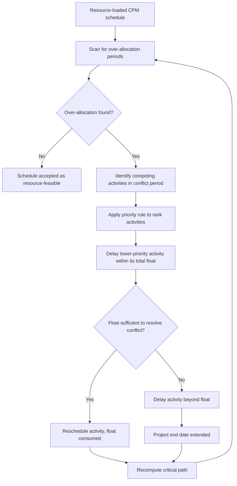

## Resource Leveling Techniques

### Overview

Resource leveling is the process of resolving resource over-allocation by adjusting activity start and finish dates within a CPM schedule, using available float first and extending the project end date only if float is insufficient. Unlike resource smoothing (which never extends duration), leveling explicitly permits schedule extension as the trade-off for achieving a resource-feasible plan.

**Key Points**

- Leveling operates on an already resource-loaded schedule — it presumes the diagnostic step (loading) has already identified over-allocation
- Leveling can shift the critical path, since delaying a float-consuming activity to resolve a resource conflict may consume all its float and make it critical
- The output is a resource-feasible schedule, which is not the same as a time-optimal schedule — leveling deliberately sacrifices some schedule efficiency for resource realism

---

### Why Leveling Is Necessary

A CPM network computed purely from logic (finish-to-start, start-to-start, etc.) assumes unlimited resource availability. In practice, finite resource pools mean multiple activities scheduled concurrently by pure logic may compete for the same crew, equipment, or specialist. Resource leveling reconciles the logic-only schedule with real-world capacity limits.

$$\text{Feasibility Condition: } \sum_{i \in A_t} r_{ik} \leq R_k \quad \forall k, \forall t$$

If this condition is violated for any resource $k$ at any time $t$ in the original schedule, leveling is required to restore feasibility.

---

### Core Leveling Mechanics

**Sequence of operations:**

1. Scan the resource histogram period by period for capacity violations
2. For each violation, identify all activities contending for the constrained resource
3. Apply a priority/ranking rule to determine which activity proceeds and which is delayed
4. Delay the lower-priority activity — first consuming its own total float, then, if exhausted, pushing into activities downstream, potentially extending the project finish date
5. Recompute the critical path, since leveling can create new critical or near-critical activities (this is sometimes called the "resource-critical path" or "critical chain" in some methodologies)
6. Repeat until no resource violations remain

---

### Priority Rules for Leveling Conflicts

When multiple activities compete for the same constrained resource, a priority rule breaks the tie. Common rules, roughly in order of frequency of use in commercial scheduling software:

| Priority Rule | Logic | Effect |
| --- | --- | --- |
| Total Float (ascending) | Activities with less float get priority (scheduled first) | Protects near-critical activities from delay |
| Early Start (ascending) | Activities that would naturally start earliest proceed first | Simple, mirrors natural schedule sequence |
| Activity ID / WBS order | Fixed, user-defined sequence | Predictable but not risk-aware |
| Duration (ascending or descending) | Shorter (or longer) activities prioritized | Can minimize number of activities delayed, or clear long-lead items early |
| Resource demand magnitude | Activities with larger resource requirements prioritized | Reduces fragmentation of resource pool commitments |
| Free Float | Activities with less free float (impact on immediate successors) prioritized | Protects local schedule integrity around merge points |

**Total float ascending** is the most common default in software such as Primavera P6 and Microsoft Project, since it directly protects the activities most likely to become critical if delayed further.

---

### Leveling Within Float vs. Beyond Float

<svg xmlns="http://www.w3.org/2000/svg" viewBox="0 0 560 320" font-family="sans-serif">
<text x="280" y="26" font-size="16" font-weight="bold" text-anchor="middle" fill="#1a1a1a">Leveling Within vs. Beyond Float (svg_diagram)</text>

<line x1="60" y1="280" x2="520" y2="280" stroke="#333" stroke-width="1.5" />
<text x="290" y="305" font-size="12" text-anchor="middle">Time</text>

<text x="60" y="70" font-size="12" font-weight="bold" fill="#333">Original (logic-only)</text>

<rect x="80" y="80" width="120" height="24" fill="`#3498db`" />

<text x="140" y="97" font-size="11" text-anchor="middle" fill="white">Activity A</text>

<rect x="220" y="80" width="90" height="24" fill="`#bdc3c7`" />

<text x="265" y="97" font-size="10" text-anchor="middle" fill="#333">Float</text>

<text x="60" y="150" font-size="12" font-weight="bold" fill="`#27ae60`">Leveled — within float (no extension)</text>

<rect x="150" y="160" width="120" height="24" fill="`#27ae60`" />

<text x="210" y="177" font-size="11" text-anchor="middle" fill="white">Activity A (delayed)</text>

<rect x="270" y="160" width="40" height="24" fill="`#bdc3c7`" />

<text x="60" y="230" font-size="12" font-weight="bold" fill="`#c0392b`">Leveled — beyond float (extension)</text>

<rect x="230" y="240" width="120" height="24" fill="`#c0392b`" />

<text x="290" y="257" font-size="11" text-anchor="middle" fill="white">Activity A (delayed)</text>

<line x1="350" y1="230" x2="350" y2="260" stroke="`#c0392b`" stroke-width="2" stroke-dasharray="3,2" />

<text x="360" y="250" font-size="10" fill="`#c0392b`">Original finish exceeded</text>

</svg>

When total float is exhausted before the conflict is resolved, the leveled activity's delay propagates to its successors, and if that activity or its successors lie on (or become) the critical path, the project finish date shifts outward.

---

### Leveling Algorithms in Practice

**Serial leveling**: Activities are processed one at a time in priority order; each is placed at the earliest resource-feasible time given all previously placed activities. Computationally simpler, widely implemented in commercial software.

**Parallel leveling**: All eligible activities at a given time step compete simultaneously for available resources at that instant, better reflecting real concurrent decision-making but more complex to implement.

**Heuristic-based leveling (as covered under schedule optimization algorithms)**: Priority-rule heuristics (SSGS, PSGS) generate a leveled schedule as their direct output — resource leveling is, in effect, the practical application of these construction heuristics to an existing schedule.

**Metaheuristic-enhanced leveling**: For complex multi-resource, multi-project environments, genetic algorithms or tabu search can be applied to search across many possible activity orderings, seeking a leveled schedule with minimal project extension — since simple priority-rule leveling is not guaranteed to minimize the extension.

---

### Leveling Impact on the Critical Path

**Example**

Two activities, "Excavate Foundation A" (float = 0, critical) and "Excavate Foundation B" (float = 5 days), both require the same excavator in week 2. Priority-by-float rules place the excavator on Foundation A first. Foundation B is delayed by 4 days — within its 5-day float, so the project finish date is unaffected, but Foundation B's remaining float drops from 5 days to 1 day, making it near-critical. If a third activity later competes for the same excavator with Foundation B, that 1-day float may be insufficient, and the delay would propagate to the project finish date.

This illustrates why leveling should always be followed by a **complete recalculation of the critical path and float values** — a schedule's criticality profile after leveling can differ substantially from its pre-leveling state.

---

### Distinguishing Leveling from Related Techniques

| Technique | Duration Impact | Float Usage | Primary Goal |
| --- | --- | --- | --- |
| Resource Leveling | May extend project duration | Uses float first, then extends beyond it if needed | Resolve resource over-allocation |
| Resource Smoothing | Never extends project duration | Uses float only; unresolved conflicts remain unresolved if float is insufficient | Reduce peaks/valleys in demand without impacting the end date |
| Schedule Crashing | Reduces project duration | Not float-based; adds resources/cost | Shorten critical path |
| Fast-Tracking | Reduces project duration | Not float-based; overlaps sequential activities | Shorten critical path via parallelism |

Resource leveling is often confused with resource smoothing; the distinguishing test is whether the technique is permitted to extend the project finish date — leveling is, smoothing is not.

---

### Common Pitfalls

- Applying resource smoothing logic (never extend duration) when the situation actually requires leveling (over-allocation genuinely cannot be resolved within existing float)
- Failing to recompute the critical path after leveling, leaving stakeholders unaware that near-critical activities have emerged with reduced float
- Leveling using a single default priority rule (e.g., activity ID order) without evaluating whether a float-based or resource-magnitude-based rule would produce a less schedule-extending result
- Manually overriding leveled dates in commercial software without understanding that a subsequent automatic re-leveling pass may reverse the manual adjustment
- Leveling once at baseline and never re-leveling after schedule updates, allowing new over-allocations introduced by actual progress deviations to go undetected

---

### Integration with EVM

- A leveled schedule, once extended by leveling-driven delays, changes the time-phasing of the **Performance Measurement Baseline (PMB)** — Planned Value (PV) curves must reflect the leveled dates, not the original logic-only dates, or SPI calculations will be measured against an infeasible baseline
- Repeated re-leveling during execution (as actual progress data updates remaining durations and resource availability) should be governed by the project's **change control process** if it materially shifts the baseline finish date, since this affects contractual and EVM reporting baselines
- Near-critical activities exposed by leveling (reduced float, as in the excavator example) are useful inputs to risk registers and should inform which activities receive closer EVM monitoring (e.g., more frequent progress updates) during execution

---

**Related Topics**

- Resource smoothing techniques and when to prefer smoothing over leveling
- Priority rule selection and its effect on leveled schedule length (empirical comparison)
- Multi-project resource leveling and cross-project contention
- Critical Chain Project Management (CCPM) as an alternative resource-based scheduling paradigm
- Resource calendars, shift patterns, and non-uniform availability in leveling calculations
- Software-specific leveling engine behavior (Primavera P6 leveling priorities vs. Microsoft Project leveling options)