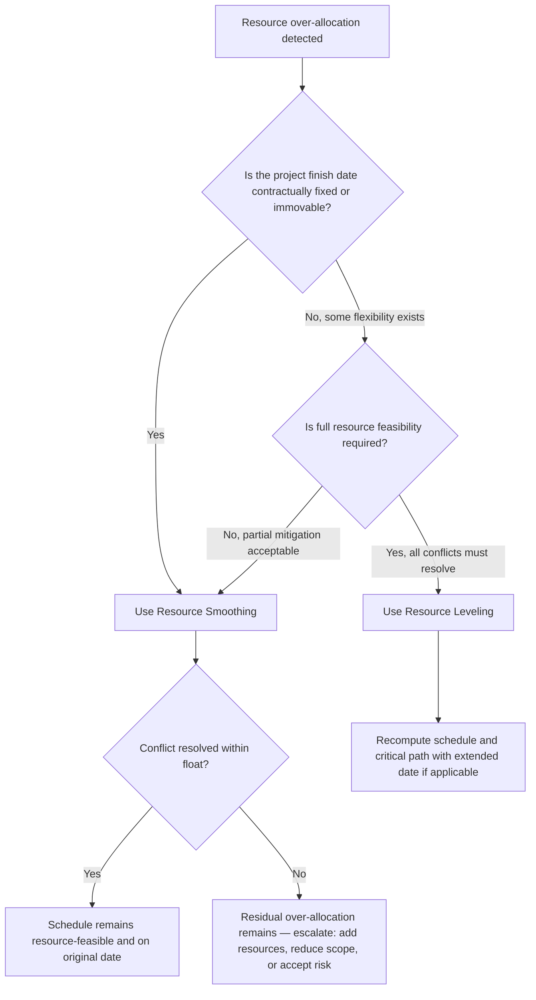

## Resource Smoothing versus Resource Leveling

### Overview

Resource smoothing and resource leveling are both techniques for addressing resource constraint violations in a resource-loaded CPM schedule, but they differ fundamentally in what they are permitted to sacrifice. Smoothing preserves the project finish date at all costs, accepting that some over-allocation may remain unresolved; leveling guarantees full resolution of over-allocation, accepting that the project finish date may be extended. Choosing between them is a constraint-priority decision, not a technique-quality decision.

**Key Points**

- The distinguishing test: does the technique permit extending the project end date? Leveling does; smoothing does not
- Smoothing only uses total float as its adjustment mechanism; once float is exhausted, smoothing stops even if over-allocation persists
- Leveling uses float first, then extends beyond it if necessary, guaranteeing a fully resource-feasible schedule at the cost of schedule certainty

---

### Formal Distinction

$$\text{Resource Smoothing: adjust } S_i \text{ such that } S_i \leq LS_i \quad \forall i \text{ (finish date fixed)}$$

$$\text{Resource Leveling: adjust } S_i \text{ freely, allowing } C_{\max}^{\text{new}} \geq C_{\max}^{\text{original}}$$

Where $S_i$ is an activity's start time, $LS_i$ its late start (the float boundary), and $C_{\max}$ the project completion time (makespan).

Smoothing restricts every rescheduling move to within an activity's total float envelope; if a resource conflict cannot be resolved without pushing an activity past its late finish, smoothing leaves that conflict unresolved rather than violate the finish-date constraint. Leveling has no such restriction — the finish date itself is a variable, not a constraint, in the leveling optimization.

---

### Side-by-Side Comparison

| Dimension | Resource Smoothing | Resource Leveling |
| --- | --- | --- |
| Project finish date | Fixed — never extended | Variable — may extend to resolve conflicts |
| Float usage | Uses total float only, never exceeds it | Uses float first, then extends beyond it if needed |
| Resource conflict resolution | Best-effort; may leave some over-allocation unresolved | Guaranteed full resolution |
| Primary use case | Time-constrained projects (fixed contractual deadline) | Resource-constrained projects (fixed resource pool, flexible deadline) |
| Typical constraint priority | Time > Resources | Resources > Time |
| Critical path impact | Critical path activities are never delayed (zero float means zero smoothing room) | Critical path can shift, and new activities can become critical |
| Software terminology | Often called "resource optimization within float" | Often the default meaning of "level resources" in scheduling tools |
| Output guarantee | Reduced peaks/valleys in demand; feasibility not guaranteed | Full resource feasibility; but original end date not guaranteed |

---

### Decision Framework: Which to Use

**When smoothing is the correct choice:**

- Contractual liquidated-damages clauses make the finish date immovable
- The project operates under a hard external constraint (e.g., a fixed event date, a regulatory deadline, a dependent downstream project)
- Stakeholders have explicitly prioritized schedule certainty over resource optimality

**When leveling is the correct choice:**

- The resource pool is genuinely fixed (cannot be augmented) and the finish date has negotiable flexibility
- Internal projects where resource cost/availability is the harder constraint (e.g., a single specialized inspector shared across all activities)
- Early planning phases, before the schedule is contractually committed, when establishing a realistic and resource-feasible baseline matters more than hitting a specific date

---

### Visual Comparison of Outcomes

<svg xmlns="http://www.w3.org/2000/svg" viewBox="0 0 560 380" font-family="sans-serif">
<text x="280" y="24" font-size="16" font-weight="bold" text-anchor="middle" fill="#1a1a1a">Smoothing vs. Leveling Outcomes (svg_diagram)</text>

<text x="55" y="60" font-size="12" font-weight="bold" fill="#333">Original (over-allocated)</text>

<line x1="60" y1="70" x2="60" y2="115" stroke="#333" stroke-width="1" />

<rect x="60" y="70" width="200" height="45" fill="`#e67e22`" opacity="0.85" />

<line x1="60" y1="90" x2="260" y2="90" stroke="`#c0392b`" stroke-width="1.5" stroke-dasharray="4,3" />

<text x="265" y="93" font-size="9" fill="`#c0392b`">capacity</text>

<text x="160" y="98" font-size="10" text-anchor="middle" fill="white">Over-allocated peak</text>

<line x1="260" y1="65" x2="260" y2="330" stroke="#555" stroke-width="1" stroke-dasharray="2,2" />

<text x="260" y="345" font-size="10" text-anchor="middle" fill="#555">Original finish</text>

<text x="55" y="160" font-size="12" font-weight="bold" fill="`#27ae60`">Smoothed</text>

<rect x="60" y="170" width="200" height="30" fill="`#27ae60`" opacity="0.85" />

<text x="160" y="189" font-size="10" text-anchor="middle" fill="white">Peak reduced within float</text>

<rect x="260" y="170" width="0" height="30" fill="`#27ae60`" />

<text x="270" y="189" font-size="10" fill="`#27ae60`" font-style="italic">Finish date unchanged</text>

<text x="55" y="240" font-size="12" font-weight="bold" fill="`#2980b9`">Leveled</text>

<rect x="60" y="250" width="200" height="25" fill="`#2980b9`" opacity="0.85" />

<rect x="260" y="250" width="90" height="25" fill="`#2980b9`" opacity="0.6" />

<text x="305" y="267" font-size="9" text-anchor="middle" fill="white">Extension</text>

<text x="160" y="267" font-size="10" text-anchor="middle" fill="white">Fully resolved</text>

<line x1="350" y1="245" x2="350" y2="330" stroke="`#2980b9`" stroke-width="1" stroke-dasharray="2,2" />

<text x="350" y="345" font-size="10" text-anchor="middle" fill="`#2980b9`">New finish (extended)</text>

</svg>

---

### Worked Example

Two activities, "Site Grading" (float = 3 days) and "Utility Trenching" (float = 0, critical), both require the same excavator during the same 3-day window.

**Applying smoothing:**

- Site Grading is delayed within its 3-day float to avoid the conflict
- Since Site Grading's float exactly covers the delay needed, the conflict resolves without touching the project finish date
- If the required delay had been 5 days (exceeding the 3-day float), smoothing would stop at the float boundary, and the excavator conflict would remain partially unresolved — smoothing does not extend the schedule to finish the job

**Applying leveling** to the same 5-day-shortfall scenario:

- Site Grading is delayed the full 5 days needed, 2 days beyond its available float
- Since Site Grading now shares dates with or extends into the critical path window, the project finish date extends by up to 2 days (depending on downstream logic)
- The conflict is fully resolved, at the cost of schedule certainty

This example shows the core trade-off directly: smoothing guarantees the date but not resource feasibility; leveling guarantees resource feasibility but not the date.

---

### Common Pitfalls

- Using the term "leveling" and "smoothing" interchangeably in project communications, causing confusion about whether the finish date is protected
- Applying smoothing to a genuinely resource-constrained project (fixed resource pool, flexible deadline) and being surprised when residual over-allocation remains unaddressed
- Applying leveling to a contractually fixed-deadline project without escalating the resulting date extension for approval, silently changing the baseline
- Assuming software defaults (many tools label their leveling feature simply "Level Resources") always perform true leveling — some configurations effectively behave as smoothing if a "do not extend project finish" option is enabled, and the distinction depends on tool-specific settings [Unverified — exact default behavior varies by software version and configuration]
- Failing to communicate to stakeholders that a "smoothed" schedule may still contain unresolved resource conflicts, since the peaks are reduced but not necessarily eliminated

---

### Integration with EVM

- A **smoothed** schedule preserves the original Performance Measurement Baseline (PMB) finish date, so PV time-phasing remains unchanged — but any residual unresolved over-allocation represents a latent execution risk that can manifest later as unfavorable CPI (unplanned overtime or resource substitution cost) even though the baseline itself looks unaffected
- A **leveled** schedule that extends the finish date requires the PMB to be updated to reflect new time-phased PV — proceeding with the original PV curve against a leveled (extended) schedule would produce a systematically misleading SPI
- Because leveling changes the baseline, it should go through the same **change control approval** as any other baseline revision before being adopted as the basis for EVM reporting

---

**Next Steps**

- Resource leveling algorithms and priority rules (SSGS/PSGS heuristics)
- Float exhaustion analysis and near-critical activity identification
- Multi-project resource contention: smoothing and leveling across shared pools
- Baseline change control procedures when leveling extends the finish date
- Critical Chain Project Management (CCPM) as an alternative to classical leveling/smoothing
- Software configuration differences in resource optimization features (Primavera P6 vs. Microsoft Project)