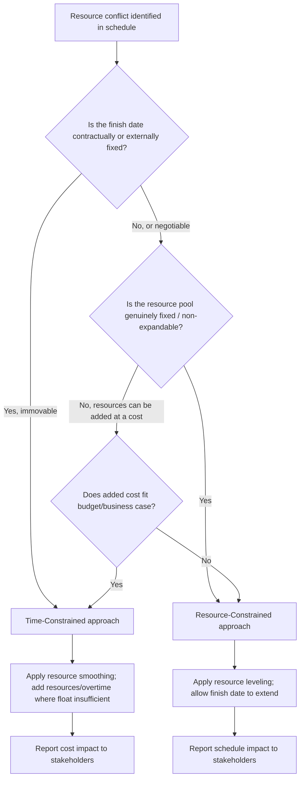

## Resource Constrained versus Time Constrained Scheduling

### Overview

Resource-constrained and time-constrained scheduling represent two opposing optimization priorities for the same underlying CPM network. The distinction determines which variable — schedule duration or resource availability — is treated as fixed and which is allowed to flex, and it governs which of resource leveling or resource smoothing (and more broadly, which planning philosophy) is appropriate for a given project.

**Key Points**

- Time-constrained scheduling treats the finish date as fixed and resources as the flexible variable (add resources, accept cost, to hit the date)
- Resource-constrained scheduling treats resource availability as fixed and the finish date as the flexible variable (the schedule extends to fit what resources can actually deliver)
- Most real projects are a hybrid — certain milestones are time-constrained (contractual, regulatory) while other phases are resource-constrained (shared specialist pools, limited equipment)

---

### Formal Definitions

**Time-Constrained Scheduling (Time-Limited Scheduling)**

The project finish date $T$ is fixed. Resource usage is optimized (minimized peaks, minimized cost) subject to that fixed date.

$$\text{Minimize } \sum_k \sum_t \max(0, \text{Demand}_k(t) - R_k) \quad \text{subject to } C_{\max} \leq T$$

The objective is to minimize resource over-allocation (or cost) while never violating the deadline constraint. If a resource conflict cannot be resolved within the fixed date, the response is to acquire more resources, not to extend the date.

**Resource-Constrained Scheduling (Resource-Limited Scheduling)**

Resource availability $R_k$ is fixed for every period. The project finish date $C_{\max}$ is the variable being minimized subject to never exceeding available resource capacity.

$$\text{Minimize } C_{\max} \quad \text{subject to } \sum_{i \in A_t} r_{ik} \leq R_k \quad \forall k, \forall t$$

This is the formal Resource-Constrained Project Scheduling Problem (RCPSP) — the finish date is whatever emerges once the fixed resource ceiling is respected.

---

### Comparative Framework

| Dimension | Time-Constrained | Resource-Constrained |
| --- | --- | --- |
| Fixed variable | Project finish date | Resource pool capacity |
| Flexible variable | Resource quantity (cost) | Project duration |
| Corresponding technique | Resource smoothing | Resource leveling |
| Typical driver | Contractual deadline, liquidated damages, market window, event date | Fixed internal crew size, single specialized resource, capital/budget ceiling |
| Response to conflict | Add resources / overtime / subcontract | Delay activity, accept later finish |
| Cost behavior | Cost rises to protect schedule | Cost held flat; schedule absorbs the impact |
| Risk profile | Cost and quality risk (rushed resourcing) | Schedule risk (uncertain finish date) |
| EVM implication | PMB finish date stable; cost baseline (BAC) may need revision if resources increase | Schedule baseline (PMB dates) revised if finish extends |

---

### Decision Framework

**Indicators pointing to time-constrained treatment:**

- Liquidated damages clauses or penalty structures tied to a specific date
- Regulatory or permit windows with hard cutoffs
- Dependent external events (product launch, seasonal window, connected infrastructure project)
- Client/sponsor has explicitly stated cost flexibility in exchange for date certainty

**Indicators pointing to resource-constrained treatment:**

- A single named specialist, unique piece of equipment, or scarce-market resource that cannot be duplicated regardless of budget
- Internal resource caps set by organizational policy (e.g., maximum concurrent crew size for safety/space reasons)
- Early-stage planning where no contractual date commitment yet exists
- Explicit organizational or sponsor preference for cost/resource discipline over schedule certainty

---

### Worked Example

A data center commissioning project has two candidate approaches for the same over-allocation conflict (a single certified commissioning engineer required by two parallel test activities in week 6):

**Time-constrained response**: The go-live date is fixed by a signed tenant lease with penalty clauses. The response is to bring in a second certified commissioning engineer (subcontracted at premium day-rate) so both test activities proceed in parallel as originally scheduled. Cost increases; schedule holds.

**Resource-constrained response**: If no lease penalty exists and only one certified engineer is available in the market on short notice, one test activity is delayed until the engineer is free, and the completion date shifts by the corresponding number of days. Cost holds; schedule extends.

The same underlying conflict produces two entirely different management responses depending on which constraint is designated as fixed.

---

### Hybrid and Mixed-Constraint Scheduling

In practice, most projects are **partially constrained** — different phases or milestones carry different constraint types simultaneously.

- **Milestone-level mixing**: An interim milestone (e.g., "structure complete for weatherproofing before winter") may be time-constrained, while the overall project finish is resource-constrained
- **Resource-specific mixing**: Common labor trades may be resource-constrained (crew size flexes the schedule), while a single long-lead specialty item is time-constrained (expedited at any cost to protect an immovable downstream date)
- **Phase-based mixing**: Design phases often run resource-constrained (fixed design team size), while construction phases run time-constrained (subcontractor crews scaled to meet a fixed completion date)

**Practical approach**: Rather than declaring an entire project one type or the other, identify constraint type at the milestone or work-package level, and apply resource smoothing where time-constrained and resource leveling where resource-constrained within the same integrated schedule.

---

### Relationship to Resource Leveling and Smoothing

| Scheduling Philosophy | Applied Technique | Rationale |
| --- | --- | --- |
| Time-constrained | Resource smoothing | Smoothing's defining property (never extend the finish date) matches the fixed-date assumption exactly |
| Resource-constrained | Resource leveling | Leveling's defining property (extend if needed to guarantee feasibility) matches the fixed-resource assumption exactly |

This mapping is not coincidental — resource smoothing and resource leveling were developed specifically as the operational techniques corresponding to time-constrained and resource-constrained scheduling philosophies, respectively.

---

### Common Pitfalls

- Declaring a project "resource-constrained" as a planning default without verifying whether a contractual deadline actually makes it time-constrained, leading to unauthorized schedule slippage
- Treating time-constrained scheduling as a "free" solution by adding resources without evaluating diminishing-returns effects (see crashing cost-slope analysis) or quality/safety risk from overtime and expanded crews
- Applying a single constraint philosophy uniformly across an entire project when different phases or milestones genuinely carry different constraint types
- Failing to document which constraint type governs a given schedule segment, causing confusion later about whether a resource conflict should be escalated as a cost issue or a schedule issue
- Assuming resource-constrained scheduling avoids cost impact entirely — extended schedules still carry indirect costs (overhead, financing, escalation) even without direct crashing expenditure

---

### Integration with EVM

- **Time-constrained** projects: cost baseline (BAC) revisions are more likely than schedule baseline (PMB date) revisions when conflicts are resolved by adding resources — EVM cost variance (CV) becomes the primary metric to monitor for the impact of this constraint choice
- **Resource-constrained** projects: schedule baseline (PMB) revisions are more likely, requiring re-time-phasing of Planned Value if leveling extends the finish date — EVM schedule variance (SV) and SPI become the primary metrics affected
- Explicitly documenting which constraint type governs a project (or phase) at baseline-setting time clarifies, in advance, which EVM variance (cost or schedule) is the expected pressure valve when conflicts arise during execution — reducing ambiguity in variance analysis and corrective action decisions

---

**Related Topics**

- Resource leveling algorithms and priority rules
- Resource smoothing mechanics and float-boundary limits
- Schedule crashing cost-slope analysis (time-constrained cost response)
- Multi-project resource-constrained scheduling (MRCPSP)
- Baseline change control for schedule and cost baseline revisions
- Critical Chain Project Management as a resource-constrained scheduling philosophy