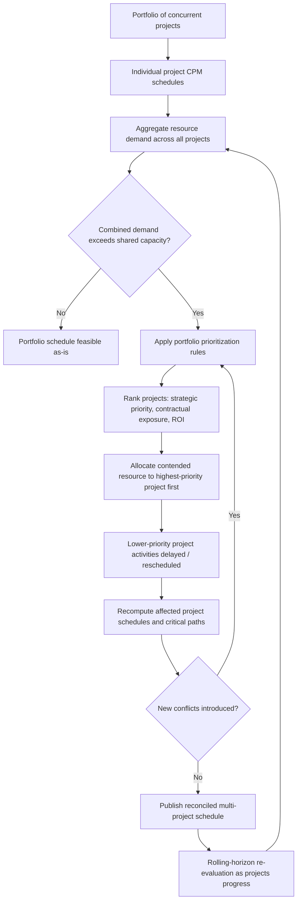

## Multi-Project Resource Contention

### Overview

Multi-project resource contention occurs when two or more projects draw on a shared, finite resource pool — labor, equipment, budget, or specialized personnel — such that scheduling decisions in one project directly affect resource availability, and therefore feasibility, in another. It extends single-project resource loading, leveling, and smoothing into a portfolio-level problem where no project's schedule can be optimized in isolation.

**Key Points**

- Single-project CPM techniques (leveling, smoothing) assume a closed resource pool dedicated to that project; multi-project contention breaks this assumption
- Resolving contention requires portfolio-level prioritization rules, since local optimization of one project's schedule can silently degrade another's feasibility
- The formal extension of RCPSP to this context is the Multi-Project Resource-Constrained Project Scheduling Problem (MRCPSP)

---

### Why Multi-Project Contention Requires Distinct Treatment

In single-project scheduling, resource capacity $R_k$ is treated as available to that project alone. When multiple projects share resource pools, the same capacity $R_k$ must now satisfy demand from every competing project simultaneously:

$$\sum_{p \in P} \sum_{i \in A_t^p} r_{ik}^p \leq R_k \quad \forall k, \forall t$$

Where $P$ is the set of concurrent projects, $A_t^p$ is the set of activities active in project $p$ at time $t$, and $r_{ik}^p$ is project $p$'s activity $i$'s demand for resource $k$.

A schedule that appears fully resource-feasible when each project is analyzed independently can violate this combined constraint the moment both projects' demands are aggregated — this is the central diagnostic challenge of multi-project environments.

---

### Sources of Multi-Project Contention

| Resource Type | Contention Mechanism | Example |
| --- | --- | --- |
| Specialized labor | Limited pool of certified/skilled personnel shared across projects | One licensed structural engineer reviewing designs for three concurrent buildings |
| Equipment | Mobile or high-value equipment shared across sites | A single tower crane rotated between two adjacent project sites |
| Management attention | Project managers, sponsors, or approval bodies with limited bandwidth | A single steering committee approving change requests for an entire portfolio |
| Budget/capital | Shared funding pool with periodic release constraints | Multiple projects drawing from one capital expenditure allocation |
| Facilities/space | Shared physical infrastructure | Multiple projects requiring the same testing lab or staging yard |

---

### Portfolio Scheduling Architecture

---

### Prioritization Strategies for Resolving Contention

**Strategic priority ranking**

Projects are ranked by organizational importance (e.g., aligned to top-tier strategic objectives, executive sponsorship level), and the highest-ranked project receives first claim on any contended resource.

**Contractual exposure ranking**

Projects with liquidated damages clauses, regulatory deadlines, or penalty exposure are prioritized over projects with more schedule flexibility, since the cost of delay is asymmetric across the portfolio.

**Financial return ranking**

Projects are ranked by expected ROI, NPV, or revenue-per-day-of-delay, directing scarce resources toward the highest-value use.

**Critical ratio / urgency-based ranking**

A dynamic ranking that recalculates as projects progress, prioritizing whichever project currently has the least schedule slack remaining relative to its own deadline — analogous to earliest-due-date scheduling in operations management.

**First-committed, first-served**

Resources are allocated based on which project's schedule was baselined or resource-reserved first, providing predictability but ignoring relative strategic value — generally considered a weaker approach for capital allocation decisions [Inference — this is a commonly cited limitation in portfolio management literature, though some organizations use it deliberately for its simplicity and fairness perception].

---

### Resource Pool Management Techniques

**Dedicated vs. shared resource pools**

- Dedicated pools eliminate contention but reduce utilization efficiency (idle time when a project doesn't need the resource)
- Shared pools improve utilization but introduce contention risk requiring active management

**Resource pooling with buffer allocation**

Analogous to Critical Chain Project Management's project and feeding buffers, a portion of shared resource capacity can be reserved as contingency to absorb unplanned contention, rather than allocating 100% of nominal capacity across the portfolio.

**Resource calendars with reservation windows**

Shared resources are managed via a calendar system where projects "book" specific time windows in advance, converting an implicit contention problem into an explicit reservation/scheduling problem, similar to shared equipment or facility booking systems.

**Cross-project resource leveling**

The single-project resource leveling algorithm is extended across the combined multi-project network — all activities from all projects are loaded into one aggregated resource histogram, and leveling proceeds using portfolio-wide priority rules rather than project-local ones.

---

### Worked Example

Three concurrent renovation projects each require the same certified fire-alarm inspector for final sign-off in the same two-week window:

- **Project A**: Contractual completion penalty of $15,000/day, inspector needed days 3-4
- **Project B**: No penalty clause, internal target date only, inspector needed days 3-5
- **Project C**: Strategic flagship project for a key client, inspector needed days 4-6

Using **contractual exposure ranking**, Project A receives priority for days 3-4 due to its quantifiable penalty exposure. Using **strategic priority ranking**, Project C might be prioritized instead despite lacking a contractual penalty, if organizational policy weighs client relationship value above contractual penalty avoidance. The two ranking methods produce different resource allocation outcomes, illustrating why the prioritization rule must be explicitly agreed upon by portfolio governance before contention arises — resolving it ad hoc during an active conflict invites inconsistent, contested decisions.

---

### Multi-Project RCPSP (MRCPSP) — Algorithmic Approaches

As introduced under schedule optimization algorithms, multi-project contention at scale is typically addressed computationally rather than manually:

- **Priority-rule heuristics extended across projects**: SSGS/PSGS generation schemes applied to the combined activity set from all projects, using a portfolio-level priority rule (e.g., minimum slack across the combined network, or explicit project-priority weighting factors)
- **Metaheuristics (Genetic Algorithms, Tabu Search)**: Search across possible activity orderings and resource assignments spanning the full portfolio, often necessary because manually-applied priority rules do not guarantee minimal total portfolio delay
- **Rolling-horizon reoptimization**: Rather than solving the multi-project schedule once statically, the portfolio schedule is re-optimized on a recurring cycle (e.g., weekly) as new projects enter the portfolio, existing projects report progress, and resource availability changes

---

### Common Pitfalls

- Scheduling and leveling each project independently without ever aggregating demand across the shared resource pool, leaving contention undetected until it causes real-world conflicts
- Resolving contention informally and inconsistently (whichever project manager escalates loudest) rather than through an agreed, transparent portfolio prioritization framework
- Treating a resource pool as infinitely available because it is "shared" rather than dedicated, when shared pools still have finite total capacity
- Failing to re-evaluate portfolio contention as projects' actual progress diverges from baseline — a resource conflict avoided in the original plan can reappear once one project falls behind and its resource needs shift into a window another project now occupies
- Ignoring "soft" contended resources such as management attention, approval bandwidth, or shared subject-matter experts, focusing contention analysis only on visibly quantifiable resources like labor and equipment

---

### Integration with EVM

- Portfolio-level resource contention decisions directly affect each affected project's **Performance Measurement Baseline (PMB)** — a project delayed to free a contended resource for a higher-priority project requires its PV time-phasing to be revised, or its SPI will reflect a "problem" that is actually a portfolio governance decision, not an execution failure
- Portfolio-level EVM roll-ups (aggregating CPI/SPI across multiple projects) can mask project-specific resource contention impacts; a well-performing high-priority project can offset a delayed low-priority project's poor SPI in a naive aggregate view, obscuring where the actual resource conflict originated
- Documenting the portfolio prioritization rationale at the time contention is resolved creates a defensible audit trail explaining schedule baseline revisions to project sponsors and stakeholders, distinguishing legitimate portfolio-driven delay from genuine execution underperformance

---

**Related Topics**

- Multi-Project Resource-Constrained Project Scheduling Problem (MRCPSP) formulations
- Portfolio governance and project prioritization frameworks
- Resource pooling and capacity reservation systems
- Rolling-horizon and dynamic reoptimization in program management
- Critical Chain Project Management at the portfolio level (multi-project buffer management)
- Portfolio-level EVM roll-up methods and their limitations