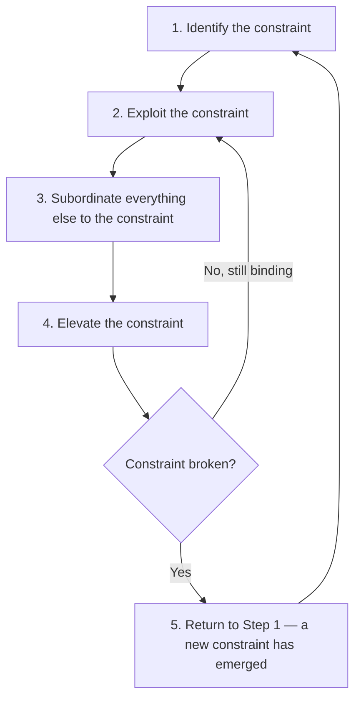

## Theory of Constraints Applied to Scheduling

### Overview

The Theory of Constraints (TOC), developed by Eliyahu Goldratt, holds that any system's throughput is governed by its single most limiting constraint (bottleneck), and that system-wide performance improves only by identifying, exploiting, subordinating to, and elevating that constraint — never by optimizing non-constraint elements in isolation. Applied to project scheduling, TOC reframes the scheduling problem away from activity-by-activity logic (the classical CPM view) and toward resource-contention and buffer management, forming the theoretical foundation of Critical Chain Project Management (CCPM).

**Key Points**

- TOC's central claim: a chain (or project) is only as strong as its weakest link — improving non-bottleneck elements does not improve overall system throughput
- In scheduling, the constraint is reframed as the **critical chain**: the longest sequence of dependent tasks *considering both logical precedence and resource dependencies*, not logic alone as in classical CPM
- TOC shifts the unit of protective safety margin from individual task duration estimates (task-level padding) to strategically placed buffers protecting the whole chain

---

### The Five Focusing Steps of TOC

TOC prescribes a continuous improvement cycle originally developed for manufacturing throughput, adapted to project scheduling as follows:

1. **Identify the constraint**: Determine the resource or dependency chain that limits how fast the project can be completed — in CCPM, this is the critical chain
2. **Exploit the constraint**: Ensure the constraining resource is never idle or starved, and is never delayed by non-critical work competing for its time
3. **Subordinate everything else**: All non-constraint activities and resources are scheduled to serve the constraint's needs, even if this means non-constraint activities run less "efficiently" in isolation
4. **Elevate the constraint**: If the constraint still limits throughput after exploitation and subordination, invest additional capacity (more resources, overtime, additional equipment) specifically at the constraint
5. **Repeat**: Once a constraint is resolved, a new constraint emerges elsewhere in the system — the cycle continues rather than terminating

**Critical TOC principle**: never let inertia become the constraint — meaning organizational habits (e.g., defaulting to task-level padding, or measuring individual task completion rather than chain throughput) can themselves become the limiting factor after the original technical constraint is resolved.

---

### From CPM's Critical Path to TOC's Critical Chain

| Concept | Classical CPM | TOC / Critical Chain |
| --- | --- | --- |
| Defining basis | Longest path through logical (precedence) dependencies only | Longest path through combined logical *and* resource dependencies |
| Assumed resource availability | Infinite (unconstrained) | Finite — explicitly modeled |
| Safety margin location | Distributed within each activity's duration estimate | Consolidated into project and feeding buffers |
| Individual task duration estimates | Include built-in safety margin (often padded to a high-confidence percentile) | Estimated at a lower-confidence (e.g., 50th percentile) duration, with removed safety pooled into buffers |
| Behavioral driver addressed | None explicitly | Student syndrome, Parkinson's Law, multitasking penalties |

**Why the critical chain can differ from the critical path**: two activities on different (non-critical, by logic alone) paths might require the same scarce resource at overlapping times. Resolving this resource conflict (by sequencing one after the other) can create a new longest chain that differs from the original logic-only critical path — this resource-adjusted longest chain is the critical chain.

---

### TOC's Behavioral Diagnosis of Traditional Scheduling

TOC's application to scheduling is grounded in a critique of how individual task estimates are made and consumed, identifying several specific dysfunctions:

**Student Syndrome**: Work on a task is delayed until close to its deadline, consuming the built-in safety margin as procrastination rather than as a buffer against genuine uncertainty, regardless of how much slack was originally estimated into the task.

**Parkinson's Law**: Work expands to fill the time available; a task estimated generously tends to take the full estimated duration even when it could have finished earlier, because early finishes are rarely reported or rewarded.

**Multitasking penalty**: When resources split attention across multiple concurrent tasks (rather than completing one before starting the next), each individual task's effective completion time lengthens due to context-switching overhead, even though the resource appears "fully utilized."

**Lack of early-finish reporting / "safety hiding"**: Because task durations are individually padded, and because early completions are not passed downstream (successors are not started early even when their predecessor finishes ahead of schedule), the safety margin is consumed but never actually benefits the project — it accumulates as wasted protection rather than pooled protection.

$$\text{Traditional (Wasted) Safety} = \sum_i (\text{Padded Duration}_i - \text{True Median Duration}_i)$$

TOC's response is not to eliminate safety margin, but to relocate and pool it, since pooled safety statistically covers overall project uncertainty more efficiently than the same total safety distributed and hidden within individual tasks.

---

### Statistical Rationale for Buffer Pooling

If activity durations are treated as independent random variables, the variance of a sum is additive, but the *relative* uncertainty of a sum shrinks compared to the sum of individual worst-case estimates:

$$\sigma_{\text{chain}} = \sqrt{\sum_i \sigma_i^2} \quad \ll \quad \sum_i \sigma_i \text{ (sum of individual safety margins)}$$

This is the statistical basis for TOC's buffer consolidation: pooling safety margin from many individual tasks into a single project buffer requires a smaller total buffer than the sum of the individual paddings it replaces, while providing equivalent (or better) statistical protection against the chain's overall completion date [Inference — this relies on an independence assumption between activity duration variances that may not fully hold when durations are correlated due to shared root causes like weather, resourcing, or scope changes].

---

### Applying the Five Focusing Steps to a Project Schedule

**Example**

A software development project's critical chain is identified as passing through a single senior database architect shared across three otherwise-parallel workstreams (Step 1: identify).

- **Exploit**: The architect's calendar is protected from non-critical meetings and administrative work during the project window; lower-priority requests for the architect's time are declined or deferred
- **Subordinate**: Other workstreams' task sequencing is adjusted so that their outputs are ready and waiting *before* the architect needs them, rather than the architect waiting on upstream work — non-constraint teams absorb the scheduling inconvenience so the constraint resource is never idle
- **Elevate**: If the architect remains the binding constraint after exploitation and subordination, the project brings in a second architect (temporary contractor, cross-training another engineer) to add capacity specifically at this point
- **Repeat**: Once the architect constraint is resolved, the critical chain shifts elsewhere — perhaps to a QA environment availability bottleneck — and the five-step cycle restarts on the new constraint

---

### Constraint Types Beyond Physical Resources

TOC in scheduling identifies constraint categories beyond an obviously scarce physical resource:

| Constraint Type | Description | Scheduling Manifestation |
| --- | --- | --- |
| Physical/resource constraint | A scarce resource limits throughput | Single specialist, shared equipment, limited crew size |
| Policy constraint | An organizational rule or practice limits throughput even without a physical scarcity | Rigid approval hierarchies, batch-processing policies, rules requiring full documentation before work starts |
| Market constraint | External demand or client-side pace limits throughput | Client review/approval cycles gating project progress |
| Behavioral constraint | Individual or team behavior patterns limit effective throughput | Multitasking culture, lack of early-finish reporting norms |

Policy and behavioral constraints are often harder to identify than physical resource constraints because they do not appear as a visible "peak" in a resource histogram — TOC's Step 1 explicitly requires looking beyond obvious physical bottlenecks.

---

### Integration with CCPM's Buffer Mechanisms

TOC's five-step framework is the conceptual foundation that CCPM operationalizes into specific scheduling artifacts:

- **Project Buffer**: The consolidated safety margin removed from individual critical chain task estimates, placed at the very end of the critical chain to protect the overall project completion date
- **Feeding Buffer**: Consolidated safety margin placed where a non-critical-chain path merges into the critical chain, protecting the critical chain from delays originating on feeding paths
- **Resource Buffer**: A signal (not a duration buffer) alerting a constraint resource in advance that its work is approaching, ensuring the resource is exploited (never idle) at the critical moment

Buffer *consumption* (how much of each buffer has been used relative to the percentage of the critical chain completed) becomes the primary project control metric in CCPM, replacing the individual-task-variance tracking more typical of classical CPM/EVM status reporting.

---

### Common Pitfalls

- Applying TOC's buffer-pooling logic without addressing the underlying behavioral constraints (student syndrome, multitasking) that caused safety margin to be hidden in task estimates in the first place — buffers alone do not fix behavior
- Misidentifying the constraint as a physical resource when it is actually a policy constraint (e.g., a mandatory sign-off procedure), leading to resource investment (Step 4: elevate) that fails to resolve the actual bottleneck
- Stopping at Step 1 (identify) without proceeding through subordination — non-constraint resources continue operating by local-efficiency logic, undermining the constraint's protection
- Assuming the critical chain is a one-time calculation; as resource assignments and progress change during execution, the binding constraint can shift, requiring the five-step cycle to be revisited
- Conflating TOC's project buffer with generic contingency reserve in traditional risk management — TOC buffers are sized and consumed based on relative chain position and consumption-versus-completion ratios, not a flat percentage of total duration

---

### Integration with EVM

- Traditional EVM metrics (SPI, CPI) are calculated relative to a time-phased Performance Measurement Baseline built on individually-padded task durations; TOC/CCPM proponents argue this can mask true performance, since a task "on schedule" against a padded estimate may still be consuming disproportionate buffer relative to its progress [Inference — this is a documented critique from CCPM literature, though EVM and CCPM are not mutually exclusive and are used in hybrid form in some organizations]
- **Buffer consumption rate versus chain completion percentage** is often used as a CCPM-native supplement (or alternative) to SPI, plotting buffer usage against project completion on a control chart to trigger management attention when consumption outpaces progress
- Organizations combining EVM and CCPM must reconcile two different "should-be-at" reference points: EVM's Planned Value curve (task-level, date-driven) and CCPM's buffer-consumption control chart (chain-level, ratio-driven) — using both without reconciling their differing assumptions about safety margin location can produce contradictory status signals

---

**Related Topics**

- Critical Chain Project Management (CCPM) full methodology and buffer sizing methods
- Project, feeding, and resource buffer sizing techniques (cut-and-paste method, root-sum-square method)
- Buffer consumption control charts and fever charts
- Behavioral scheduling dysfunctions: student syndrome and Parkinson's Law mitigation
- Multi-project Critical Chain (portfolio-level buffer management and drum resource scheduling)
- Reconciling CCPM buffer management with traditional EVM reporting