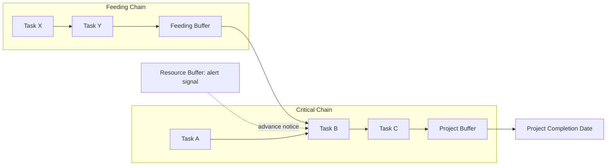

## Project, Feeding, and Resource Buffers

### Overview

Project, feeding, and resource buffers are the three buffer types used in Critical Chain Project Management (CCPM) to operationalize the Theory of Constraints' safety-margin relocation principle. Rather than embedding contingency within each individual task's duration estimate, CCPM strips that safety out at the task level, aggregates it, and reinserts it at specific structural points in the network — protecting the project as a whole rather than protecting each task in isolation.

**Key Points**

- All three buffer types exist because task duration estimates in CCPM are deliberately cut to a lower-confidence value (commonly the 50th percentile), removing the safety margin that must then be relocated somewhere
- Project buffers and feeding buffers are *time* buffers inserted into the schedule; resource buffers are *signals/alerts*, not durations, and do not themselves consume schedule time
- Buffer consumption relative to critical chain completion becomes the primary project control and reporting mechanism, replacing task-by-task variance tracking

---

### Why Buffers Are Needed: The Safety Relocation Principle

Traditional task estimates are often built to a high-confidence percentile (e.g., 80-90%) to give the individual performing the task a comfortable safety margin. CCPM instead requests estimates at a much lower confidence level (commonly 50%), then pools the difference into buffers.

$$\text{Removed Safety}_i = \text{Traditional Estimate}_i - \text{Aggressive (50th percentile) Estimate}_i$$

$$\text{Project Buffer} \approx f\left(\sum_{i \in \text{critical chain}} \text{Removed Safety}_i\right)$$

Because task durations behave as random variables, and the standard deviation of a sum grows more slowly than the sum of standard deviations, a single pooled buffer sized appropriately provides statistical protection equal to or better than the sum of the individual paddings it replaces, while requiring a smaller total duration.

---

### The Three Buffer Types

| Buffer Type | Nature | Placement | Purpose |
| --- | --- | --- | --- |
| Project Buffer | Time duration | End of the critical chain, before the project completion milestone | Protects the overall project due date from critical chain variation |
| Feeding Buffer | Time duration | Where a non-critical-chain path merges into the critical chain | Protects the critical chain from delays originating on feeding (non-critical) paths |
| Resource Buffer | Signal/alert, not a duration | Placed ahead of a critical chain task requiring a specific constrained resource | Ensures the resource is mentally and logistically ready, preventing idle time on the constraint (TOC's "exploit" step) |

---

### Project Buffer

The **project buffer** sits at the very end of the critical chain, immediately before the project's final completion milestone. It absorbs variation accumulated across every task on the critical chain, so that overruns on individual critical chain tasks consume buffer rather than directly delaying the committed project completion date.

**Sizing methods:**

**Cut-and-Paste Method (50% rule)**: The buffer is sized as 50% of the total safety removed from critical chain task estimates during the aggressive-estimate conversion.

$$\text{Project Buffer} = 0.5 \times \sum_{i \in \text{critical chain}} (\text{Traditional Estimate}_i - \text{Aggressive Estimate}_i)$$

**Root-Sum-Square (RSS) Method**: Treats each task's safety margin as a standard deviation component and combines them statistically, producing a smaller and more rigorously justified buffer than the flat 50% rule, at the cost of requiring explicit variance estimates per task.

$$\text{Project Buffer} = \sqrt{\sum_{i \in \text{critical chain}} \left(\text{Safety}_i\right)^2}$$

The RSS method generally produces a smaller buffer than the cut-and-paste method for chains with many tasks, since it more accurately reflects that unlikely worst-case outcomes are unlikely to occur simultaneously across many independent tasks [Inference — the magnitude of this difference depends on the number of tasks and the actual correlation structure between task durations, which is rarely fully independent in practice].

---

### Feeding Buffer

A **feeding buffer** is placed wherever a chain of non-critical-chain activities merges into the critical chain. Its purpose is to ensure that delays on the feeding path do not propagate into and delay the critical chain itself.

**Mechanics:**

- The feeding path is scheduled to finish, in the ideal case, before its merge point — with the feeding buffer providing the cushion between the feeding path's (aggressive-estimate) planned finish and the actual required merge date
- If the feeding path consumes its entire feeding buffer, delay begins propagating into the critical chain — the feeding buffer's consumption rate is therefore an early-warning indicator specific to that particular merge risk

**Sizing**: Feeding buffers use the same methods as project buffers (cut-and-paste or RSS), applied to the safety removed from the feeding path's own task estimates rather than the critical chain's.

**Example**

The critical chain for a product launch runs through hardware manufacturing and final assembly. A software development workstream (not on the critical chain, since it has more inherent slack) must deliver firmware before final assembly can begin. A feeding buffer is placed between the software workstream's aggressive-estimate completion and the point where firmware is required by final assembly — protecting the critical chain from software delays without requiring the software team's tasks to be padded individually.

---

### Resource Buffer

Unlike the project and feeding buffers, the **resource buffer** is not a block of schedule time — it consumes no duration and does not appear as an extension of the schedule. It is a **notification mechanism**: an advance alert sent to a specific resource (person, team, equipment operator) that their critical chain task is approaching, so they can complete any current work, clear their availability, and be ready to start exactly when needed.

**Purpose (directly implementing TOC's "Exploit the Constraint" step):**

- Prevents the situation where a critical chain task is ready to start but the required resource is unavailable or unaware, causing an avoidable delay
- Particularly important for resources that are shared across multiple projects or workstreams (see multi-project resource contention), where advance coordination prevents the resource from being double-booked at the critical moment

**Implementation forms:**

- Automated scheduling system alerts triggered a set number of days before a critical chain task's aggressive-estimate start date
- Manual project management communication protocols (e.g., a standing rule that constraint resources receive notice X working days in advance)
- Physical/logistical readiness checklists ensuring materials, access, or environment are prepared in addition to the resource's personal availability

---

### Buffer Consumption Monitoring: The Fever Chart

CCPM's primary project control tool plots buffer consumption (as a percentage of the buffer's total size) against critical chain completion (as a percentage of total chain duration), producing a chart commonly called a "fever chart" divided into zones.

<svg xmlns="http://www.w3.org/2000/svg" viewBox="0 0 560 380" font-family="sans-serif">
<text x="280" y="24" font-size="16" font-weight="bold" text-anchor="middle" fill="#1a1a1a">Buffer Consumption Fever Chart (svg_diagram)</text>

<line x1="70" y1="320" x2="520" y2="320" stroke="#333" stroke-width="2" />
<line x1="70" y1="320" x2="70" y2="50" stroke="#333" stroke-width="2" />
<text x="295" y="352" font-size="12" text-anchor="middle">% Critical Chain Complete</text>
<text x="30" y="185" font-size="12" text-anchor="middle" fill="#333" transform="rotate(-90 30 185)">% Buffer Consumed</text>

<polygon points="70,320 520,320 520,260 70,320" fill="#2ecc71" opacity="0.35" />
<polygon points="70,320 520,260 520,150 70,220" fill="#f1c40f" opacity="0.35" />
<polygon points="70,220 520,150 520,50 70,50" fill="#e74c3c" opacity="0.3" />

<text x="440" y="305" font-size="11" fill="`#1e8449`" font-weight="bold">Green (OK)</text>

<text x="440" y="195" font-size="11" fill="`#9a7d0a`" font-weight="bold">Yellow (Watch)</text>

<text x="440" y="90" font-size="11" fill="`#a93226`" font-weight="bold">Red (Act)</text>

<circle cx="140" cy="290" r="4" fill="#1a1a1a" />
<circle cx="220" cy="255" r="4" fill="#1a1a1a" />
<circle cx="300" cy="200" r="4" fill="#1a1a1a" />
<circle cx="380" cy="150" r="4" fill="#1a1a1a" />
<polyline points="140,290 220,255 300,200 380,150" fill="none" stroke="#1a1a1a" stroke-width="1.5" stroke-dasharray="3,2" />
<text x="390" y="140" font-size="10" fill="#1a1a1a">Current status: entering Yellow</text>
</svg>

**Zone interpretation:**

- **Green zone**: Buffer consumption rate is proportionally lower than chain completion rate — no management action needed
- **Yellow zone**: Buffer consumption is keeping pace with or slightly outrunning chain completion — monitor closely, prepare contingency options
- **Red zone**: Buffer consumption significantly outpaces chain completion — active management intervention required (resource reallocation, scope adjustment, or escalation)

The specific zone boundaries (where green ends and yellow begins, etc.) are commonly set as a function of percent complete — early in the project, a given consumption percentage triggers more caution than the same percentage later, since more chain remains in which the buffer could be further depleted. Exact boundary formulas vary across CCPM implementations and organizational risk tolerance [Unverified — no single universal standard governs exact zone boundaries; organizations calibrate them to their own risk appetite and historical performance].

---

### Buffer Sizing Comparison Summary

| Buffer Type | Consumes Schedule Time? | Sizing Basis | Primary Monitoring Metric |
| --- | --- | --- | --- |
| Project Buffer | Yes | Aggregated safety from critical chain tasks (cut-and-paste or RSS) | Consumption % vs. critical chain completion % (fever chart) |
| Feeding Buffer | Yes | Aggregated safety from the specific feeding path's tasks | Consumption % vs. feeding path completion, relative to merge point |
| Resource Buffer | No (signal only) | Lead-time policy (days of advance notice), not duration math | Alert delivered / resource confirmed ready (binary or lead-time compliance) |

---

### Common Pitfalls

- Sizing the project buffer as a generic percentage of total project duration (mimicking traditional contingency reserve) rather than deriving it from the safety actually removed from critical chain task estimates — this defeats the statistical rationale for buffer pooling
- Treating the resource buffer as if it were a time buffer that extends the schedule, when it is fundamentally a coordination/notification mechanism consuming no duration
- Failing to place feeding buffers at every merge point, leaving the critical chain exposed to delay propagation from paths that appear "non-critical" and therefore seemingly low-risk
- Monitoring buffer consumption only at project milestones rather than continuously, missing the early-warning value the fever chart is designed to provide
- Allowing individual task owners to re-insert their own informal safety margin on top of the aggressive estimate, silently reintroducing the student syndrome and Parkinson's Law dynamics that buffer consolidation was meant to eliminate

---

### Integration with EVM

- CCPM's buffer consumption metric and EVM's SPI both aim to answer "are we on track," but from different structural assumptions — SPI compares earned value against a time-phased baseline built on padded (traditional) estimates, while buffer consumption compares actual chain progress against buffers built from de-padded (aggressive) estimates; using both without reconciling this difference can generate seemingly contradictory status signals for the same underlying project condition [Inference — this reconciliation challenge is a recurring theme in literature comparing CCPM and EVM, though the two are not inherently incompatible when the organization is explicit about which safety-margin model underlies its baseline]
- Feeding buffer consumption provides a EVM-complementary diagnostic that pure critical-path float analysis does not: a feeding path with high buffer consumption signals emerging risk to the critical chain before that risk would necessarily show up as a negative schedule variance (SV) on the critical chain itself
- Resource buffer discipline (ensuring constrained resources are alerted and ready) reduces the incidence of resource-unavailability delays that would otherwise appear as unfavorable SPI with an ambiguous root cause in traditional EVM reporting — tracking resource buffer compliance separately clarifies whether schedule slippage stems from estimation error or resource coordination failure

---

**Related Topics**

- Buffer sizing methods in depth: cut-and-paste versus root-sum-square comparative accuracy
- Fever chart zone calibration and organizational risk tolerance calibration
- Multi-project Critical Chain: drum resource scheduling and staggered project buffers across a portfolio
- Behavioral adoption challenges: transitioning task estimators from padded to aggressive-estimate culture
- Reconciling CCPM buffer reporting with traditional EVM baseline reporting
- Critical chain identification algorithms when resource and logical dependencies conflict