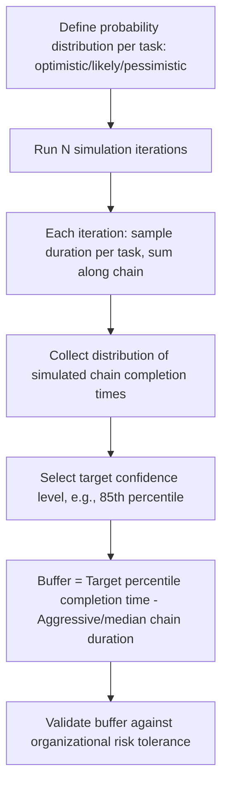

## Buffer Sizing Methods

### Overview

Buffer sizing methods are the quantitative techniques used to determine how large a project, feeding, or resource buffer should be in Critical Chain Project Management. Because buffers exist to statistically absorb the variability removed from individual task estimates, sizing them correctly is central to CCPM's validity — an undersized buffer fails to protect the schedule, while an oversized buffer erodes the very schedule compression CCPM is meant to deliver.

**Key Points**

- All buffer sizing methods answer the same underlying question: how much pooled safety is needed to protect a chain of tasks whose individual safety margins were deliberately removed?
- Methods range from simple heuristic rules (fast to apply, less statistically rigorous) to variance-based statistical methods (more rigorous, more data-intensive) to simulation-based methods (most rigorous, most computationally demanding)
- No single method is universally "correct" — the choice reflects a trade-off between implementation simplicity, data availability, and desired statistical fidelity

---

### The Underlying Statistical Rationale

Buffer sizing methods share a common foundation: if $n$ independent task durations each have some safety margin removed, the *aggregate* uncertainty of the chain grows with the square root of the sum of variances, not with the linear sum of individual safety margins.

$$\sigma_{\text{chain}} = \sqrt{\sum_{i=1}^{n} \sigma_i^2}$$

Since $\sigma_{\text{chain}} \leq \sum_{i=1}^n \sigma_i$ for any set of two or more positive variances, a correctly sized pooled buffer can be smaller than the sum of individually removed safety margins while providing equal or greater statistical protection — this inequality is what justifies buffer consolidation in the first place, and every sizing method below is, in effect, an attempt to approximate or exploit this relationship.

---

### Method 1: Cut-and-Paste (50% Rule)

The simplest and most widely cited method. Each task's traditional (high-confidence, e.g., 80-90th percentile) duration estimate is compared against an aggressive (50th percentile, "median") estimate. The difference is the safety removed from that task. The buffer is set to 50% of the total safety removed across all tasks on the chain.

$$\text{Buffer} = 0.5 \times \sum_{i=1}^{n} \left(D_i^{\text{traditional}} - D_i^{\text{aggressive}}\right)$$

**Advantages:**

- Extremely simple to calculate and explain to stakeholders
- Requires only two duration estimates per task, both of which are commonly already produced during traditional estimating practice

**Limitations:**

- The 50% factor is a heuristic rule of thumb, not derived from the actual variance structure of the specific chain — it does not distinguish between a chain of 3 highly variable tasks and a chain of 30 low-variability tasks, even though the statistically appropriate buffer would differ substantially between these cases [Inference — this is a widely noted critique of the cut-and-paste method in CCPM literature]
- Tends to oversize buffers for long chains with many tasks (where the square-root relationship would justify a smaller buffer) and can undersize buffers for short chains with highly variable tasks

---

### Method 2: Root-Sum-Square (RSS) Method

Treats each task's removed safety margin as representing a standard deviation, and combines them using the square-root-of-sum-of-squares formula directly, rather than a flat percentage.

$$\text{Buffer} = \sqrt{\sum_{i=1}^{n} \left(D_i^{\text{traditional}} - D_i^{\text{aggressive}}\right)^2}$$

**Advantages:**

- Directly reflects the statistical aggregation principle rather than approximating it with a fixed ratio
- Produces progressively smaller buffers (as a fraction of total removed safety) as the number of tasks in the chain increases, correctly capturing the diversification benefit of combining many independent uncertain durations

**Limitations:**

- Assumes each task's duration variance is well-approximated by the difference between two point estimates, which is a simplification of the true underlying probability distribution
- Assumes task duration variability is statistically independent across tasks — correlated risks (e.g., a single weather event or a common supplier delay affecting multiple tasks simultaneously) violate this assumption and can cause the RSS method to undersize the buffer relative to actual risk [Inference — the degree of undersizing depends on the actual correlation structure, which varies by project and is often not empirically measured]

**Comparative example**: For a 9-task critical chain where each task has 4 days of removed safety (36 days total removed safety):

- Cut-and-paste buffer: $0.5 \times 36 = 18$ days
- RSS buffer: $\sqrt{9 \times 4^2} = \sqrt{144} = 12$ days

The RSS method produces a smaller buffer in this case, illustrating why chain length and the number of pooled tasks materially affects which method yields a more conservative result.

---

### Method 3: Three-Point (PERT-Style) Variance Estimation

Rather than using only two duration points (traditional and aggressive), this method applies three-point estimation per task — optimistic ($t_o$), most likely ($t_m$), pessimistic ($t_p$) — and derives both an expected duration and a variance per task using the standard PERT formulas:

$$t_e = \frac{t_o + 4t_m + t_p}{6} \qquad \sigma_i^2 = \left(\frac{t_p - t_o}{6}\right)^2$$

The chain's aggressive-estimate duration uses $t_e$ (or sometimes $t_m$) per task, and the buffer is sized using RSS aggregation of the resulting $\sigma_i^2$ values:

$$\text{Buffer} = z \times \sqrt{\sum_{i=1}^n \sigma_i^2}$$

Where $z$ is a chosen confidence multiplier (e.g., $z=1$ for approximately 68% confidence under a normality assumption, $z \approx 1.65$ for approximately 90% confidence).

**Advantages:**

- Grounds the buffer size in an explicit confidence level, communicable to stakeholders as "this buffer provides approximately X% confidence of protecting the completion date"
- Leverages three-point estimation practices that may already be standard in organizations using PERT or Monte Carlo risk analysis elsewhere

**Limitations:**

- Requires three duration estimates per task rather than two, increasing estimation effort
- The PERT variance formula itself is a simplification (derived from an assumed Beta distribution approximation) and may not accurately reflect true task duration variability in all contexts

---

### Method 4: Monte Carlo Simulation-Based Sizing

The most statistically rigorous approach: rather than relying on closed-form aggregation formulas, thousands of simulated chain completions are generated by sampling each task's duration from its assumed probability distribution (Beta, Triangular, or empirically derived), and the buffer is sized directly from the resulting distribution of simulated chain completion times.

$$\text{Buffer} = P_{85}(\text{Simulated Chain Duration}) - \text{Median Chain Duration}$$

Where $P_{85}$ denotes the 85th percentile of the simulated completion time distribution (the target percentile is a policy choice, commonly falling in the 80-95% range depending on organizational risk appetite).

**Advantages:**

- Does not require an independence assumption to be strictly true if the simulation explicitly models correlations between task durations (e.g., common-cause risk factors affecting multiple tasks)
- Directly produces a confidence-level-based buffer size without relying on a normality assumption, since it uses the empirical simulated distribution rather than a closed-form variance formula
- Can incorporate non-standard risk events (discrete risk occurrences, not just continuous duration variability) directly into the buffer sizing calculation

**Limitations:**

- Requires more sophisticated tooling (simulation software) and more detailed probability distribution inputs per task than the simpler methods
- Result quality depends heavily on the accuracy of the input distributions and any modeled correlations — poor input assumptions produce a precise-looking but inaccurate buffer size ("garbage in, garbage out")

---

### Comparative Summary

| Method | Data Required | Statistical Rigor | Handles Correlation? | Typical Use Case |
| --- | --- | --- | --- | --- |
| Cut-and-Paste (50% rule) | Two estimates per task | Low (heuristic) | No | Quick implementation, initial CCPM adoption, small-to-medium chains |
| Root-Sum-Square (RSS) | Two estimates per task | Moderate | No (assumes independence) | Standard CCPM practice once teams are comfortable with variance concepts |
| Three-Point / PERT-Style | Three estimates per task | Moderate-High | No (assumes independence) | Organizations already using three-point estimating for risk analysis |
| Monte Carlo Simulation | Full probability distributions per task, optionally with correlation structure | High | Yes, if explicitly modeled | Complex, high-value, or high-uncertainty projects where sizing accuracy materially affects decision-making |

---

### Resource Buffer Sizing (A Distinct Consideration)

Because resource buffers are lead-time alerts rather than schedule-duration buffers, they are sized differently from project and feeding buffers — as a **policy-based lead time** rather than a statistically derived duration:

- Common practice sets resource buffer lead time based on the specific resource's typical reallocation or ramp-up time (e.g., "constrained specialists receive 3 working days' notice")
- Sizing can be informed by historical data on how long it typically takes a given resource type to disengage from other commitments and become available
- Unlike project/feeding buffers, there is no standard statistical formula for resource buffer "size" since it is not protecting against duration variance but against coordination failure

---

### Buffer Sizing in Practice: A Worked Comparison

**Example**

A 6-task feeding chain has the following removed safety values (traditional minus aggressive estimate, in days) per task: 3, 2, 4, 1, 3, 2 (total = 15 days).

- **Cut-and-paste**: $0.5 \times 15 = 7.5$ days
- **RSS**: $\sqrt{3^2+2^2+4^2+1^2+3^2+2^2} = \sqrt{9+4+16+1+9+4} = \sqrt{43} \approx 6.6$ days

The two methods produce similar results in this case because the chain is relatively short; as chain length grows, the gap between the two methods' outputs widens, with RSS producing proportionally smaller buffers for longer chains — this is the direct consequence of the square-root aggregation relationship discussed above.

---

### Common Pitfalls

- Applying the 50% cut-and-paste rule uniformly regardless of chain length, producing systematically oversized buffers on long chains and potentially undersized buffers on short, high-variability chains
- Using RSS or three-point methods while implicitly assuming task duration independence, when common-cause risks (shared suppliers, shared weather exposure, shared resource fatigue) actually correlate durations across multiple chain tasks
- Selecting a Monte Carlo target percentile without an explicit organizational risk-tolerance discussion, resulting in a buffer size that looks rigorous but reflects an arbitrary confidence choice
- Sizing resource buffers using duration-variance formulas meant for project/feeding buffers, conflating a coordination lead-time policy with a statistical schedule buffer
- Failing to revisit buffer sizing methodology as more historical execution data becomes available — early-project buffer sizes based on estimation alone should ideally be recalibrated against actual observed task duration variance over time

---

### Integration with EVM

- The buffer sizing method chosen affects how "aggressive" the underlying critical chain baseline is, which in turn affects the relationship between CCPM buffer-consumption tracking and any parallel EVM reporting — a Monte-Carlo-sized buffer at a high confidence percentile produces a materially different aggressive baseline than a cut-and-paste-sized buffer, even for the identical set of tasks
- Organizations running hybrid CCPM/EVM reporting should document which buffer sizing method underlies the published schedule baseline, since stakeholders reconciling SPI-based status against buffer-consumption-based status need to understand the statistical assumptions behind each metric to avoid misinterpreting apparently conflicting signals
- Historical buffer consumption data, once collected across multiple projects, can itself become an empirical input for future buffer sizing (an organization-specific alternative or calibration check to the generic 50% or RSS formulas), analogous to how historical EVM performance indices (CPI, SPI) inform future estimate-at-completion forecasting

---

**Related Topics**

- Fever chart zone calibration using different buffer sizing method outputs
- Monte Carlo schedule risk simulation architecture and correlation modeling
- Three-point (PERT) estimation practices and Beta distribution assumptions
- Multi-project Critical Chain: buffer sizing across a shared resource pool
- Historical calibration of buffer sizing using organizational process assets
- Reconciling CCPM aggressive baselines with traditional EVM performance measurement baselines