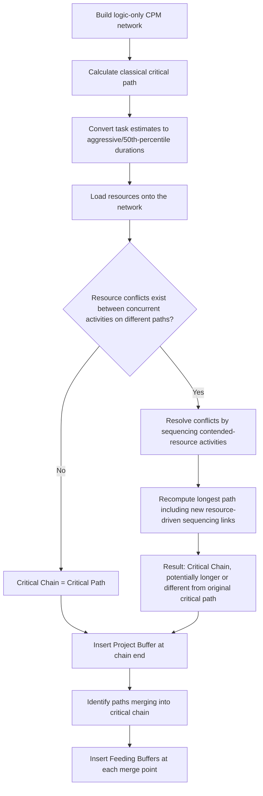

## Critical Chain versus Critical Path Comparison

### Overview

The critical path and the critical chain both identify the sequence of activities that determines a project's minimum completion date, but they are derived from different underlying assumptions and serve different scheduling philosophies. The critical path is a purely logic-based construct from classical CPM, computed assuming unlimited resource availability; the critical chain incorporates resource constraints directly into the determination of the longest sequence, making it the resource-adjusted counterpart used in Critical Chain Project Management.

**Key Points**

- The critical path is computed from precedence logic alone; the critical chain is computed from precedence logic *combined with* resource contention
- When resources are unconstrained (or sufficiently abundant relative to demand), the critical chain and critical path coincide exactly — the distinction only matters when resource scarcity exists
- The critical chain, once identified, receives the project buffer; non-critical-chain paths receive feeding buffers — the entire CCPM buffer architecture is built around whichever chain is identified as critical

---

### Formal Definitions

**Critical Path (Classical CPM)**

The longest path through the activity network considering only precedence (logical) dependencies, assuming every activity can be resourced simultaneously without constraint.

$$\text{Critical Path} = \arg\max_{\text{paths } P} \sum_{i \in P} d_i \quad \text{subject to precedence constraints only}$$

Total float for any activity $i$ on the critical path is zero:

$$TF_i = LS_i - ES_i = 0$$

**Critical Chain (CCPM)**

The longest path through the network considering *both* precedence dependencies and resource dependencies — meaning that if two activities on different logical paths require the same constrained resource, a sequencing dependency is introduced between them even though no logical predecessor relationship exists in the original network.

$$\text{Critical Chain} = \arg\max_{\text{paths } P} \sum_{i \in P} d_i \quad \text{subject to precedence AND resource constraints}$$

---

### Why the Two Can Diverge

<svg xmlns="http://www.w3.org/2000/svg" viewBox="0 0 580 400" font-family="sans-serif">
<text x="290" y="24" font-size="16" font-weight="bold" text-anchor="middle" fill="#1a1a1a">Critical Path vs. Critical Chain Divergence (svg_diagram)</text>

<text x="20" y="55" font-size="12" font-weight="bold" fill="#333">Logic-only network (Critical Path view)</text>

<rect x="30" y="70" width="80" height="30" fill="#3498db" />
<text x="70" y="90" font-size="10" text-anchor="middle" fill="white">Task A (5d)</text>
<rect x="130" y="70" width="80" height="30" fill="#3498db" />
<text x="170" y="90" font-size="10" text-anchor="middle" fill="white">Task B (5d)</text>
<rect x="230" y="70" width="80" height="30" fill="#3498db" />
<text x="270" y="90" font-size="10" text-anchor="middle" fill="white">Task C (5d)</text>
<text x="340" y="90" font-size="10" fill="#3498db" font-weight="bold">= 15 days (longest by logic)</text>
<line x1="110" y1="85" x2="130" y2="85" stroke="#333" stroke-width="1.5" />
<line x1="210" y1="85" x2="230" y2="85" stroke="#333" stroke-width="1.5" />

<rect x="30" y="130" width="80" height="30" fill="#95a5a6" />
<text x="70" y="150" font-size="10" text-anchor="middle" fill="white">Task X (4d)</text>
<rect x="130" y="130" width="80" height="30" fill="#95a5a6" />
<text x="170" y="150" font-size="10" text-anchor="middle" fill="white">Task Y (4d)</text>
<text x="260" y="150" font-size="10" fill="#7f8c8d" font-weight="bold">= 8 days (shorter by logic alone)</text>
<line x1="110" y1="145" x2="130" y2="145" stroke="#333" stroke-width="1.5" />

<text x="70" y="185" font-size="9" fill="`#c0392b`" font-style="italic">Task B and Task Y both require the same crane operator</text>

<line x1="20" y1="205" x2="560" y2="205" stroke="#ccc" stroke-width="1" />

<text x="20" y="230" font-size="12" font-weight="bold" fill="#333">Resource-adjusted network (Critical Chain view)</text>

<rect x="30" y="245" width="80" height="30" fill="#95a5a6" />
<text x="70" y="265" font-size="10" text-anchor="middle" fill="white">Task X (4d)</text>
<rect x="130" y="245" width="80" height="30" fill="#95a5a6" />
<text x="170" y="265" font-size="10" text-anchor="middle" fill="white">Task Y (4d)</text>
<rect x="230" y="245" width="80" height="30" fill="#3498db" />
<text x="270" y="265" font-size="9" text-anchor="middle" fill="white">Task B (5d, waits for crane)</text>
<rect x="330" y="245" width="80" height="30" fill="#3498db" />
<text x="370" y="265" font-size="10" text-anchor="middle" fill="white">Task C (5d)</text>
<line x1="110" y1="260" x2="130" y2="260" stroke="#333" stroke-width="1.5" />
<line x1="210" y1="260" x2="230" y2="260" stroke="#c0392b" stroke-width="2" />
<text x="220" y="245" font-size="8" fill="#c0392b">resource link</text>
<line x1="310" y1="260" x2="330" y2="260" stroke="#333" stroke-width="1.5" />
<text x="450" y="265" font-size="10" fill="#c0392b" font-weight="bold">= 18 days (new critical chain)</text>

<text x="20" y="340" font-size="10" fill="#555" font-style="italic">Resource contention on the crane operator forces Task B to wait for Task Y,</text>

<text x="20" y="358" font-size="10" fill="#555" font-style="italic">extending the effective longest chain from 15 to 18 days.</text>

</svg>

In this illustration, Task B and Task Y do not share a logical predecessor-successor relationship, but both require the same crane operator. Once this resource dependency is enforced, Task B cannot start until Task Y (and its resource) is free, creating a *de facto* sequencing constraint that lengthens the effective longest path from 15 days (logic-only critical path) to 18 days (resource-adjusted critical chain).

---

### Side-by-Side Comparison

| Dimension | Critical Path | Critical Chain |
| --- | --- | --- |
| Dependency basis | Precedence (logic) only | Precedence AND resource contention |
| Resource assumption | Unlimited/unconstrained | Explicitly finite, modeled |
| Safety margin location | Distributed within each task's duration estimate | Consolidated into project and feeding buffers |
| Float terminology | Total float, free float | Feeding buffer consumption (conceptually analogous but calculated differently) |
| Sensitivity to resource reassignment | None — recalculating resource assignments does not change the critical path by definition | High — reassigning a contended resource can change which chain is critical |
| Governing methodology | Classical CPM | Critical Chain Project Management (rooted in Theory of Constraints) |
| Typical software output | Standard in nearly all scheduling tools (Gantt charts, network diagrams) | Requires CCPM-specific software features or add-ons; less universally available |
| When they coincide | N/A (this is always the baseline case) | When no resource contention exists across parallel paths — the critical chain equals the critical path exactly |

---

### Identifying the Critical Chain: Process

A key procedural point: identifying the critical chain requires first converting to aggressive (de-padded) duration estimates and then resolving resource conflicts — performing resource leveling on the padded (traditional) durations would produce a different, less compressed result than CCPM's intended aggressive-estimate-based critical chain.

---

### Practical Implications of the Distinction

**Schedule risk visibility**: Classical CPM's float calculation can understate true schedule risk when resource contention exists on nominally "non-critical" paths — an activity with substantial logical float may still face a hard resource-availability constraint invisible to a float calculation performed without resource loading.

**Baseline stability under resource reassignment**: Because the critical chain depends on resource assignments, changing which specific resource is assigned to a task (e.g., substituting a different but equally qualified team member) can shift which chain is critical — a sensitivity classical critical path calculations do not exhibit, since the critical path is invariant to resource assignment by construction.

**Management focus**: In classical CPM, project managers focus attention on critical path activities (zero float). In CCPM, management attention explicitly follows TOC's exploit/subordinate logic — protecting the critical chain resource assignments and closely monitoring feeding buffer consumption at merge points, since a feeding-path delay is the most common threat to the critical chain's integrity.

---

### Example: Same Network, Different Answers

**Example**

A network has two paths converging on a final integration task: Path 1 (logic-only length: 20 days) and Path 2 (logic-only length: 14 days). Under classical CPM, Path 1 is the critical path (float on Path 2 = 6 days). If, however, a specific mechanical technician is required by both a Path 1 activity and a Path 2 activity in overlapping windows, and Path 2's activity is scheduled first due to an earlier logical start, Path 1's technician-dependent activity may be delayed until the technician frees up — potentially consuming all 6 days of Path 1's apparent "buffer" relative to Path 2, or even causing Path 1 (now resource-delayed) to become longer than originally calculated. The critical chain in this resourced scenario may no longer be Path 1 in its original form, but a hybrid sequence reflecting the resource-driven reordering.

---

### Common Pitfalls

- Assuming the classical critical path automatically represents the true schedule risk driver in a resource-constrained environment, when a resource-adjusted critical chain calculation might reveal a different or longer governing sequence
- Applying CCPM buffer concepts (project buffer, feeding buffer) to a critical path that was never actually resource-adjusted into a critical chain, producing a hybrid approach that lacks the resource-conflict resolution CCPM's buffer architecture assumes has already occurred
- Failing to recompute the critical chain when resource assignments change during execution, since a chain identified as critical at baseline may no longer be critical once actual resourcing diverges from the plan
- Treating critical chain identification as a one-time calculation rather than revisiting it whenever significant progress updates or resource reallocation occurs
- Confusing "critical chain" with simply "the critical path with buffers added" — the resource-conflict resolution step is what defines the critical chain, not merely the subsequent buffer insertion

---

### Integration with EVM

- EVM's Performance Measurement Baseline is conventionally built from classical CPM schedule dates; if a project is actually managed via critical chain (with resource-adjusted sequencing and aggressive estimates), the EVM baseline should reflect the critical-chain-adjusted schedule, not the original unconstrained critical path, or Planned Value time-phasing will not match the actual intended execution sequence
- Divergence between the critical path and critical chain is itself a risk signal worth surfacing in EVM-adjacent risk reporting — a project where the critical chain differs substantially from the critical path indicates the schedule is more resource-sensitive than the logic-only network suggests, warranting closer monitoring of the specific contended resources
- When organizations run classical EVM reporting (SPI/CPI) alongside CCPM buffer tracking, the critical chain (not the critical path) should be the reference sequence used to determine which activities' delays are most consequential to the project completion date, ensuring corrective action prioritization aligns with the resource-adjusted reality rather than the unconstrained logic-only view

---

**Related Topics**

- Resource-Constrained Project Scheduling Problem (RCPSP) formal formulation
- Critical chain identification algorithms in commercial CCPM software
- Project and feeding buffer placement at chain merge points
- Multi-project Critical Chain and drum resource scheduling across a portfolio
- Sensitivity of the critical chain to resource reassignment during execution
- Reconciling classical CPM-based EVM baselines with CCPM aggressive-estimate baselines