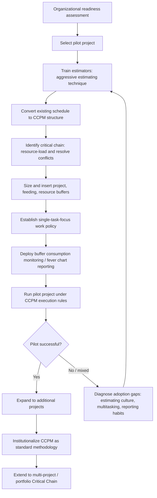

## Implementing CCPM in Practice

### Overview

Implementing Critical Chain Project Management is an organizational change effort as much as a scheduling technique change — it requires converting estimation practices, restructuring the schedule network, retraining reporting habits, and shifting measurement from task-level dates to buffer-consumption trends. Organizations that implement only the mechanical scheduling changes (aggressive estimates, buffers) without addressing the behavioral and cultural dimensions commonly see limited benefit, since CCPM's theoretical advantages depend on genuine behavioral change alongside the new schedule structure.

**Key Points**

- Successful CCPM implementation requires converting existing task estimates from padded (high-confidence) to aggressive (median) values — a change that meets predictable resistance from task owners accustomed to protective padding
- CCPM changes what is measured and reported: individual task due-date adherence is de-emphasized in favor of buffer consumption trends and single-task focus (avoiding multitasking)
- Software tooling, training, and pilot-project selection are all practical implementation levers that materially affect adoption success

---

### Implementation Roadmap

---

### Step 1: Organizational Readiness and Pilot Selection

Before converting an entire portfolio to CCPM, most successful implementations begin with a single pilot project, chosen deliberately:

- **Moderate complexity**: Complex enough to demonstrate CCPM's value on resource contention and buffer management, but not so complex that implementation mistakes are costly or highly visible
- **Supportive sponsor**: A project sponsor willing to tolerate the initial adjustment period and defend the aggressive-estimating approach against instinctive stakeholder skepticism
- **Measurable baseline**: A project type for which the organization has reasonable historical data, enabling a meaningful before/after comparison of schedule performance

**Readiness indicators an organization should assess:**

- Willingness of task owners and their managers to abandon individual task-level padding without punitive consequences for early or on-time (rather than "early-flagged-as-wrong") completion
- Existing project management maturity — organizations with weak baseline scheduling discipline may need to strengthen fundamental CPM practice before layering CCPM on top
- Availability of a sponsor or champion empowered to enforce single-task-focus policies, which often conflict with prevailing multitasking-heavy resource management norms

---

### Step 2: Converting Estimation Practice

The most behaviorally sensitive step is converting task duration estimates from traditional (padded) to aggressive (50th-percentile) values.

**Practical techniques for this conversion:**

- **Direct estimator conversation**: Ask estimators for their traditional estimate, then explicitly ask "if there were no need to protect against risk, what would this realistically take about half the time?" — anchoring the aggressive estimate relative to the familiar padded one
- **Historical data mining**: Where historical actual-duration data exists, derive the aggressive estimate empirically (e.g., median of past similar task durations) rather than relying solely on a conversation-based estimate
- **Explicit safety-margin transparency**: Communicate clearly to estimators that removed safety is not being deleted from the project — it is being relocated to buffers, still available to protect their work, just managed collectively rather than individually

**Common resistance pattern**: Estimators frequently perceive aggressive estimating as management pressure to "sandbag less" without corresponding trust that pooled buffers will genuinely protect them — addressing this perception directly, and demonstrating early pilot buffer usage transparently, is often necessary for adoption to take hold [Inference — this dynamic is widely discussed in CCPM implementation literature, though the specific severity varies by organizational culture and prior estimating practices].

---

### Step 3: Restructuring the Schedule Network

Once aggressive estimates are established, the schedule must be rebuilt to reflect CCPM structure:

1. Resource-load the network using aggressive estimates
2. Resolve resource conflicts to identify the true critical chain (distinct from the original logic-only critical path — see critical chain versus critical path comparison)
3. Size and insert the project buffer at the end of the critical chain
4. Identify every point where a non-critical-chain path merges into the critical chain, and size/insert a feeding buffer at each
5. Establish resource buffer alert policies for constrained resources feeding the critical chain

This restructuring is typically a one-time setup effort per project, followed by ongoing buffer consumption monitoring rather than repeated full network rebuilds — though significant scope or resource changes during execution may require partial rework of this structure.

---

### Step 4: Establishing Execution Policies

CCPM's theoretical benefits depend on specific execution behaviors, which must be established as explicit team working agreements, not left implicit:

**Single-task focus / relay-race work ethic**: Resources work on one task at a time, completing it as quickly as possible ("relay-race" mentality — pass the baton and move fully to the next leg), rather than splitting attention across multiple concurrent assignments. This directly counters the multitasking penalty TOC identifies as a hidden throughput killer.

**Immediate reporting of early finishes**: A resource finishing a task early is expected to report the actual completion immediately, allowing successor tasks to start early rather than waiting for the originally scheduled start date — countering Parkinson's Law, where work otherwise expands to fill the full estimated duration.

**No due-date pressure on individual tasks**: Since aggressive estimates carry roughly 50% likelihood of being exceeded on any individual task, task-level lateness against the aggressive estimate should not trigger the same alarm or penalty traditional scheduling would apply — the buffer, not individual task adherence, is the meaningful control signal. Communicating this clearly is essential, since it represents a significant departure from conventional task-level accountability culture.

**Resource buffer responsiveness**: Constrained resources receiving advance alerts are expected to actually clear their availability in response, rather than treating the alert as informational only.

---

### Step 5: Deploying Monitoring and Reporting

**Fever chart / buffer consumption reporting** replaces (or supplements) traditional Gantt-chart-based status reporting as the primary control mechanism:

- Buffer consumption percentage is tracked against critical chain completion percentage
- Reports focus management attention on buffers entering yellow or red zones, rather than individual late tasks
- Reporting cadence is typically more frequent than traditional milestone reporting, since buffer trends are most useful as an early-warning mechanism when reviewed regularly

**Software tooling considerations**: While CCPM concepts can be implemented manually or in spreadsheets for small projects, most organizations adopt CCPM-capable scheduling software (either dedicated CCPM tools or CCPM add-on modules for existing CPM software) to automate resource-conflict resolution, buffer sizing calculations, and fever chart generation at scale. Specific product capabilities and feature sets change over time and should be verified against current vendor documentation rather than assumed from general CCPM theory [Unverified — the tooling landscape evolves, and this content does not endorse or describe specific current software products].

---

### Common Implementation Obstacles

| Obstacle | Manifestation | Mitigation Approach |
| --- | --- | --- |
| Estimator resistance to aggressive estimating | Estimators quietly re-pad tasks despite instructions, undermining buffer sizing accuracy | Transparent communication about buffer purpose; historical data validation of aggressive estimates; non-punitive culture around individual task variance |
| Persistent multitasking culture | Resources continue splitting time across tasks despite single-task-focus policy | Explicit resource manager buy-in; visible enforcement; addressing the organizational incentives that originally drove multitasking (e.g., utilization metrics) |
| Misinterpreting task lateness against aggressive estimates as a problem | Stakeholders react to individual task overruns as if under traditional CPM reporting, undermining CCPM's buffer-centric philosophy | Stakeholder education on buffer-based control; reframing reporting dashboards around buffer consumption, not task due dates |
| Software/tooling gaps | Existing scheduling tools lack native CCPM features (critical chain identification, fever charts) | Evaluate CCPM-specific tooling or add-ons before full-scale rollout; pilot with manual/spreadsheet tracking if necessary |
| Portfolio-level resource contention not addressed | Single-project CCPM implemented while shared resources across other (non-CCPM) projects remain a source of unmanaged contention | Extend CCPM principles to multi-project resource management (drum resource scheduling) rather than implementing project-by-project in isolation |

---

### Example: A Phased Rollout

**Example**

An engineering firm implements CCPM starting with a single moderately complex product development project as a pilot. Estimators are trained in aggressive estimating with historical data validation; the schedule is restructured with a project buffer sized via the root-sum-square method and feeding buffers at three merge points; a single-task-focus policy is enforced with explicit resource manager sign-off. After the pilot demonstrates a measurable reduction in overall project duration alongside successful buffer-based early warning of a schedule risk (a feeding buffer that reached the red zone, triggering timely intervention before it affected the critical chain), the organization expands CCPM to two additional projects sharing a common resource pool, at which point multi-project buffer coordination (drum resource scheduling) becomes the next implementation priority.

---

### Common Pitfalls

- Implementing the mechanical elements of CCPM (aggressive estimates, buffers) without addressing the behavioral elements (single-task focus, early-finish reporting), producing a schedule that looks like CCPM but does not deliver CCPM's intended benefits
- Rolling out CCPM organization-wide before validating the approach through a pilot, multiplying the risk of implementation mistakes across many projects simultaneously
- Continuing to evaluate individual task performance against aggressive estimates using traditional due-date-adherence metrics, effectively punishing the very estimating behavior CCPM requires
- Neglecting multi-project resource contention when implementing CCPM on a single project within a larger portfolio still governed by traditional scheduling elsewhere, undermining the constrained-resource protections CCPM depends on
- Underestimating the change-management effort required and treating CCPM adoption as a purely technical/software rollout rather than a cultural and behavioral shift

---

### Integration with EVM

- Organizations transitioning to CCPM must decide, before rollout, how EVM reporting will coexist with buffer-based control — options include running EVM against the CCPM-adjusted (aggressive-estimate) baseline, maintaining a parallel traditional baseline for contractual EVM reporting while using buffer consumption internally, or phasing out formal EVM in favor of buffer-based reporting entirely; each choice carries different implications for contractual reporting obligations and stakeholder communication
- Pilot project selection should consider whether the project has external EVM reporting obligations (e.g., contractual earned value reporting requirements) that constrain how freely the schedule baseline can be restructured around aggressive estimates
- Buffer consumption trends observed during a CCPM pilot can be compared against what traditional EVM metrics (SPI, CPI) would have indicated for the same underlying project performance, providing an internal validation point for whether the organization's chosen sizing methodology and execution policies are functioning as intended before wider rollout

---

**Related Topics**

- Multi-project Critical Chain implementation and drum resource scheduling
- Change management strategies for aggressive-estimating culture adoption
- CCPM-capable scheduling software evaluation criteria
- Fever chart reporting cadence and stakeholder communication design
- Reconciling contractual EVM reporting obligations with CCPM-based internal control
- Long-term institutionalization: from pilot project to organizational standard methodology