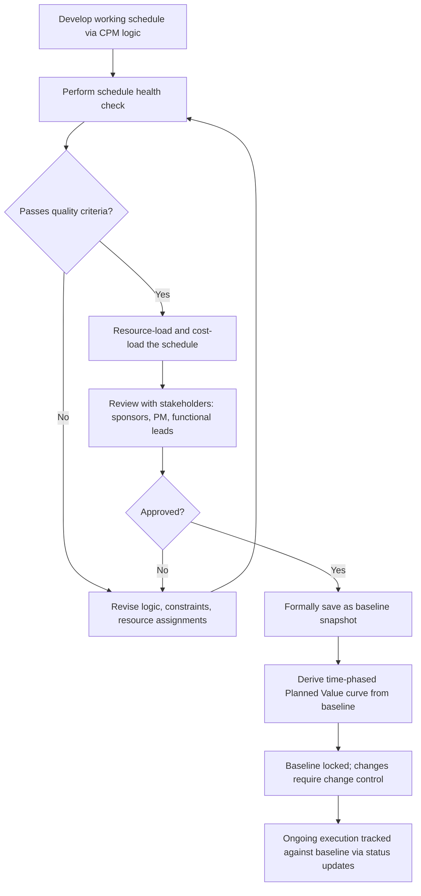

## Establishing the Schedule Baseline

### Overview

Establishing the schedule baseline is the process of formally approving and freezing a specific version of the project schedule as the reference point against which all future progress, variance, and performance will be measured. The baseline transforms a working schedule (subject to ongoing revision during planning) into a controlled artifact — changes to it thereafter require formal change control rather than routine editing, since the baseline is what makes schedule variance (SV) and Schedule Performance Index (SPI) calculations in EVM meaningful.

**Key Points**

- A schedule baseline is a snapshot, not a living document — once approved, it does not update automatically as the project executes, even though the working (current) schedule does
- Baseline quality depends on the maturity of the underlying CPM network — a baseline built on an incomplete or poorly logic-linked schedule produces unreliable variance measurement from day one
- Establishing the baseline is the formal transition point between project planning and project execution/control in most schedule management frameworks

---

### Prerequisites Before Baselining

A schedule should not be baselined until it satisfies a set of readiness criteria, since baselining a flawed schedule produces a flawed measurement foundation for the entire project duration.

**Schedule quality checks (commonly termed a "schedule health check"):**

- **Logic completeness**: Every activity (except the first and last) has at least one predecessor and one successor — no "dangling" activities disconnected from the network
- **Minimal use of hard constraint dates**: Excessive use of "must start on" or "must finish on" constraints (rather than logic-driven dates) undermines the schedule's ability to reflect true dependency-driven float
- **Reasonable lag/lead usage**: Excessive positive lags or negative leads (fast-tracking overlaps) should be reviewed, since they can mask logic errors or unrealistic compression assumptions
- **No excessive float outliers**: Extremely high float values on individual activities often indicate a missing logical link rather than genuine schedule flexibility
- **Resource loading completed**: If EVM cost baselining depends on resource-loaded time-phased costs, resource assignments should be finalized before baseline approval
- **Critical path validated**: Stakeholders should confirm the critical path (or critical chain, if using CCPM) makes logical sense given the project's actual constraints and priorities

$$\text{Schedule Health Score} = f(\text{logic completeness \%}, \text{constraint density}, \text{float distribution}, \text{lag/lead usage})$$

Many scheduling standards (e.g., the U.S. Defense Contract Management Agency's 14-point schedule assessment) formalize these checks into a quantifiable health metric used as a gate before baseline approval [Unverified — specific numerical thresholds and exact check counts vary across different published schedule health frameworks and organizational standards].

---

### The Baselining Process

**Key procedural elements:**

1. The working schedule is developed and iteratively refined during planning
2. A formal health check and stakeholder review precede approval — this is not a unilateral scheduler decision but typically requires sponsor or governance sign-off
3. Once approved, most scheduling software provides an explicit "save baseline" or equivalent function that captures a frozen snapshot of dates, durations, logic, and resource assignments at that moment
4. The baseline becomes the source from which the Planned Value (PV) curve is derived for EVM reporting
5. From this point forward, the *working* schedule (reflecting actual progress and revisions) and the *baseline* schedule (frozen reference) are tracked as two distinct entities, compared against each other to calculate variance

---

### Baseline Components

A complete schedule baseline consists of more than just a completion date — it captures the full network state:

| Component | Description |
| --- | --- |
| Activity list and WBS structure | The complete, approved scope decomposition reflected in the schedule |
| Logical relationships | All precedence links (FS, SS, FF, SF) with associated lags/leads |
| Activity durations | The approved duration estimates used at baseline time |
| Resource assignments | Which resources are committed to which activities, at what quantities |
| Calculated dates | Early/late start and finish dates, and resulting float, computed from the above |
| Milestones | Key contractual or governance checkpoints embedded in the schedule |
| Time-phased budget (if integrated) | The cost distribution across the baseline timeline, forming the Performance Measurement Baseline (PMB) when combined with the schedule |

---

### Baseline Types and Their Relationship

| Baseline Type | Scope | Relationship to Schedule Baseline |
| --- | --- | --- |
| Schedule Baseline | Dates, durations, logic, milestones | The foundational baseline discussed here |
| Cost Baseline | Time-phased budget (BAC distributed over time) | Often derived jointly with the schedule baseline when resource/cost-loading is integrated |
| Performance Measurement Baseline (PMB) | Combined schedule + cost baseline | The integrated baseline against which EVM metrics (PV, EV, AC) are actually measured |
| Scope Baseline | Approved WBS and scope statement | Upstream input that the schedule baseline should be traceable to — every schedule activity should map to an approved scope element |

The schedule baseline does not exist in isolation — it is one of three components (scope, schedule, cost) that together constitute the full Performance Measurement Baseline used for integrated EVM analysis.

---

### The Planned Value Curve as a Baseline Output

Once the schedule baseline is fixed, and each activity carries a time-phased budget allocation, the cumulative **Planned Value (PV)** curve — often visualized as an S-curve — can be derived directly:

$$PV(t) = \sum_{i} BAC_i \times \text{(fraction of activity } i\text{'s planned work scheduled to be complete by time } t\text{)}$$

This curve becomes the fixed reference line against which cumulative Earned Value (EV) is compared throughout execution, and its shape (typically S-shaped, reflecting slower start/end ramp and faster middle-phase progress) should itself be sanity-checked at baseline time — an unrealistic PV curve (e.g., disproportionately front-loaded) produces misleading SPI readings from the earliest reporting periods.

---

### Baseline Approval Governance

Establishing a baseline is typically a formal governance event, not merely a technical scheduling task:

- **Sponsor/steering committee sign-off**: Confirms organizational commitment to the dates and resource assumptions represented
- **Functional/resource manager confirmation**: Validates that assumed resource assignments and quantities are realistic and committed, not merely requested
- **Contractual alignment check**: For externally contracted work, the baseline should be checked against any contractual milestone or completion date commitments before formal approval
- **Documented approval record**: Many organizations require an explicit sign-off record (meeting minutes, approval workflow, signed baseline change request) establishing exactly when and by whom the baseline was approved, supporting later audit or dispute resolution

---

### Example: Baseline Establishment Sequence

**Example**

A manufacturing equipment installation project completes its detailed CPM schedule with 340 activities. A schedule health check identifies 12 activities with missing successors and an unusually high proportion (18%) of hard constraint dates; the scheduler revises the logic to reduce dangling activities to zero and hard constraints to under 5%. Resource loading is completed, revealing a temporary over-allocation of the commissioning engineer resolved via resource leveling (extending the schedule by 3 days). The revised schedule, now health-check compliant, is presented to the steering committee alongside the associated time-phased budget; upon approval, the scheduling software's baseline snapshot function is used to formally save the baseline. From this date forward, the Planned Value curve derived from this baseline governs all subsequent EVM reporting until a formal change control action authorizes a re-baseline.

---

### Common Pitfalls

- Baselining a schedule with unresolved logic gaps or excessive hard constraints, producing an artificially "clean" critical path that does not reflect genuine dependency-driven risk
- Treating baseline approval as a purely administrative software action (clicking "save baseline") without the accompanying stakeholder governance review that gives the baseline its authority and buy-in
- Failing to resource-load and cost-load the schedule before baselining when EVM reporting is intended, resulting in a schedule baseline that cannot support a valid Planned Value curve
- Allowing informal, undocumented adjustments to baseline dates during early execution ("it's basically the same, we'll just tweak it"), eroding the baseline's integrity as a fixed reference point before formal change control processes even begin
- Confusing the schedule baseline with the current/working schedule in reporting, leading to variance calculations that compare the working schedule against itself rather than against the frozen baseline

---

### Integration with EVM

- The schedule baseline is a direct, mandatory input to the Performance Measurement Baseline (PMB) — without an approved schedule baseline, Planned Value cannot be meaningfully time-phased, and Schedule Variance (SV) and SPI cannot be calculated with a valid reference point
- Baseline quality directly determines EVM reliability: a schedule baseline with poor logic integrity or unrealistic durations will produce SPI/SV readings that reflect baseline flaws rather than genuine execution performance, undermining the credibility of all subsequent EVM-based decision-making
- The formal governance and sign-off process for baseline approval typically aligns with (and often is the same event as) formal approval of the overall Performance Measurement Baseline for EVM purposes, since schedule and cost baselines are usually approved together as an integrated package in mature EVM implementations

---

**Related Topics**

- Schedule health check frameworks and quality metrics (e.g., DCMA 14-point assessment)
- Performance Measurement Baseline (PMB) integration of scope, schedule, and cost
- Planned Value curve development and S-curve validation
- Baseline change control procedures and re-baselining triggers
- Variance analysis: comparing baseline against working schedule during execution
- Contractual baseline requirements in earned value management systems (e.g., EIA-748 compliance contexts)