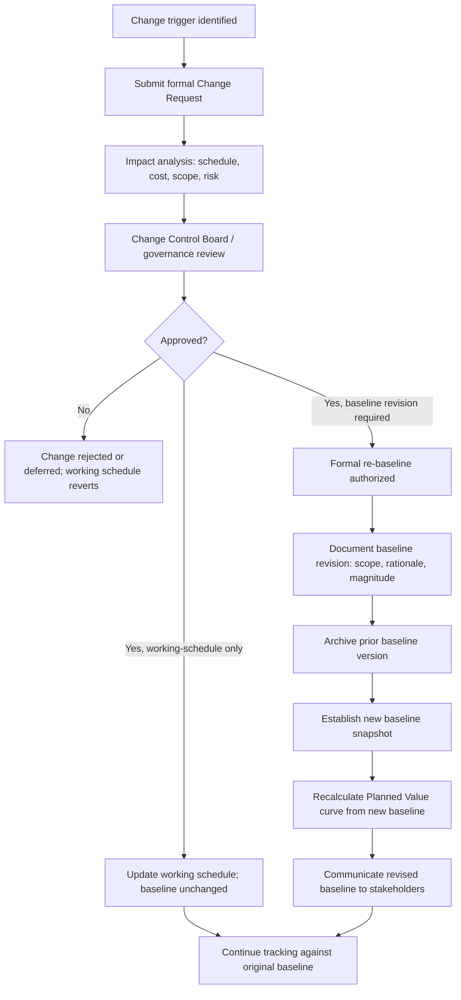

## Baseline Change Control Processes

### Overview

Baseline change control processes are the formal governance procedures used to evaluate, approve, and implement modifications to an established schedule baseline. Because the baseline is the reference point for all EVM variance calculations, uncontrolled or informal changes to it undermine the integrity of every subsequent performance measurement — change control exists specifically to prevent the baseline from silently drifting to match actual (often underperforming) execution, a failure mode sometimes called "baseline erosion" or "rubber baselining."

**Key Points**

- Change control distinguishes between changes to the *working* schedule (routine, expected during execution) and changes to the *baseline* itself (exceptional, requiring formal approval)
- Not every schedule change requires baseline revision — only changes that affect the approved scope, contractual dates, or fundamental resourcing assumptions typically warrant a formal re-baseline
- A disciplined change control process preserves an auditable history of why and when the baseline changed, which is essential for both internal governance and, in contracted environments, external stakeholder or auditor scrutiny

---

### Why Baseline Change Control Is Necessary

Without formal change control, two failure modes commonly emerge:

**Baseline erosion ("rubber baselining")**: The baseline is repeatedly and informally adjusted to match whatever the project is currently achieving, eliminating the variance signal EVM depends on — SPI approaches 1.0 not because performance improved, but because the baseline was silently redefined to match actual performance.

**Baseline rigidity**: The opposite failure — refusing to ever update a baseline even when scope, external conditions, or approved changes have made the original baseline genuinely obsolete, producing meaningless variance figures that reflect outdated assumptions rather than current project reality.

Formal change control processes exist to strike the correct balance: the baseline should change only when a legitimate, approved reason exists, and every such change should be documented, quantified, and traceable.

---

### The Change Control Process Flow

**Key stages:**

1. **Change trigger identification**: A change originates from an approved scope change, a significant risk event, a resourcing shift, or a recognized estimating error discovered during execution
2. **Change Request submission**: The proposed change is formally documented, typically including the reason, the specific schedule/cost impact, and the requesting party
3. **Impact analysis**: The scheduler or project controls team quantifies the effect on the critical path, milestones, resource loading, and the cost baseline
4. **Governance review**: A Change Control Board (CCB), steering committee, or designated approval authority evaluates the request against the project's change control thresholds
5. **Approval decision**: The request is approved, rejected, or deferred; approval may authorize only a working-schedule update, or may explicitly authorize a full baseline revision
6. **Baseline revision execution**: If approved, the prior baseline is archived (never deleted — preserved for audit and historical comparison), and a new baseline snapshot is established
7. **Communication**: Stakeholders are informed of the revised baseline and its rationale, and EVM reporting transitions to the new Planned Value curve going forward

---

### Distinguishing Working Schedule Updates from Baseline Revisions

| Change Type | Example | Baseline Impact |
| --- | --- | --- |
| Routine progress update | Recording actual start/finish dates, percent complete | Working schedule updated; baseline unchanged |
| Internal re-sequencing within existing scope | Reordering non-critical activities for efficiency, no date/scope impact | Working schedule updated; baseline unchanged |
| Approved scope change | Client-approved addition of new deliverables | Baseline revision typically required (scope baseline changes cascade to schedule baseline) |
| Major risk event realization | A significant unplanned delay event (e.g., regulatory hold, force majeure) | Baseline revision may be authorized depending on organizational policy and contractual terms |
| Resource reallocation affecting the critical path | Reassigning a scarce resource in a way that shifts the completion date | Requires governance review; may or may not trigger full re-baseline depending on materiality |
| Correction of a demonstrated estimating error | Original duration estimates proven systematically wrong post-baseline | Handled cautiously — frequent "error correction" re-baselining risks becoming disguised baseline erosion |

A common governing principle: routine execution variance (activities running ahead or behind due to normal performance variability) should **not** trigger baseline revision — that variance is exactly what SV and SPI are designed to measure and report, not to eliminate by moving the baseline.

---

### Change Control Thresholds

Many organizations define explicit materiality thresholds determining which changes require Change Control Board review versus which can be approved at a lower authority level:

$$\text{Threshold Trigger: } |\Delta \text{Completion Date}| > X \text{ days, OR } |\Delta \text{BAC}| > Y\% \text{ of total budget}$$

**Example threshold structure:**

- Changes affecting the finish date by fewer than 5 days and cost by less than 2% of BAC: approved by the project manager directly
- Changes affecting the finish date by 5-15 days or cost by 2-5% of BAC: reviewed by a project-level Change Control Board
- Changes affecting the finish date by more than 15 days or cost by more than 5% of BAC: escalated to sponsor/steering committee or portfolio governance

Specific threshold values vary widely by organization, industry, and contract type, and should be defined explicitly in the project's change management plan rather than assumed [Unverified — no universal standard threshold values exist; these figures are illustrative rather than prescriptive].

---

### Baseline Version Control and Archival

Disciplined change control requires maintaining a clear historical record of every baseline revision, not merely overwriting the prior baseline:

- **Baseline versioning**: Each approved baseline revision is assigned a version identifier (e.g., "Baseline 1.0," "Baseline 2.0 — Change Request #14 approved"), preserving traceability
- **Variance analysis continuity**: When reporting cumulative EVM performance across a baseline revision, analysts must be careful to distinguish variance that occurred *before* the revision (measured against the old baseline) from variance occurring *after* (measured against the new baseline) — conflating the two produces misleading trend analysis
- **Rationale documentation**: Each baseline version's change record should capture what changed, why, the quantified impact, and who approved it — supporting later audits, lessons-learned reviews, or contractual dispute resolution

---

### Example: A Change Control Sequence

**Example**

A client approves a scope addition (an extra building wing) to a construction project, six months after the original baseline was established and while the project is already 40% complete by earned value. The change is submitted as a formal Change Request, and impact analysis determines it adds 45 days to the critical path and $1.2M to the budget — both figures exceeding the project's Change Control Board escalation threshold. The Board reviews and approves the change, authorizing a formal re-baseline. The original baseline (Baseline 1.0) is archived; a new baseline (Baseline 2.0) incorporating the added scope, revised critical path, and updated cost is established. Going forward, SPI and CPI are calculated against Baseline 2.0; historical SPI/CPI trends from before the change remain valid as measured against Baseline 1.0, and management reporting clearly labels the transition point to avoid misinterpreting the trend as a sudden performance shift.

---

### Common Pitfalls

- Allowing informal "just this once" baseline adjustments to accumulate without formal change control approval, gradually eroding the baseline's meaning as a fixed reference point
- Re-baselining in response to routine unfavorable variance (the project running behind due to normal execution issues) rather than reserving re-baselining for genuine scope, resourcing, or major risk-driven changes — this is the classic rubber-baselining failure mode
- Failing to archive prior baseline versions, losing the ability to analyze historical performance trends or defend past reporting in an audit or dispute
- Setting change control thresholds so low that trivial changes trigger unnecessary governance overhead, or so high that materially significant changes bypass appropriate scrutiny
- Blending pre- and post-revision variance data into a single continuous trend line without clearly marking the baseline transition point, producing misleading performance narratives

---

### Integration with EVM

- Every approved baseline revision requires recalculating the time-phased Planned Value curve from the new baseline forward — continuing to calculate SPI against an outdated baseline after a formally approved revision produces meaningless (or actively misleading) schedule performance data
- The Budget at Completion (BAC) and Performance Measurement Baseline (PMB) must be revised in lockstep with the schedule baseline whenever a change affects both cost and schedule (as most significant scope changes do), since a schedule-only re-baseline without a corresponding cost re-baseline creates an inconsistent PMB
- Mature EVM implementations (particularly those governed by formal standards such as EIA-748 in defense and government contracting contexts) typically mandate a specific, auditable baseline change control process as a compliance requirement, not merely a best practice — organizations operating under such standards should consult the specific governing standard's documented requirements rather than relying on generic change control principles alone [Unverified — specific compliance requirements vary by governing standard and contract; this content describes general EVM change control principles, not a specific standard's mandated procedure]

---

**Related Topics**

- Rubber baselining and baseline erosion detection techniques
- Change Control Board governance structures and authority thresholds
- EIA-748 and formal EVM system compliance requirements for baseline control
- Variance analysis continuity across baseline revisions
- Scope baseline, schedule baseline, and cost baseline integration in the PMB
- Lessons-learned processes tied to historical baseline revision records