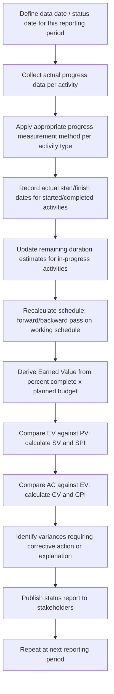

## Progress Measurement and Status Updates

### Overview

Progress measurement and status updates are the recurring operational processes of capturing actual schedule performance during execution — recording actual start and finish dates, percent complete, and remaining duration — and feeding that data into the working schedule and EVM calculations. The quality and consistency of progress measurement directly determines the reliability of every downstream schedule and cost variance metric; inconsistent or subjective progress reporting is one of the most common sources of unreliable EVM data in practice.

**Key Points**

- Progress measurement methods vary in objectivity — some (units completed, milestone weighting) are largely objective, while others (subjective percent complete estimates) are prone to bias and inconsistency
- Status updates feed two parallel outputs: the updated working schedule (revised forecast dates) and updated Earned Value (EV) for EVM reporting — both depend on the same underlying progress data but serve different analytical purposes
- Data date (also called status date or "as-of" date) discipline — ensuring every activity's status reflects the same consistent point in time — is essential for internally consistent schedule updates

---

### Progress Measurement Methods

Different activity types warrant different progress measurement approaches, since a single universal method (e.g., naive percent complete) does not accurately reflect true progress for all work types.

| Method | Description | Best Suited For | Objectivity |
| --- | --- | --- | --- |
| Units Complete | Percent complete = actual units produced / total planned units | Repetitive, quantifiable work (e.g., linear feet of pipe installed, cubic yards poured) | High |
| Milestone Weighting (0/50/100 or 0/100) | Activity credited 0% until started, a fixed interim percentage (e.g., 50%) once started, 100% only at verified completion | Activities where interim measurement is difficult or unreliable | High |
| Weighted Milestones | Activity decomposed into sub-milestones, each with a pre-assigned percentage weight, credited as each sub-milestone is achieved | Longer activities with identifiable interim deliverables | Moderate-High |
| Percent Complete Estimate (Supervisor/Performer Judgment) | The responsible resource or supervisor estimates percent complete subjectively | Work lacking clear quantifiable units or milestones | Low — prone to optimism bias and inconsistency |
| Level of Effort (LOE) | Progress credited proportionally to elapsed time, regardless of actual output | Support activities without a discrete deliverable (e.g., project management overhead) | N/A — by design, always matches planned schedule |
| Apportioned Effort | Progress credited as a fixed ratio to a related, directly-measured base activity | Activities inherently tied to another measured activity (e.g., quality inspection tied to production rate) | Depends on the base activity's own measurement quality |

**0/50/100 Rule Illustration**: An activity not yet started is credited 0%; once work begins, it is immediately credited 50% regardless of actual progress within the activity; only upon verified completion is it credited 100%. This method sacrifices interim precision for objectivity and simplicity, avoiding the subjective judgment calls inherent in continuous percent-complete estimation.

---

### The Status Update Cycle

**Critical procedural discipline**: every activity's status must be reported as of the *same* data date within a given reporting cycle. Mixing progress data collected at different points in time within a single status update (e.g., one activity's status reflects last Tuesday, another reflects yesterday) produces an internally inconsistent schedule state and unreliable variance calculations.

---

### Remaining Duration vs. Percent Complete

A common progress-measurement pitfall is relying solely on percent complete to forecast remaining work, when percent complete and remaining duration are not always proportionally related.

$$\text{Naive Assumption: } \text{Remaining Duration} = \text{Original Duration} \times (1 - \%\text{Complete})$$

This assumption holds only if work proceeds at a constant, predictable rate — which is frequently untrue. Best practice separates the two into independent judgments:

- **Percent complete**: How much of the defined scope of this activity has been accomplished
- **Estimate to Complete (duration)**: An independent forecast of how much additional time is genuinely needed, informed by current productivity rates, known remaining obstacles, and resource availability — not mechanically derived from percent complete alone

**Example**: An activity is 80% complete by units installed, but the remaining 20% involves the most technically difficult portion of the work (e.g., final complex connections after simpler runs are finished). A naive proportional calculation would suggest 20% of the original duration remains; an independent remaining-duration estimate informed by the performer's assessment might reasonably indicate 35% of the original duration is still needed, reflecting the disproportionate difficulty of the remaining scope.

---

### Deriving Earned Value from Progress Measurement

Earned Value (EV) is calculated by applying the measured percent complete to the activity's planned budget (its share of BAC):

$$EV_i = \%\text{Complete}_i \times BAC_i$$

$$EV_{\text{total}} = \sum_i EV_i$$

The choice of progress measurement method directly affects EV accuracy — an activity measured via subjective percent-complete judgment introduces the same subjectivity and potential optimism bias directly into the EVM cost and schedule performance indices, since EV is the numerator in both SPI and CPI.

$$SPI = \frac{EV}{PV} \qquad CPI = \frac{EV}{AC}$$

Inflated or inconsistent percent-complete reporting therefore does not merely misrepresent physical progress — it directly distorts the two primary EVM health indicators used for forecasting and corrective action decisions.

---

### Status Update Data Quality Controls

**Independent verification**: Where feasible, progress claims (particularly subjective percent-complete estimates) should be periodically verified by someone other than the person directly responsible for the work, reducing self-reporting optimism bias.

**Consistency checks across reporting periods**: A sudden jump in percent complete (e.g., an activity reported at 30% one period and 95% the next, with no corresponding surge in resource application) warrants investigation — it may indicate prior under-reporting, current over-reporting, or a genuine but unusual acceleration.

**Reconciliation with actual cost data**: Comparing earned value progress against actual cost incurred (yielding CPI) can reveal reporting inconsistencies — an activity reporting high percent complete alongside unexpectedly low actual cost consumption may indicate progress overstatement, since real work typically consumes resources (and therefore cost) in some traceable relationship to the work performed.

**Milestone completion criteria clarity**: For milestone-weighted methods, ambiguous completion criteria ("what does 50% actually require to have been done?") should be defined explicitly in advance, not interpreted ad hoc at status-update time.

---

### Impact of Measurement Method Choice

<svg xmlns="http://www.w3.org/2000/svg" viewBox="0 0 560 340" font-family="sans-serif">
<text x="280" y="24" font-size="16" font-weight="bold" text-anchor="middle" fill="#1a1a1a">Progress Measurement Method Comparison (svg_diagram)</text>

<line x1="60" y1="290" x2="520" y2="290" stroke="#333" stroke-width="2" />
<line x1="60" y1="290" x2="60" y2="50" stroke="#333" stroke-width="2" />
<text x="290" y="315" font-size="12" text-anchor="middle">Elapsed Time</text>
<text x="25" y="170" font-size="12" text-anchor="middle" fill="#333" transform="rotate(-90 25 170)">% Complete Reported</text>

<path d="M 60 290 Q 200 260 290 170 Q 380 90 520 60" fill="none" stroke="#2c3e50" stroke-width="2.5" />
<text x="420" y="75" font-size="10" fill="#2c3e50" font-weight="bold">True physical progress</text>

<path d="M 60 290 L 60 290 L 150 290 L 150 170 L 480 170 L 480 60 L 520 60" fill="none" stroke="#e67e22" stroke-width="2" stroke-dasharray="6,3" />
<text x="160" y="185" font-size="10" fill="#e67e22" font-weight="bold">0/50/100 method (step)</text>

<path d="M 60 290 Q 150 220 250 130 Q 320 90 400 75" fill="none" stroke="#c0392b" stroke-width="2" stroke-dasharray="3,2" />
<text x="270" y="115" font-size="10" fill="#c0392b" font-weight="bold">Optimistic subjective estimate</text>
</svg>

The chart illustrates why measurement method choice matters: the 0/50/100 method under-reports early and over-reports late relative to true progress but never fabricates unearned credit, while subjective estimation can systematically run ahead of true physical progress if not independently checked — directly inflating EV and masking emerging schedule or cost problems until later in the project.

---

### Common Pitfalls

- Using different data dates for different activities within the same status update cycle, producing an internally inconsistent schedule snapshot
- Relying on naive proportional remaining-duration calculations (original duration × (1 − percent complete)) for activities whose remaining work does not proceed at a constant rate
- Allowing self-reported subjective percent complete to go unverified, especially for activities with significant cost or schedule weight, introducing avoidable bias directly into EV and the resulting SPI/CPI
- Applying a single progress measurement method uniformly across all activity types rather than matching the method to the nature of the specific work (units-based, milestone-based, LOE, etc.)
- Failing to reconcile earned value progress against actual cost data, missing an available cross-check that could reveal progress-reporting inconsistencies before they compound over multiple reporting periods

---

### Integration with EVM

- Progress measurement is the direct operational input that produces Earned Value — every EVM metric (SV, SPI, CV, CPI, EAC, VAC) is only as reliable as the percent-complete data feeding into the $EV = \%\text{Complete} \times BAC$ calculation
- Consistent data-date discipline across activities is a prerequisite for valid cumulative EVM reporting; inconsistent status dates within a reporting period can produce PV, EV, and AC figures that do not actually correspond to the same point in project time, undermining the validity of any variance calculated from them
- Organizations with mature EVM systems typically formalize progress measurement method selection (units complete, milestone weighting, LOE, etc.) at the WBS/control-account level during planning, as part of the same governance process that establishes the schedule and cost baseline, rather than leaving measurement method choice to ad hoc decision during execution reporting

---

**Related Topics**

- Earned value techniques and control account planning (0/100, 50/50, weighted milestones in depth)
- Data date discipline and schedule update cycle governance
- Independent verification and audit practices for progress reporting
- Estimate to Complete (ETC) forecasting methods distinct from percent-complete extrapolation
- Reconciling actual cost data with earned value for progress-reporting quality assurance
- Schedule and cost variance analysis following a status update cycle