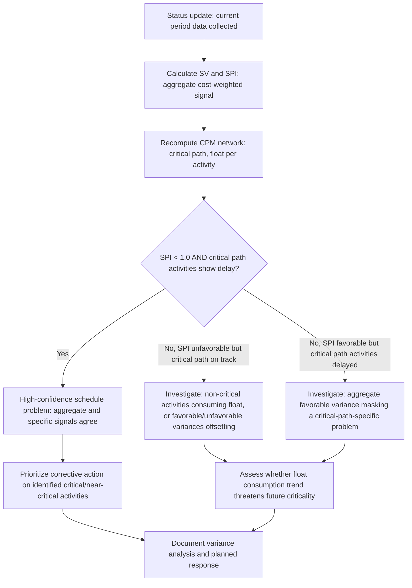

## Schedule Variance Identification

### Overview

Schedule variance identification is the process of detecting, quantifying, and diagnosing the difference between planned and actual schedule performance during project execution. It draws on both classical CPM float analysis and EVM's quantitative Schedule Variance (SV) and Schedule Performance Index (SPI) metrics, since the two approaches surface different but complementary dimensions of schedule health — EVM metrics indicate aggregate cost-weighted schedule health, while CPM float and critical path analysis reveal exactly where the network is at risk.

**Key Points**

- EVM's SV and SPI are cost-weighted, aggregate measures — they can mask activity-specific problems if favorable and unfavorable variances offset within the calculation
- CPM float and critical path analysis identify *where* in the network delay is occurring and whether it threatens the completion date, complementing EVM's aggregate signal
- Variance identification is diagnostic, not corrective — it answers "is there a problem and where," which precedes (and informs) any subsequent corrective action decision

---

### EVM-Based Schedule Variance Metrics

**Schedule Variance (SV)**

$$SV = EV - PV$$

A negative SV indicates the project has earned less value than planned by this point (behind schedule in cost-weighted terms); a positive SV indicates ahead of schedule.

**Schedule Performance Index (SPI)**

$$SPI = \frac{EV}{PV}$$

$SPI < 1.0$ indicates unfavorable schedule performance (earning value slower than planned); $SPI > 1.0$ indicates favorable performance; $SPI = 1.0$ indicates performance exactly on plan.

**Important limitation**: Both SV and SPI are denominated in cost/budget units, not time units — they measure how much *planned budget's worth of work* has been accomplished relative to how much was scheduled, not literal days or weeks of schedule slippage. A project can show $SPI = 0.85$ without this translating directly into "the project is 15% of its duration behind," since the relationship between cost-weighted progress and calendar time depends on the shape of the Planned Value curve and which specific activities are driving the variance.

---

### CPM-Based Schedule Variance Analysis

Because SV and SPI are aggregate metrics, they can fail to reveal whether the *specific* activities driving the variance are on the critical path (threatening the completion date) or on non-critical paths (consuming float without threatening the date).

**Float consumption tracking**: Comparing an activity's current total float against its float at baseline reveals whether float is being consumed over time, which is an earlier and more specific warning signal than waiting for SPI to register aggregate impact.

$$\text{Float Consumption} = TF_{\text{baseline}} - TF_{\text{current}}$$

**Critical path drift analysis**: Tracking whether the critical path itself has changed from one reporting period to the next — a shifting critical path often indicates that different activities are now driving completion risk than originally anticipated, requiring management attention to reallocate accordingly.

**Near-critical path monitoring**: Activities with low (but nonzero) float deserve explicit monitoring, since routine variance can convert them into critical activities before the next reporting cycle, especially in schedules with several paths of similar length.

---

### Combining EVM and CPM Signals

The most informative variance identification combines both lenses: SPI/SV establish whether an aggregate problem exists, while critical path and float analysis pinpoint whether that problem threatens the completion date or is contained within available schedule flexibility.

---

### Why Aggregate EVM Metrics Can Mask Critical-Path Problems

**Example**

A project's overall SPI reads 1.02 (apparently favorable), driven by several early-finishing, high-budget-weight, non-critical activities. Simultaneously, a lower-budget-weight critical path activity is running 8 days behind, consuming all its float and threatening the project completion date. The aggregate SPI, dominated by the favorable non-critical variance, does not flag this critical-path risk — only a parallel float consumption and critical path review reveals it. This scenario illustrates why relying on SPI alone, without complementary CPM-based float and critical path monitoring, can leave a genuine completion-date threat undetected until much later.

---

### Diagnostic Categories of Schedule Variance

| Variance Pattern | Likely Cause | Recommended Investigation |
| --- | --- | --- |
| Unfavorable SV/SPI, critical path activities delayed | Genuine schedule risk to completion date | Root cause analysis on delayed critical activities; consider compression techniques |
| Unfavorable SV/SPI, critical path on track | Delay concentrated in non-critical (float-consuming) activities | Monitor float consumption trend; assess whether float will be exhausted before those activities' merge points |
| Favorable SV/SPI, critical path activities delayed | Aggregate favorable variance masking a specific critical-path problem | Do not rely on aggregate SPI alone; verify critical path status explicitly every reporting period |
| Favorable SV/SPI, critical path ahead of schedule | Genuine overall favorable performance | Verify sustainability — early favorable variance sometimes reflects front-loaded easy work rather than a durable trend |
| SPI near 1.0 but individual activity variances are large and offsetting | Netting effect concealing volatility | Review activity-level variance distribution, not just the aggregate index |

---

### Time-Based Schedule Variance Alternatives

Because SV and SPI are cost-denominated and can be difficult to interpret in calendar terms, several alternative or supplementary metrics have been proposed to express schedule variance more directly in time units:

**Earned Schedule (ES)**: Determines the point in time at which the current Earned Value would have been planned to occur on the original PV curve, then compares that to the actual current time — yielding variance and performance metrics denominated in time rather than cost.

$$ES = t \text{ such that } PV(t) = EV_{\text{current}}$$

$$SV(t) = ES - AT \qquad SPI(t) = \frac{ES}{AT}$$

Where $AT$ is the actual elapsed time to the current status date. Earned Schedule metrics are particularly useful near project completion, where classical SV and SPI converge toward misleadingly favorable values (since $PV$ approaches $BAC$ regardless of actual date performance) — a limitation that time-denominated Earned Schedule analysis avoids [Inference — this near-completion convergence behavior of classical SV/SPI is a well-documented limitation in EVM literature, and Earned Schedule was specifically developed to address it].

---

### Root Cause Categories for Identified Variance

Once variance is identified and localized (via SPI, SV, float consumption, or Earned Schedule), diagnosing the underlying cause typically falls into a few recurring categories:

- **Estimating error**: Original duration or productivity estimates were inaccurate
- **Resource unavailability**: Planned resources were not available as scheduled (see resource loading and allocation, multi-project resource contention)
- **External dependency delay**: A predecessor outside direct project control (supplier, regulatory approval, client decision) was delayed
- **Scope change not yet reflected in baseline**: Work is being performed against evolving requirements not yet captured in a formal baseline revision
- **Quality/rework issues**: Work had to be redone, consuming schedule without net progress
- **Logic or sequencing errors in the original schedule**: The baseline itself contained flawed assumptions about dependencies now being revealed during execution

Correctly categorizing the root cause determines whether the appropriate response is a corrective action within the existing baseline, a formal change request (if scope-driven), or a lessons-learned item for future estimating improvement.

---

### Common Pitfalls

- Relying exclusively on SPI/SV without parallel critical path and float analysis, missing critical-path-specific problems masked by aggregate favorable variance elsewhere in the network
- Misinterpreting SV/SPI as literal time units (e.g., treating $SPI = 0.9$ as "10% of the schedule duration behind"), when these are cost-weighted indices, not direct calendar-time measures
- Failing to distinguish near-completion SPI/SV convergence toward favorable values from genuine performance improvement — a known limitation of classical EVM schedule metrics near project end
- Investigating variance only when SPI crosses an alarming threshold, rather than continuously tracking float consumption trends that provide earlier warning
- Treating every identified variance as requiring the same response, rather than first categorizing root cause (estimating error, resource issue, external dependency, scope change, rework) to determine an appropriate and proportionate response

---

### Integration with EVM

- Schedule variance identification is itself a core EVM analytical process — SV, SPI, and (where adopted) Earned Schedule metrics are calculated directly from the EV, PV, and AT data produced by the progress measurement and status update cycle
- Effective variance identification requires integrating classical CPM schedule network analysis (critical path, float) alongside standalone EVM index calculation, since neither lens alone provides a complete picture of schedule health — this integration is a recurring theme distinguishing mature EVM/schedule integration practice from EVM implementations that track cost and schedule indices without corresponding network-level analysis
- Identified variances, once root-cause categorized, feed directly into the change control process (when scope or baseline-affecting) or into corrective action planning (when addressable within the existing baseline), closing the loop between measurement and management response

---

**Related Topics**

- Earned Schedule methodology and its advantages near project completion
- Root cause analysis techniques for schedule variance
- Corrective action planning following variance identification
- Estimate at Completion (EAC) and Estimate to Complete (ETC) forecasting from identified variance trends
- Critical path drift analysis across successive reporting periods
- Integrating CPM network analysis with EVM index reporting in status reviews