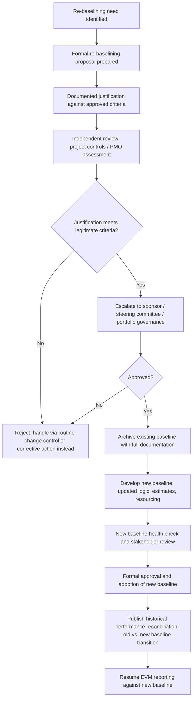

## Re-Baselining Criteria and Governance

### Overview

Re-baselining criteria and governance define the specific conditions under which a project is permitted to formally replace its existing schedule baseline with a new one, and the approval structure that authorizes and controls this action. Re-baselining is the most consequential form of baseline change control — it does not merely modify an activity or two but resets the entire reference framework against which future performance is measured, making disciplined criteria and governance essential to prevent the practice from being used to disguise poor performance.

**Key Points**

- Re-baselining should be reserved for situations where the existing baseline has become genuinely invalid as a performance reference, not used as a routine response to unfavorable variance
- Distinct governance is typically required for re-baselining compared to ordinary baseline change control, given the scale of impact on historical performance comparability
- A well-governed re-baselining process preserves the prior baseline for historical analysis rather than discarding it, maintaining an auditable record of why and when the reset occurred

---

### Distinguishing Re-Baselining from Routine Baseline Change Control

While baseline change control processes (covered separately) handle discrete changes to specific activities or scope elements, **re-baselining** refers to a comprehensive reset of the schedule (and typically cost) baseline in its entirety, usually undertaken when the existing baseline has diverged so substantially from current reality that incremental changes no longer suffice.

| Dimension | Routine Baseline Change | Full Re-Baselining |
| --- | --- | --- |
| Scope of change | Specific activities, a scope addition, a discrete risk event | The entire schedule and cost baseline, comprehensively reset |
| Frequency | As individual changes arise, potentially frequent | Rare — reserved for exceptional circumstances |
| Governance level | Change Control Board or project-level approval, per threshold | Typically requires sponsor, steering committee, or portfolio-level approval |
| Historical continuity | Prior baseline largely remains valid; change is incremental | Prior baseline is superseded entirely; historical EVM trend analysis must account for the discontinuity |
| Common trigger | Approved scope change, resourcing shift, risk event | Fundamental schedule invalidity: major scope overhaul, extended suspension, catastrophic estimating failure |

---

### Legitimate Criteria for Re-Baselining

Re-baselining governance frameworks typically specify explicit, restrictive criteria — the intent is to make re-baselining the exception, not a routine escape valve for unfavorable performance.

**Commonly accepted legitimate triggers:**

- **Major, approved scope change**: A scope revision so extensive that incremental change control against the existing WBS and network structure is impractical (e.g., a substantial redesign, an added project phase)
- **Extended project suspension or hold**: A significant pause (regulatory hold, funding gap, force majeure event) during which the original schedule assumptions (resource availability, market conditions, sequencing logic) are no longer valid upon resumption
- **Contractual restructuring**: A formal contract modification altering fundamental scope, deliverables, or milestone structure
- **Catastrophic original estimating failure**: Documented evidence that the original baseline was built on fundamentally flawed assumptions (rather than normal execution variance), such that continuing to measure against it provides no meaningful management information
- **Merger of previously separate schedules**: Integration of a previously standalone project into a larger program structure, requiring baseline harmonization

**Criteria that typically should NOT justify re-baselining:**

- Consistently unfavorable SPI/CPI trends attributable to normal execution performance variability
- A desire to "reset" unfavorable variance to improve the appearance of ongoing performance reports
- Minor scope adjustments that could be handled through routine baseline change control instead
- Resource or productivity issues that, while significant, do not invalidate the fundamental logic and assumptions of the existing baseline

---

### Governance Structure for Re-Baselining Decisions

**Key governance elements:**

- **Independent review before escalation**: A project controls function or PMO, ideally independent of the project team requesting the re-baseline, should assess whether the proposal meets legitimate criteria before it proceeds to senior governance — this independence check helps prevent self-interested re-baselining requests from advancing unchallenged
- **Senior-level approval authority**: Given the scale of impact, re-baselining approval typically sits above the level required for routine baseline changes — sponsor, steering committee, or portfolio governance board, depending on organizational structure
- **Mandatory documentation**: The justification, quantified impact, and approval record for a re-baseline should be comprehensively documented, supporting later audit and lessons-learned review

---

### Preserving Historical Performance Continuity

A critical governance requirement is ensuring that re-baselining does not erase or obscure historical performance data — the organization needs to retain the ability to analyze what happened under the original baseline, even after adopting a new one.

**Practices supporting continuity:**

- **Baseline archival**: The superseded baseline (dates, logic, resource assignments, time-phased budget) is preserved in full, not deleted, typically as a distinctly versioned historical record
- **Transition-point labeling**: EVM trend reports spanning the re-baselining event should clearly mark the transition point, so that a reader does not misinterpret a sudden shift in SPI/CPI trend as a genuine performance change rather than a baseline reset artifact
- **Dual reporting during transition**: Some organizations report performance against both the old and new baseline for a defined transition period, providing stakeholders a bridge between the two reference frames before fully retiring the old baseline from active reporting
- **Cumulative-to-date reconciliation**: Where cumulative EVM metrics (e.g., cumulative EAC) are reported, the calculation methodology after re-baselining should be explicit about whether it incorporates pre-re-baseline actuals or restarts measurement from the re-baseline point, since both approaches are used in practice and produce different figures [Unverified — organizational and contractual conventions vary on this point, and the correct approach depends on the specific EVM governance framework in force].

---

### Example: A Legitimate Re-Baselining Case

**Example**

A regulatory agency issues a 9-month construction hold on an infrastructure project after 30% completion, pending an environmental review unrelated to project performance. Upon resumption, the original schedule's resource availability assumptions, seasonal work-window assumptions, and several supplier lead times are no longer valid. The project team documents this as a re-baselining justification under the "extended suspension" criterion, and an independent PMO review confirms the disruption is genuinely external and not a disguised performance issue. The steering committee approves a full re-baseline; the original baseline is archived with full documentation of the hold's impact, and a new baseline reflecting post-resumption realities is developed, health-checked, and approved. Historical SPI/CPI trends from before the hold remain available for reference, clearly separated from the new baseline's forward-looking trend line.

---

### Example: An Illegitimate Re-Baselining Request (Contrast Case)

**Example**

A project consistently shows SPI around 0.82 for several consecutive reporting periods due to underperforming subcontractor productivity — a normal (if unfavorable) execution variance, not evidence of a flawed original baseline. The project team requests re-baselining to "reflect current reality." An independent PMO review determines this does not meet legitimate re-baselining criteria — the original baseline logic and assumptions remain valid; the issue is a performance problem requiring corrective action (subcontractor management, resource reallocation), not a baseline reset. The request is declined, and the team is directed toward corrective action planning within the existing baseline instead.

---

### Common Pitfalls

- Approving re-baselining requests that are, in substance, an attempt to disguise unfavorable performance as an artifact of an "outdated" baseline, without independent scrutiny of whether the underlying criteria are genuinely met
- Failing to archive the superseded baseline in sufficient detail, losing the ability to conduct meaningful historical performance analysis or defend past reporting in an audit
- Not clearly marking the transition point in trend reports, allowing stakeholders to misread a re-baselining artifact as a genuine performance improvement or decline
- Applying inconsistent re-baselining criteria across different projects within the same organization or portfolio, undermining confidence in the fairness and rigor of governance decisions
- Delegating re-baselining approval authority to the same level responsible for routine baseline changes, understating the governance weight this exceptional action warrants

---

### Integration with EVM

- Re-baselining fundamentally resets the Performance Measurement Baseline (PMB), requiring the Planned Value curve, Budget at Completion, and all forward EVM calculations to be rebuilt from the new baseline — this is the most consequential of all baseline actions from an EVM continuity perspective
- Organizations governed by formal EVM standards (such as EIA-748 in defense and government contracting) typically impose stringent, auditable requirements specifically around re-baselining, given its potential to obscure genuine cost and schedule performance history if used inappropriately — the specific documentation and approval requirements under such standards should be consulted directly rather than assumed from general principles [Unverified — this content describes general EVM governance principles for re-baselining, not the specific requirements of any single named compliance standard]
- Post-re-baselining EAC (Estimate at Completion) forecasting should explicitly account for the discontinuity, ensuring that historical CPI/SPI trends from before the re-baseline are not naively blended with post-re-baseline performance in a way that produces a misleading composite forecast

---

**Related Topics**

- Baseline change control processes for routine (non-comprehensive) changes
- EIA-748 and formal EVM system governance requirements around baseline integrity
- Historical performance trend reconciliation across baseline discontinuities
- Independent PMO review functions and their role in governance objectivity
- Estimate at Completion (EAC) forecasting methodologies following a re-baseline
- Lessons-learned processes tied to root causes that necessitated re-baselining