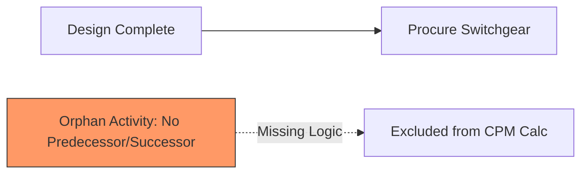
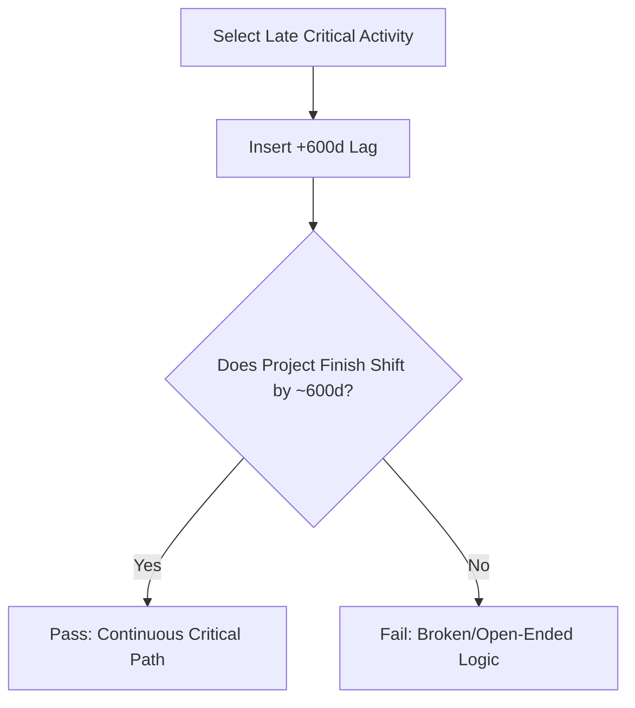

## DCMA 14-Point Schedule Assessment

### Overview

The DCMA 14-Point Assessment is a schedule quality diagnostic developed by the U.S. Defense Contract Management Agency to evaluate the structural integrity, logic soundness, and realism of a Critical Path Method (CPM) schedule, typically built in Primavera P6 or Microsoft Project. It does not measure whether a project is on time or behind — it measures whether the schedule itself is trustworthy enough to make that determination. A schedule that fails these checks produces unreliable float values, an unstable critical path, and misleading forecasts, regardless of how much effort went into building it.

The assessment emerged from DCMA's oversight of major defense contracts, where schedule integrity directly affects contract performance evaluation (e.g., Integrated Baseline Reviews). It has since become a de facto industry standard applied to commercial construction, EPC (Engineering, Procurement, Construction), IT, and aerospace programs, even outside government contracting.

### Purpose and Context

**Key Points**

- The 14-point check is a *diagnostic*, not a *corrective* tool — it flags symptoms of poor schedule construction, not root causes.
- It is typically run monthly or at each schedule baseline/update using automated tools (P6's built-in metrics, Deltek Acumen Fuse, Schedule Analyzer, or custom scripts against the XER/XML export).
- Passing all 14 metrics does not guarantee a *good* schedule — it guarantees a *structurally sound* one. Logic can be technically valid yet strategically wrong (e.g., artificially sequencing parallel work).
- It is most powerful used longitudinally: tracking metric trends update-to-update reveals degradation (e.g., rising negative float, growing high-duration task count) before it becomes a crisis.

### The 14 Metrics

#### 1. Logic

**Key Points**

- Measures the percentage of activities missing a predecessor, successor, or both (excluding project start/finish milestones).
- DCMA threshold: no more than **5%** of activities may be missing logic.
- Missing logic means the activity floats freely or is anchored only by a constraint, meaning it cannot properly drive or be driven by the network — it becomes invisible to critical path calculations.

**Example**

An activity "Procure Switchgear" with no predecessor will simply appear on its data date with zero actual duration driving it. If 30 of 500 activities (6%) lack logic ties, the schedule fails this check.

#### 2. Leads (Negative Lag)

**Key Points**

- A "lead" (negative lag) allows a successor to start before its predecessor logically finishes (e.g., FS -5d).
- DCMA threshold: **zero tolerance** — 0% of relationships should use negative lag.
- Leads are prohibited because they distort float calculations and are often used to artificially compress a schedule without genuine logic changes, masking real slippage.
- The recommended correction is to break the predecessor into smaller, discrete activities and use standard Finish-to-Start (FS) logic instead.

#### 3. Lags (Positive Lag)

**Key Points**

- Positive lag (e.g., FS+10d, representing concrete cure time) is not inherently wrong, but excessive use disguises missing work scope as a mere waiting period.
- DCMA threshold: no more than **5%** of relationships should carry positive lag.
- Best practice: lag should only represent genuine passive waiting time (curing, drying, approval processing) — never "buffer" for uncertain durations, which belongs in contingency/float, not lag.

#### 4. Relationship Types (FS Logic)

**Key Points**

- Measures the percentage of relationships that are Finish-to-Start (FS), as opposed to Start-to-Start (SS), Finish-to-Finish (FF), or Start-to-Finish (SF).
- DCMA threshold: at least **90%** of relationships should be FS.
- FS relationships produce the most predictable, auditable logic chains. SS/FF pairs are permitted for legitimately overlapping work (e.g., "Install Rebar" SS "Pour Concrete" +2d) but overuse of SF logic in particular is a red flag, as it is rarely a valid real-world constraint and is often a modeling error.

#### 5. Hard Constraints

**Key Points**

- Constraints like "Must Start On," "Must Finish On," "Start No Later Than," or "Finish No Later Than" override network logic and can suppress true float or force artificial dates.
- DCMA threshold: no more than **5%** of activities should carry hard constraints.
- "Soft" constraints (e.g., "As Late As Possible," "Start No Earlier Than") are generally acceptable since they do not override logic-driven dates; hard constraints should be reserved for genuinely contractual or regulatory dates (e.g., a permit issuance date fixed by a government agency).

#### 6. High Float

**Key Points**

- Flags activities with total float exceeding a threshold, commonly **44 working days** (equivalent to roughly one calendar quarter), though this is configurable per DCMA guidance.
- DCMA threshold: no more than **5%** of incomplete activities should exceed the high-float threshold.
- Excessive float usually indicates missing logic ties (the activity isn't connected to enough of the network to constrain it) rather than genuine schedule slack.

#### 7. Negative Float

**Key Points**

- Negative float occurs when an activity's calculated finish date exceeds a constraint or the project finish date — indicating the current plan cannot meet a required date given existing logic and durations.
- DCMA threshold: **zero** activities with negative float at baseline.
- Negative float found in an *update* (not baseline) is expected to be investigated and resolved through a recovery plan, resequencing, resourcing, or a formal change to the target date.

$$TF = LS - ES = LF - EF$$

Where negative $TF$ (Total Float) indicates the activity's late dates precede its early dates — a logical impossibility under normal float mechanics, driven by a constraint.

#### 8. High Duration

**Key Points**

- Flags activities with original duration exceeding a threshold, typically **44 working days**.
- DCMA threshold: no more than **5%** of incomplete activities should exceed this.
- Long-duration activities are difficult to status objectively (percent-complete becomes subjective) and obscure the true critical path since sub-components with different risk profiles are bundled together. Best practice is decomposing them into discrete, measurable work packages ideally no longer than one reporting period.

#### 9. Invalid Dates

**Key Points**

- Flags actual start/finish dates that fall after the schedule's data date, or forecast dates that fall before it — a logical impossibility (you cannot have completed work in the future, or plan to start work in the past).
- DCMA threshold: **zero** invalid dates.
- These typically arise from status entry errors or from a scheduler failing to reset actual dates after a rebaseline.

#### 10. Resources

**Key Points**

- Measures the percentage of activities with resources or costs assigned.
- DCMA threshold: **100%** of activities should carry resource/cost loading (some practitioners apply this as a target for detail activities, excluding summary/milestone rows).
- Without resource loading, the schedule cannot support Earned Value Management (EVM), since EV requires a budgeted cost (BCWS) tied to each work package to calculate performance.

#### 11. Missed Tasks (Hit Task %)

**Key Points**

- Measures the percentage of *completed* activities that finished on or before their baseline finish date.
- DCMA threshold: at least **95%** hit rate (i.e., no more than 5% of completed tasks missed their baseline date).
- This is a retrospective health check — a low hit rate signals either overly optimistic original durations/logic, or genuine execution problems, and should be cross-referenced with schedule performance index (SPI) trends.

#### 12. Critical Path Test

**Key Points**

- Not a numeric threshold but a structural test: DCMA verifies the critical path is logically continuous and reactive. This is typically done by adding a large lag (e.g., 600 days) to a critical activity near the end of the schedule and confirming the project finish date shifts by a corresponding amount.
- If the finish date does *not* shift, the schedule contains broken or open-ended logic — the "critical path" reported by the software is not actually driving project completion.

#### 13. Critical Path Length Index (CPLI)

**Key Points**

- CPLI compares the length of the critical path to the total project float, indicating how efficiently the project's schedule reserve is being used relative to remaining duration.
- DCMA threshold: CPLI should be close to **1.0** (typically between 0.95 and 1.00 is considered healthy).
- $$CPLI = \frac{CriticalPathLength + TotalFloat}{CriticalPathLength}$$
- A CPLI significantly above 1.0 suggests the schedule carries excess float relative to the critical path length (potentially masking risk or indicating an overly generous baseline); below 1.0 indicates a compressed or already-slipping critical path.

#### 14. Baseline Execution Index (BEI)

**Key Points**

- BEI measures overall schedule execution efficiency by comparing the count of activities actually completed to the count that *should* have been completed by the data date, per baseline.
- DCMA threshold: BEI should be **≥ 0.95**, though some references treat 1.0 as the ideal target.
- $$BEI = \frac{ActivitiesCompleted}{ActivitiesScheduledForCompletion(BaselineToDate)}$$
- A BEI below 1.0 indicates the project is completing fewer activities than planned by this point — an early warning distinct from cost/schedule variance, since it's count-based rather than dollar- or duration-based.

### Summary Table

| # | Metric | DCMA Threshold |
| --- | --- | --- |
| 1 | Logic | ≤ 5% missing logic |
| 2 | Leads | 0% negative lag |
| 3 | Lags | ≤ 5% with positive lag |
| 4 | Relationship Types | ≥ 90% FS |
| 5 | Hard Constraints | ≤ 5% |
| 6 | High Float | ≤ 5% (>44 days) |
| 7 | Negative Float | 0 activities |
| 8 | High Duration | ≤ 5% (>44 days) |
| 9 | Invalid Dates | 0 activities |
| 10 | Resources | 100% loaded |
| 11 | Missed Tasks | ≥ 95% hit rate |
| 12 | Critical Path Test | Pass/Fail (structural) |
| 13 | CPLI | ~1.0 (0.95–1.00) |
| 14 | BEI | ≥ 0.95 |

### Integration with EVM

**Key Points**

- Metrics 10 (Resources), 11 (Missed Tasks), and 14 (BEI) are the direct bridges between CPM schedule quality and EVM reliability.
- Without resource/cost loading (metric 10), there is no BCWS (Budgeted Cost of Work Scheduled) curve, making SPI and SV calculations impossible at the activity level.
- A poor Logic score (metric 1) or excessive constraints (metric 5) corrupts the time-phased BCWS distribution itself, since the software cannot correctly calculate *when* budgeted work was planned to occur.
- BEI is often used alongside SPI (Schedule Performance Index, a cost-based EVM metric) as a cross-check: SPI can be distorted by high-value activities finishing early while many low-value activities lag, whereas BEI (a pure count) exposes that discrepancy. [Inference] Practitioners commonly favor using both together rather than relying on either metric in isolation, though the specific reporting cadence varies by organization.

### Limitations

**Key Points**

- The 14-point check is purely structural/statistical — it cannot detect whether logic is *strategically* correct (e.g., unnecessarily serial sequencing that is technically "valid" FS logic but wastes schedule opportunity).
- Thresholds (5%, 44 days, etc.) originated in a DoD/defense-contracting context and are sometimes applied uncritically to industries with different scales and norms; many organizations tailor thresholds to their own historical baselines. [Unverified] The extent to which any given commercial organization formally deviates from the original DCMA thresholds is not standardized and varies by contract and company policy.
- It does not assess resource *leveling* feasibility (whether assigned resources are realistically available), only whether resources are *assigned*.

### DCMA 14-Point Assessment Flow (svg_diagram)

<svg xmlns="http://www.w3.org/2000/svg" viewBox="0 0 900 480">
<text x="450" y="30" font-family="Arial, sans-serif" font-size="18" font-weight="bold" text-anchor="middle" fill="#222">DCMA 14-Point Schedule Assessment Flow (svg_diagram)</text>
<rect x="30" y="60" width="180" height="60" rx="8" fill="#e8f0fe" stroke="#4472c4" stroke-width="1.5" />
<text x="120" y="85" font-family="Arial" font-size="13" text-anchor="middle" fill="#222">Export Schedule</text>
<text x="120" y="103" font-family="Arial" font-size="11" text-anchor="middle" fill="#555">(XER / XML)</text>
<rect x="260" y="60" width="200" height="60" rx="8" fill="#fdf2e3" stroke="#e0964b" stroke-width="1.5" />
<text x="360" y="85" font-family="Arial" font-size="13" text-anchor="middle" fill="#222">Run Structural Checks</text>
<text x="360" y="103" font-family="Arial" font-size="11" text-anchor="middle" fill="#555">Metrics 1–9</text>
<rect x="510" y="60" width="200" height="60" rx="8" fill="#e6f4ea" stroke="#3c9d5b" stroke-width="1.5" />
<text x="610" y="85" font-family="Arial" font-size="13" text-anchor="middle" fill="#222">Run Resource/EVM Checks</text>
<text x="610" y="103" font-family="Arial" font-size="11" text-anchor="middle" fill="#555">Metric 10</text>
<rect x="760" y="60" width="120" height="60" rx="8" fill="#f4e6f7" stroke="#8e4cb0" stroke-width="1.5" />
<text x="820" y="85" font-family="Arial" font-size="13" text-anchor="middle" fill="#222">Performance</text>
<text x="820" y="103" font-family="Arial" font-size="11" text-anchor="middle" fill="#555">Metrics 11, 14</text>
<line x1="210" y1="90" x2="255" y2="90" stroke="#555" stroke-width="1.5" marker-end="url(#arrow)" />
<line x1="460" y1="90" x2="505" y2="90" stroke="#555" stroke-width="1.5" marker-end="url(#arrow)" />
<line x1="710" y1="90" x2="755" y2="90" stroke="#555" stroke-width="1.5" marker-end="url(#arrow)" />
<rect x="260" y="180" width="380" height="70" rx="8" fill="#fff2f2" stroke="#c0392b" stroke-width="1.5" />
<text x="450" y="205" font-family="Arial" font-size="13" text-anchor="middle" fill="#222">Critical Path Continuity Test</text>
<text x="450" y="223" font-family="Arial" font-size="11" text-anchor="middle" fill="#555">(Metric 12: +600d lag injection test)</text>
<text x="450" y="240" font-family="Arial" font-size="11" text-anchor="middle" fill="#555">Confirms finish date reacts correctly</text>
<line x1="360" y1="120" x2="400" y2="175" stroke="#555" stroke-width="1.5" marker-end="url(#arrow)" />
<line x1="610" y1="120" x2="550" y2="175" stroke="#555" stroke-width="1.5" marker-end="url(#arrow)" />
<rect x="180" y="300" width="220" height="60" rx="8" fill="#fdf2e3" stroke="#e0964b" stroke-width="1.5" />
<text x="290" y="325" font-family="Arial" font-size="13" text-anchor="middle" fill="#222">CPLI Calculation</text>
<text x="290" y="343" font-family="Arial" font-size="11" text-anchor="middle" fill="#555">Metric 13</text>
<rect x="500" y="300" width="220" height="60" rx="8" fill="#e6f4ea" stroke="#3c9d5b" stroke-width="1.5" />
<text x="610" y="325" font-family="Arial" font-size="13" text-anchor="middle" fill="#222">BEI Calculation</text>
<text x="610" y="343" font-family="Arial" font-size="11" text-anchor="middle" fill="#555">Metric 14</text>
<line x1="400" y1="250" x2="330" y2="295" stroke="#555" stroke-width="1.5" marker-end="url(#arrow)" />
<line x1="500" y1="250" x2="580" y2="295" stroke="#555" stroke-width="1.5" marker-end="url(#arrow)" />
<rect x="300" y="400" width="300" height="60" rx="8" fill="#e8f0fe" stroke="#4472c4" stroke-width="1.5" />
<text x="450" y="425" font-family="Arial" font-size="13" text-anchor="middle" fill="#222">Schedule Health Report</text>
<text x="450" y="443" font-family="Arial" font-size="11" text-anchor="middle" fill="#555">Pass/Fail per metric + trend analysis</text>
<line x1="290" y1="360" x2="400" y2="395" stroke="#555" stroke-width="1.5" marker-end="url(#arrow)" />
<line x1="610" y1="360" x2="500" y2="395" stroke="#555" stroke-width="1.5" marker-end="url(#arrow)" />
</svg>

### **Related Topics**

- Total Float vs. Free Float calculation methodology
- Schedule risk analysis (Monte Carlo simulation on CPM networks)
- Integrated Baseline Review (IBR) process
- Resource leveling and resource-critical path analysis
- Baseline Execution Index (BEI) vs. Schedule Performance Index (SPI) reconciliation
- Work Breakdown Structure (WBS) decomposition standards for schedule activities
- Schedule Performance Index (SPI) and Cost Performance Index (CPI) in EVM
- Near-critical path identification and float thresholds
- Primavera P6 vs. Microsoft Project schedule metric extraction methods