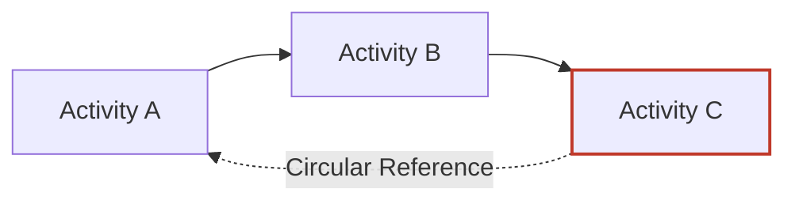
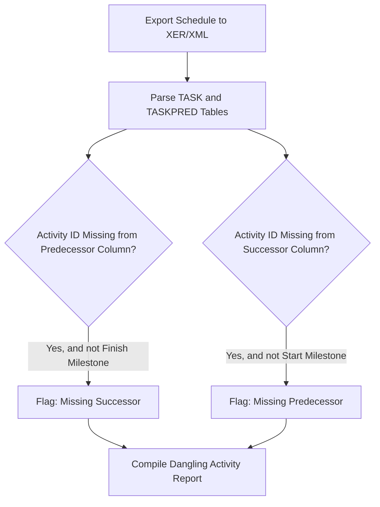

## Logic Checks and Dangling Activity Detection

### Overview

Logic checks are the systematic validation of predecessor/successor relationships within a Critical Path Method (CPM) network to ensure every activity is properly integrated into the schedule's driving path. A "dangling activity" is any task that lacks a predecessor, a successor, or both — meaning it is not logically tethered to the network and therefore cannot be correctly evaluated for early/late dates, total float, or critical path membership. Dangling logic is the single most common structural defect in real-world schedules and the leading cause of unreliable float and false critical paths.

This assessment area is closely tied to DCMA metric 1 (Logic), but extends beyond that single percentage threshold into the diagnostic techniques and remediation patterns used to actually locate and fix the defects.

### Why Logic Integrity Matters

**Key Points**

- The Critical Path Method calculates early/late start and finish dates via a **forward pass** and **backward pass** that propagate strictly through predecessor/successor links.
- An activity with no predecessor is effectively anchored only at the project start (or its constraint), regardless of what work logically precedes it.
- An activity with no successor is effectively anchored only at the project finish (or its constraint) during the backward pass, which artificially inflates its total float.
- Because float is derived from the difference between early and late dates, any break in the logic chain corrupts float calculations not just for the dangling activity itself, but potentially for every activity connected downstream or upstream of it.

$$TF = LS - ES$$

If an activity's late finish is artificially pulled to the project finish date because no successor constrains it, $LS$ becomes inflated, producing a falsely high total float — masking the fact that the activity may actually be critical.

### Categories of Logic Defects

#### Missing Predecessor (Open Start)

**Key Points**

- An activity has no driving logic into its start; it defaults to starting as early as possible from the data date or an imposed constraint.
- Common causes: activity added late in schedule development and never tied in, or a predecessor deleted during a schedule revision without re-linking.
- Detection: filter for activities where the "Predecessor" count = 0, excluding the designated project start milestone.

#### Missing Successor (Open End)

**Key Points**

- An activity has no logic driving out of its finish; during the backward pass it is pulled directly to the project finish constraint, producing artificially high float.
- This is often more damaging than a missing predecessor because it silently hides true criticality — the activity may actually be essential to a downstream deliverable, but the schedule reports it as having months of float.
- Detection: filter for activities where the "Successor" count = 0, excluding the designated project finish milestone.

#### Fully Dangling (Both Missing)

**Key Points**

- The activity has neither predecessor nor successor. It floats entirely independently of the network, typically showing dates equal to the data date (or a constraint date) with maximum float.
- This is the clearest and most severe form of the defect, usually caused by copy-paste errors, import artifacts, or an activity that was never sequenced during initial schedule build.

#### Redundant/Circular Logic

**Key Points**

- Not "dangling" in the traditional sense, but a related integrity defect: logic loops (A→B→C→A) that make the network mathematically unsolvable, or redundant relationships (both a direct FS and an indirect path already implying the same sequence) that add unnecessary complexity without changing the calculated dates.
- Most scheduling software (Primavera P6, MS Project) will reject or flag a true circular loop outright, since forward-pass calculation cannot converge.

### Detection Methodology

**Key Points**

- **Automated filtering**: Nearly all modern scheduling tools support filtering by predecessor/successor count. In Primavera P6, this is done via the "Predecessors" and "Successors" columns or the built-in Schedule Check report; in MS Project, via a custom filter on the "Predecessor" and "Successor" fields.
- **XER/XML parsing**: For programmatic checks (e.g., building a DCMA 14-point automation script), parse the exported schedule file's relationship table (`TASKPRED` in XER format) and cross-reference against the activity table (`TASK`) to identify any activity ID absent from both the predecessor and successor columns.
- **Visual network diagram (PDM view)**: Precedence Diagramming Method views visually isolate activities with no connecting lines — useful for smaller schedules or spot-checking specific WBS areas, though impractical at scale for schedules exceeding a few hundred activities.
- **Milestone exclusion rule**: Genuine project start and finish milestones are expected to have only one logic tie (start milestone has no predecessor; finish milestone has no successor) — these must be excluded from dangling-activity counts to avoid false positives.

### Example: Identifying a Dangling Activity

**Example**

Consider a 40-activity mechanical installation schedule. A filter for "Successor Count = 0" returns:

| Activity ID | Activity Name | Predecessor | Successor | Total Float |
| --- | --- | --- | --- | --- |
| A1040 | Install Pump Skid | A1030 | *(none)* | 187d |
| A1041 | Pump Alignment Check | A1040 | A1050 | 4d |

`A1040` shows 187 days of float — implausible for a discrete four-day installation task sitting in the middle of an active work sequence. Investigation reveals the scheduler forgot to link `A1040` to `A1041` as a predecessor when `A1041` was added in a later revision (A1041 was linked to A1030 by mistake, bypassing A1040 entirely). The correct fix is inserting A1040 as an FS predecessor to A1041, after which A1040's float drops to match the true critical or near-critical value.

### Remediation Patterns

**Key Points**

- **Never delete the activity to "solve" the flag** — a dangling activity almost always represents real, necessary scope; the fix is adding the missing logic tie, not removing the work.
- **Trace the intended workflow**, not just the nearest chronological neighbor — the correct predecessor/successor is determined by actual physical or procedural dependency (what must genuinely finish before this can start), not merely what appears adjacent in the activity ID sequence or bar chart.
- **Avoid using constraints as a substitute for logic** — a "Start No Earlier Than" date might mask a missing predecessor by making dates look reasonable, but it doesn't restore the activity's participation in true CPM float calculation, and increases the hard-constraint percentage (DCMA metric 5).
- **Re-run the full network calculation after each fix** — because forward/backward pass logic is cascading, fixing one dangling activity can change the total float and critical path status of many other activities.

### Integration with Broader Schedule Health

**Key Points**

- Logic checks should be the *first* diagnostic run in any DCMA 14-point assessment, since a high rate of dangling activities invalidates the reliability of several downstream metrics — particularly High Float (metric 6), Negative Float (metric 7), and the Critical Path Length Index (metric 13), all of which depend on accurate float values.
- [Inference] Because dangling activities most often occur in recently added or recently revised portions of the schedule, running a logic check immediately after any significant schedule revision (rather than waiting for the next scheduled monthly update) is a commonly recommended practice, though the specific cadence varies by organizational procedure.
- Some organizations tie logic-check pass rates to formal schedule acceptance criteria in Integrated Baseline Reviews (IBRs), rejecting a baseline schedule outright if the missing-logic percentage exceeds the agreed threshold (commonly the DCMA 5% ceiling).

### Limitations

**Key Points**

- Automated logic checks detect the *absence* of a relationship but cannot verify the *correctness* of relationships that do exist — an activity can have both a predecessor and successor and still be logically wrong (e.g., linked to the wrong activity, or using an inappropriate relationship type).
- Filtering tools flag dangling activities structurally but do not explain *why* the logic is missing; root-cause investigation still requires a scheduler to trace intended workflow, which is manual and domain-specific.
- Large schedules (several thousand activities) can produce dangling-activity reports too voluminous for manual review; in these cases, prioritizing by float magnitude (activities with unusually high float are more likely to be masking a defect) is a practical triage approach.

### **Related Topics**

- DCMA 14-point schedule assessment (parent diagnostic framework)
- Forward pass and backward pass calculation mechanics
- Relationship types (FS, SS, FF, SF) and appropriate usage
- Constraint types and their effect on float calculation
- Circular logic detection and resolution in CPM networks
- Schedule baseline configuration control and revision tracking
- Near-critical path and float threshold analysis
- XER/XML file structure for schedule data extraction