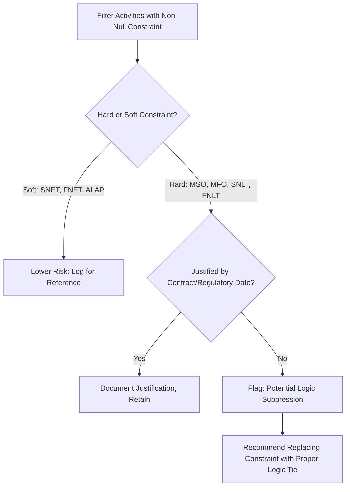
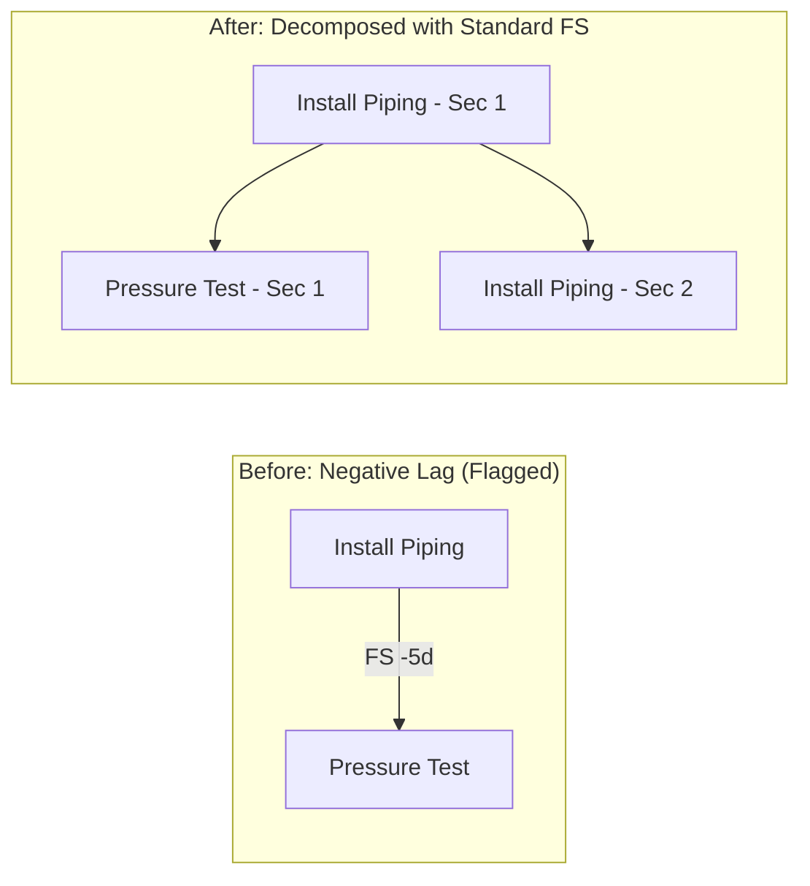
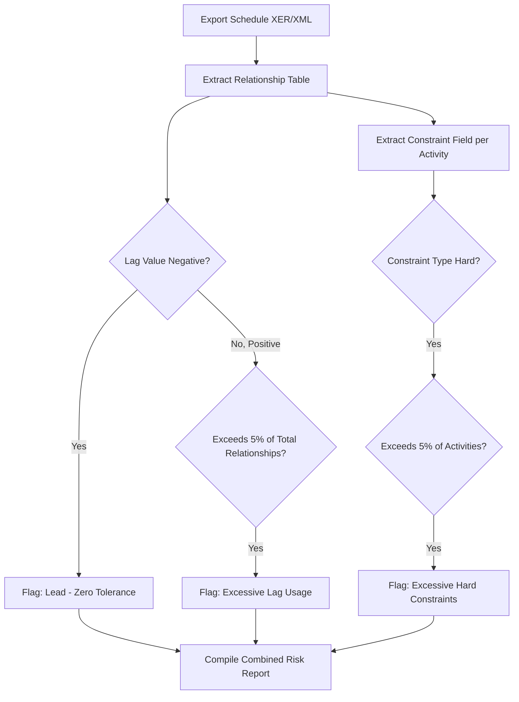

## Constraint and Lag Audits

### Overview

Constraint and lag audits are targeted reviews of two specific CPM schedule mechanisms — date constraints and relationship lags — that, while legitimate tools when used correctly, are also the most common vectors for artificially manipulating or corrupting a schedule's calculated dates and float. Unlike logic checks (which detect *missing* relationships), constraint and lag audits detect *misused* relationships: logic that exists and calculates cleanly but does not reflect genuine physical or contractual reality. These audits map directly to DCMA metrics 2 (Leads), 3 (Lags), and 5 (Hard Constraints).

### Why This Audit Matters

**Key Points**

- Constraints and lags both override or modify the "pure" logic-driven date calculation that the forward/backward pass would otherwise produce.
- Used properly, they represent genuine real-world conditions: a permit that cannot be issued before a fixed regulatory date (constraint), or concrete cure time (lag).
- Used improperly, they become a mechanism for hiding schedule risk: a scheduler under pressure to show an on-time finish can impose a "Finish No Later Than" constraint or insert negative lag rather than confronting the fact that the logic-driven calculation shows a later date.
- Because constraints and lags directly alter float, an audit of their usage is inseparable from an audit of the resulting float values — a schedule can pass a basic negative-float check yet still contain the very constraints that are suppressing what would otherwise be a negative-float condition.

### Constraint Audit

#### Constraint Types and Risk Profile

**Key Points**

- **Hard constraints** override logic-calculated dates entirely and can prevent the true late date from propagating through the backward pass:
  - *Must Start On (MSO)* / *Must Finish On (MFO)*: locks the date regardless of logic in both directions.
  - *Start No Later Than (SNLT)* / *Finish No Later Than (FNLT)*: caps the late date, which can force negative float if the logic-driven date would otherwise exceed it.
- **Soft constraints** limit dates in only one direction and generally do not override logic-driven float calculations:
  - *Start No Earlier Than (SNET)* / *Finish No Earlier Than (FNET)*: only affects the early date if the constraint date is later than the calculated early date.
  - *As Late As Possible (ALAP)*: schedules the activity as late as its float allows — useful for deferring discretionary work, but can obscure true criticality if overused.
- DCMA threshold: no more than **5%** of activities should carry hard constraints (MSO, MFO, SNLT, FNLT).

#### Constraint Detection Methodology

**Key Points**

- Filter the activity table for any non-null constraint field, then categorize by constraint type (hard vs. soft) before comparing against the threshold — a raw "constraint present" count without this split overstates the problem, since soft constraints are generally low-risk.
- Cross-reference each hard constraint against its justification: does the constraint correspond to a genuine external commitment (contract milestone, regulatory date, resource availability window), or was it applied to force a date the logic would not otherwise produce?
- In Primavera P6, constraint type and date are visible in dedicated activity columns; a global filter such as "Primary Constraint is not None" combined with a constraint-type breakdown quickly isolates the population for review.
- Pay particular attention to constraints applied to activities that are also flagged with negative float (DCMA metric 7) or activities near the project finish milestone — these are the highest-risk locations for constraint misuse, since a constraint here can mask an unrealistic finish date.

#### Example: Constraint Masking Slippage

**Example**

An activity "Issue Final Permit" carries a Finish No Later Than (FNLT) constraint of a project milestone date. The logic-driven calculation (based on actual predecessor durations) would place its early finish 15 working days later than the constraint date. Because FNLT caps the late finish at the constraint date, the schedule reports 0 days of float on this activity's predecessors instead of –15 days of negative float. The constraint has effectively hidden a genuine 15-day slippage that would otherwise surface as a negative-float alarm. Removing the artificial FNLT constraint and allowing the schedule to calculate naturally reveals the true condition, which should then be addressed through a recovery plan rather than a suppressed date.

### Lag Audit

#### Lag vs. Lead

**Key Points**

- **Lag** (positive value, e.g., FS+10d) delays the successor's start/finish relative to the predecessor — appropriate for genuine passive waiting time.
- **Lead** (negative value, e.g., FS–5d) allows the successor to start before the predecessor's logical trigger point — this is a "negative lag" and is a DCMA zero-tolerance item.
- DCMA thresholds: **0%** of relationships should use leads (negative lag); no more than **5%** should use positive lag.

#### Why Leads Are Prohibited

**Key Points**

- A lead artificially compresses the schedule by allowing overlap that isn't represented by genuine logic — it simulates fast-tracking without requiring the scheduler to actually decompose the work into the parallel-capable pieces that would justify it.
- Leads make float calculations unreliable because the "start" trigger for the successor no longer corresponds to an actual completion event in the predecessor.
- The correct remediation is almost always to break the predecessor activity into two (or more) discrete, sequential sub-activities, then apply standard Finish-to-Start logic — this achieves the same practical overlap while preserving auditable, driving logic.

**Example**

Original (flagged): `Install Piping` → `Pressure Test` with FS –5 days (test begins 5 days before piping installation finishes).

Corrected: Split `Install Piping` into `Install Piping – Section 1` and `Install Piping – Section 2`. Link `Install Piping – Section 1` → `Pressure Test – Section 1` (standard FS), allowing genuine parallel progress on Section 2 without relying on a negative-lag override.

#### Positive Lag Audit Criteria

**Key Points**

- A legitimate lag should be traceable to a physical or procedural cause with a defensible duration: concrete curing time, regulatory review/approval periods, mandatory soak/burn-in periods, or contractually defined waiting windows.
- An audit red flag is a lag value that appears to be a rounded, arbitrary "buffer" (e.g., a flat 10 or 20 days applied broadly across dissimilar activity types) rather than a value tied to a specific technical standard or specification.
- Lag should never be used as a substitute for activity duration uncertainty or risk contingency — uncertainty belongs in the duration estimate (or a separate, transparently modeled contingency/buffer activity), not hidden inside a relationship lag where it escapes scrutiny and cannot be tracked or reported against.
- Excessive lag usage, even when individually justifiable, can indicate missing scope: if "Cure Concrete" requires 21 days of lag, best practice is to model it as a discrete zero-resource activity ("Concrete Curing," 21 days) rather than a lag value, since this makes the wait time visible, reportable, and auditable in progress statusing.

### Combined Constraint-Lag Interaction Risk

**Key Points**

- Constraints and lags compound each other's masking effect: a hard constraint downstream of a chain containing excessive lag can suppress the negative float that the lag-inflated duration would otherwise generate, creating a schedule that appears healthy on the surface while carrying substantial hidden risk.
- A rigorous audit reviews both together along the same logic path, not just as independent metric counts — tracing a single critical or near-critical path end-to-end and cataloging every constraint and lag encountered along that path gives a more accurate risk picture than aggregate percentages alone.

### Detection Workflow Summary

### Limitations

**Key Points**

- Automated audits detect the *presence* and *frequency* of constraints and lags but cannot independently verify whether a specific lag duration or constraint date is technically correct — that requires domain expertise (e.g., confirming a stated cure time against a governing specification).
- A schedule can pass all numeric thresholds (fewer than 5% hard constraints, fewer than 5% lag, zero leads) while still containing a small number of strategically placed constraints or lags that materially distort the reported critical path — percentage-based screening should be paired with targeted critical-path tracing, not relied upon alone.
- [Inference] Because constraint and lag misuse is often introduced under schedule pressure late in a project's life, auditing at every monthly update rather than only at baseline is generally considered more effective at catching this behavior early, though specific audit cadence is an organizational policy decision rather than a fixed DCMA requirement.

### **Related Topics**

- DCMA 14-point schedule assessment (parent diagnostic framework)
- Logic checks and dangling activity detection
- Negative float root-cause analysis
- Critical Path Length Index (CPLI) calculation
- Schedule fast-tracking vs. crashing techniques
- Total float vs. free float interpretation
- Schedule baseline change control and constraint governance policies
- Critical path continuity testing methodology