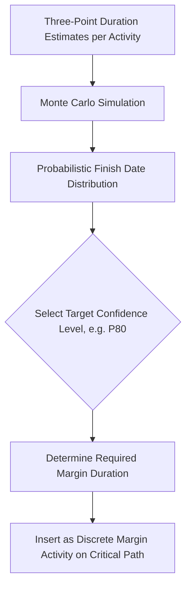
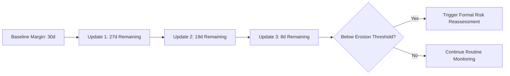

## Schedule Margin and Contingency Review

### Overview

Schedule margin (also called schedule reserve, buffer, or contingency in a schedule context) is a deliberately inserted, explicitly modeled block of time in a CPM schedule that absorbs known and unknown risks without consuming the float of underlying work activities. A schedule margin review audits whether margin exists, whether it is modeled transparently (as a discrete, visible activity rather than hidden inside padded durations or lags), whether its magnitude is defensible, and whether it is being consumed or eroded appropriately as the project executes. This is a distinct discipline from the DCMA 14-point structural checks — it addresses whether the schedule has *adequate and honest* protection against uncertainty, not merely whether the network logic is mechanically sound.

### Why Schedule Margin Matters

**Key Points**

- A CPM schedule built with zero-float logic and no explicit margin communicates false precision — it implies deterministic certainty about durations and sequencing that rarely exists in real project execution.
- Without visible margin, schedulers under pressure tend to hide risk protection inside individual activity durations (padding) or relationship lags — both of which were flagged as red flags in the DCMA lag audit, since hidden padding escapes scrutiny, cannot be tracked, and is typically the first thing removed during schedule compression exercises.
- Explicit margin makes risk protection auditable: stakeholders can see exactly how much buffer exists, where it sits in the network, and how much has been consumed to date — enabling objective conversations about whether the project finish date is still achievable.
- Margin also creates a governance mechanism: erosion of margin over successive updates is an early warning indicator, often surfacing schedule risk before it appears in traditional EVM metrics like SPI.

### Types of Schedule Margin

#### Project-Level Margin (Terminal Float / Contract Margin)

**Key Points**

- A discrete activity (often zero-duration-resourced but with a defined duration) inserted between the last technical activity on the critical path and the contractual/customer-required finish milestone.
- Absorbs cumulative risk across the entire project; its size is typically derived from schedule risk analysis (e.g., Monte Carlo simulation) rather than an arbitrary percentage.
- Sometimes called "management reserve" in a time context, paralleling the cost-side management reserve used in EVM, though the two are governed separately (time margin does not automatically imply cost margin, and vice versa).

#### Intermediate/Feeding Margin

**Key Points**

- Smaller margin blocks placed at key integration points within the network — for example, before a major milestone, a testing phase, or a hand-off between subcontractors — to protect specific high-risk junctures rather than only the final project finish.
- Particularly valuable in schedules with parallel feeding paths of differing risk profiles: a high-risk path (e.g., first-of-a-kind equipment fabrication) may warrant its own dedicated margin block feeding into an integration milestone, separate from the overall project-level margin.

#### Phase or Milestone-Specific Margin

**Key Points**

- Applied at the boundary of a project phase (e.g., Design Complete, Procurement Complete) to protect a contractually significant interim date without necessarily protecting the final project finish separately.
- Common on programs with progress payments or contractual milestones tied to interim dates, where slippage at an interim milestone carries direct financial or contractual consequences independent of the final delivery date.

### Modeling Requirements for Legitimate Margin

**Key Points**

- Margin must be modeled as a **discrete, visible activity** with its own activity ID, description (clearly labeled, e.g., "Schedule Margin – Project Finish"), and duration — never as a hidden pad inside a technical activity's duration.
- Margin activities should carry **no resources or cost** (they represent time reserve, not work scope) unless the organization deliberately links margin consumption to a management-reserve cost pool, in which case that linkage should be explicit and separately governed.
- Margin should sit on (or immediately adjacent to) the critical path so that its presence is reflected in total float calculations — margin placed off the critical path provides no genuine schedule protection for the activities that actually need it.
- Margin consumption should be tracked explicitly at each update: as the margin activity's remaining duration shrinks (because upstream activities are taking longer than planned and eating into the buffer), this should be visible and reported as a distinct trend line, not absorbed silently into overall float figures.

### Sizing Methodology

**Key Points**

- **Quantitative (risk-based) sizing**: Schedule Risk Analysis (SRA) using Monte Carlo simulation on activity duration distributions (e.g., three-point PERT estimates) produces a probabilistic finish-date distribution; margin is then sized to move the deterministic finish date to a target confidence level (commonly P70–P90, meaning 70–90% probability of finishing by the protected date).
- **Heuristic/percentage-based sizing**: A simpler, less rigorous approach applying a flat percentage (e.g., 5–10%) of total project duration or of the critical path length as margin — used when a full quantitative SRA is not feasible, but less defensible under audit since it is not tied to actual identified risks.
- **Risk register-driven sizing**: Margin duration derived by aggregating the schedule impact of specific identified risks from a project risk register (each risk's probability × schedule impact, summed with appropriate correlation treatment) — bridges the gap between purely statistical Monte Carlo output and a documented, auditable justification tied to named risks.

$$P_{target} = P\left(FinishDate \leq D_{protected}\right)$$

Where $D_{protected}$ is the date the margin is intended to protect, and $P_{target}$ is the organization's chosen confidence threshold (e.g., 0.80 for P80).

### Example: Margin Review Finding

**Example**

A schedule review identifies that the baseline shows a single 15-day "Project Contingency" activity immediately before the contractual finish milestone, with no stated basis for the 15-day figure beyond "standard practice." Cross-referencing against the project's Monte Carlo SRA output (run separately by the risk team) shows the P80 finish date is actually 34 working days beyond the deterministic (zero-margin) finish. The reviewer flags this as **under-margined**: the modeled buffer provides roughly P55 confidence rather than the organization's stated P80 target policy, meaning the schedule is significantly more likely to miss its contractual date than the margin implies. The recommendation is either to increase the margin activity to align with SRA output or to formally document and accept the lower confidence level with stakeholder sign-off.

### Margin Erosion Tracking

**Key Points**

- At each schedule update, compare the current remaining duration of margin activities against their baseline duration — a declining trend indicates the schedule is consuming its protection faster than the plan anticipated.
- A margin erosion rate can be plotted alongside SPI and BEI (Baseline Execution Index) as a leading indicator: margin erosion often precedes visible SPI degradation, since margin is typically the first thing consumed before negative float or missed milestones become apparent in cost-based EVM metrics.
- Establish trigger thresholds (e.g., if margin falls below 50% of baseline value before 50% of project duration has elapsed) that prompt a formal schedule risk reassessment or recovery plan discussion, rather than allowing margin to be silently consumed to zero without governance review.

### Common Audit Findings and Anti-Patterns

**Key Points**

- **No margin present at all**: the schedule shows zero float on the reported critical path with no discrete buffer — any minor slippage immediately produces negative float and a missed contractual date, with no cushion for legitimate variability.
- **Margin hidden as float rather than as an activity**: some schedules rely on naturally occurring float between the last activity and an artificially late finish milestone constraint rather than an explicit margin activity — this is fragile, since it is invisible in standard float reports and can be silently consumed by logic changes elsewhere in the network without triggering any visible alert.
- **Margin placed off the critical path**: a margin activity exists but is not actually protecting the activities most at risk, providing a false sense of security.
- **Margin sized arbitrarily and never revisited**: a fixed contingency value set at baseline and never re-evaluated against actual risk exposure or realized performance as the project progresses.
- **Margin consumed and reset without visibility**: margin activities that are periodically "topped up" or extended at each update without a documented justification, which defeats the purpose of using margin as an objective erosion indicator.

### Integration with Broader Schedule Health

**Key Points**

- Margin review complements the DCMA 14-point assessment: a schedule can pass all 14 DCMA structural metrics (correct logic, minimal constraints, acceptable float distribution) while still carrying an outright unrealistic finish date because it has no genuine risk protection — margin review addresses realism, while DCMA metrics address structural integrity.
- Margin erosion trends should be reviewed alongside CPLI (Critical Path Length Index) and BEI at each reporting cycle, since a healthy CPLI can mask the fact that the underlying margin protecting that critical path is being rapidly consumed.
- [Inference] Organizations that formally integrate schedule margin review into monthly update cycles, rather than treating it as a one-time baseline exercise, are generally better positioned to detect schedule risk early, though the specific governance cadence and erosion-threshold policy vary by organization and contract type.

### Limitations

**Key Points**

- Quantitative sizing via Monte Carlo simulation depends heavily on the quality of underlying duration-uncertainty estimates (optimistic/pessimistic ranges); poorly calibrated inputs produce a margin figure with false statistical precision. [Unverified] The degree to which any given organization's three-point estimates are empirically calibrated against historical actuals is not standardized and varies significantly by maturity of the scheduling function.
- Margin protects against duration and sequencing uncertainty but does not substitute for correcting genuine logic defects, unrealistic original durations, or resource overallocation — using margin to compensate for a poorly constructed schedule treats a symptom rather than the underlying structural problem.
- Stakeholder or contractual pressure to show an aggressive finish date can create incentive to under-size or remove margin, undermining the review's purpose; margin review is therefore as much a governance and reporting discipline as a technical calculation.

### **Related Topics**

- Schedule Risk Analysis (SRA) and Monte Carlo simulation methodology
- DCMA 14-point schedule assessment (parent diagnostic framework)
- Constraint and lag audits
- Critical Path Length Index (CPLI) and its relationship to margin
- Baseline Execution Index (BEI) as a leading indicator
- Three-point (PERT) duration estimating techniques
- Management reserve governance in Earned Value Management
- Schedule recovery planning and re-baselining triggers