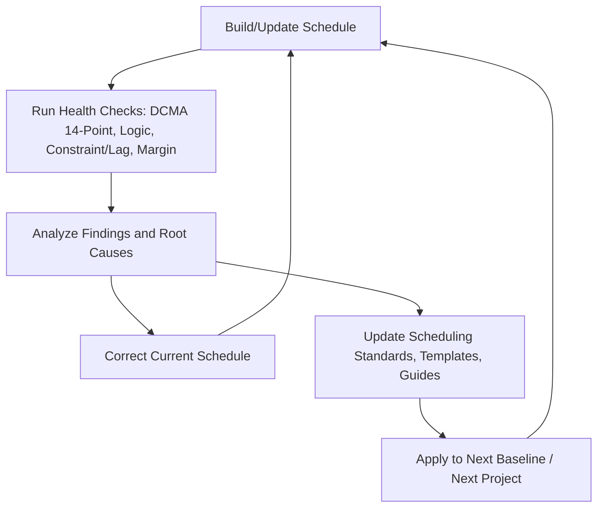
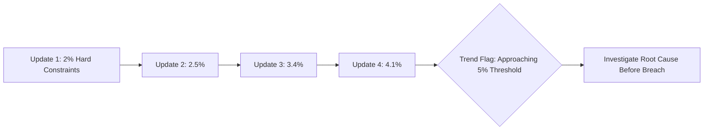
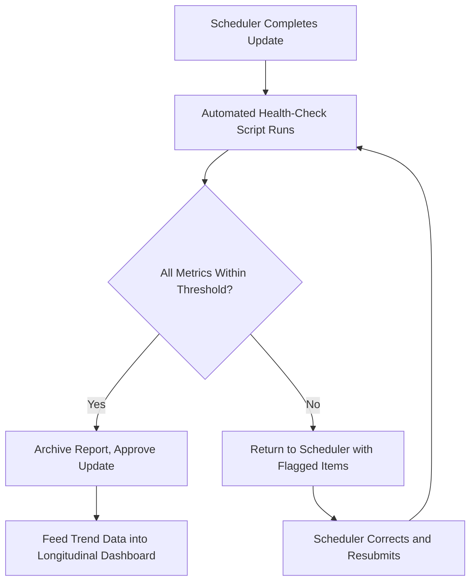

## Continuous Schedule Improvement Practices

### Overview

Continuous schedule improvement is the ongoing organizational discipline of using schedule quality data — DCMA metrics, logic audits, constraint/lag audits, margin erosion trends, and execution performance indices — not merely to diagnose a single schedule at a point in time, but to systematically improve scheduling practice across the life of a project and across an organization's portfolio over time. Where the DCMA 14-point assessment and its related audits answer "is this schedule structurally sound right now," continuous improvement answers "is our scheduling practice getting better, and are we closing the loop between what we find and how we build the next schedule." It converts periodic health checks from a compliance exercise into a feedback system.

### Why Continuous Improvement Matters

**Key Points**

- A single-instance DCMA check catches structural defects in the current schedule but does nothing to prevent the same defects from recurring in the next baseline, the next project, or the next update cycle — without a feedback loop, organizations re-litigate the same logic errors and constraint misuse indefinitely.
- Schedule quality tends to degrade over time within a single project (logic decay) as activities are added, deleted, and re-sequenced under time pressure; continuous monitoring catches this decay incrementally rather than allowing it to accumulate into a wholesale schedule integrity crisis discovered only at a major milestone review.
- Trend data across multiple projects reveals systemic root causes (e.g., a particular subcontractor's schedules consistently show excessive lag usage, or a particular scheduling team consistently under-sizes margin) that a single-project snapshot cannot expose.
- Continuous improvement is what distinguishes a mature Project Controls / Planning & Scheduling function from one that merely produces compliant-looking schedules for contractual submission without genuine planning value.

### The Continuous Improvement Cycle

**Key Points**

- Continuous schedule improvement typically follows a Plan-Do-Check-Act (PDCA)-style loop adapted to scheduling practice: build/update the schedule, run health checks, analyze root causes of findings, and feed corrections back into both the current schedule and the standards used to build future ones.
- The cycle operates at two nested levels simultaneously: within a single project (update-to-update trend monitoring) and across the organization (lessons-learned aggregation feeding scheduling standards, templates, and training).

### Practice 1: Trend Monitoring Across Updates

**Key Points**

- Rather than treating each monthly DCMA assessment as a standalone pass/fail event, plot each metric (missing logic %, hard constraint %, lag %, high float %, negative float count, CPLI, BEI) as a time series across successive updates.
- A metric that is individually within threshold but trending steadily in the wrong direction (e.g., hard constraints climbing from 1% to 4% over six months, still under the 5% DCMA ceiling) is a leading indicator worth investigating before it crosses the threshold, rather than waiting for an outright failure.
- Trend monitoring distinguishes one-off anomalies (a single problematic update caused by a known event, such as a major scope change) from systemic drift (a gradual, unexplained decline suggesting a process or discipline problem).

### Practice 2: Root Cause Analysis of Recurring Findings

**Key Points**

- When the same defect type recurs across multiple update cycles or multiple projects, treat it as a process defect rather than re-fixing each instance in isolation — for example, if dangling activities consistently appear in newly added scope, the root cause may be a missing step in the change-control procedure requiring logic ties before a new activity can be approved into the schedule.
- Categorize recurring findings by originating cause: training/skill gap, process gap (no enforced review gate), tool misconfiguration (default settings encouraging constraint use), or schedule pressure (deliberate manipulation to hide slippage) — each category demands a different corrective action.
- Document root-cause findings in a lessons-learned repository tied to the specific defect pattern, not just a generic "schedule was late" note, so future schedule builders can search for and avoid the specific mechanism (e.g., "avoid FNLT constraints on permit activities without documented regulatory basis").

**Example**

Across four consecutive project baselines, the negative-lag (lead) metric repeatedly spikes just before each milestone review, then drops back to zero immediately after. Root cause analysis traces this to schedulers inserting temporary negative lag to artificially show an on-time finish for the review, then "cleaning up" the schedule afterward. The corrective action is not merely removing the leads each time, but changing the review process itself: requiring the DCMA logic check to run and be archived as a permanent record at the same moment the schedule is locked for review, removing the window in which manipulation can occur undetected.

### Practice 3: Standardization Through Templates and Scheduling Guides

**Key Points**

- Codify lessons learned into organizational scheduling standards: activity coding structures, default relationship-type policy (FS preferred, SS/FF requiring justification), constraint-usage policy (hard constraints require documented approval), and lag-usage policy (lag values must cite a technical basis).
- Maintain reusable WBS and activity templates for common project types, pre-populated with standard logic patterns that have already passed health checks in prior projects — reduces the rate of new defects being introduced simply because a scheduler is building common sequences from scratch under time pressure.
- Publish a scheduling guide or "schedule quality charter" that sets explicit thresholds (which may tighten DCMA's own defaults for internal use — e.g., a 3% hard-constraint ceiling instead of DCMA's 5%) and assigns ownership for periodic health-check execution and review.

### Practice 4: Automated, Recurring Health-Check Integration

**Key Points**

- Integrate DCMA-style checks and constraint/lag/margin audits directly into the schedule update workflow via automated tooling (Deltek Acumen Fuse, Schedule Analyzer, custom scripts against exported XER/XML) rather than relying on manual, ad hoc review — automation ensures the check happens consistently every cycle regardless of workload pressure at update time.
- Configure automated checks to run and produce a report as a mandatory gate before a schedule update can be formally submitted or approved, rather than as an optional post-hoc audit — this shifts the discipline from reactive detection to preventive gating.
- Store each cycle's health-check output as a permanent, timestamped record (not overwritten by the next update) to preserve the trend history described in Practice 1 and to provide an audit trail demonstrating due diligence, which is particularly relevant on contracts subject to formal Integrated Baseline Review or DCMA oversight.

### Practice 5: Cross-Project Benchmarking and Feedback to Estimating

**Key Points**

- Aggregate health-check and execution-performance data (BEI, hit-task rate, margin erosion rate) across the organization's project portfolio to identify which project types, contract structures, or teams consistently produce higher-quality schedules — and feed that insight back into resourcing and training decisions.
- Compare planned durations against actual realized durations at the activity-type level across closed projects to recalibrate future duration estimates and three-point (PERT) uncertainty ranges used in schedule risk analysis — closing the loop between margin-sizing assumptions (see Schedule Margin and Contingency Review) and observed reality.
- [Inference] Organizations that formally review closed-project schedule performance as part of a post-project lessons-learned process are generally better positioned to improve estimating accuracy over time, though the degree of formal integration between scheduling lessons-learned and estimating databases varies considerably by organizational maturity.

### Practice 6: Governance and Accountability Structures

**Key Points**

- Assign clear ownership for schedule quality distinct from ownership for schedule content — a Project Controls or Planning Manager role responsible for health-check compliance provides a check against the natural incentive for a project scheduler under delivery pressure to under-report risk.
- Establish escalation triggers tied to trend data (not just single-point threshold breaches) — for example, three consecutive updates showing margin erosion beyond the planned burn rate automatically triggers a formal schedule risk reassessment meeting with program leadership.
- Tie schedule quality metrics into formal program reviews (monthly management reviews, Integrated Baseline Reviews, contract milestone reviews) alongside cost and technical performance data, ensuring schedule integrity receives the same governance visibility as cost and scope.

### Common Anti-Patterns in Continuous Improvement Efforts

**Key Points**

- **Check-the-box compliance**: running the DCMA 14-point report each month purely to produce a passing document for contractual submission, without any process for acting on findings or tracking trends over time.
- **No archival of historical reports**: overwriting each update's health-check output with the next, destroying the ability to detect trends or demonstrate improvement over time.
- **Findings without ownership**: identifying recurring defects but never assigning a specific corrective action owner or follow-up date, so the same root cause persists indefinitely.
- **Standards created but not enforced**: publishing a scheduling guide or template library that is never actually mandated or checked against, allowing practice to drift back to prior habits.
- **Improvement isolated to one project**: treating each project's lessons learned as siloed rather than feeding them into organization-wide templates, training, and guides — losing the compounding benefit that a genuine continuous-improvement system provides.

### Integration with the Broader Schedule Quality Framework

**Key Points**

- Continuous improvement is the practice that ties together every other schedule health discipline covered in this chapter: the DCMA 14-point assessment, logic checks, constraint/lag audits, and margin review are each individually a point-in-time diagnostic; continuous improvement is the mechanism that makes their findings compound into lasting organizational capability rather than one-off corrections.
- A mature continuous-improvement program treats a "clean" DCMA report not as an endpoint but as confirmation that the current process is working — and treats any flagged finding as an input to both immediate correction and longer-term process refinement.

### Limitations

**Key Points**

- Continuous improvement requires sustained organizational investment (tooling, dedicated Project Controls resourcing, leadership buy-in for governance gates) that smaller organizations or short-duration projects may not be able to justify proportionally.
- Trend and benchmarking data are only as reliable as the consistency of the underlying health-check methodology across projects — comparing DCMA metrics across teams that apply different threshold configurations or different exclusion rules (e.g., how milestones are treated) can produce misleading cross-project comparisons unless methodology is standardized first.
- [Unverified] The degree to which continuous schedule-improvement programs demonstrably reduce project-level schedule slippage, as opposed to simply improving reported metric compliance, is not something with a single universally agreed empirical benchmark; the causal link is plausible and widely asserted in project controls practice but varies by how rigorously an individual organization closes the loop from finding to corrective action.

### **Related Topics**

- DCMA 14-point schedule assessment (parent diagnostic framework)
- Logic checks and dangling activity detection
- Constraint and lag audits
- Schedule margin and contingency review
- Integrated Baseline Review (IBR) process and governance
- Lessons-learned repositories and knowledge management in project controls
- Schedule Risk Analysis (SRA) recalibration using historical actuals
- Organizational Project Management Maturity Models (OPM3, P3M3) as applied to scheduling practice