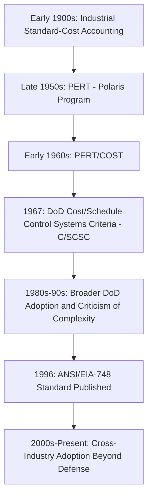

## History and Origins of EVM

### Overview

Earned Value Management (EVM) traces its conceptual roots to industrial cost accounting practices of the early 20th century and its formalized methodology to U.S. Department of Defense (DoD) acquisition reform of the 1960s. Its central innovation — measuring project performance not by comparing planned cost to actual cost alone, but by introducing a third dimension, the *value of work actually accomplished* — transformed project control from a purely financial exercise into an integrated measure of cost, schedule, and technical progress. Understanding this history clarifies why EVM's terminology, governance structure, and rigor originate in a defense-contracting context, even though the technique is now applied broadly across construction, IT, aerospace, and commercial industries.

### Industrial Precursors (Early 1900s)

**Key Points**

- The conceptual seed of earned value predates formal project management as a discipline: industrial engineers in manufacturing settings, influenced by scientific management (Taylorism) in the early 1900s, began comparing standard costs (what a task *should* cost) against actual costs incurred, laying groundwork for variance-based performance measurement.
- Factory cost-accounting systems of this era tracked "standard hours earned" for completed units of production — a direct conceptual ancestor of EVM's "earned value," applied to repetitive manufacturing output rather than unique project deliverables.
- These early systems lacked an integrated schedule dimension; they compared cost efficiency but did not yet combine that with a time-phased baseline against which progress could be measured, which is the defining structural feature EVM would later add.

### The PERT/COST Era (Early 1960s)

**Key Points**

- The U.S. Navy's Polaris missile program in the late 1950s produced PERT (Program Evaluation and Review Technique), a probabilistic network-scheduling method developed to manage the program's extraordinary technical and schedule uncertainty.
- In the early 1960s, PERT was extended into **PERT/COST**, an attempt to integrate cost tracking directly with the PERT network schedule — widely regarded as the first formal attempt by the U.S. government to combine schedule and cost performance measurement into a single reporting framework.
- PERT/COST proved administratively burdensome and was not broadly successful in practice, but it established the essential principle that cost and schedule performance needed to be measured together rather than as separate, disconnected reporting streams — a principle EVM would later operationalize more effectively.

### Cost/Schedule Control Systems Criteria — C/SCSC (1967)

**Key Points**

- In December 1967, the U.S. Department of Defense formally established the **Cost/Schedule Control Systems Criteria (C/SCSC)**, a set of 35 criteria that a contractor's internal cost and schedule management system had to satisfy to be deemed acceptable for DoD contract reporting.
- C/SCSC is the direct methodological origin of modern EVM. Rather than mandating a single prescribed system, DoD required contractors to demonstrate their internal management systems met defined criteria across five categories: Organization, Planning and Budgeting, Accounting, Analysis, and Revisions and Access to Data.
- The 35 criteria collectively required exactly what EVM still requires today: a time-phased performance measurement baseline, integration of scope/schedule/budget into discrete work packages, objective measurement of work accomplished (not just cost incurred), and variance analysis against that baseline.
- C/SCSC's introduction reflected a broader DoD acquisition-reform motivation of the period: high-profile cost overruns on major weapons systems programs created pressure for a standardized, auditable method of verifying that contractor-reported progress reflected genuine physical accomplishment rather than merely spending rate.

### The "Earned Value" Terminology and Conceptual Shift

**Key Points**

- Under C/SCSC, the core conceptual advance was reframing "percent complete" from a subjective, self-reported figure into a calculated, budget-based value: the *Budgeted Cost of Work Performed (BCWP)*, later renamed *Earned Value (EV)* under modern terminology.
- This introduced the now-fundamental three-parameter model:
  - Budgeted Cost of Work Scheduled (BCWS) → now **Planned Value (PV)**
  - Budgeted Cost of Work Performed (BCWP) → now **Earned Value (EV)**
  - Actual Cost of Work Performed (ACWP) → now **Actual Cost (AC)**
- The conceptual breakthrough was that comparing AC to PV alone (traditional cost-variance accounting) could not distinguish between a project that was genuinely over budget and one that was simply ahead of or behind schedule — introducing EV as a third, independent measurement axis resolved this ambiguity, allowing cost variance and schedule variance to be calculated and interpreted separately.

$$CV = EV - AC \qquad SV = EV - PV$$

This formulation — still the foundation of modern EVM — is a direct descendant of the BCWP-based variance analysis introduced under C/SCSC in 1967.

### Criticism and Simplification Period (1980s–1990s)

**Key Points**

- Through the 1980s, C/SCSC became associated with excessive procedural complexity: the original 35 criteria, along with extensive contractor certification requirements, were widely criticized within both government and industry as bureaucratically heavy and costly to implement, particularly for smaller contractors.
- This period saw growing calls to reframe the discipline around underlying management principles rather than rigid compliance criteria — shifting emphasis from "does the contractor's system meet these specific 35 rules" toward "does the contractor's system embody genuine integrated cost/schedule/scope management," a shift that would culminate in the transition to guideline-based standards in the 1990s.
- The terminology "Earned Value Management" (EVM) itself gained broader currency during this period, gradually superseding "C/SCSC" as the common name for the discipline, reflecting the shift from a narrow DoD-compliance framework toward a more general management methodology.

### Standardization: ANSI/EIA-748 (1996–1998)

**Key Points**

- In 1996, the National Defense Industrial Association (NDIA), working with industry, published a revised and consolidated set of **32 Earned Value Management guidelines**, reducing and reframing the original 35 C/SCSC criteria into a more principle-based structure organized around five categories: Organization, Planning/Scheduling/Budgeting, Accounting Considerations, Analysis and Management Reports, and Revisions and Data Maintenance.
- These guidelines were adopted as the American National Standards Institute / Electronic Industries Alliance standard **ANSI/EIA-748**, first published in 1998, which remains the foundational industry standard for EVM system compliance today (periodically updated in subsequent revisions).
- The transition from C/SCSC to ANSI/EIA-748 marked EVM's formal move from a DoD-specific contractual mandate into a broader, industry-governed national standard — a structural change that enabled its adoption well beyond defense contracting.

### Expansion Beyond Defense (2000s–Present)

**Key Points**

- Following ANSI/EIA-748 standardization, EVM adoption expanded into other U.S. federal agencies (NASA, Department of Energy, Department of Transportation) that similarly required rigorous cost/schedule accountability on large capital programs.
- Professional bodies, notably the Project Management Institute (PMI), incorporated EVM as a core technique within general project management practice (documented in the *Practice Standard for Earned Value Management* and referenced within the *PMBOK Guide*), decoupling it from defense-specific procurement language and making it accessible to construction, IT, and commercial program management.
- International adoption followed a parallel track, with standards bodies in other countries and international frameworks (e.g., ISO 21508, which addresses earned value management in project and program management) building on the same core BCWS/BCWP/ACWP (now PV/EV/AC) conceptual model established by C/SCSC.
- [Inference] The continued convergence of EVM terminology toward PV/EV/AC (rather than the original BCWS/BCWP/ACWP acronyms) across PMI and ISO materials reflects a broader trend of EVM shedding its defense-specific origin, though certain federal contracting environments still use the legacy acronyms in formal reporting.

### Summary Timeline

| Period | Milestone |
| --- | --- |
| Early 1900s | Standard-cost industrial accounting establishes variance-based performance concepts |
| Late 1950s | PERT developed for the Polaris missile program |
| Early 1960s | PERT/COST attempts to integrate cost and schedule |
| 1967 | DoD publishes Cost/Schedule Control Systems Criteria (C/SCSC) — 35 criteria |
| 1980s–90s | C/SCSC criticized as overly complex; push toward guideline-based simplification |
| 1996 | NDIA publishes 32 EVM guidelines |
| 1998 | ANSI/EIA-748 standard formally published |
| 2000s–present | Broad adoption across federal agencies, PMI/PMBOK, construction, IT, and international standards (e.g., ISO 21508) |

### Why This History Matters for Practitioners

**Key Points**

- EVM's terminology (Planned Value, Earned Value, Actual Cost, Cost Performance Index, Schedule Performance Index) and its governance emphasis on auditable, criteria-based system compliance are direct legacies of its origin as a defense-procurement oversight mechanism — understanding this explains why EVM implementations, even in commercial contexts, retain a strong emphasis on documented baselines, formal change control, and variance thresholds.
- The historical shift from rigid criteria (C/SCSC's 35 rules) to principle-based guidelines (ANSI/EIA-748's 32 guidelines) reflects a lasting lesson still relevant to implementation today: EVM is most effective when applied as a genuine management discipline integrated into how work is planned and executed, rather than as a compliance overlay applied only for reporting purposes.

### **Related Topics**

- ANSI/EIA-748 guideline structure and the 32 EVM criteria
- Core EVM terminology: PV, EV, AC and their historical acronyms (BCWS, BCWP, ACWP)
- Cost Variance (CV) and Schedule Variance (SV) calculation
- Work Breakdown Structure (WBS) and the Performance Measurement Baseline (PMB)
- Integrated Baseline Review (IBR) process
- PMI's Practice Standard for Earned Value Management
- ISO 21508 and international EVM standards
- Relationship between EVM and Critical Path Method (CPM) scheduling