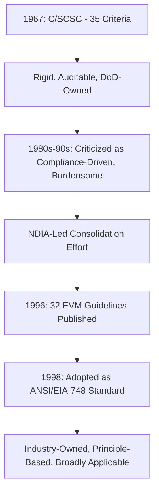
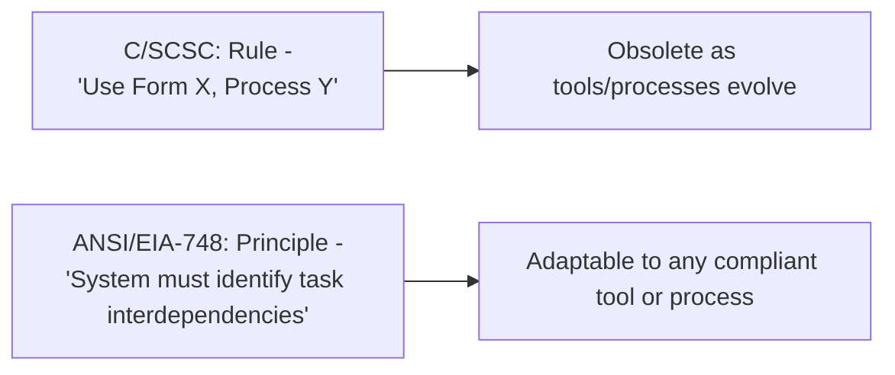

## From C/SCSC to Modern EVM Standards

### Overview

The evolution from Cost/Schedule Control Systems Criteria (C/SCSC) to modern Earned Value Management (EVM) standards represents a deliberate, decades-long transition from a rigid, prescriptive compliance regime to a flexible, principle-based management discipline. While the prior topic in this chapter covered the historical origins and timeline of EVM broadly, this topic focuses specifically on the structural and philosophical transformation of the *standards themselves* — what changed in how the criteria were written, governed, and applied, and why those changes matter to practitioners implementing EVM systems today.

### The C/SCSC Structural Model (1967)

**Key Points**

- C/SCSC comprised **35 discrete criteria** organized into five categories: Organization (criteria 1–5), Planning and Budgeting (criteria 6–15), Accounting (criteria 16–21), Analysis (criteria 22–27), and Revisions and Access to Data (criteria 28–35).
- Each criterion was written as a specific, auditable requirement a contractor's management system had to demonstrably satisfy — for example, requiring that budgets be time-phased, that indirect costs be allocated consistently, or that variance thresholds trigger formal management analysis.
- Compliance was determined through formal DoD **validation reviews**, in which government review teams physically examined a contractor's management system against each of the 35 criteria and issued formal certification (or rejection) — a resource-intensive process for both government and contractor.
- The system's rigor was intentional: C/SCSC emerged directly from a period of high-profile cost overruns on major weapons programs, and DoD's priority was verifiable, standardized proof that contractor-reported progress reflected genuine accomplishment, not merely spending rate or optimistic self-assessment.

### Criticisms That Drove Change

**Key Points**

- **Compliance-focused rather than management-focused culture**: contractors often built systems designed to satisfy the literal wording of the 35 criteria during a validation review, without necessarily using the resulting data for genuine internal management decision-making — the phrase "the tail wagging the dog" was commonly used to describe systems built to pass review rather than to manage work.
- **Disproportionate burden on smaller contractors**: the certification process and system overhead were criticized as scaling poorly to smaller programs and contractors, effectively creating a barrier to broader adoption despite the underlying management principles being valuable at any project scale.
- **Rigid, rule-based language**: because the 35 criteria were written as specific procedural rules rather than general principles, they aged awkwardly as management practices, tools, and organizational structures evolved — criteria written around 1967-era administrative processes did not map cleanly onto newer methods of project execution.
- **Government-only ownership**: as a DoD-issued criteria set, C/SCSC's evolution and interpretation were controlled entirely within a defense-acquisition context, limiting its credibility and applicability as a genuinely industry-wide standard for non-defense sectors.

### The Transition Period: Toward Guidelines (Late 1980s–1996)

**Key Points**

- Through the late 1980s and early 1990s, a joint government-industry effort — led substantially by the **National Defense Industrial Association (NDIA)**, then still largely operating under its predecessor organization structures for industrial program management — worked to consolidate and reframe the 35 criteria.
- The explicit goal of this effort was to shift the standard's character from *criteria* (implying rigid, auditable pass/fail rules) to *guidelines* (implying principle-based expectations that a well-designed management system should naturally embody, regardless of the specific tools or procedures used to achieve them).
- This reframing reduced the original 35 criteria to **32 guidelines**, published by NDIA in 1996, while preserving the same five underlying category structure (Organization; Planning, Scheduling, and Budgeting; Accounting Considerations; Analysis and Management Reports; Revisions and Data Maintenance) — the consolidation eliminated redundancy and rigidity rather than removing substantive management principles.

### ANSI/EIA-748: The Modern Standard (1998–Present)

**Key Points**

- In 1998, the 32 guidelines were formally adopted as an American National Standards Institute standard in partnership with the Electronic Industries Alliance, designated **ANSI/EIA-748**, commonly referred to simply as "748" in practitioner shorthand.
- Unlike C/SCSC, ANSI/EIA-748 is an **industry-consensus national standard**, maintained and periodically revised through ANSI's standard governance process rather than being unilaterally issued and controlled by DoD — this structural change gave the standard broader legitimacy and applicability outside defense contracting.
- The standard has undergone periodic revisions since 1998 to keep pace with evolving practice, while retaining the same core 32-guideline, five-category structure established at its founding.
- The guideline categories remain conceptually identical to C/SCSC's five categories, underscoring that the *substance* of sound EVM practice did not fundamentally change — what changed was the framing (guidelines vs. criteria), the ownership (industry-consensus vs. government-mandated), and the compliance philosophy (self-assessment and system-based judgment vs. formal government validation review).

### Structural Comparison: C/SCSC vs. ANSI/EIA-748

| Dimension | C/SCSC (1967) | ANSI/EIA-748 (1998–present) |
| --- | --- | --- |
| Number of requirements | 35 criteria | 32 guidelines |
| Category structure | 5 categories | 5 categories (same conceptual groupings) |
| Governing body | U.S. Department of Defense | Industry consensus (ANSI/EIA, NDIA involvement) |
| Compliance philosophy | Rule-based, pass/fail | Principle-based, system-level judgment |
| Validation approach | Formal DoD certification review | Self-assessment / surveillance review, scaled to program risk |
| Primary applicability | Defense contracts above dollar thresholds | Any program choosing to implement rigorous cost/schedule integration |
| Terminology | BCWS / BCWP / ACWP | Planned Value (PV) / Earned Value (EV) / Actual Cost (AC) |

### Modernization of Application and Governance

**Key Points**

- **Risk-scaled compliance oversight**: modern EVM implementations, particularly within U.S. federal acquisition (governed today primarily through the Federal Acquisition Regulation and agency-specific guidance rather than C/SCSC directly), scale the rigor of formal system surveillance and validation to the size and risk profile of the contract, rather than applying a uniform, heavyweight review process to every program regardless of scale.
- **Integration with modern scheduling and cost tools**: where C/SCSC-era systems relied heavily on manual and semi-manual reporting processes, modern EVM implementations are built around integrated CPM scheduling software (Primavera P6, MS Project) linked to cost-collection systems, enabling the time-phased Performance Measurement Baseline required by the guidelines to be generated and maintained far more efficiently than was feasible in 1967.
- **Broader professional ownership**: the Project Management Institute's *Practice Standard for Earned Value Management* and its incorporation of EVM concepts into the *PMBOK Guide* extended EVM's reach into general project management practice, decoupled from any defense-specific procurement language — meaning a construction or IT program manager today can apply EVM guided by PMI literature without needing direct familiarity with ANSI/EIA-748's defense-contracting origin.
- **International parallel standards**: frameworks such as ISO 21508 (earned value management in project and program management) provide an internationally recognized standard built on the same PV/EV/AC conceptual model, allowing EVM practice to be applied consistently across jurisdictions beyond the U.S. ANSI/EIA framework.

### Why the Guideline-Based Approach Matters in Practice

**Key Points**

- A guideline framed as "the organization shall use a scheduling system that identifies significant task interdependencies" (principle-based) accommodates any scheduling tool or methodology that achieves that outcome, whereas a criterion written as "the contractor shall produce Form X using Process Y" (rule-based) becomes obsolete the moment tools or processes evolve.
- This shift is a primary reason EVM was able to be adopted well beyond its original defense-acquisition context: a construction firm or software development organization can implement genuinely compliant EVM practice using tools and processes that did not exist in 1967, because the standard specifies *what* a sound system must accomplish rather than *how* it must be executed.
- The self-assessment orientation of ANSI/EIA-748 also shifted responsibility: rather than depending primarily on an external government review team to certify compliance, organizations are expected to internally understand and validate that their own systems embody the guidelines — reinforcing EVM's intended role as a genuine internal management tool rather than an externally imposed reporting obligation.

### Limitations of the Transition

**Key Points**

- The move to principle-based guidelines increased interpretive flexibility, which also introduced more variability in how rigorously different organizations implement EVM — two organizations can both claim ANSI/EIA-748 compliance while differing substantially in the actual discipline and data quality of their underlying systems.
- [Unverified] The degree to which self-assessment-oriented surveillance under the modern framework provides equivalent assurance to the formal government validation reviews conducted under C/SCSC is a matter of ongoing professional discussion rather than a settled, universally quantified comparison; program-specific oversight requirements still vary by contract type and agency.
- Legacy defense-contracting environments and long-running federal programs sometimes retain C/SCSC-era terminology (BCWS, BCWP, ACWP) and reporting conventions even where the governing standard is technically ANSI/EIA-748, creating minor but persistent terminology inconsistency for practitioners moving between defense and commercial contexts.

### **Related Topics**

- History and origins of EVM
- ANSI/EIA-748 guideline categories in detail (Organization, Planning/Scheduling/Budgeting, Accounting, Analysis, Revisions)
- Performance Measurement Baseline (PMB) construction
- PMI's Practice Standard for Earned Value Management
- ISO 21508 and international EVM standards
- Integrated Baseline Review (IBR) process
- Federal Acquisition Regulation (FAR) and EVM compliance requirements
- Core EVM terminology: PV, EV, AC and legacy acronym mapping