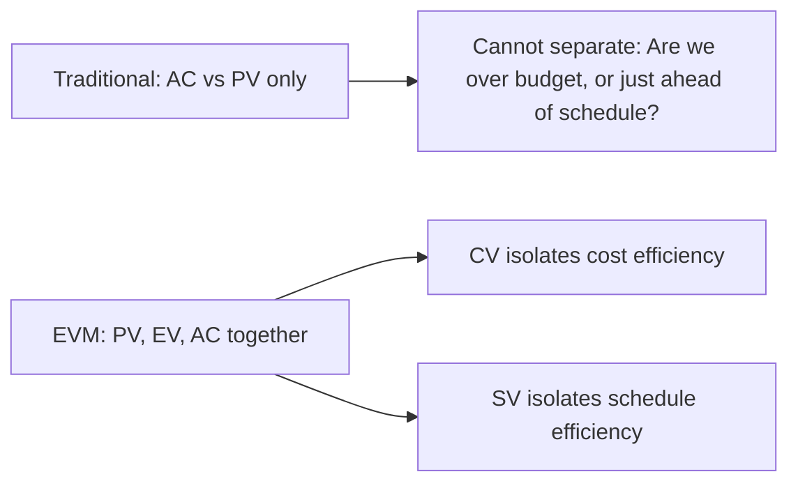
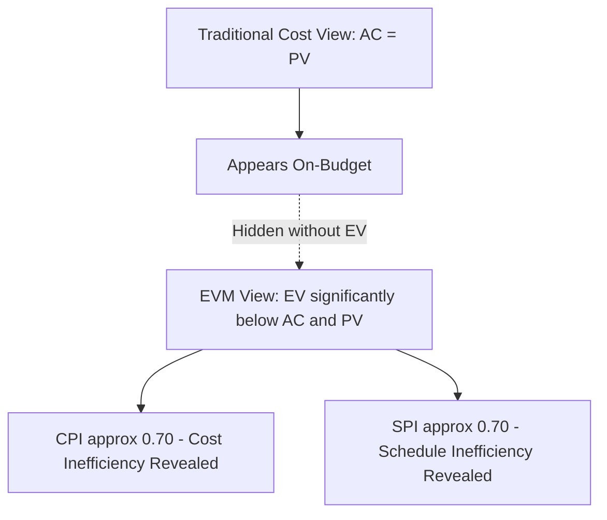

## Purpose and Benefits of EVM

### Overview

Earned Value Management (EVM) exists to answer a question that traditional cost tracking and traditional CPM scheduling cannot answer alone: *given what we have actually accomplished so far, are we truly ahead, on, or behind our plan — in both cost and schedule terms — and where will we likely end up if current performance continues?* EVM's purpose is to integrate scope, schedule, and cost into a single, objective performance measurement system, replacing subjective progress reporting with quantifiable, auditable metrics. Its benefits flow directly from this integration: earlier detection of problems, more accurate forecasting, and a shared, defensible basis for management decisions and stakeholder communication.

### The Core Problem EVM Solves

**Key Points**

- Traditional cost tracking compares **planned spending** to **actual spending** (a two-dimensional comparison). This alone cannot distinguish between a project that is genuinely over budget and one that is simply progressing faster than planned and therefore spending money sooner than scheduled.
- Traditional schedule tracking (CPM float, percent-complete bar charts) shows *sequence and timing* but is frequently disconnected from cost data, and "percent complete" reported by a subjective assessment (a task owner's gut-feel estimate) is notoriously unreliable and prone to the "90% done, 90% to go" phenomenon.
- EVM resolves this by introducing a third, objective measure — **Earned Value (EV)**, the budgeted value of work actually accomplished — allowing cost performance and schedule performance to be calculated independently and unambiguously from the same underlying data.

$$CV = EV - AC \qquad SV = EV - PV$$

Without EV, neither $CV$ (Cost Variance) nor $SV$ (Schedule Variance) can be isolated — only the ambiguous comparison of $AC$ (Actual Cost) against $PV$ (Planned Value) is possible, which conflates cost efficiency and timing into a single indistinguishable number.

### Primary Purposes of EVM

#### Objective Progress Measurement

**Key Points**

- EVM replaces subjective "percent complete" self-reporting with a defined, budget-based earning rule applied consistently across all work packages — common rules include 0/100 (credit only on completion), 50/50 (half credit at start, half at finish), or percent-complete tied to a physical measurement (units installed, drawings approved).
- Because EV is calculated against a pre-established budget baseline using a consistent earning methodology, two different observers assessing the same work package should arrive at the same EV figure — removing the variability inherent in asking a task owner "how done are you."

#### Integrated Performance Measurement Baseline (PMB)

**Key Points**

- EVM requires the explicit integration of scope (via the Work Breakdown Structure), schedule (via time-phasing of work packages), and budget into a single Performance Measurement Baseline — a structural discipline that, by itself, forces better upfront planning even before any performance data is collected.
- This integration exposes planning gaps early: a work package with scope but no assigned budget, or budget with no time-phased schedule tie, becomes visible as a defect in the baseline before execution even begins, rather than surfacing later as an unexplained variance.

#### Early Warning and Trend Detection

**Key Points**

- Because EVM calculates variances and performance indices at every reporting period, unfavorable trends become visible while there is still time to act — a Cost Performance Index (CPI) or Schedule Performance Index (SPI) trending downward across several consecutive periods is a leading indicator of a developing problem, often well before the issue would become obvious through cost or schedule review in isolation.
- EVM's forecasting formulas (Estimate at Completion, Estimate to Complete) convert current performance trends into a projected final outcome, giving management a quantified basis for corrective action rather than only a retrospective account of variance to date.

$$EAC = \frac{BAC}{CPI}$$

Where a CPI persistently below 1.0 projects a final cost (Estimate at Completion) exceeding the original Budget at Completion (BAC), providing an early, data-driven forecast rather than waiting for cumulative actual costs to confirm the overrun after the fact.

#### Unified Cost and Schedule Integration

**Key Points**

- EVM is unusual among project control techniques in genuinely fusing cost and schedule data into a single measurement system, rather than tracking them as parallel but separate disciplines (a CPM schedule maintained by a scheduler, a cost report maintained by a cost analyst, reconciled only informally).
- This integration prevents a common project-control failure mode: a project reporting "green" on cost (spending as planned) and "green" on schedule (activities finishing on their planned dates) independently, while EVM's integrated view reveals that the *value* of what is being accomplished is falling behind what the combined cost and schedule data would suggest.

#### Accountability and Auditability

**Key Points**

- Because EVM ties performance measurement to a formally baselined, change-controlled Performance Measurement Baseline, it creates a defensible, auditable record of what was planned, what was accomplished, and when changes to the plan were formally approved — valuable both for internal governance and for external stakeholder or contractual reporting.
- This auditability is the direct legacy of EVM's origin in defense-acquisition oversight (see History and Origins of EVM), where the ability to verify contractor-reported progress against an objective standard was the primary driver for the methodology's creation.

### Benefits of EVM

#### For Project Managers

**Key Points**

- Provides a single, quantified view combining cost, schedule, and scope status, replacing the need to separately reconcile a cost report and a schedule report that may otherwise tell inconsistent stories.
- Supplies forecasting metrics (EAC, ETC, To-Complete Performance Index) that support proactive decision-making — reallocating resources, adjusting scope, or escalating risk — while there is still time to influence the outcome, rather than only after the fact.
- Enables root-cause variance analysis at the work-package level, allowing a manager to identify *which* specific scope areas are driving overall cost or schedule variance rather than only observing an aggregate, project-level number.

#### For Sponsors and Executives

**Key Points**

- Delivers a standardized, comparable performance snapshot (CPI, SPI, and derived percentages) that can be understood consistently across multiple projects or programs, supporting portfolio-level prioritization and resource allocation decisions.
- Reduces reliance on subjective status reporting from project teams who may have incentive (consciously or not) to present an optimistic picture — EVM's calculated metrics provide an independent check against purely narrative status updates.
- Supports more defensible go/no-go and re-baselining decisions by quantifying, rather than merely describing, the magnitude and trend of cost and schedule performance.

#### For Contracting Parties and Regulators

**Key Points**

- Provides a standardized, auditable basis for verifying contractor performance claims on cost-reimbursable or incentive-based contracts, directly supporting the oversight function EVM was originally designed to serve under C/SCSC and its successor, ANSI/EIA-748.
- Reduces information asymmetry between a contracting organization and a customer/regulator by establishing a shared, formally defined measurement methodology rather than allowing each party to interpret "progress" differently.

#### For Organizations (Portfolio and Process Level)

**Key Points**

- Aggregated EVM data across multiple projects enables organizational-level trend analysis — identifying which project types, teams, or contract structures consistently show strong or weak CPI/SPI performance — feeding into the continuous improvement practices covered elsewhere in this chapter's broader schedule and EVM quality discipline.
- Historical EVM performance data (realized CPI and SPI trends by activity type) improves the accuracy of future cost and schedule estimating, closing the loop between past execution and future planning assumptions.

### Example: EVM Revealing a Hidden Problem

**Example**

A project reports actual cost tracking exactly to the planned budget curve through month six ($AC \approx PV$), which on a traditional cost report would appear entirely healthy — spending is proceeding as planned. However, EVM's earned value calculation shows only 70% of the planned work has actually been completed for that spending level ($EV$ significantly below both $AC$ and $PV$). This reveals a $CPI$ of approximately 0.70 (cost inefficiency — work is costing more than budgeted per unit of value delivered) and an $SPI$ of approximately 0.70 (schedule inefficiency — less value has been earned than planned for this point in time), both of which were completely invisible in the traditional cost-only view. The project appeared "on budget" while actually being significantly over budget relative to true progress and behind schedule — a condition EVM surfaces months before it would otherwise become apparent through cost tracking alone.

### Common Misconceptions About EVM's Purpose

**Key Points**

- EVM is not a scheduling methodology in itself — it depends on and integrates with an underlying CPM schedule (see the relationship between EVM and CPM covered elsewhere in this material), but does not replace critical path calculation, logic, or float analysis.
- EVM is not solely a cost-control tool — its schedule-performance dimension (SPI, Schedule Variance) is equally central to its purpose, and organizations that implement EVM purely as a budget-tracking exercise are not realizing its full integrated value.
- Passing EVM system compliance (e.g., against ANSI/EIA-748 guidelines) is not the same as achieving EVM's actual purpose — a system can be technically compliant while still being used as a reporting formality rather than a genuine management decision-support tool, echoing the "compliance versus management culture" tension discussed in the transition from C/SCSC to modern standards.

### Limitations and Preconditions for Realizing EVM's Benefits

**Key Points**

- EVM's benefits depend entirely on the quality of the underlying baseline and the discipline of the earning methodology — a poorly constructed Performance Measurement Baseline (unrealistic budgets, weak WBS decomposition, inconsistent earning rules) produces EVM metrics that are precise-looking but substantively misleading.
- EVM requires genuine organizational commitment to time-phased planning, disciplined change control, and periodic status collection — the administrative overhead of maintaining a rigorous EVM system is non-trivial, and [Inference] organizations that adopt EVM without adequate planning maturity or resourcing commonly experience the "compliance theater" failure mode described above, though the degree to which this occurs is not something with a single standardized measurement across industries.
- EVM is most valuable on projects with sufficient duration, complexity, and value at risk to justify its overhead; extremely short or simple projects may find the administrative burden disproportionate to the benefit gained relative to simpler progress-tracking methods.

### **Related Topics**

- History and origins of EVM
- From C/SCSC to modern EVM standards
- Core EVM terminology: PV, EV, AC and derived metrics
- Cost Variance (CV) and Schedule Variance (SV) calculation
- Cost Performance Index (CPI) and Schedule Performance Index (SPI)
- Estimate at Completion (EAC) and forecasting formulas
- Performance Measurement Baseline (PMB) construction
- Relationship between EVM and Critical Path Method (CPM) scheduling