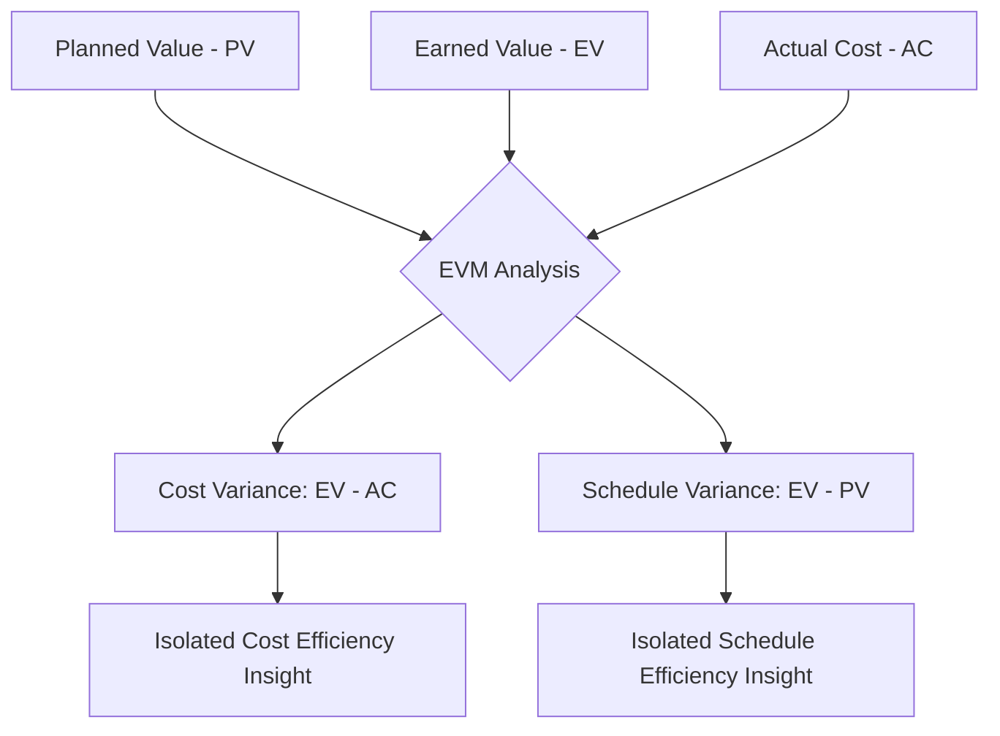
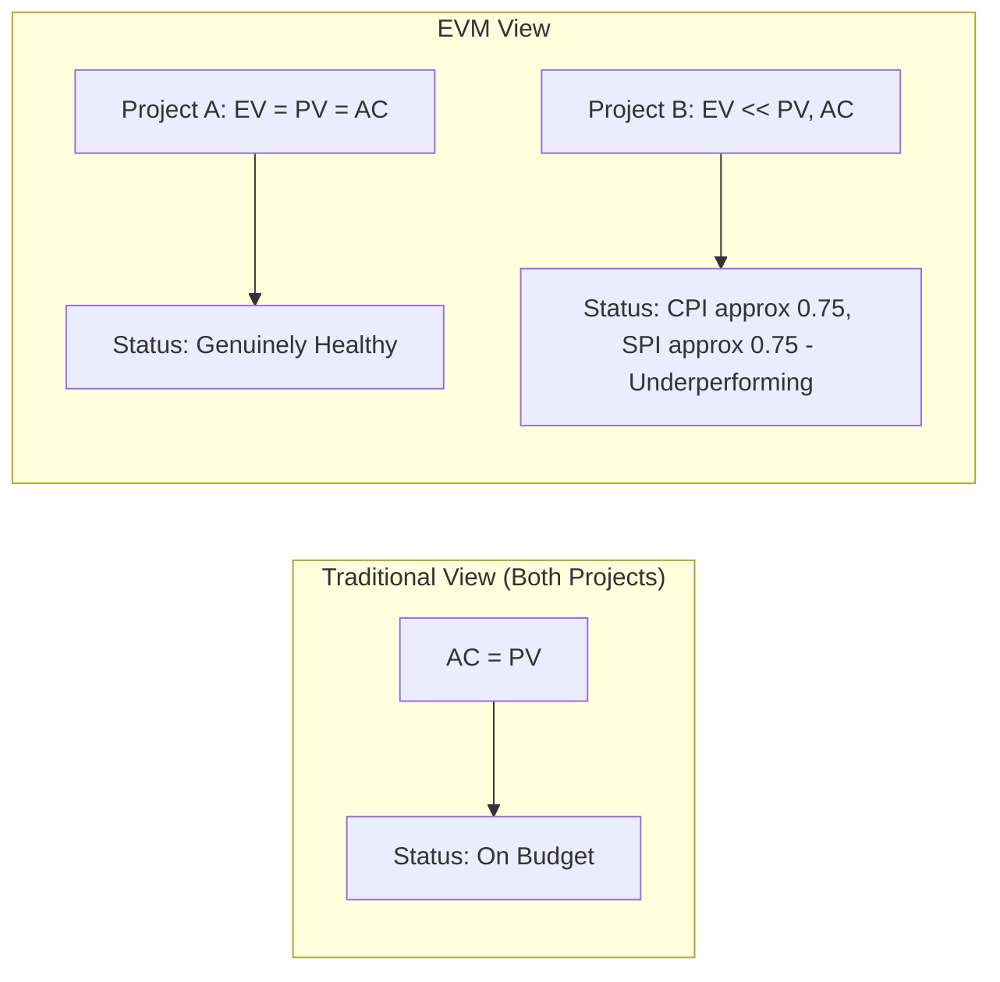

## EVM Compared to Traditional Cost Tracking

### Overview

Traditional cost tracking measures project financial health by comparing planned expenditure to actual expenditure over time. Earned Value Management (EVM) measures the same underlying reality through a fundamentally different lens: it introduces the *value of work actually completed* as an independent third variable, enabling cost and schedule performance to be isolated and understood separately. This topic contrasts the two approaches directly — what traditional cost tracking can and cannot tell you, what EVM adds, and the specific failure modes that EVM was designed to eliminate.

### Traditional Cost Tracking: Structure and Mechanics

**Key Points**

- Traditional cost tracking is fundamentally two-dimensional: it plots **planned spending** (a budget curve, time-phased across the project duration) against **actual spending** (real costs incurred, recorded through accounting/invoicing systems) and reports the difference as a simple budget variance.
- The typical output is a cumulative cost curve chart showing two lines — planned cumulative spend and actual cumulative spend — with the gap between them at any point in time treated as the "variance."
- Progress is usually tracked *separately*, if at all, often through subjective status reporting (a task owner's self-assessed percent complete) or through a simple binary milestone-complete/not-complete tracking mechanism disconnected from the cost curve.

$$Budget\ Variance_{traditional} = Planned\ Spend - Actual\ Spend$$

This single formula is the entire analytical output of traditional cost tracking — it says nothing about whether the work corresponding to that spending has actually been accomplished.

### The Core Structural Gap in Traditional Tracking

**Key Points**

- Traditional cost tracking cannot answer the question "are we spending efficiently relative to the work actually accomplished?" because it never measures the work accomplished in budget terms — only the money spent and the money planned.
- This creates a specific, well-documented failure mode: a project can be **spending exactly as planned** while being **significantly behind in actual progress** — or conversely, spending more than planned while actually being ahead of schedule and simply incurring costs sooner than anticipated. Traditional tracking cannot distinguish between these two scenarios; both appear identically as "over budget" or "on budget" depending only on the AC-to-PV comparison.
- Because progress status is typically self-reported and not budget-calibrated, it is prone to the well-known "90% done, 90% to go" phenomenon, where subjective completion estimates systematically overstate actual progress, especially in the later stages of a task.

### EVM's Structural Addition: The Third Variable

**Key Points**

- EVM adds **Earned Value (EV)** — the budgeted value of the work actually accomplished, calculated using a defined, objective earning methodology applied against the Performance Measurement Baseline — as an independent measurement alongside Planned Value (PV) and Actual Cost (AC).
- With three independent variables instead of two, EVM can calculate two distinct variances rather than one ambiguous variance:

$$CV = EV - AC \quad \text{(Cost Variance — cost efficiency)}$$

$$SV = EV - PV \quad \text{(Schedule Variance — timing efficiency)}$$

- This decomposition is EVM's central structural advantage: it separates the question "are we spending efficiently for the work we've done?" (CV) from the question "are we ahead or behind where we planned to be at this point in time?" (SV) — two questions traditional tracking conflates into one ambiguous number.

### Side-by-Side Comparison

| Dimension | Traditional Cost Tracking | Earned Value Management |
| --- | --- | --- |
| Core variables | Planned Spend, Actual Spend (2) | Planned Value, Earned Value, Actual Cost (3) |
| Progress measurement | Often subjective, separately tracked | Objective, budget-calibrated, integrated into cost analysis |
| Can isolate cost efficiency alone | No — conflated with timing | Yes — via Cost Variance (CV) and CPI |
| Can isolate schedule efficiency alone | No — not measured in cost terms | Yes — via Schedule Variance (SV) and SPI |
| Forecasting capability | Limited — typically linear extrapolation of spend rate | Formula-based (EAC, ETC) grounded in demonstrated performance efficiency |
| Requires integrated WBS/schedule/budget baseline | Not necessarily | Yes — structurally required |
| Detects "spending on plan, but behind in work" | No — appears healthy | Yes — surfaces immediately as low SPI/CPI despite AC≈PV |
| Origin/governance rigor | Informal, varies widely by organization | Formalized (ANSI/EIA-748), auditable, change-controlled baseline |

### Example: Identical Spend, Divergent Reality

**Example**

Two projects each report Actual Cost exactly matching Planned Value at the six-month mark — both would appear "on budget" under traditional cost tracking, with a budget variance of zero.

- **Project A**: EV calculation shows the work accomplished is worth exactly what was planned for this point (EV = PV = AC). Traditional tracking and EVM agree: the project is genuinely healthy.
- **Project B**: EV calculation shows only 75% of the planned value has actually been earned (EV significantly below both PV and AC). Traditional cost tracking, blind to this gap, reports the identical "on budget" status as Project A. EVM reveals CPI ≈ 0.75 and SPI ≈ 0.75 — Project B is materially underperforming despite an identical surface-level cost report.

This is the single clearest illustration of what EVM adds: two projects that are indistinguishable under traditional tracking can be sharply differentiated once earned value is introduced.

### Forecasting: Extrapolation vs. Performance-Based Projection

**Key Points**

- Traditional cost tracking, when it attempts forecasting at all, typically relies on simple linear extrapolation of the actual-spend trend line — assuming future spending will continue at the same rate observed to date, without reference to how much *work* that spending has actually produced.
- EVM's forecasting formulas ground the projection in demonstrated cost efficiency, most simply:

$$EAC = \frac{BAC}{CPI}$$

- This distinction matters materially: a project that has been consistently inefficient (CPI below 1.0) will show a proportionally larger cost overrun forecast under EVM than a naive linear extrapolation of spend rate would suggest, because EVM's EAC formula explicitly incorporates the demonstrated relationship between cost incurred and value produced — not just the raw spending trend.
- More advanced EVM forecasting techniques can further weight this projection using both cost and schedule performance jointly (e.g., using a composite CPI×SPI factor in the EAC denominator for schedule-constrained projects), a level of nuance unavailable to traditional cost-only forecasting.

### What Traditional Cost Tracking Still Offers

**Key Points**

- Traditional cost tracking is simpler to implement and requires less organizational discipline — no integrated WBS/schedule/budget baseline, no formalized earning methodology, and no change-control rigor are structurally required to produce a basic actual-versus-planned spend chart.
- For very short-duration, low-complexity projects, or projects where formal EVM overhead would be disproportionate to project value, straightforward cost tracking combined with milestone-based progress checks may be an adequate and more efficient control method.
- Traditional cost tracking remains a necessary *input* to EVM, not a discarded predecessor — Actual Cost (AC) in the EVM model is still derived from the same underlying accounting data traditional cost tracking has always used; EVM does not replace cost accounting, it adds an analytical layer on top of it.

### When the Difference Matters Most

**Key Points**

- The gap between traditional tracking and EVM widens as project complexity, duration, and the number of concurrent work streams increase — on a simple, short, linear project, spend rate and progress rate tend to track closely together naturally, minimizing the practical difference between the two approaches.
- The difference matters most on programs where work packages have highly variable cost-to-duration ratios, where subcontracted or vendor-supplied cost data can create timing mismatches between spend and progress, or where schedule risk and cost risk are only loosely correlated — precisely the conditions under which traditional tracking's blind spot (conflating spend rate with progress rate) is most likely to produce a materially misleading status picture.
- [Inference] Organizations managing large, multi-year, or high-complexity programs generally derive proportionally greater benefit from EVM's added rigor relative to its implementation overhead than organizations managing small or short-duration projects, though the specific threshold at which EVM's benefit clearly outweighs its overhead is a judgment call that varies by organizational context rather than a fixed, universally agreed figure.

### Limitations Shared by Both Approaches

**Key Points**

- Neither traditional cost tracking nor EVM can compensate for a fundamentally inaccurate underlying budget or schedule estimate — both approaches measure performance *against a baseline*, and a poorly constructed baseline undermines the reliability of either method's output.
- Both approaches depend on the timeliness and accuracy of actual cost data capture from accounting systems; delayed or misallocated cost data produces misleading variance figures under either method, though EVM's additional EV dimension can sometimes make such data-quality issues more visible (an EV that appears inconsistent with known physical progress is itself a diagnostic signal).

### **Related Topics**

- Purpose and benefits of EVM
- History and origins of EVM
- Core EVM terminology: PV, EV, AC and derived metrics
- Cost Performance Index (CPI) and Schedule Performance Index (SPI)
- Estimate at Completion (EAC) and forecasting formulas
- Performance Measurement Baseline (PMB) construction
- Earning methodologies (0/100, 50/50, percent-complete rules)
- Relationship between EVM and Critical Path Method (CPM) scheduling