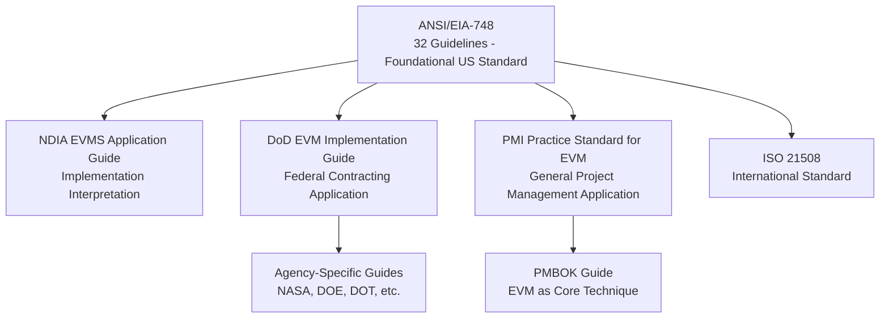

## Overview of EVM Guiding Standards

### Overview

Earned Value Management is governed by a small set of formal standards and guideline documents that define what an EVM system must contain to be considered compliant, auditable, and management-relevant. These standards range from the foundational U.S. industry standard (ANSI/EIA-748) to sector-specific implementation guides, professional-body practice standards, and international standards that generalize the methodology beyond its U.S. defense origins. This topic surveys the current standards landscape, how the documents relate to one another, and which standard applies in which context.

### The Standards Landscape at a Glance

### ANSI/EIA-748: The Foundational Standard

**Key Points**

- **ANSI/EIA-748** (American National Standards Institute / Electronic Industries Alliance) is the primary foundational EVM standard in the United States, first published in 1998 as the successor to the DoD's 35-criteria Cost/Schedule Control Systems Criteria (C/SCSC).
- The standard defines **32 guidelines** organized into five categories: Organization, Planning/Scheduling/Budgeting, Accounting Considerations, Analysis and Management Reports, and Revisions and Data Maintenance.
- ANSI/EIA-748 is deliberately principle-based rather than prescriptive — it specifies *what* a compliant EVM system must accomplish (e.g., integrate scope, schedule, and budget into a time-phased baseline) without mandating a specific software tool, template, or procedural implementation, allowing broad applicability across industries and organizational contexts.
- The standard is periodically revised through ANSI's standard-maintenance process to remain current with evolving practice, while retaining its core 32-guideline structure.

### NDIA EVMS Application Guide

**Key Points**

- Published by the **National Defense Industrial Association (NDIA)**, the EVMS (Earned Value Management System) Application Guide provides detailed interpretive guidance on how to implement each of the 32 ANSI/EIA-748 guidelines in practice.
- Where ANSI/EIA-748 states the *what* (a principle-based guideline), the NDIA Application Guide provides the *how* — practical implementation approaches, common pitfalls, and example practices that satisfy the underlying guideline intent.
- This document is widely used by contractors and consultants as the practical companion reference when designing or auditing an EVM system for ANSI/EIA-748 compliance, since the base standard alone is intentionally too general to serve as a step-by-step implementation manual.

### DoD and Federal Agency Implementation Guides

**Key Points**

- The U.S. Department of Defense maintains its own **EVM Implementation Guide**, which applies ANSI/EIA-748's 32 guidelines within the specific context of DoD acquisition regulations, contract types, and reporting requirements (including formal data deliverables such as the Contract Performance Report and Integrated Master Schedule requirements).
- Federal EVM policy is anchored in the **Federal Acquisition Regulation (FAR)** and associated Defense Federal Acquisition Regulation Supplement (DFARS) clauses, which mandate ANSI/EIA-748-compliant EVM systems on qualifying contracts above defined dollar thresholds.
- Other federal agencies with large capital programs maintain analogous agency-specific implementation guidance built on the same ANSI/EIA-748 foundation — **NASA**, the **Department of Energy (DOE)**, and the **Department of Transportation (DOT)** each publish EVM guidance tailored to their program types (aerospace/research programs, energy infrastructure, transportation infrastructure, respectively), while remaining consistent with the underlying 32-guideline structure.
- [Inference] The proliferation of agency-specific implementation guides built on a common base standard reflects a deliberate design choice in ANSI/EIA-748's principle-based structure — allowing each agency to specify compliance detail appropriate to its contracting environment without requiring a separate base standard, though the precise degree of interpretive divergence between agencies' guides is not something with a single standardized comparison.

### PMI's Practice Standard for Earned Value Management

**Key Points**

- The **Project Management Institute (PMI)** publishes a dedicated *Practice Standard for Earned Value Management*, which translates EVM methodology into general project management terminology, decoupled from defense-acquisition-specific language and compliance mechanisms.
- This standard is written for practitioners across any industry — construction, IT, commercial product development — who wish to apply EVM's core measurement techniques without necessarily pursuing formal ANSI/EIA-748 system certification.
- PMI's terminology (Planned Value, Earned Value, Actual Cost, Schedule Performance Index, Cost Performance Index) is the modern standard nomenclature now widely used across industries, superseding the legacy C/SCSC-era acronyms (BCWS, BCWP, ACWP) in most non-federal contexts.
- EVM concepts from this practice standard are also incorporated directly into the **PMBOK Guide** (A Guide to the Project Management Body of Knowledge), positioning EVM as one of PMI's core recognized project performance measurement techniques within general project management education and certification (e.g., referenced in PMP exam content).

### ISO 21508: International Standardization

**Key Points**

- **ISO 21508**, *Earned value management in project and programme management*, is the primary international standard addressing EVM, published by the International Organization for Standardization to provide globally consistent EVM guidance outside the U.S.-specific ANSI/EIA-748 framework.
- ISO 21508 is built on the same core conceptual model (Planned Value, Earned Value, Actual Cost and their derived variances and indices) as ANSI/EIA-748 and PMI's practice standard, reflecting the underlying convergence of EVM methodology across standards bodies even as governance and terminology conventions differ somewhat by region and industry.
- Organizations operating across multiple jurisdictions, or seeking a standard not explicitly tied to U.S. defense-acquisition heritage, often reference ISO 21508 as the applicable international framework, particularly on programs with non-U.S. government stakeholders.

### Other Notable Reference Frameworks

**Key Points**

- The **Integrated Master Plan (IMP) and Integrated Master Schedule (IMS) guidance**, though not an EVM standard per se, is closely associated with EVM implementation on U.S. government programs, since a compliant EVM system depends on a properly structured, time-phased schedule as its foundation.
- Industry-specific extensions and interpretive guides exist within construction (often integrating EVM with Construction Industry Institute practices) and IT/software development (where earning methodologies are adapted to agile or iterative delivery models), though these typically function as supplementary practice guidance rather than formal competing standards.
- **GAO (U.S. Government Accountability Office) Cost Estimating and Assessment Guide** references EVM extensively as part of broader federal program cost-estimating and oversight practice, functioning as an adjacent reference rather than a dedicated EVM standard itself.

### How the Standards Relate: A Practical View

**Key Points**

- All major EVM standards trace back to the same conceptual lineage established by C/SCSC in 1967 and formalized in ANSI/EIA-748's 32 guidelines in 1998 — differences between standards are primarily in *application context and terminology emphasis*, not in the fundamental PV/EV/AC measurement model.
- A practitioner working on a U.S. federal defense contract will most directly engage with ANSI/EIA-748 (as implemented through DoD/agency-specific guides), while a practitioner in commercial construction or IT would more likely reference PMI's Practice Standard, and a practitioner on an international or non-U.S.-government program might reference ISO 21508 — but the underlying calculations (CV, SV, CPI, SPI, EAC) are consistent across all three.
- Understanding which standard governs a given engagement matters primarily for compliance and reporting-format purposes (specific deliverable formats, surveillance review requirements, terminology conventions) rather than for understanding the core mathematics of EVM itself, which is standardized in substance across all these frameworks.

### Summary Table

| Standard/Guide | Publishing Body | Primary Scope |
| --- | --- | --- |
| ANSI/EIA-748 | ANSI / Electronic Industries Alliance | Foundational U.S. standard — 32 guidelines |
| NDIA EVMS Application Guide | National Defense Industrial Association | Implementation interpretation of the 32 guidelines |
| DoD EVM Implementation Guide | U.S. Department of Defense | Federal defense contracting application |
| Agency-specific guides (NASA, DOE, DOT) | Respective federal agencies | Sector-specific federal program application |
| PMI Practice Standard for EVM | Project Management Institute | General cross-industry project management application |
| PMBOK Guide | Project Management Institute | EVM as a core recognized PM technique |
| ISO 21508 | International Organization for Standardization | International/global EVM standard |

### Limitations

**Key Points**

- Multiple overlapping standards, while conceptually consistent, can create terminology and reporting-format friction when a program or organization must satisfy more than one standard simultaneously (e.g., a U.S. defense subcontractor also reporting to an international joint-venture partner under ISO 21508 conventions).
- Formal certification or surveillance review requirements differ significantly by standard and governing body — ANSI/EIA-748 compliance under federal contract typically involves formal system surveillance, whereas applying PMI's practice standard on a commercial project generally does not involve any external certification process at all, meaning "EVM compliance" can mean materially different things depending on which standard and context is being referenced.
- [Unverified] The precise degree of technical alignment between ISO 21508's specific guideline language and ANSI/EIA-748's 32 guidelines, clause by clause, is not something with a single universally published side-by-side comparison; organizations operating under both should verify specific requirements directly against each standard's current published text rather than assuming full interchangeability.

### **Related Topics**

- From C/SCSC to modern EVM standards
- History and origins of EVM
- ANSI/EIA-748 guideline categories in detail
- Performance Measurement Baseline (PMB) construction
- Integrated Baseline Review (IBR) process
- Federal Acquisition Regulation (FAR) and DFARS EVM requirements
- Core EVM terminology: PV, EV, AC and derived metrics
- Earning methodologies across industries (defense, construction, IT/agile)