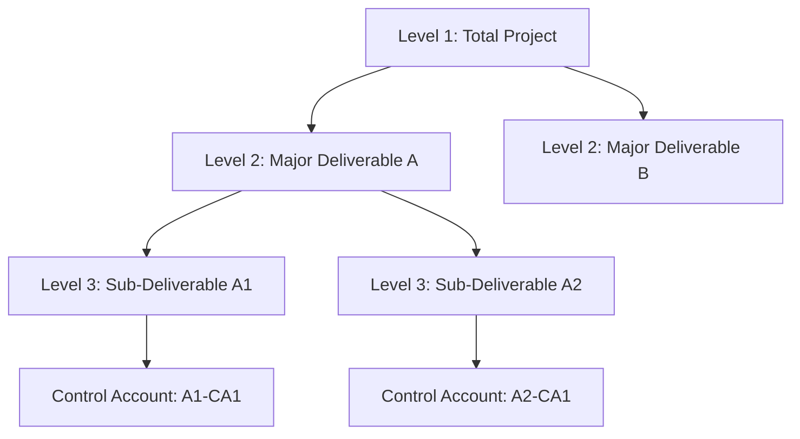
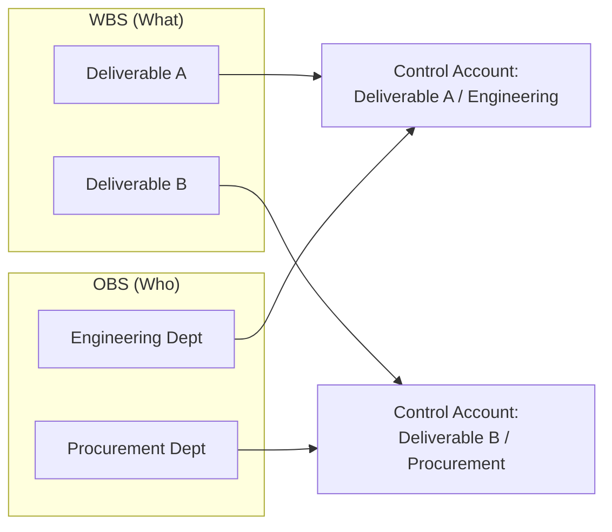
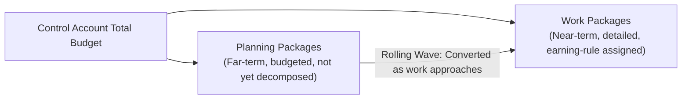

## Integrating the WBS with Control Accounts

### Overview

The Work Breakdown Structure (WBS) decomposes total project scope into progressively smaller, manageable deliverable-oriented elements. Control accounts are the management points where scope, schedule, and budget are formally integrated and where EVM performance is actually measured and reported. Integrating the WBS with control accounts is the structural act of deciding *where in the WBS hierarchy* performance measurement will occur — it is arguably the single most consequential design decision in building a Performance Measurement Baseline (PMB), because it determines the resolution, manageability, and accountability structure of everything EVM subsequently measures.

### The WBS as the Scope Foundation

**Key Points**

- The WBS is a hierarchical, deliverable-oriented decomposition of total project scope, typically extending from Level 1 (the total project) down through intermediate levels to Level 3 or Level 4, where individual deliverables or major scope groupings are defined.
- ANSI/EIA-748 Guideline 1 (Organization category) requires that total program scope be defined and integrated in this manner — the WBS is not optional documentation but a structural prerequisite for a compliant EVM system.
- Every dollar of budget and every unit of schedule must ultimately trace back to a WBS element — work with no WBS home is, by definition, out-of-scope or undefined, a condition that undermines the completeness of the entire baseline.

### What a Control Account Is

**Key Points**

- A **control account (CA)** is a management control point at which scope, schedule, and budget are integrated and compared to actual performance for management control purposes — it is the specific location in the WBS/OBS intersection where EVM measurement formally occurs.
- A control account is not itself a work package; it is a container that aggregates one or more **work packages** (the discrete, near-term, measurable pieces of work with an assigned earning methodology) and, where near-term detail is not yet planned, **planning packages** (future work identified in scope and budget but not yet broken into work packages with assigned earning rules).
- Every control account has a single control account manager (CAM) accountable for that scope, schedule, and budget — establishing clear ownership is itself one of ANSI/EIA-748's organizational guidelines.

### The Control Account as the WBS/OBS Intersection

**Key Points**

- A control account is formally defined at the intersection of the **WBS** (what work, organized by deliverable) and the **Organizational Breakdown Structure, OBS** (who is accountable, organized by responsible manager or department) — this dual structure is a defining characteristic distinguishing a control account from a simple WBS element.
- This intersection is commonly visualized as a **Responsibility Assignment Matrix (RAM)**, mapping each WBS element against the OBS to identify precisely where control accounts fall — a cell in this matrix where a specific organizational unit is responsible for a specific WBS scope element becomes the natural candidate location for a control account.
- Because a control account requires both a defined scope boundary (from the WBS) and a single accountable manager (from the OBS), a WBS element split across multiple responsible organizations cannot itself be a single control account — it must either be subdivided further along WBS lines, or the OBS assignment must be reconciled so a single CAM has clear authority over the full scope.

### Determining the Appropriate Level for Control Accounts

**Key Points**

- Control accounts are typically established at an intermediate WBS level — commonly Level 3 or Level 4 — deep enough to provide meaningful management visibility and accountability, but not so granular that the number of control accounts becomes administratively unmanageable.
- Setting control accounts too high in the WBS (e.g., at Level 2) sacrifices resolution: variances at a high level can mask offsetting problems and successes within the aggregated scope, delaying detection of a genuine issue buried within a large control account.
- Setting control accounts too low (too close to individual work packages) multiplies administrative overhead — more control accounts means more CAMs, more individual variance analyses, more formal change-control transactions — without necessarily improving decision-useful visibility.
- The appropriate level is a judgment balancing several factors: the natural boundaries of organizational accountability (OBS structure), the magnitude of budget/risk associated with different scope areas (higher-risk or higher-value scope often warrants finer control account resolution), and the practical reporting cadence the program can sustain.

### Work Packages and Planning Packages Within a Control Account

**Key Points**

- **Work packages** are the near-term, detailed, schedulable, and measurable units of work within a control account — each has a defined start and finish, an assigned budget, and a specific earning methodology (0/100, 50/50, percent-complete, etc.) used to calculate Earned Value as work progresses.
- **Planning packages** represent far-term scope within a control account that has been identified and budgeted in total but has not yet been decomposed into individual work packages — this is standard practice under the *rolling wave planning* principle, where near-term work is planned in fine detail while far-term work remains at a coarser level of definition until it approaches execution.
- As a project progresses, planning packages are progressively converted into detailed work packages through a formal, documented process (not an informal re-plan) — this conversion is itself subject to baseline change control, ensuring the total control account budget remains reconciled throughout the transition.

### Budget Integration: From Control Account to Baseline

**Key Points**

- The sum of all work package and planning package budgets within a control account equals the control account's total budget — and the sum of all control account budgets equals the project's total Performance Measurement Baseline (PMB), which itself equals the contract or project Budget at Completion (BAC), potentially net of management reserve held separately.
- This summation requirement is not merely arithmetic bookkeeping — it is the mechanism that ensures traceability: any dollar of budget can be traced from the total project BAC down to a specific control account, down further to a specific work package, and ultimately to the specific scope of work that budget is meant to accomplish.
- Time-phasing occurs at the work package level (each work package's budget is distributed across its scheduled duration according to its earning methodology), and this time-phased distribution aggregates upward through the control account to produce the overall project's Planned Value (PV) curve.

$$BAC_{project} = \sum_{i=1}^{n} CA_i \quad \text{where} \quad CA_i = \sum WP_j + \sum PP_k$$

### Schedule Integration: Linking Control Accounts to the CPM Network

**Key Points**

- Each work package within a control account must be represented as one or more activities in the CPM schedule, with logic ties connecting it to predecessor and successor work — this is the mechanism by which control account-level cost data becomes time-phased and integrated with schedule performance (enabling SV and SPI calculation, not just CV and CPI).
- Because control accounts sit at an intermediate WBS level while the CPM schedule is typically built at a more granular activity level, a mapping (often maintained via activity coding or a WBS-code field within the scheduling tool) is required to allow schedule activities to roll up correctly into their corresponding control account for EVM reporting purposes.
- A control account whose constituent work packages/activities lack proper logic ties in the CPM network (see the earlier discussion of dangling activity detection) will produce unreliable time-phased Planned Value distribution for that control account, undermining the accuracy of SV and SPI at that control account and, by extension, at the project level.

### Example: Control Account Structuring Decision

**Example**

A construction project's WBS includes a Level 2 element "Mechanical Systems," further decomposed at Level 3 into "HVAC Installation" and "Plumbing Installation." The OBS shows both scopes are managed by the same Mechanical Superintendent. A scheduler proposes establishing a single control account at "Mechanical Systems" (Level 2) to minimize administrative overhead. Review reveals HVAC installation carries significantly higher cost and schedule risk (specialized equipment, longer lead times) than plumbing installation. The recommendation is to split into two control accounts — "HVAC Installation" and "Plumbing Installation" — both still managed by the same CAM (satisfying OBS accountability) but providing separate variance visibility, so that a cost overrun specific to HVAC equipment does not get diluted or masked within a combined Mechanical Systems variance figure.

### Why This Integration Matters for EVM Integrity

**Key Points**

- The WBS/control-account/OBS integration is the structural backbone that makes every downstream EVM calculation (CV, SV, CPI, SPI, EAC) meaningful — without a properly integrated PMB, variance figures exist but cannot be reliably traced to a specific accountable scope or manager, undermining the corrective-action value EVM is meant to provide.
- Poorly designed control account structure (too coarse, misaligned with OBS accountability, or with weak WBS-to-schedule traceability) is one of the most common root causes of an EVM system that is technically ANSI/EIA-748 compliant on paper but fails to provide genuine management insight in practice — echoing the "compliance versus management culture" tension discussed in the transition from C/SCSC to modern EVM standards.
- [Inference] Because control account structure is established during initial baseline planning and is difficult to substantially restructure mid-project without a formal, disruptive re-baseline, getting this integration right at the outset is generally considered to have outsized importance relative to many other EVM system design decisions, though the specific consequences of a poorly structured baseline vary by project context and are not reducible to a single standardized metric.

### Limitations

**Key Points**

- Even a well-structured control account framework cannot compensate for inaccurate underlying budget or duration estimates within its work packages — structural integration ensures traceability and accountability, not the intrinsic accuracy of the plan itself.
- Organizations with matrixed or frequently changing organizational structures may find maintaining a stable OBS-to-WBS mapping difficult over a long project duration, creating friction each time control account ownership must be formally reassigned.
- [Unverified] The specific administrative overhead ratio between "too many small control accounts" and "too few large control accounts" has no single universally validated formula; the appropriate balance is generally treated as a program-specific judgment informed by risk, value, and organizational capacity rather than a fixed rule specified in ANSI/EIA-748 itself.

### **Related Topics**

- Performance Measurement Baseline (PMB) construction
- Work package definition and earning methodologies
- Rolling wave planning and planning package conversion
- Responsibility Assignment Matrix (RAM) development
- Overview of EVM guiding standards
- Integrated Baseline Review (IBR) process
- Schedule integration between control accounts and the CPM network
- Baseline change control and configuration management in EVM