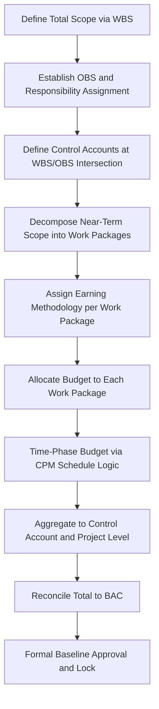

## Performance Measurement Baseline Development

### Overview

The Performance Measurement Baseline (PMB) is the time-phased budget plan against which all EVM performance is measured — it is the formal answer to "what did we intend to accomplish, and when, and for how much?" Developing the PMB is the culmination of EVM planning: it integrates the Work Breakdown Structure, control account structure, organizational accountability, schedule logic, and budget allocation into a single, internally consistent baseline that becomes the fixed reference point for calculating Planned Value, and against which Earned Value and Actual Cost will be compared throughout project execution. A properly developed PMB is the single most important determinant of whether an EVM system will produce meaningful management insight or merely produce numbers.

### What the PMB Represents

**Key Points**

- The PMB is the time-phased distribution of the project's authorized budget — the Budget at Completion (BAC), net of management reserve — across the full project duration, structured by control account and, within each control account, by work package and planning package.
- The cumulative value of the PMB at any point in the project timeline, up to the current status date, *is* the Planned Value (PV) at that point — PV is not a separately calculated figure but simply a read of the PMB as of a given date.
- The PMB is formally baselined (locked) once developed, and subsequent changes to it are only permitted through disciplined, documented change control — this formal locking is what gives EVM variance analysis its meaning: a variance is only interpretable relative to a plan that has not been silently altered to make the variance disappear.

$$BAC = PMB_{total} = \sum_{i=1}^{n} CA_i$$

$$PV(t) = \sum \text{time-phased budget values in the PMB up to date } t$$

### The PMB Development Process

#### Step 1: Complete Scope Definition

**Key Points**

- PMB development begins with a finalized WBS covering 100% of authorized project scope — any scope not represented in the WBS cannot be included in the PMB, and any PMB budget without corresponding WBS scope represents an unexplained or undocumented allocation.
- This is the practical application of the "100% Rule" commonly associated with WBS development: the sum of all WBS elements at any level must represent the entirety of the scope of the level above, with no gaps and no overlaps.

#### Step 2: Organizational Accountability and Control Account Definition

**Key Points**

- The Organizational Breakdown Structure (OBS) is mapped against the WBS via a Responsibility Assignment Matrix (RAM) to establish control accounts, each with a single accountable Control Account Manager (CAM) — this structural step (covered in depth under Integrating the WBS with Control Accounts) is a direct prerequisite to PMB development, since budget cannot be meaningfully allocated and time-phased without first knowing where control accounts sit.

#### Step 3: Work Package Decomposition and Earning Methodology Assignment

**Key Points**

- Within each control account, near-term scope is decomposed into work packages — discrete, short-duration, individually measurable units of work — following the rolling wave planning principle, while far-term scope remains at the coarser planning package level until it approaches execution.
- Each work package is assigned a specific earning methodology appropriate to its nature: 0/100 (credit only at completion) for short-duration or binary-outcome tasks; 50/50 or similar split methods for tasks spanning a reporting period; percent-complete tied to a physical measure (units installed, drawings issued, lines of code, cubic yards poured) for longer, measurable tasks; and level of effort (LOE) for support-type activities without a discrete, measurable deliverable, which earns value simply by the passage of time rather than physical accomplishment.
- The choice of earning methodology directly affects how "honestly" progress will later be reported — a poorly chosen methodology (e.g., percent-complete self-assessment applied to work with no objective measurement basis) reintroduces the very subjectivity EVM is designed to eliminate.

#### Step 4: Budget Allocation

**Key Points**

- Each work package receives a specific dollar (or resource-hour) budget derived from the project's overall cost estimate, ensuring the sum of all work package budgets within a control account equals that control account's authorized budget, and the sum of all control accounts equals the total PMB.
- Budget allocation at this stage should be traceable back to the underlying estimate basis (a resource-loaded schedule, a parametric estimate, vendor quotes, historical unit costs) — an auditable PMB requires that budget figures are not arbitrary but derived from a documented estimating methodology.
- **Management reserve** is explicitly excluded from the PMB and held separately, under the control of the project manager or sponsor, to be released into the PMB only through formal change control when scope-related risk materializes — this separation ensures the PMB reflects only the budget for defined, authorized scope, keeping contingency for unknown-unknowns clearly distinguished from planned work.

#### Step 5: Time-Phasing via Schedule Integration

**Key Points**

- Each work package's budget must be distributed across its scheduled duration according to its assigned earning methodology and the underlying CPM schedule logic — a work package scheduled to run across three reporting periods with a percent-complete earning rule will typically have its budget spread proportionally (or per a defined spend/effort curve) across those periods.
- This step is where PMB development depends directly on a structurally sound CPM schedule (see the schedule quality assessment practices covered earlier in this material) — a schedule with dangling logic, excessive constraints, or unrealistic durations will produce a distorted time-phased PV curve, undermining the PMB's reliability even if the total dollar amounts and WBS structure are otherwise correct.
- The result of this step, aggregated across all work packages and control accounts, is the cumulative PV curve — often visualized as an S-curve, reflecting the typically slower ramp-up and wind-down of spending at a project's beginning and end relative to its middle phase.

#### Step 6: Aggregation, Reconciliation, and Validation

**Key Points**

- Work package time-phased budgets are summed to the control account level, and control accounts are summed to the total project level, with the resulting total formally reconciled against the authorized BAC — any discrepancy must be resolved before the baseline can be locked.
- Validation checks at this stage typically include confirming every control account has an assigned CAM, every work package has an assigned earning methodology and a schedule tie, no budget exists without corresponding scope (and vice versa), and the time-phased PV curve reflects a logically continuous, schedule-driven distribution rather than an artificially smoothed or evenly distributed allocation that does not reflect actual planned work timing.

#### Step 7: Formal Baseline Approval and Lock

**Key Points**

- Once validated, the PMB is formally approved (often through an internal governance gate, and on larger or contractually significant programs, through a formal Integrated Baseline Review with the customer/sponsor) and locked as the fixed reference point for all subsequent EVM measurement.
- From this point forward, any change to the PMB — whether due to approved scope changes, corrective replanning, or formally authorized use of management reserve — must go through documented baseline change control rather than informal adjustment, preserving the integrity and traceability that make variance analysis meaningful.

### Example: PMB Development for a Single Control Account

**Example**

A control account "Foundation Works" ($480,000 total budget, OBS: Civil Superintendent) is decomposed into three work packages: "Excavation" ($120,000, 0/100 earning, 2-week duration), "Rebar and Formwork" ($200,000, percent-complete by linear-foot installed, 6-week duration), and "Concrete Pour and Cure" ($160,000, 50/50 earning, 3-week duration including a 10-day cure lag). Each work package is scheduled in the CPM network with appropriate FS logic and the 10-day cure period modeled as a discrete, zero-cost "Concrete Curing" activity rather than hidden as relationship lag (consistent with lag-audit best practice). The $480,000 is time-phased across the resulting 11-week sequence according to each work package's earning rule, producing the control account's contribution to the project's overall PV curve. Summed with all other control accounts, this reconciles to the project's total BAC before the baseline is locked.

### Common PMB Development Pitfalls

**Key Points**

- **Top-down budget allocation without bottom-up estimate basis**: assigning control account budgets by simply dividing total project budget proportionally across WBS elements, rather than building each work package budget from an actual estimate — produces a PMB that reconciles arithmetically but has no genuine estimating credibility.
- **Artificially smoothed time-phasing**: spreading a work package's budget evenly across its duration regardless of actual expected effort or cost timing (e.g., linear spread when actual cost incurrence is heavily front-loaded), which distorts the PV curve and produces misleading SV/SPI results even when the total budget figure is correct.
- **Excessive reliance on Level of Effort (LOE) earning**: classifying discrete, measurable work as LOE (which earns value simply by time passing rather than physical accomplishment) removes the objective measurement EVM is meant to provide — LOE should be reserved genuinely for support-type work (program management, quality assurance oversight) without a discrete deliverable.
- **Weak schedule integration**: developing the PMB's time-phasing from a schedule with unresolved logic defects (dangling activities, excessive lag/constraints) inherits all of the scheduling issues directly into the cost baseline, compounding the problem across both dimensions of EVM measurement.

### Why PMB Quality Determines EVM's Entire Value

**Key Points**

- Every downstream EVM calculation — CV, SV, CPI, SPI, EAC, and all variance and trend analysis — is measured *against* the PMB; a flawed PMB does not produce "no data," it produces confidently precise-looking numbers that are substantively misleading, which is arguably worse than having no EVM system at all, since it creates false confidence.
- This is the direct practical consequence of the principle established when EVM's guiding standards were surveyed: ANSI/EIA-748's guidelines specify *what* a sound baseline must accomplish, but the actual discipline of achieving that soundness happens entirely during PMB development — compliance with the guideline structure does not, by itself, guarantee estimating accuracy or realistic time-phasing.

### Limitations

**Key Points**

- PMB development requires significant upfront planning investment and cross-functional coordination (estimating, scheduling, control account managers, program management) before any execution work begins — this front-loaded effort is sometimes under-resourced on programs facing schedule pressure to begin execution quickly.
- Even a well-developed PMB reflects the estimating and scheduling knowledge available at the time of baseline — genuine unknown-unknowns and evolving scope understanding mean some replanning and formal baseline change is a normal and expected part of program execution, not necessarily a sign of poor original PMB quality.
- [Inference] The specific balance between planning rigor invested at PMB development and the administrative overhead that rigor imposes is generally treated as a judgment calibrated to program size, risk, and contractual requirements, rather than a fixed formula specified in the guiding standards themselves.

### **Related Topics**

- Integrating the WBS with control accounts
- Work package earning methodologies (0/100, 50/50, percent-complete, LOE)
- Rolling wave planning and planning package conversion
- Management reserve governance and release procedures
- Integrated Baseline Review (IBR) process
- Baseline change control and configuration management in EVM
- Schedule quality assessment and its dependency for PMB time-phasing
- Overview of EVM guiding standards