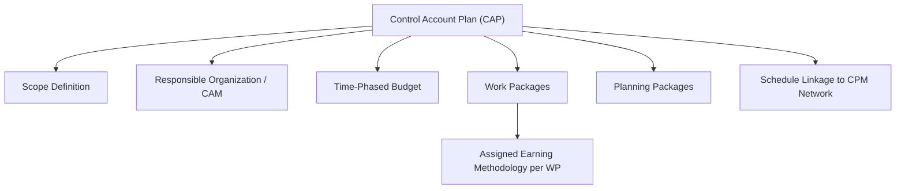
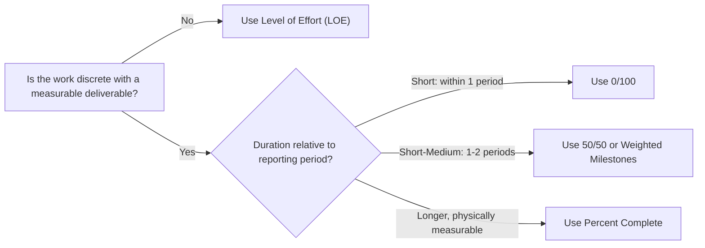

## Control Account Plans and Work Packages

### Overview

A Control Account Plan (CAP) is the detailed planning document that operationalizes a single control account — it is where the abstract structural concepts of the control account (covered under Integrating the WBS with Control Accounts) become a concrete, executable plan with defined work packages, assigned budgets, scheduled timing, and named earning methodologies. If the Performance Measurement Baseline is the project-wide integrated plan, the CAP is its building block: the PMB is, in effect, the sum of all individual CAPs. This topic focuses specifically on the internal structure and content of a CAP and the work packages within it, including the mechanics of earning methodologies in practical application.

### What a Control Account Plan Contains

**Key Points**

- A CAP is authored and owned by the Control Account Manager (CAM) and documents, at minimum: the scope of work covered by the control account, the responsible organization, the time-phased budget, the constituent work packages and planning packages, the earning methodology assigned to each work package, and the schedule activities/logic ties that represent that work in the CPM network.
- The CAP serves a dual purpose: it is a **planning artifact** (documenting what will be done, by whom, on what schedule, for what budget) and a **measurement artifact** (defining precisely how progress will be objectively assessed once work begins) — these two purposes must be consistent, since a CAP that plans work one way but measures it another produces unreliable EVM data.
- Because the CAM is accountable for the control account's performance, the CAP is typically the document a CAM uses directly to manage execution, not merely a compliance artifact prepared once and filed away — a properly functioning CAP is a living reference the CAM consults when analyzing variances and directing corrective action.

### Work Packages: The Fundamental Unit of Measurement

**Key Points**

- A **work package** is the lowest level of the WBS at which cost and schedule are integrated and status is objectively measured — it is a discrete, short-duration (typically no longer than one or two reporting periods), individually assignable unit of work with a defined start, finish, budget, and earning methodology.
- Work packages should be sized so that a single reporting period's worth of progress is meaningful and visible — a work package spanning many reporting periods without interim measurable milestones reintroduces the same subjectivity problem (long-duration, hard-to-objectively-status tasks) flagged as a schedule-quality risk under the DCMA high-duration metric.
- Each work package must have a single, clearly defined **scope of work** description precise enough that completion is unambiguous — vague work package descriptions ("various engineering support") undermine the objectivity that earning methodologies are meant to provide, regardless of which methodology is technically assigned.

### Earning Methodologies in Practical Detail

#### 0/100 (Milestone Completion)

**Key Points**

- No credit is earned until the work package is 100% complete; credit is earned entirely at completion, and 0% credit is given for any partial progress, regardless of actual physical status.
- Best suited to short-duration work packages (ideally within a single reporting period) where the administrative simplicity outweighs the loss of interim visibility — since the entire work package's budget is either fully earned or not earned at all, there is no risk of subjective partial-credit inflation.
- Because no partial credit is given, 0/100 tends to understate progress during the work package's active period and then produce a step-function jump in EV upon completion — acceptable for short work packages, but potentially misleading if applied to longer-duration work.

#### 50/50 (Split Milestone)

**Key Points**

- Half of the work package's budget is earned when the work package starts (or reaches a defined initial milestone), and the remaining half is earned upon completion — a middle ground between the extreme conservatism of 0/100 and the potential for progress overstatement in unconstrained percent-complete methods.
- Commonly used for short-to-medium duration work packages spanning roughly one to two reporting periods, where some interim visibility is desired but a fully objective interim measurement point (like a physical percent-complete metric) is not readily available.
- Variants exist (e.g., 25/75, 20/80) applying different split ratios depending on how much of the effort is genuinely front-loaded or back-loaded within the work package.

#### Percent Complete (Physical Measurement)

**Key Points**

- Earned Value is calculated as the work package's total budget multiplied by an objectively measured percent-complete figure, ideally tied to a physical, countable unit of production (linear feet of pipe installed, cubic yards of concrete placed, drawings approved, lines of code passing test, welds completed) rather than a subjective estimate.
- This is the most information-rich earning methodology when a genuine physical measurement basis exists, since it provides continuous, granular progress visibility across the full duration of the work package rather than only at defined milestone points.
- The critical implementation requirement is that the percent-complete figure must be derived from an objective, verifiable count — a percent-complete methodology applied via subjective self-assessment ("I think we're about 60% done") reintroduces exactly the unreliability EVM's earning-rule discipline is designed to eliminate, even though it is technically using the "percent complete" methodology label.

$$EV = BAC_{WP} \times \%Complete_{measured}$$

#### Weighted Milestones

**Key Points**

- The work package is broken into a series of discrete, sequential milestones, each assigned a specific portion of the total work package budget (weights summing to 100%) — Earned Value accrues incrementally as each milestone is objectively completed.
- Provides finer interim visibility than 0/100 or 50/50 without requiring a continuous physical measurement basis (as percent-complete does) — appropriate for work with natural, identifiable sub-completion points (e.g., "Design 30% Complete," "Design 60% Complete," "Design Issued for Construction") even when a granular unit-count measure isn't practical.

#### Level of Effort (LOE)

**Key Points**

- Earned Value accrues simply as a function of time elapsed, at the planned rate, regardless of actual output or accomplishment — used for support-type activities without a discrete, measurable deliverable (program management oversight, ongoing safety supervision, general administrative support).
- LOE work packages, by design, always show EV equal to PV (since value is "earned" purely by time passing) — meaning LOE contributes **zero genuine schedule variance information** and should never be used for discrete, measurable work, since doing so would falsely suppress variance visibility that a proper earning methodology would otherwise reveal.
- Because of this characteristic, ANSI/EIA-748 implementations typically restrict LOE usage to a defined, limited percentage of total project budget, and guidance strongly discourages using it as a default or convenient fallback for work that is genuinely measurable but administratively inconvenient to track more rigorously.

### Comparison of Earning Methodologies

| Methodology | Interim Visibility | Objectivity Basis | Best Suited For |
| --- | --- | --- | --- |
| 0/100 | None (step function at completion) | High (binary, unambiguous) | Short-duration work packages |
| 50/50 | Limited (two points) | High | Short-to-medium duration, no physical measure available |
| Weighted Milestones | Moderate (several defined points) | High, if milestones are objectively verifiable | Work with natural sub-completion points |
| Percent Complete | Continuous | High, if tied to genuine physical measurement | Longer-duration, physically measurable work |
| Level of Effort (LOE) | Continuous but meaningless (EV=PV always) | None (time-based, not accomplishment-based) | Support activities with no discrete deliverable |

### Example: Selecting Earning Methodologies Within a Single CAP

**Example**

A "Site Electrical Installation" control account contains four work packages. "Mobilize Electrical Crew" (3-day duration, binary completion) is assigned 0/100. "Conduit Installation" (8-week duration, measured in linear feet installed against a known total) is assigned percent-complete, tracked weekly against actual linear-foot counts from field reports. "Panel Termination and Testing" (2-week duration, with a clear midpoint of "terminations complete" before "testing complete") is assigned 50/50. "Electrical Superintendent Oversight" (spans the entire control account duration, providing general supervision with no discrete deliverable of its own) is assigned LOE. This mix reflects the general principle: match the earning methodology to the genuine nature and measurability of each specific work package rather than applying a single methodology uniformly across the entire control account.

### Planning Packages: Deferred Detail Within the CAP

**Key Points**

- Far-term scope within a control account that has not yet been decomposed into work packages is held as a **planning package** — budgeted in total, tied to the WBS, but without the fine-grained schedule and earning-rule detail that a work package requires.
- Planning packages are a deliberate application of rolling wave planning: detailed work-package-level planning is deferred until the work approaches execution, when better information (finalized design, confirmed resource availability, refined duration estimates) is available, avoiding the false precision of detailed planning done too far in advance.
- Conversion of a planning package into one or more work packages is a formally documented event within the CAP, occurring on a defined schedule (often tied to the rolling wave horizon, e.g., converting planning packages roughly two to three reporting periods before they are due to begin) — this conversion must preserve the total budget continuity of the control account, reconciling the sum of newly created work packages against the planning package budget it replaced.

### Maintaining the CAP During Execution

**Key Points**

- As work packages are completed, the CAM updates the CAP to reflect actual progress against the assigned earning methodology, feeding the resulting EV data into the broader project EVM reporting cycle.
- Any change to a work package's scope, budget, schedule, or earning methodology after the control account has been baselined requires formal change control — informally adjusting a work package's earning rule or budget mid-execution to "correct" an unfavorable variance undermines the entire basis for trustworthy variance analysis and is a recognized anti-pattern in EVM governance.
- The CAM is expected to actively use the CAP-level variance data (not just project-aggregate figures) to identify which specific work packages are driving control account performance, supporting the root-cause-level analysis that project-wide aggregate metrics alone cannot provide.

### Limitations

**Key Points**

- Even a well-structured CAP with appropriately matched earning methodologies depends on accurate underlying budget and duration estimates for its work packages — the earning methodology governs *how* progress is measured, not whether the original plan was itself realistic.
- Percent-complete methodologies, while objectively the richest in interim visibility, require a genuine physical measurement infrastructure (field counts, verified quantities) to remain honest — organizations lacking this infrastructure may nominally use percent-complete while actually applying subjective estimates, undermining the methodology's intended rigor without this being visible in the reported EVM data itself.
- [Inference] Because LOE earning methodology structurally cannot reveal schedule variance, control accounts or projects with an unusually high proportion of LOE-classified work relative to discrete, measurable work are generally considered to have reduced overall EVM diagnostic value, though the specific threshold at which LOE proportion becomes a material concern is a judgment call rather than a fixed rule specified in the guiding standards.

### **Related Topics**

- Integrating the WBS with control accounts
- Performance Measurement Baseline development
- Rolling wave planning and planning package conversion
- Baseline change control and configuration management in EVM
- Cost Performance Index (CPI) and Schedule Performance Index (SPI) calculation
- Integrated Baseline Review (IBR) process
- Schedule integration between work packages and the CPM network
- DCMA 14-point schedule assessment (high-duration activity guidance)