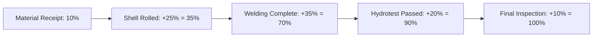
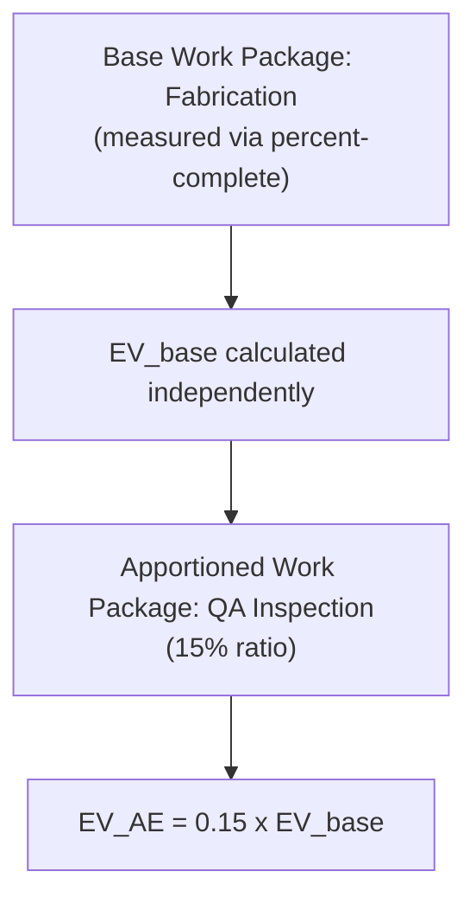
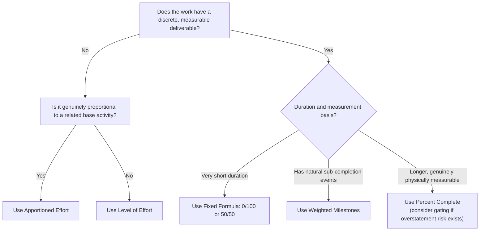

## Methods of Earning Value

### Overview

An earning methodology (also called an earned value technique, EVT) is the formally assigned rule by which a work package converts physical or temporal progress into a calculated Earned Value (EV) figure. While the previous topic introduced 0/100, 50/50, percent-complete, weighted milestones, and Level of Effort as practical examples, this topic provides the comprehensive, standards-level treatment of the full family of earning techniques recognized in EVM practice — including fixed formula methods, milestone-based methods, percent-complete methods, Level of Effort, and Apportioned Effort — along with the selection criteria and governance considerations that determine which technique is appropriate for a given work package.

### Why the Choice of Earning Methodology Matters

**Key Points**

- The earning methodology is the mechanism that converts a work package's physical reality into a dollar-denominated Earned Value figure comparable against Planned Value and Actual Cost — an inappropriate methodology can make a work package appear ahead of, behind, or exactly on schedule regardless of true physical status, undermining every downstream EVM calculation for that work package.
- ANSI/EIA-748 Guideline 10 (Planning, Scheduling, and Budgeting category) requires that objective, quantifiable indicators be used to measure physical progress — the earning methodology is the specific implementation of this requirement at the work package level.
- Selecting a methodology involves a fundamental trade-off between **administrative simplicity**, **interim visibility** (how much granularity of progress is revealed between start and finish), and **objectivity/subjectivity risk** (how resistant the method is to biased or inflated self-reporting).

### Family 1: Fixed Formula Methods

**Key Points**

- Fixed formula methods assign a predetermined, fixed percentage of the work package's budget as EV at defined trigger points (start and/or finish), independent of any interim physical measurement — this family includes 0/100, 50/50, and less common variants such as 25/75 or 20/80.
- **0/100**: Zero credit until the work package is fully complete, at which point 100% of budget is earned in a single step. Maximizes objectivity (no ambiguity about partial credit) but provides no interim visibility — the most conservative fixed formula variant.
- **50/50**: 50% of budget earned at work package start, remaining 50% earned at completion. Provides one interim data point while retaining most of the objectivity of 0/100, since neither trigger point requires subjective judgment about the degree of completion.
- **25/75, 20/80, and other splits**: Adjust the ratio between the start-trigger credit and completion-trigger credit to better reflect a work package's actual effort distribution (e.g., a work package that is heavily back-loaded in effort might use 20/80 to avoid overstating early progress).
- Fixed formula methods are best suited to short-duration work packages (typically within one to two reporting periods) where the administrative cost of finer-grained measurement would exceed its decision-useful value.

$$EV_{0/100} = \begin{cases} 0 & \text{if incomplete} \\ BAC_{WP} & \text{if complete} \end{cases} \qquad EV_{50/50} = \begin{cases} 0.5 \times BAC_{WP} & \text{at start} \\ 1.0 \times BAC_{WP} & \text{at completion} \end{cases}$$

### Family 2: Milestone-Based Methods

#### Weighted Milestones

**Key Points**

- The work package is subdivided into a sequence of discrete, objectively verifiable milestones, each assigned a specific weighted percentage of the total work package budget (weights summing to 100%) — EV accrues incrementally as each milestone is achieved.
- Distinct from fixed formula methods in that the number and weighting of interim measurement points is tailored to the specific work package rather than fixed at a standard split — appropriate when the work has natural, identifiable sub-completion points that are more numerous or unevenly distributed than a simple 50/50 split would capture.
- Milestone weights should reflect genuine relative effort or value, not simply be divided evenly by count — assigning weights without a defensible basis reintroduces subjectivity at the planning stage even though execution-stage measurement (milestone achieved or not achieved) remains objective.

**Example**

A "Vessel Fabrication" work package uses weighted milestones: "Material Receipt" (10%), "Shell Rolled" (25%), "Welding Complete" (35%), "Hydrotest Passed" (20%), "Final Inspection Accepted" (10%). Each milestone is a binary, verifiable event (achieved or not achieved) — EV accrues in discrete steps as each is confirmed, providing five interim data points across the work package's duration without relying on any continuous or subjective measurement.

### Family 3: Percent-Complete Methods

#### Percent Complete (Physical Measurement)

**Key Points**

- EV is calculated continuously as the work package's total budget multiplied by a physically measured percent-complete figure, ideally derived from an objective, countable unit of production (linear feet, cubic yards, drawing counts, test cases passed).
- Provides the finest-grained interim visibility of any earning methodology, since progress can, in principle, be measured at any point during execution rather than only at discrete trigger or milestone points — but this benefit is entirely contingent on the underlying measurement being genuinely objective rather than a disguised subjective estimate.

$$EV = BAC_{WP} \times \frac{Units_{completed}}{Units_{total}}$$

#### Percent Complete with Milestone Gates

**Key Points**

- A hybrid variant combining continuous percent-complete measurement with defined milestone "caps" or "gates" that limit how much credit can be claimed before an objective checkpoint is passed — for example, capping claimed percent-complete at 80% until a formal quality inspection milestone is achieved, with the remaining 20% released only at that gate.
- This variant is used specifically to counteract the risk of percent-complete overstatement (a natural tendency to claim steady, optimistic progress even when actual production has stalled) by anchoring credit release to periodic objective verification rather than allowing continuous self-reported estimates to accumulate unchecked between verification points.

### Family 4: Level of Effort (LOE)

**Key Points**

- LOE credits Earned Value purely as a function of elapsed time at the planned rate — EV is set equal to PV for every reporting period, regardless of actual work accomplished, because the underlying activity (typically program management, administrative support, ongoing safety oversight, or similar support functions) has no discrete, individually measurable deliverable against which physical progress could be assessed.
- Because $EV_{LOE} \equiv PV_{LOE}$ by construction, LOE work packages contribute **zero Schedule Variance** by definition ($SV = EV - PV = 0$ always) — this is not a sign of genuine schedule performance, but a structural artifact of the methodology itself.
- LOE is appropriate *only* for work genuinely lacking a discrete, measurable output — using LOE for work that does have a measurable deliverable (simply because it is administratively convenient) eliminates schedule variance visibility that a proper methodology would otherwise reveal, and is a recognized misuse pattern that undermines EVM's diagnostic value.
- Because of this risk, ANSI/EIA-748 implementation guidance typically encourages limiting LOE to a defined, minority percentage of total project budget, and treats a disproportionately high LOE percentage as a flag warranting review of whether work has been appropriately classified.

$$EV_{LOE}(t) = PV_{LOE}(t) \quad \text{for all } t \implies SV_{LOE} = 0 \text{ always}$$

### Family 5: Apportioned Effort (AE)

**Key Points**

- Apportioned Effort applies to work that is directly and proportionally dependent on a related, separately measured "base" work package — rather than being measured independently, the apportioned effort work package earns value as a fixed percentage of whatever EV is earned by its base activity.
- The canonical example is **quality inspection** or **quality assurance** effort tied directly to a production activity: if QA effort is planned at, say, 15% of the labor associated with a fabrication work package, the QA work package earns 15% of whatever EV the fabrication work package earns in each period — as fabrication progresses faster or slower than planned, QA's earned value moves proportionally with it.
- This distinguishes Apportioned Effort from LOE: AE work packages *do* reflect genuine schedule variance, because their earned value is tied to the demonstrated performance of a related, independently and objectively measured base activity — they are not measured directly, but they are not time-based either; they are performance-linked by proxy.
- AE is appropriate specifically when a support activity's effort genuinely scales with a related activity's progress in a fixed, well-established ratio (inspection effort scaling with production, certain engineering support scaling with design activity) — misapplying AE to a support activity whose actual effort does not genuinely track the base activity's pace produces the same kind of distorted variance signal that LOE misuse produces.

$$EV_{AE} = k \times EV_{base}$$

Where $k$ is the fixed apportionment ratio (e.g., 0.15 for a 15% QA apportionment) and $EV_{base}$ is the Earned Value calculated independently for the base work package using its own (typically percent-complete or milestone-based) earning methodology.

### Comprehensive Comparison Table

| Method | Interim Granularity | Reflects Genuine Schedule Variance | Subjectivity Risk | Typical Use Case |
| --- | --- | --- | --- | --- |
| Fixed Formula (0/100) | None (step at finish) | Yes | Very low | Short discrete tasks |
| Fixed Formula (50/50) | One point (start) | Yes | Very low | Short-to-medium tasks |
| Weighted Milestones | Several defined points | Yes | Low, if milestones are genuinely verifiable | Work with natural sub-completion events |
| Percent Complete | Continuous | Yes | Moderate-to-high, depends on measurement basis | Longer, physically measurable work |
| Percent Complete w/ Gates | Continuous, capped | Yes | Moderate, reduced by gating | Work at risk of overstatement |
| Level of Effort (LOE) | Continuous but meaningless | **No — always SV=0** | Low risk of misstatement, but structurally uninformative | Support work with no discrete deliverable |
| Apportioned Effort (AE) | Tracks base activity | Yes, via proxy to base | Low, if ratio is well-established | Support work proportional to a measured base activity |

### Selection Decision Framework

### Example: Mixed Methodology Across a Program

**Example**

A shipbuilding program applies five different earning methodologies within a single control account structure: "Steel Cutting" uses 0/100 (short, binary tasks per plate batch); "Hull Assembly" uses percent-complete measured by tonnage welded against total planned tonnage; "Outfitting Milestones" uses weighted milestones tied to system installation checkpoints; "Quality Inspection" uses Apportioned Effort at a fixed 12% ratio against the Hull Assembly base activity, since inspection labor is contractually and historically proportional to assembly progress; and "Program Management Office Support" uses Level of Effort, since PMO oversight has no discrete deliverable of its own. This mix illustrates the general principle underlying methodology selection: each technique is matched to the genuine measurability and structural relationship of its specific work, rather than a single method being applied uniformly across the program.

### Governance and Consistency Requirements

**Key Points**

- Earning methodology assignment is made during Performance Measurement Baseline development and documented within each work package's Control Account Plan — it is not a decision left to informal interpretation during execution, since inconsistent or opportunistically shifting methodology application undermines the comparability of EVM data across reporting periods.
- Changing a work package's earning methodology after the baseline has been locked requires formal change control, precisely because doing so can materially alter reported EV without any actual change in physical progress — an uncontrolled methodology change is a recognized mechanism for artificially manipulating reported performance.
- Percent-complete and weighted-milestone methods, being more susceptible to interpretation than fixed formula methods, typically warrant periodic independent verification (surveillance reviews, physical audits of claimed quantities) to confirm that reported progress genuinely reflects the underlying physical reality.

### Limitations

**Key Points**

- No earning methodology can compensate for an inaccurate underlying budget or duration estimate — the methodology governs how progress *within* a correctly estimated work package is measured, not whether the original estimate itself was sound.
- Percent-complete and Apportioned Effort methods both depend on the reliability of an underlying measurement or base-activity relationship; if that foundation is flawed (inaccurate quantity surveys, a genuinely mismatched apportionment ratio that no longer reflects actual effort proportionality), the resulting EV figures will be precise-looking but substantively misleading.
- [Inference] Programs with a disproportionately high combined percentage of LOE and loosely verified percent-complete work packages are generally considered to carry reduced overall EVM diagnostic reliability relative to programs favoring more objectively verifiable methods, though no single universally standardized threshold defines when this proportion becomes a material concern — this remains a program-specific governance judgment.

### **Related Topics**

- Control account plans and work packages
- Performance Measurement Baseline development
- Integrating the WBS with control accounts
- Cost Performance Index (CPI) and Schedule Performance Index (SPI)
- Baseline change control and configuration management in EVM
- Rolling wave planning and planning package conversion
- Overview of EVM guiding standards
- DCMA 14-point schedule assessment (activity duration and measurability guidance)