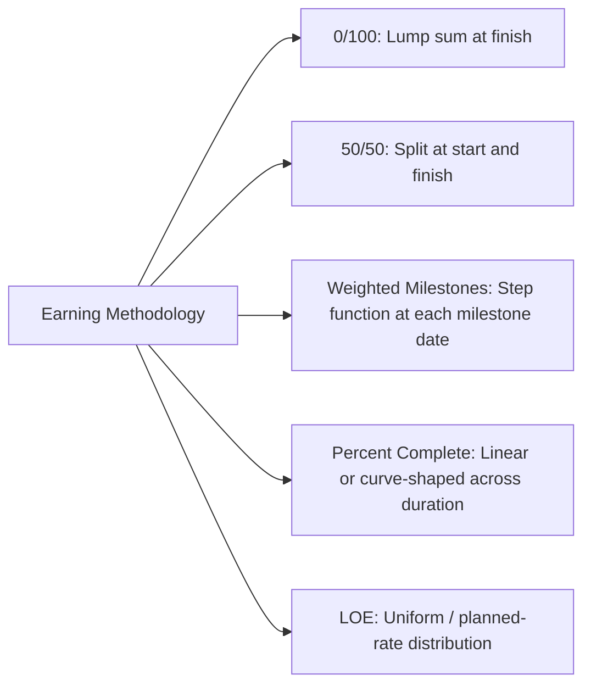
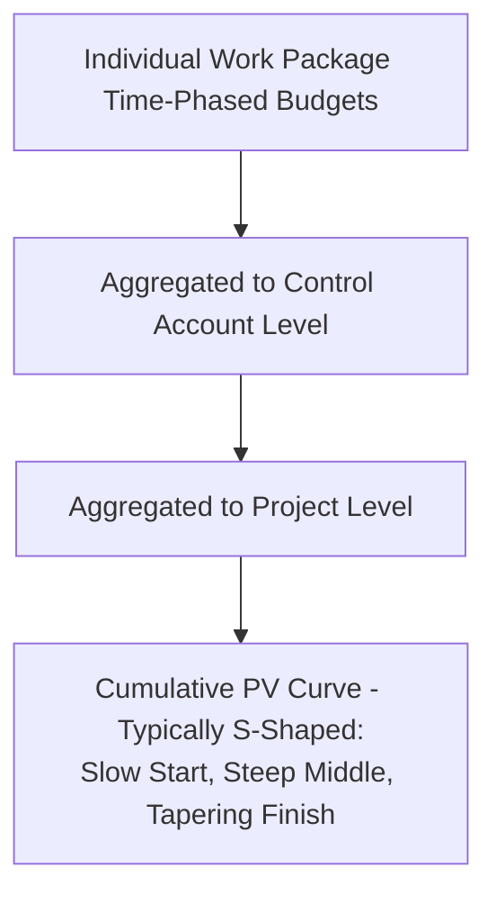

## Time Phasing the Budget

### Overview

Time phasing the budget is the process of distributing each work package's total budget across its scheduled duration in a pattern that reflects when the value of that work is actually expected to be accomplished — not merely when money will be spent, but when *earned value* would be reasonably claimed if progress proceeds exactly as planned. This time-phased distribution, aggregated across all work packages and control accounts, produces the cumulative Planned Value (PV) curve that forms the spine of the Performance Measurement Baseline. Time phasing is the step that converts a static, undated budget allocation into a dynamic, date-driven baseline capable of supporting Schedule Variance and Schedule Performance Index calculation.

### Why Time Phasing Is Structurally Necessary

**Key Points**

- A budget figure alone (e.g., "$200,000 for Rebar and Formwork") tells you *how much* will be spent but nothing about *when* — without time phasing, there is no basis for calculating Planned Value at any specific point in the project timeline, and therefore no basis for Schedule Variance ($SV = EV - PV$) or Schedule Performance Index ($SPI = EV / PV$).
- Time phasing is what distinguishes EVM's Planned Value from a simple total budget figure: PV is inherently a function of time, $PV(t)$, representing the cumulative value of work that *should* have been accomplished by date $t$ according to the baseline plan.
- Because time-phased budget distribution is derived directly from the CPM schedule (each work package's start date, finish date, and internal timing), time phasing is the specific mechanism through which schedule quality (covered extensively in the earlier chapter on schedule quality assessment) directly determines the reliability of the cost-side EVM baseline — a poorly sequenced or logic-defective schedule produces a distorted PV curve even when the underlying dollar totals are correct.

$$PV(t) = \sum_{i} \left[ \text{time-phased budget of work package } i \text{ accumulated through date } t \right]$$

### The Relationship Between Time Phasing and Earning Methodology

**Key Points**

- The shape of a work package's time-phased budget distribution should be consistent with — and is often directly derived from — its assigned earning methodology, since Planned Value at any point represents the value that *would* be earned if the work package were exactly on plan at that point.
- A work package using **0/100** earning is typically time-phased as a single lump-sum value placed at its planned finish date — since no partial credit exists in the earning rule, there is no logical basis for spreading its PV smoothly across the duration; PV should jump at the same point EV would jump upon actual completion.
- A work package using **50/50** earning is time-phased with half its budget placed at the planned start date and the remaining half at the planned finish date, mirroring the two-point structure of the earning rule itself.
- A work package using **percent-complete** with a genuinely linear expected progress rate (e.g., steady-rate production such as consistent linear-feet-per-day installation) is commonly time-phased as a straight-line distribution across its duration — but where progress is realistically expected to be non-linear (slow start, faster middle, tapering finish — a common real-world pattern), the time-phased distribution should reflect that expected curve rather than defaulting to a flat straight-line assumption.
- **Weighted milestones** are time-phased by placing each milestone's budget weight at that milestone's planned achievement date within the schedule, producing a step-function PV curve mirroring the step-function EV pattern the methodology will later produce during execution.
- **Level of Effort** is time-phased simply as a uniform or planned-rate distribution across its duration, consistent with its time-based (rather than accomplishment-based) earning rule.

### Time-Phasing Patterns

#### Linear (Straight-Line) Distribution

**Key Points**

- Budget is spread evenly across the work package's duration — the simplest pattern to compute, appropriate when the work genuinely proceeds at a constant rate (e.g., steady-rate production of identical units with consistent daily output).
- Overused as a default assumption in practice: applying linear time-phasing to work with a genuinely non-linear effort profile (heavy startup mobilization, tapering demobilization) produces a PV curve that does not reflect realistic expected performance, creating artificial schedule variance signals even when actual execution proceeds exactly as a realistic planner would have expected.

#### Front-Loaded or Back-Loaded Distribution

**Key Points**

- Front-loaded distributions concentrate more planned value earlier in the work package's duration — appropriate for work with heavy initial effort (mobilization, procurement commitment, design front-loading) that tapers as the work package approaches completion.
- Back-loaded distributions concentrate more planned value later in the duration — appropriate for work where meaningful physical progress genuinely accelerates toward completion (e.g., final assembly and integration activities where most measurable value is realized only once component pieces come together near the end).
- The specific shape should be derived from a defensible basis (historical productivity curves, engineering judgment about the nature of the work, resource loading profiles) rather than selected arbitrarily — an unjustified shape choice undermines the same auditability principle that governs PMB development generally.

#### S-Curve Distribution (Project or Control Account Level)

**Key Points**

- At the aggregate level — a full control account or the entire project — the cumulative PV curve typically takes an "S" shape: a slow ramp-up at the start (few work packages active, lower cumulative spend rate), a steep middle section (peak concurrent activity and spend rate), and a tapering tail toward completion (fewer remaining work packages, wind-down activities).
- This S-curve shape emerges naturally from the aggregation of many individual work packages' time-phased distributions across a realistically sequenced schedule — it is not typically imposed directly at the aggregate level but is a natural consequence of correct work-package-level time phasing combined with realistic schedule logic (parallel work ramping up, converging toward milestones, then tapering).
- A PMB whose aggregate PV curve does *not* resemble a plausible S-curve (e.g., an unnaturally straight line, or an implausible early spike) is often a diagnostic signal of underlying time-phasing problems at the work package level — worth investigating during PMB validation before the baseline is locked.

### Mechanics of Deriving Time Phasing from the CPM Schedule

**Key Points**

- Each work package's schedule dates (early start, early finish, or the planned/baseline dates if using a status-date-relative schedule) define the time window across which its budget will be distributed — this is the direct structural link between the CPM schedule and the cost-side PMB.
- For work packages spanning multiple reporting periods (weekly, monthly, whichever cadence the program uses for status), the total budget must be allocated across each individual period according to the chosen distribution pattern, producing a period-by-period planned value table that sums correctly to the work package's total budget.
- Scheduling software (Primavera P6, MS Project) combined with cost-loading functionality, or dedicated EVM/cost-engineering tools, typically automate this period-by-period allocation once resource or cost assignments and a distribution curve type are specified at the activity level — manual time-phasing across a schedule of any significant size is generally impractical to sustain accurately over multiple update cycles.

### Example: Time-Phasing a Single Work Package

**Example**

A "Conduit Installation" work package has a total budget of $140,000, an 8-week planned duration, and is assigned percent-complete earning based on linear-foot installation. Historical productivity data for this type of work shows a realistic ramp-up during the first two weeks (crew mobilization, initial access constraints) followed by steady-state production for weeks three through seven, then a taper in week eight (final closeout, punch-list items). Rather than defaulting to an even $17,500-per-week linear spread, the time-phased distribution is built as: Week 1 – $7,000 (5%), Week 2 – $14,000 (10%), Weeks 3–7 – $16,800 per week (12% each, totaling 60%), Week 8 – $35,000 (25%, reflecting concentrated closeout activity). This non-linear time-phased curve, summing to the full $140,000, provides a more realistic Planned Value baseline against which actual weekly progress can be meaningfully compared than a naive straight-line assumption would.

### Common Time-Phasing Errors

**Key Points**

- **Default linear assumption applied universally**: using straight-line time phasing for every work package regardless of the actual expected effort profile, producing systematically inaccurate PV curves for any work package whose real progress pattern is genuinely non-linear.
- **Time phasing disconnected from the earning methodology**: distributing budget in a pattern inconsistent with how EV will actually be measured (e.g., linearly spreading a 0/100-earned work package's budget across its duration, when the earning rule itself provides zero credit until completion) — creating an artificial mismatch where PV accrues smoothly while EV will jump abruptly, guaranteeing a misleading SV signal even under perfectly on-plan execution.
- **Time phasing derived independently of the CPM schedule**: manually estimating a spending curve without genuinely tying it to the schedule's actual activity dates and logic, breaking the structural link between schedule and cost that gives EVM its integrated value.
- **Failure to update time phasing following approved schedule changes**: when a work package's schedule dates shift due to an approved baseline change, failing to correspondingly re-time-phase its budget leaves the PMB internally inconsistent between its schedule and cost dimensions.

### Time Phasing and Baseline Change Control

**Key Points**

- Because time phasing directly determines the PV curve against which all schedule-side EVM performance is measured, any change to a work package's time-phased distribution — whether due to a schedule shift, a re-sequencing, or a revised distribution-curve judgment — is subject to the same formal baseline change control discipline as any other PMB modification.
- Re-time-phasing without a documented, approved change (sometimes informally used to "smooth over" an unfavorable variance by silently redistributing remaining budget) is a recognized governance failure mode, directly analogous to the earning-methodology manipulation risk discussed previously — both undermine the integrity of variance analysis by altering the yardstick rather than genuinely correcting the underlying plan.

### Limitations

**Key Points**

- Time phasing can only be as accurate as the underlying schedule logic and duration estimates it is derived from — a structurally sound but substantively unrealistic schedule (accurate logic, unrealistic durations) will still produce a time-phased PV curve that looks internally consistent while poorly reflecting genuine expected performance.
- Selecting a defensible non-linear distribution shape (front-loaded, back-loaded, or a specific historical productivity curve) requires either historical performance data or credible engineering judgment; in the absence of either, organizations often default to linear distribution as a practical compromise, accepting some resulting inaccuracy in exchange for administrative simplicity. [Inference] The degree to which this trade-off materially affects the reliability of resulting SV/SPI figures likely scales with how far a work package's true effort profile diverges from linear, though this is a general pattern rather than a precisely quantified relationship applicable uniformly across all work types.
- Time-phasing granularity is bounded by the program's reporting period cadence — a monthly reporting cycle cannot reveal within-month timing variance regardless of how precisely the underlying distribution curve is theoretically modeled.

### **Related Topics**

- Performance Measurement Baseline development
- Methods of earning value (fixed formula, percent complete, milestone, LOE, apportioned effort)
- Control account plans and work packages
- Schedule Variance (SV) and Schedule Performance Index (SPI) calculation
- DCMA 14-point schedule assessment (schedule quality dependency)
- Baseline change control and configuration management in EVM
- Integrated Baseline Review (IBR) process
- Resource loading and cost-loading techniques in CPM scheduling software