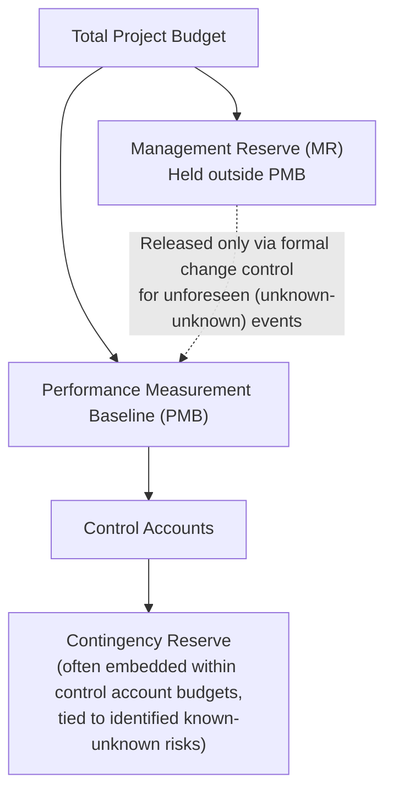
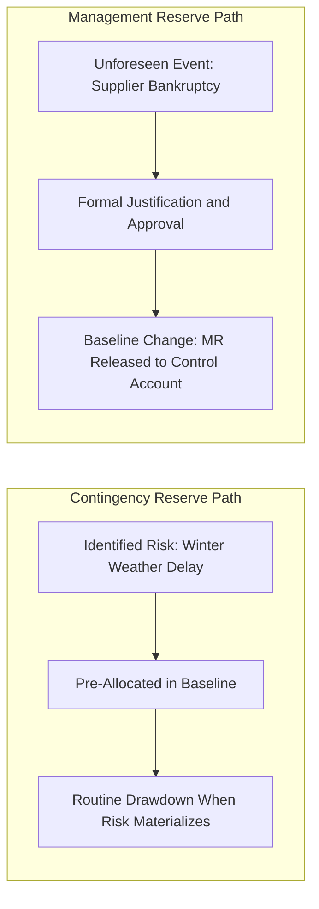

## Management Reserve Versus Contingency Reserve

### Overview

Management reserve and contingency reserve are both budget set-asides intended to absorb risk and uncertainty, but they differ fundamentally in what type of risk they cover, who controls their release, and how they relate to the Performance Measurement Baseline. Confusing the two — or worse, treating them as interchangeable — is a common source of governance failure in EVM implementations, since each carries distinct approval authority, budgetary placement, and reporting treatment. This topic distinguishes the two reserves precisely and explains how each interacts with the PMB, control accounts, and formal change control.

### The Fundamental Distinction

**Key Points**

- **Contingency reserve** covers **known-unknowns** — identified risks with quantifiable probability and impact, typically derived from a documented risk register or a schedule/cost risk analysis (e.g., Monte Carlo simulation). Because the risks are identified in advance, contingency reserve can be allocated to the specific control accounts or work packages most exposed to those risks, and in mature implementations is often included *within* the Performance Measurement Baseline itself.
- **Management reserve (MR)** covers **unknown-unknowns** — risks that were not and could not reasonably have been identified during baseline planning. Because these risks are, by definition, not tied to any specific scope element in advance, management reserve is held **outside** the PMB, under the control of the project manager or program sponsor, and is not time-phased or allocated to any control account until a specific unforeseen event requires its release.
- This distinction directly parallels the "schedule margin" concept covered earlier in this material (Schedule Margin and Contingency Review): schedule margin sized via risk-register-driven methods most closely parallels contingency reserve's known-risk basis, while an unallocated project-level schedule buffer for unforeseen events parallels management reserve's unknown-risk basis — though schedule margin/reserve and cost-side MR/contingency reserve are governed as related but distinct disciplines.

### Contingency Reserve in Detail

**Key Points**

- Sized through a documented, defensible methodology — commonly derived from a project risk register (probability × impact for each identified risk, aggregated with appropriate correlation treatment), or from quantitative schedule/cost risk analysis such as Monte Carlo simulation targeting a specific confidence level (e.g., P70 or P80).
- Because contingency reserve is tied to specific, identified risks associated with specific scope elements, it can be — and in many mature EVM implementations is — allocated directly to the relevant control accounts and included within the baselined PMB, time-phased alongside the rest of that control account's budget.
- Some organizations instead hold contingency reserve at a project level, undistributed to specific control accounts but still counted within the PMB and still governed by less restrictive release authority than management reserve (since the risks it addresses were already anticipated during planning, its release is a more routine, lower-friction event than an MR release).
- Release or consumption of contingency reserve, when a known risk materializes as anticipated, is typically a more routine event than a management reserve release, since the risk and its budgetary provision were both identified and approved during original baseline planning — the "surprise" element that characterizes MR release is largely absent.

### Management Reserve in Detail

**Key Points**

- Explicitly excluded from the Performance Measurement Baseline, meaning it is not time-phased, not distributed to control accounts, and not reflected in the Planned Value curve — a control account or work package cannot draw on management reserve without a formal budget transfer.
- Held under the direct control of the project manager or a designated program authority (not individual Control Account Managers), reflecting management reserve's purpose as a program-level, not control-account-level, risk buffer.
- Release of management reserve into the PMB is a **formal baseline change control event**: it requires documented justification (typically describing the specific unforeseen circumstance requiring it), approval by the appropriate authority, and results in a corresponding increase to the receiving control account's budget along with associated re-time-phasing.
- Once released into a control account, the funds become part of that control account's budget and are subject to the same PMB governance, time-phasing, and earning-methodology discipline as any other budget within the baseline — management reserve does not retain any special status once formally transferred.
- ANSI/EIA-748 Guideline 8 (Planning, Scheduling, and Budgeting category) explicitly requires that management reserve be identified separately and that its use be documented and controlled — this is not merely good practice but a formal compliance requirement under the governing standard.

### Comparison Table

| Dimension | Contingency Reserve | Management Reserve |
| --- | --- | --- |
| Covers | Known-unknowns (identified risks) | Unknown-unknowns (unforeseen risks) |
| Basis for sizing | Risk register, Monte Carlo simulation, documented risk analysis | Organizational policy or judgment (often a percentage of BAC) |
| Location relative to PMB | Often included within the PMB, allocated to specific control accounts | Held outside the PMB entirely |
| Time-phased | Yes, when allocated to a control account | No — undistributed until formally released |
| Controlled by | Control Account Manager (once allocated) or project-level risk owner | Project Manager / Program Sponsor |
| Release mechanism | Routine consumption as anticipated risk materializes | Formal baseline change control transaction |
| Reflected in BAC | Yes, as part of the PMB total | Typically tracked separately from PMB-based BAC, though included in total authorized project budget |
| ANSI/EIA-748 treatment | Governed as part of standard PMB budgeting guidelines | Explicitly required to be separately identified (Guideline 8) |

### How Reserves Interact with the Total Project Budget

**Key Points**

- The total authorized project or contract budget is generally structured as: $Total\ Budget = PMB + Management\ Reserve$, where the PMB itself may already contain allocated contingency reserve within its control account budgets.
- This layered structure means a single project can have three distinct "budget" figures in play at once: the **Budget at Completion (BAC)**, typically referring to the PMB total (which may include embedded contingency); the **Total Allocated Budget (TAB)**, sometimes used to describe BAC plus management reserve together; and the **Contract Budget Base (CBB)** on contractual programs, which may include additional authorized-but-unpriced work or fee/profit considerations depending on contract structure.
- [Inference] The precise terminology and layering (BAC vs. TAB vs. CBB) varies somewhat by governing standard, industry, and specific contract type; practitioners should confirm the specific definitions in use on a given program rather than assuming universal consistency across all EVM implementations, since this is an area where terminology conventions are not perfectly uniform across ANSI/EIA-748, PMI practice standards, and various federal agency implementation guides.

$$Total\ Authorized\ Budget = PMB_{total} + MR = \left(\sum CA_i\right) + MR$$

### Example: Distinguishing a Contingency Release from an MR Release

**Example**

A construction project's risk register identifies "weather delays during the winter concrete pour window" as a known risk with an estimated schedule and cost impact; contingency reserve of $45,000 is pre-allocated to the "Foundation Works" control account specifically to cover this anticipated risk, and is included within the baselined PMB. When winter weather does cause the anticipated delay, the CAM draws on this pre-allocated contingency as a routine, already-approved budget consumption — no new baseline change transaction is required, since the risk and its provision were already planned for. Later in the same project, an unrelated and entirely unforeseen event occurs: a supplier's sudden bankruptcy forces emergency re-procurement of a critical component at a significantly higher cost, a risk that did not appear on the original risk register. Because this is a genuine unknown-unknown, the project manager formally requests release of $80,000 from management reserve, documents the justification, obtains sponsor approval, and only then transfers the funds into the affected control account's budget through a formal baseline change — a materially different governance path than the routine contingency drawdown.

### Common Governance Pitfalls

**Key Points**

- **Using management reserve to cover known, poorly estimated risks**: MR is intended for genuine unknown-unknowns; routinely drawing on it to cover risks that were actually foreseeable but simply under-budgeted at baseline (a contingency-reserve failure, not an MR-appropriate event) masks poor original estimating and erodes MR's availability for genuine emergencies.
- **Embedding contingency inside individual work package budgets without visibility**: burying risk-driven padding directly into a work package's budget (rather than tracking it as identified, separately visible contingency) removes the auditability that makes contingency reserve a defensible, trackable governance tool — echoing the same "hidden padding" anti-pattern flagged in the earlier discussion of schedule margin and lag audits.
- **Releasing management reserve without formal change control**: informally allowing a CAM to draw on MR without documented justification and approval undermines the separation of authority that gives MR its governance value, and can obscure the true frequency and magnitude of genuinely unforeseen risk events on the program.
- **Sizing management reserve as an arbitrary flat percentage without revisiting it**: setting MR once at project initiation (e.g., a standard 5% of BAC) without connecting that sizing to any actual risk exposure assessment, and never re-evaluating it as the project's risk profile evolves — reducing MR to an unexamined buffer rather than a genuinely risk-informed reserve.

### Reporting and Variance Analysis Implications

**Key Points**

- Because management reserve sits outside the PMB, it is **not** reflected in Planned Value and therefore does not directly affect Cost Variance, Schedule Variance, CPI, or SPI calculations until and unless it is formally released into a control account — at which point it becomes ordinary baselined budget subject to normal variance analysis.
- Contingency reserve embedded within the PMB, by contrast, is included in the relevant control account's PV from the outset — meaning its planned consumption (or lack thereof) already factors into that control account's baseline and resulting variance calculations, even before any specific risk event occurs.
- Tracking the remaining, unconsumed balance of both reserves over time — analogous to the schedule margin erosion tracking discussed earlier in this material — provides program leadership with a leading indicator of overall risk exposure: a management reserve balance depleting faster than the program's remaining duration would suggest is a signal warranting formal risk reassessment, independent of what the PMB-based CPI/SPI figures show at any given moment.

### Limitations

**Key Points**

- Distinguishing a "genuinely unforeseen" risk from a "poorly estimated known risk" after the fact is not always unambiguous — the classification depends on the quality and completeness of the original risk register and estimating basis, and disputes about which reserve should properly cover a given cost growth event are a recognized point of friction, particularly in contractual settings where reserve classification can have financial consequences for the parties involved.
- [Unverified] There is no single universally standardized sizing formula for management reserve analogous to the risk-register-driven or Monte Carlo-based methods commonly used for contingency reserve — MR sizing in practice is often informed by organizational policy, historical experience, or negotiated contractual provisions, and the degree of rigor applied varies considerably across organizations and contract types.
- Both reserves depend on the quality of the underlying risk identification process; a project with an incomplete or superficial risk register will tend to misclassify genuinely foreseeable risks as "unforeseen" MR-appropriate events after the fact, regardless of how well the reserve governance structure itself is designed.

### **Related Topics**

- Performance Measurement Baseline development
- Schedule margin and contingency review
- Baseline change control and configuration management in EVM
- Time phasing the budget
- Control account plans and work packages
- Overview of EVM guiding standards
- Schedule Risk Analysis (SRA) and Monte Carlo simulation methodology
- Integrated Baseline Review (IBR) process