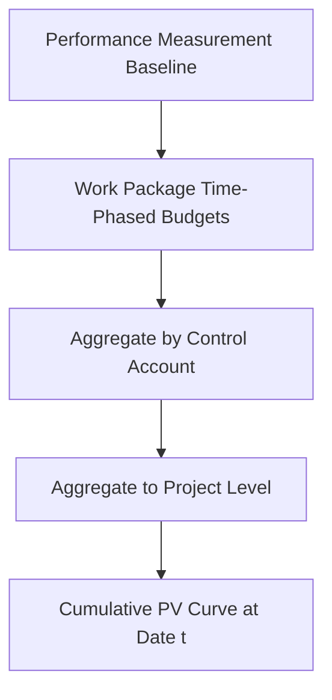

## Planned Value

### Overview

Planned Value (PV), formerly termed Budgeted Cost of Work Scheduled (BCWS) under the original C/SCSC terminology, is the authorized, time-phased budget assigned to scheduled work as of a specific point in time. It answers a single, precise question: *according to the baseline plan, how much value should have been produced by this date?* PV is not a measure of actual performance at all — it is purely a statement of the plan, read at a given date. Every other core EVM metric (Earned Value, Cost Variance, Schedule Variance, and their derived indices) is calculated relative to this planned reference point, making PV the foundational building block of the entire EVM measurement system.

### Formal Definition

**Key Points**

- Planned Value at a given date $t$ is the cumulative sum of the time-phased budget for all work scheduled to be accomplished up to and including that date, drawn directly from the Performance Measurement Baseline.
- PV is entirely a function of the baseline plan — it does not change based on what has actually happened during execution. It changes only when the baseline itself is formally revised through approved change control.
- The total PV across the entire project duration, at the project's planned finish date, equals the Budget at Completion (BAC) — PV at project completion and BAC are, by definition, the same figure.

$$PV(t) = \sum_{i=1}^{n} \left[ \text{time-phased budget of work package}_i \text{ scheduled through date } t \right]$$

$$PV(T_{finish}) = BAC$$

### PV's Relationship to the PMB and Time Phasing

**Key Points**

- PV is the direct output of the time-phasing process described earlier in this material: once each work package's budget has been distributed across its scheduled duration according to an appropriate pattern (linear, front-loaded, back-loaded, milestone-based, or matched to its earning methodology), the cumulative sum of those distributions at any date *is* PV at that date.
- Because time phasing is built from the CPM schedule's activity dates and logic, PV inherits the structural integrity (or defects) of the underlying schedule directly — a schedule with dangling activities, excessive constraints, or unrealistic durations produces a PV curve that does not genuinely reflect achievable planned progress, even if the total dollar figures reconcile correctly to BAC.
- PV, aggregated across a full project or control account, typically forms an S-curve shape: a slower ramp-up at the start (fewer concurrent work packages active), a steeper middle section (peak planned activity), and a tapering finish — this shape emerges naturally from realistic schedule logic rather than being imposed directly.

### PV as a Pure Function of the Plan, Not of Execution

**Key Points**

- A common point of confusion for practitioners new to EVM is assuming PV reflects some blend of plan and actual progress — it does not. PV on a given status date is exactly what the baseline said it would be, regardless of whether the project is actually ahead, behind, or exactly on track.
- This purity is precisely what makes PV useful as a comparison anchor: because PV is fixed by the baseline and does not move with actual performance, comparing EV (actual accomplishment, budget-valued) against PV isolates genuine schedule performance rather than conflating it with re-baselined or a posteriori adjusted expectations.
- PV *does* change when the baseline itself is formally revised — an approved scope change, a formally released management reserve allocation added to a control account, or an approved re-baseline following a recovery plan will all alter subsequent PV figures, but only through the disciplined change-control process, never informally.

### Example: Reading PV at a Status Date

**Example**

A control account "Piping Installation" has a total baselined budget of $300,000, planned to run over 12 weeks, time-phased with a front-loaded distribution reflecting expected mobilization intensity: $30,000 in Week 1, $25,000 in Week 2, then $22,000 per week from Weeks 3–12 (summing to $220,000 across those ten weeks, totaling the full $300,000). At the Week 5 status date, PV is calculated as the cumulative sum through Week 5: $30,000 + $25,000 + $22,000 + $22,000 + $22,000 = $121,000. This figure — $121,000 — represents what the baseline plan says *should* have been accomplished by Week 5, entirely independent of what has actually happened on site. Whether the crew has genuinely earned $121,000, $90,000, or $150,000 worth of value by that date is a separate question, answered by Earned Value, not by PV itself.

### PV's Role in Downstream EVM Calculations

**Key Points**

- **Schedule Variance**: $SV = EV - PV$ — PV serves as the baseline reference against which actual accomplishment (EV) is compared to determine whether the project is ahead of or behind its planned schedule position, expressed in dollar (or budgeted-value) terms.
- **Schedule Performance Index**: $SPI = EV / PV$ — a ratio expressing accomplishment efficiency relative to plan; an SPI of 1.0 indicates the project is earning value exactly at the planned rate, values below 1.0 indicate earning value more slowly than planned.
- **To-Complete Performance Index (schedule variant)** and other advanced forecasting metrics also reference PV as the denominator or comparison basis for assessing remaining schedule performance requirements.
- Because PV is purely plan-derived, any variance calculated against it (SV, SPI) is genuinely diagnostic of execution performance — this is the direct payoff of PV's "pure plan" characteristic: it provides an uncontaminated reference point.

### PV Versus the Legacy Terminology (BCWS)

**Key Points**

- Under the original 1967 C/SCSC framework and its immediate successors, this concept was termed **Budgeted Cost of Work Scheduled (BCWS)** — the terminology still appears in some legacy defense-contracting environments and older reference materials, even though "Planned Value" is now the standard term across PMI practice standards, ANSI/EIA-748 modern usage, and ISO 21508.
- $PV$ and $BCWS$ refer to identically calculated and conceptually identical figures — the terminology shift reflects EVM's broader evolution from a defense-acquisition-specific discipline toward a general, cross-industry project management technique, as covered in the earlier discussion of EVM's guiding standards and the transition from C/SCSC.
- Practitioners working across both legacy federal contracting contexts and modern commercial environments should recognize both terms as referring to the same underlying metric.

### Common Misunderstandings About PV

**Key Points**

- **PV is not the same as Actual Cost.** PV represents planned budget for planned work; it has no relationship to what has actually been spent (Actual Cost, AC) — a project can have AC exceed, equal, or fall below PV at any given point, entirely independent of PV's own value.
- **PV is not "percent complete" expressed in dollars.** PV represents planned progress according to the baseline schedule, not actual progress — conflating the two is a common source of confusion for practitioners new to the distinction between planned and earned value.
- **A high PV does not indicate good performance, and a low PV does not indicate poor performance.** PV simply reflects the shape and pacing of the baseline plan itself — a control account with a heavily back-loaded time-phased distribution will show a low PV early in its duration by design, not because of any performance issue.
- **PV changes with baseline revisions, not with reporting period status updates.** Updating a schedule's actual dates and percent-complete figures during a routine status cycle does not change PV; only a formally approved change to the baseline itself changes PV going forward.

### Limitations

**Key Points**

- PV is only as reliable as the underlying Performance Measurement Baseline from which it is derived — inaccurate original budget estimates, poorly chosen time-phasing curves, or schedule logic defects all propagate directly into a PV curve that may look precise while poorly representing genuinely achievable planned progress.
- Because PV is fixed against the original (or most recently approved) baseline, significant unaddressed scope creep or informal work-around changes that never go through formal change control will not be reflected in PV, creating a growing disconnect between the baseline PV curve and the project's actual evolving scope — a discipline problem in baseline change control rather than a flaw in the PV concept itself.
- [Inference] Organizations that allow frequent informal re-baselining to avoid unfavorable schedule variance readings undermine PV's diagnostic value over time, since a PV curve that is continuously adjusted to match whatever is convenient ceases to function as a stable, meaningful reference point — though the frequency and rigor of baseline change control varies considerably by organization and is a governance rather than a calculation issue.

### **Related Topics**

- Time phasing the budget
- Earned Value (EV)
- Schedule Variance (SV) and Schedule Performance Index (SPI)
- Performance Measurement Baseline development
- Methods of earning value (fixed formula, percent complete, milestone, LOE, apportioned effort)
- Actual Cost (AC)
- Budget at Completion (BAC)
- Baseline change control and configuration management in EVM