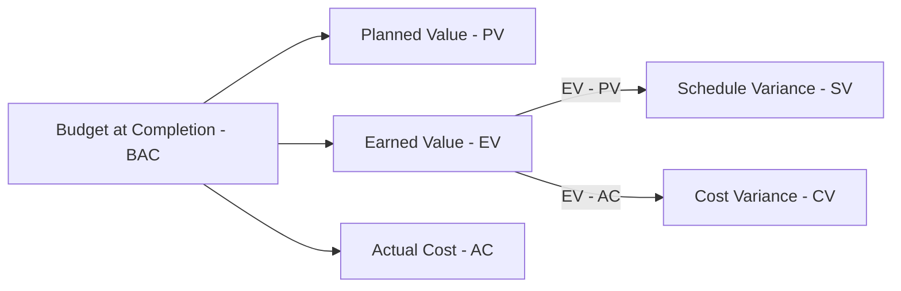

## Earned Value

### Definition

Earned Value (EV), also called the Budgeted Cost of Work Performed (BCWP), is the value of work actually completed, expressed in terms of the budget originally assigned to that work. It measures physical progress in monetary (or labor-hour) terms rather than money spent.

$$EV = \% \text{Complete} \times BAC$$

Where:

- $\% \text{Complete}$ = the proportion of a task or project physically finished
- $BAC$ = Budget at Completion, the total planned budget for the task/project

### Purpose Within EVM

EV is one of the three core data points in Earned Value Management, alongside Planned Value (PV) and Actual Cost (AC). It answers the question: **"What is the value of the work we have actually accomplished so far?"** By itself, PV only tells you what was scheduled, and AC only tells you what was spent — neither reveals whether the money spent produced the intended amount of work. EV bridges that gap.

### Relationship to PV and AC

| Comparison | Formula | Reveals |
| --- | --- | --- |
| EV vs. PV | $SV = EV - PV$ | Schedule performance |
| EV vs. AC | $CV = EV - AC$ | Cost performance |

- If $EV > PV$: project is ahead of schedule
- If $EV < PV$: project is behind schedule
- If $EV > AC$: project is under budget for work performed
- If $EV < AC$: project is over budget for work performed

### Methods of Measuring EV

Since "% complete" is often subjective, several standardized techniques exist to calculate EV consistently:

**1. Fixed Formula (0/100 or 20/80)**

- 0/100: No credit until task is 100% done
- 20/80: 20% credit at task start, 80% at completion
- Best for short-duration tasks where partial credit is hard to justify

**2. Percent Complete (Estimated)**

- Manager estimates completion percentage subjectively
- Simple but prone to bias (e.g., the "90% done" syndrome, where the last 10% takes disproportionately long)

**3. Milestone / Weighted Milestones**

- Task is broken into milestones, each with an assigned weight
- EV is credited when a milestone is achieved
- More objective than pure percent-complete estimation

**4. Units Completed**

- Applicable when work is measured in discrete, uniform units (e.g., meters of pipe laid, lines of code, drawings approved)

$$EV = \left(\frac{\text{Units Completed}}{\text{Total Units}}\right) \times BAC$$

**5. Level of Effort (LOE)**

- Used for tasks without a measurable deliverable (e.g., project management overhead, ongoing support)
- EV is simply credited as time passes, equal to PV — meaning LOE tasks always show zero schedule variance, which can mask real schedule problems elsewhere if overused [Inference — this is a widely cited caution in EVM practice regarding LOE's effect on aggregate schedule metrics]

### Worked Example

A task has a $BAC$ of $50,000 and is scheduled to be 100% complete by the reporting date.

- If the team reports the task is 70% physically complete:

$$EV = 0.70 \times \$50{,}000 = \$35{,}000$$

- Suppose $PV$ at this point (per the baseline schedule) is $50,000, and $AC$ (actual money spent) is $40,000.

$$SV = EV - PV = \$35{,}000 - \$50{,}000 = -\$15{,}000 \quad \text{(behind schedule)}$$

$$CV = EV - AC = \$35{,}000 - \$40{,}000 = -\$5{,}000 \quad \text{(over budget)}$$

Despite spending $40,000, the team only produced $35,000 worth of planned work — indicating inefficiency, not just delay.

### Common Pitfalls

- **Over-reporting % complete**: inflates EV, hiding true performance
- **Using LOE for measurable work**: eliminates the ability to detect schedule slippage
- **Inconsistent measurement method across WBS elements**: makes aggregated EV misleading
- **Ignoring rebaselining effects**: if BAC changes mid-project, historical EV trends must be interpreted with that context in mind

### Visual: EV in Context

### Related Topics

- Planned Value (PV) and its calculation from the schedule baseline
- Actual Cost (AC) and cost accounting integration
- Schedule Variance (SV) and Schedule Performance Index (SPI)
- Cost Variance (CV) and Cost Performance Index (CPI)
- Estimate at Completion (EAC) forecasting methods
- Work Breakdown Structure (WBS) as the basis for EV measurement rules