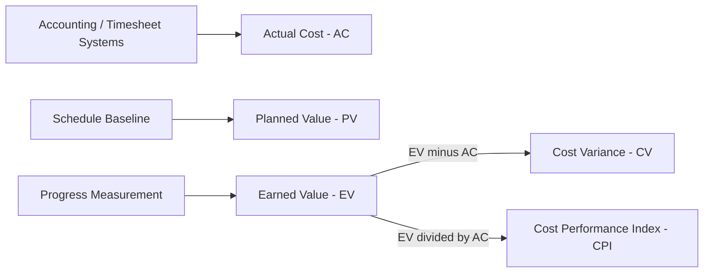

## Actual Cost

### Definition

Actual Cost (AC), also called Actual Cost of Work Performed (ACWP), is the total cost actually incurred for the work performed on a task or project up to a given point in time. It reflects real expenditure — labor, materials, equipment, overhead — regardless of how much work that spending actually accomplished.

$$AC = \sum (\text{Actual Resource Cost} \times \text{Actual Resource Usage})$$

### Purpose Within EVM

AC is the "reality check" metric of Earned Value Management. Where Planned Value (PV) says what should have been spent and Earned Value (EV) says what the completed work is worth, AC says what was actually spent. Comparing AC against EV produces Cost Variance (CV) and Cost Performance Index (CPI) — the primary indicators of cost efficiency.

$$CV = EV - AC$$

$$CPI = \frac{EV}{AC}$$

### Sources of Actual Cost Data

AC is typically pulled from the organization's accounting or timesheet systems rather than estimated, which distinguishes it from PV and EV:

- **Labor costs**: timesheets, payroll systems, resource rate tables
- **Materials**: procurement/invoicing records, purchase orders
- **Equipment**: rental agreements, depreciation allocations, fuel/maintenance logs
- **Overhead**: allocated indirect costs (facilities, administration) per organizational accounting policy
- **Subcontractor costs**: invoices and progress payments

Because AC comes from financial systems, it usually has a reporting lag — costs incurred are sometimes not fully reflected until an accounting period closes, which can create timing mismatches against PV/EV data pulled directly from the schedule. [Inference — this lag is a commonly cited practical limitation in EVM implementations, though its magnitude is organization-dependent]

### Worked Example

A task has a $BAC$ of $50,000. By the reporting date:

- The team has spent $40,000 on labor and materials for this task (this is $AC$)
- The task is 70% physically complete, so $EV = 0.70 \times \$50{,}000 = \$35{,}000$
- The schedule baseline says the task should be 100% done, so $PV = \$50{,}000$

$$CV = EV - AC = \$35{,}000 - \$40{,}000 = -\$5{,}000$$

$$CPI = \frac{EV}{AC} = \frac{35{,}000}{40{,}000} = 0.875$$

A CPI of 0.875 means the project is getting only $0.875 of value for every dollar spent — a cost overrun condition, since CPI < 1.

### AC vs. PV vs. EV — Distinguishing the Three

| Metric | Question Answered | Data Source |
| --- | --- | --- |
| PV | What did we plan to have done by now, in budget terms? | Schedule baseline |
| EV | What is the work we've actually completed worth, in budget terms? | Progress measurement (% complete, milestones, units) |
| AC | What have we actually spent to get here? | Accounting/finance system |

A common conceptual error is confusing AC with PV — assuming that if a project is "on budget" (spending matches the plan), it is also on schedule. AC alone says nothing about schedule or scope progress; it must always be paired with EV to be meaningful.

### Common Pitfalls

- **Comparing AC directly to PV**: this yields no valid EVM insight (spending vs. plan, without regard to work accomplished) and is a frequent misinterpretation for those new to EVM
- **Timing misalignment**: AC reported for a different cutoff date than PV/EV, distorting CV and CPI
- **Omitting indirect/overhead costs**: understates true AC and inflates apparent CPI
- **Currency or unit mismatches**: AC must use the same unit basis (currency, labor-hours) as PV and EV for valid comparison

### Visual: Cost Data Flow

### Related Topics

- Cost Variance (CV) and Cost Performance Index (CPI) interpretation
- Estimate at Completion (EAC) — using AC and CPI to forecast final cost
- Variance at Completion (VAC)
- Integrating accounting systems with EVM tools
- To-Complete Performance Index (TCPI)