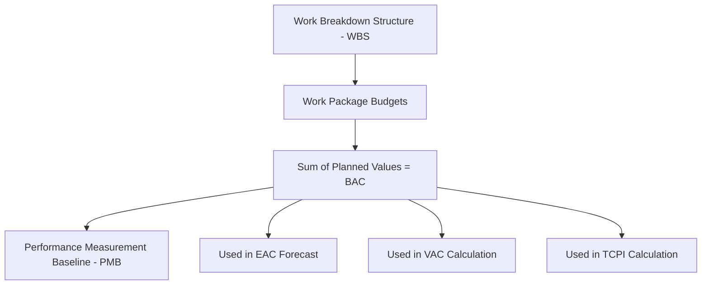

## Budget at Completion

### Definition

Budget at Completion (BAC) is the total planned budget for the entire scope of work — the sum of all Planned Value (PV) across the whole project or task, from start to finish. It represents the authorized cost baseline against which all EVM performance is measured.

$$BAC = \sum_{i=1}^{n} PV_i$$

Where each $PV_i$ is the planned value of a work package or activity at project completion (i.e., the cumulative PV curve reaches BAC at the planned finish date).

### Purpose Within EVM

BAC is the anchor value for nearly every forecasting formula in Earned Value Management. It answers: **"How much did we originally plan to spend to complete all the work?"** Unlike PV, EV, and AC — which are all time-phased (measured "as of" a reporting date) — BAC is a single, fixed total representing the full project baseline.

BAC feeds directly into:

$$EV = \% \text{Complete} \times BAC$$

$$EAC = \frac{BAC}{CPI} \quad \text{(one common forecasting formula)}$$

$$VAC = BAC - EAC$$

$$TCPI = \frac{BAC - EV}{BAC - AC}$$

### Where BAC Comes From

BAC is established during project planning and is derived from:

- **Work Breakdown Structure (WBS)**: the sum of budgeted costs assigned to each work package
- **Cost baseline**: formally approved by the project sponsor/stakeholders before execution begins
- **Time-phased budget**: BAC is the endpoint of the cumulative PV (S-curve) plotted against the project schedule

BAC should equal the total of the **Performance Measurement Baseline (PMB)**, which itself typically equals the project budget minus management reserve (management reserve is held separately and is not part of BAC).

### Worked Example

A project has three work packages:

| Work Package | Budget |
| --- | --- |
| Design | $20,000 |
| Construction | $120,000 |
| Testing | $10,000 |

$$BAC = 20{,}000 + 120{,}000 + 10{,}000 = \$150{,}000$$

If, at the reporting date, cumulative $EV = \$90{,}000$ and cumulative $AC = \$100{,}000$:

$$CPI = \frac{EV}{AC} = \frac{90{,}000}{100{,}000} = 0.9$$

$$EAC = \frac{BAC}{CPI} = \frac{150{,}000}{0.9} \approx \$166{,}667$$

$$VAC = BAC - EAC = 150{,}000 - 166{,}667 = -\$16{,}667$$

The project is forecast to overrun its original $150,000 budget by roughly $16,667 if current cost performance continues.

### BAC vs. EAC — A Critical Distinction

| Metric | Meaning | Fixed or Variable? |
| --- | --- | --- |
| BAC | Original total planned budget | Fixed (unless formally rebaselined) |
| EAC | Forecasted total cost at completion, given current performance | Variable — recalculated each reporting period |

BAC does not change simply because a project is running over or under budget. It only changes through a formal **rebaselining** process (e.g., approved scope change, contract modification). Confusing "revised budget" with BAC without going through change control undermines the integrity of EVM as a performance-tracking tool.

### Common Pitfalls

- **Silently adjusting BAC** to match actual spending trends, defeating the purpose of variance analysis
- **Excluding management reserve inconsistently**: some organizations mistakenly fold reserve into BAC, inflating the apparent baseline
- **Failing to update BAC after an approved scope change**: leaves the baseline stale and comparisons meaningless
- **Confusing BAC with total project cost including contingency**: BAC reflects only the PMB, not contingency/reserve amounts held outside it

### Visual: BAC as the Baseline Anchor

### Related Topics

- Performance Measurement Baseline (PMB) and management reserve
- Estimate at Completion (EAC) — multiple forecasting formulas
- Variance at Completion (VAC)
- To-Complete Performance Index (TCPI)
- Rebaselining and change control procedures
- Work Breakdown Structure (WBS) development