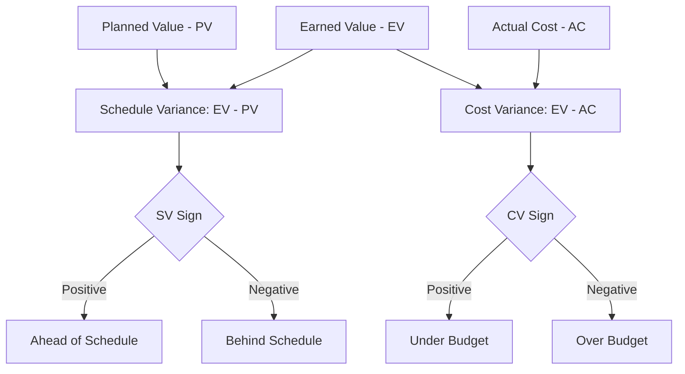

## Cost Variance and Schedule Variance

### Definitions

**Cost Variance (CV)** measures the difference between the value of work performed and the actual cost incurred to perform it — indicating whether a project is over or under budget for the work completed so far.

$$CV = EV - AC$$

**Schedule Variance (SV)** measures the difference between the value of work performed and the value of work planned — indicating whether a project is ahead of or behind schedule, in budgetary terms.

$$SV = EV - PV$$

Both are absolute (dollar or labor-hour) measures, derived from the same three core EVM data points: Planned Value (PV), Earned Value (EV), and Actual Cost (AC).

### Interpreting the Values

| Variance | Result | Interpretation |
| --- | --- | --- |
| CV | Positive ($CV > 0$) | Under budget — work performed cost less than earned value |
| CV | Zero ($CV = 0$) | On budget |
| CV | Negative ($CV < 0$) | Over budget — work performed cost more than earned value |
| SV | Positive ($SV > 0$) | Ahead of schedule |
| SV | Zero ($SV = 0$) | On schedule |
| SV | Negative ($SV < 0$) | Behind schedule |

A key nuance: SV is expressed in currency/labor-hours, not time. It does not directly tell you *how many days* behind a project is — only the dollar-value gap between planned and earned work. For an actual time-based lag, Schedule Performance Index (SPI) combined with schedule network analysis (or Earned Schedule techniques) is used instead. [Inference — this limitation of SV as a time-unit measure is a well-documented critique in EVM literature, particularly regarding near-project-end distortions]

### Worked Example

At a given reporting date for a task with $BAC = \$50{,}000$:

- $PV = \$50{,}000$ (task should be 100% complete per baseline schedule)
- $EV = \$35{,}000$ (task is actually 70% complete)
- $AC = \$40{,}000$ (actual cost spent so far)

$$CV = EV - AC = 35{,}000 - 40{,}000 = -\$5{,}000 \quad \text{(over budget)}$$

$$SV = EV - PV = 35{,}000 - 50{,}000 = -\$15{,}000 \quad \text{(behind schedule)}$$

This project is both over budget and behind schedule — a combination sometimes informally called a "double whammy," requiring corrective action on both cost control and schedule recovery.

### The Four Quadrants of Performance

Combining CV and SV signs produces four general project health states:

|  | SV > 0 (Ahead) | SV < 0 (Behind) |
| --- | --- | --- |
| **CV > 0 (Under Budget)** | Ideal: ahead and under budget | Behind schedule but efficient with cost |
| **CV < 0 (Over Budget)** | Ahead of schedule but overspending | Worst case: behind and over budget |

### Relationship to Performance Indices

CV and SV have index (ratio) counterparts that normalize the variance for easier comparison across projects of different sizes:

$$CPI = \frac{EV}{AC} \quad \text{(Cost Performance Index)}$$

$$SPI = \frac{EV}{PV} \quad \text{(Schedule Performance Index)}$$

A variance of $-\$5,000$ means very different things on a $50,000 project versus a $5,000,000 project; CPI and SPI provide the normalized (percentage-based) view that CV and SV alone cannot.

### Common Pitfalls

- **Treating SV as a time-based metric**: SV is denominated in cost/value units, not days or weeks
- **SV converging to zero near project completion regardless of actual delay**: because $PV$ approaches $BAC$ and $EV$ also approaches $BAC$ at project end, SV mathematically trends toward zero even on a late project — a known limitation addressed by Earned Schedule methods
- **Ignoring LOE (Level of Effort) tasks in SV aggregation**: LOE tasks always show $SV = 0$ by design, which can mask real variance elsewhere in a rolled-up total
- **Reporting variances without variance thresholds**: many organizations define acceptable variance thresholds (e.g., ±10% of BAC) to distinguish normal fluctuation from a genuine problem requiring a corrective action plan

### Visual: Variance Calculation Flow

### Related Topics

- Cost Performance Index (CPI) and Schedule Performance Index (SPI)
- Earned Schedule (ES) technique for time-based schedule variance
- Estimate at Completion (EAC) forecasting using CPI
- Variance thresholds and corrective action planning
- Level of Effort (LOE) impact on aggregated EVM metrics
- Integrating EVM variance with Critical Path Method (CPM) float analysis