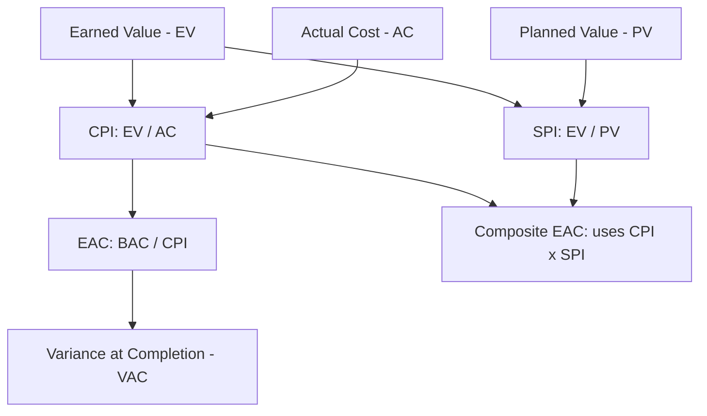

## Cost Performance Index and Schedule Performance Index

### Definitions

**Cost Performance Index (CPI)** is the ratio of Earned Value to Actual Cost, measuring cost efficiency — how much value is being produced per unit of currency spent.

$$CPI = \frac{EV}{AC}$$

**Schedule Performance Index (SPI)** is the ratio of Earned Value to Planned Value, measuring schedule efficiency — how much of the planned work is actually being accomplished.

$$SPI = \frac{EV}{PV}$$

Both are normalized (unitless) ratios, which makes them more directly comparable across tasks, work packages, or entire projects of different sizes than their absolute counterparts, Cost Variance (CV) and Schedule Variance (SV).

### Interpreting the Values

| Index | Value | Interpretation |
| --- | --- | --- |
| CPI | $> 1.0$ | Under budget — earning more value than spent |
| CPI | $= 1.0$ | On budget |
| CPI | $< 1.0$ | Over budget — earning less value than spent |
| SPI | $> 1.0$ | Ahead of schedule |
| SPI | $= 1.0$ | On schedule |
| SPI | $< 1.0$ | Behind schedule |

A CPI of 0.9, for example, means the project is getting only $0.90 of earned value for every $1.00 actually spent — a 10% cost inefficiency.

### Worked Example

For a task with $BAC = \$50{,}000$, at the reporting date:

- $PV = \$50{,}000$
- $EV = \$35{,}000$
- $AC = \$40{,}000$

$$CPI = \frac{EV}{AC} = \frac{35{,}000}{40{,}000} = 0.875$$

$$SPI = \frac{EV}{PV} = \frac{35{,}000}{50{,}000} = 0.70$$

This indicates the project is operating at 87.5% cost efficiency and 70% schedule efficiency relative to plan — both below the ideal 1.0 baseline.

### Use in Forecasting

CPI and SPI are the foundation of several standard Estimate at Completion (EAC) formulas, which project the likely final cost or schedule outcome based on current performance trends:

$$EAC = \frac{BAC}{CPI} \quad \text{(assumes current cost performance continues for remaining work)}$$

$$EAC = AC + \frac{BAC - EV}{CPI \times SPI} \quad \text{(assumes both cost and schedule performance influence remaining work — a more conservative composite formula)}$$

$$TCPI = \frac{BAC - EV}{BAC - AC} \quad \text{(the cost efficiency required for all remaining work to still hit BAC)}$$

Comparing $TCPI$ against current $CPI$ indicates whether the original budget is still realistically achievable: if $TCPI$ is substantially higher than the CPI trend achieved so far, hitting the original BAC becomes statistically improbable without a significant performance change. [Inference — this comparative use of TCPI vs. CPI as a "reality check" is standard EVM practice, but the threshold for "substantially higher" is judgment-based and organization-dependent]

### CPI vs. SPI — Combined Diagnostic Use

| CPI | SPI | Diagnosis |
| --- | --- | --- |
| $\geq 1.0$ | $\geq 1.0$ | Healthy: efficient and on/ahead of schedule |
| $\geq 1.0$ | $< 1.0$ | Efficient spending but falling behind schedule (may need more resources) |
| $< 1.0$ | $\geq 1.0$ | On schedule but inefficient (overspending to keep pace) |
| $< 1.0$ | $< 1.0$ | Critical: both over budget and behind schedule |

### Common Pitfalls

- **Treating CPI as static**: research commonly cited in EVM practice (the "80% rule," sometimes attributed to empirical DoD program studies) suggests that once a project passes roughly 20% completion, cumulative CPI rarely improves significantly — it tends to stabilize or worsen. [Unverified — this heuristic is widely cited in program management literature but its empirical basis varies by source and should not be treated as a guaranteed rule for every project type]
- **Using period (incremental) CPI/SPI instead of cumulative** without labeling which is which — the two can diverge significantly and lead to different conclusions
- **SPI approaching 1.0 near project completion regardless of actual delay**: since $EV$ and $PV$ both converge toward $BAC$ at project end, SPI becomes an unreliable schedule indicator in the final stages — Earned Schedule (ES) techniques address this limitation
- **Ignoring the compounding effect in the EAC formula** that uses $CPI \times SPI$: this formula assumes schedule pressure inflates future costs (e.g., overtime, expediting), which may not apply to every project context

### Visual: Index Calculation and Forecast Flow

### Related Topics

- Estimate at Completion (EAC) — full range of forecasting formulas
- To-Complete Performance Index (TCPI)
- Cost Variance (CV) and Schedule Variance (SV) as absolute counterparts
- Earned Schedule (ES) for time-based schedule performance near project end
- Cumulative vs. incremental (periodic) performance reporting
- Variance at Completion (VAC)