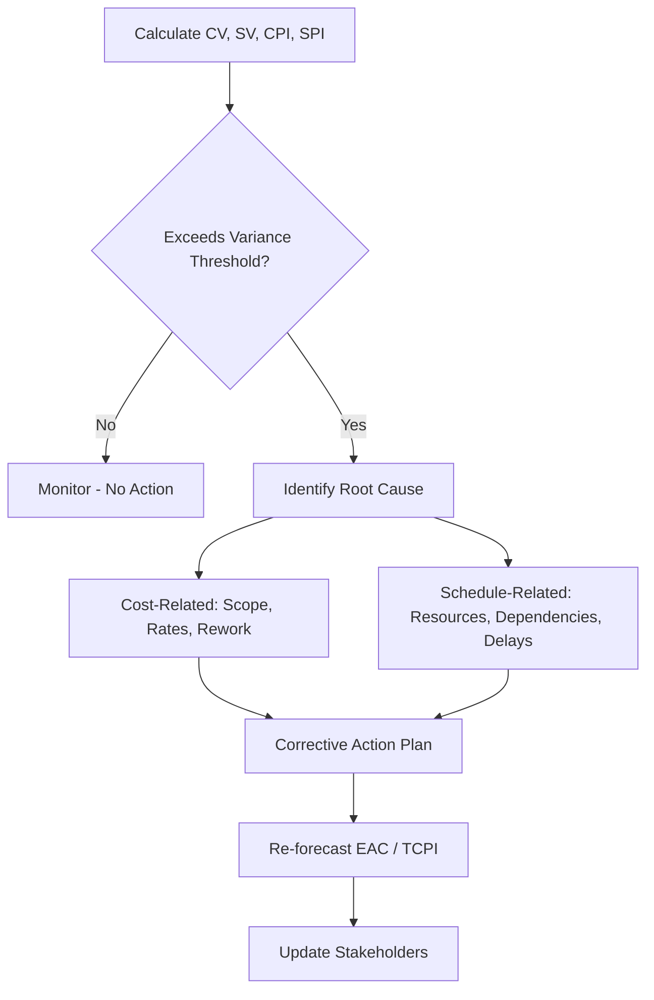

## Interpreting Cost and Schedule Variances

### Purpose of Interpretation

Calculating Cost Variance (CV), Schedule Variance (SV), CPI, and SPI is only the first step in EVM. The real analytical value comes from correctly interpreting what those numbers mean for a project's health, causes, and likely outcome — and avoiding common misreadings that lead to bad decisions.

### The Core Signal Table

| Metric | Formula | Positive/>1.0 | Negative/<1.0 |
| --- | --- | --- | --- |
| CV | $EV - AC$ | Under budget | Over budget |
| SV | $EV - PV$ | Ahead of schedule | Behind schedule |
| CPI | $EV / AC$ | Cost-efficient | Cost-inefficient |
| SPI | $EV / PV$ | Schedule-efficient | Schedule-inefficient |

### Magnitude Matters, Not Just Sign

A variance's sign tells direction; its magnitude tells severity. Most organizations define **variance thresholds** (e.g., a CV or SV exceeding ±10% of the relevant baseline value) to separate normal noise from a genuine issue requiring a formal corrective action plan or variance report. Without thresholds, teams risk either:

- **Alarm fatigue**: reacting to every minor fluctuation
- **Complacency**: allowing a slow-building overrun to go unaddressed until it's unrecoverable

### Distinguishing Root Cause from Symptom

A variance is a *symptom*; interpretation means tracing it to a *cause*. Common cause categories:

**For negative CV (over budget):**

- Underestimated original budget (estimating error)
- Scope creep not reflected in BAC
- Resource rate increases (labor, materials)
- Rework due to quality issues
- Inefficient execution or productivity loss

**For negative SV (behind schedule):**

- Resource unavailability or under-allocation
- Underestimated task durations
- Unresolved dependencies or external blockers
- Scope changes not reflected in the schedule baseline
- Weather, permitting, or other external delays (common in construction/LGU infrastructure contexts)

The same numeric variance can stem from entirely different root causes, so interpretation always requires supplementing EVM data with qualitative status information from the responsible task owner.

### The Four-Quadrant Health Check

Combining CV and SV signs gives a fast triage view:

|  | SV ≥ 0 | SV < 0 |
| --- | --- | --- |
| **CV ≥ 0** | Healthy | Behind but cost-controlled — may recover with schedule acceleration |
| **CV < 0** | Ahead but overspending — investigate resource burn rate | Critical — compounding risk, requires escalation |

### Interpreting Trends, Not Just Snapshots

A single reporting period's CV/SV is a snapshot; trend analysis across multiple periods reveals trajectory:

- **Improving trend**: variance narrowing toward zero — corrective actions working
- **Stable but negative**: chronic underperformance — the [Inference — commonly cited] "80% rule" heuristic suggests cumulative CPI rarely self-corrects once a project passes roughly 20% completion, making early trend detection valuable
- **Worsening trend**: accelerating risk — often warrants immediate management escalation and re-forecasting via EAC

### Worked Example — Interpreting a Combined Scenario

A work package shows, cumulatively:

- $PV = \$200{,}000$, $EV = \$170{,}000$, $AC = \$210{,}000$

$$CV = 170{,}000 - 210{,}000 = -\$40{,}000$$

$$SV = 170{,}000 - 200{,}000 = -\$30{,}000$$

$$CPI = 170{,}000 / 210{,}000 \approx 0.81$$

$$SPI = 170{,}000 / 200{,}000 = 0.85$$

**Interpretation**: The project is in the worst quadrant — both over budget and behind schedule. CPI of 0.81 indicates the team is earning only $0.81 per dollar spent. This combination often signals that schedule pressure is driving inefficient spending (e.g., overtime, expediting, added resources) without proportional output gain — reinforcing why some EAC formulas multiply $CPI \times SPI$ to model compounding risk on remaining work.

### Common Pitfalls in Interpretation

- **Reading SV as calendar time**: a $-\$30,000$ SV does not mean "X days late" — it must be paired with critical path/schedule network analysis or Earned Schedule (ES) to translate into a time estimate
- **Ignoring LOE task dilution**: Level of Effort tasks contribute $SV = 0$ by definition, which can mask real variance in aggregated totals across a WBS
- **Over-relying on a single period's data**: one bad week does not indicate a trend; conversely, waiting too many periods to act on a consistent negative trend delays corrective action
- **Failing to reconcile with qualitative status**: EVM numbers alone don't explain "why" — they must be interpreted alongside status reports, risk registers, and stakeholder input
- **Assuming positive variance is always good**: a strongly positive CV combined with negative SV can indicate underspending due to resource shortages, not efficiency — the "good" number may itself be a symptom of a problem

### Visual: Variance Interpretation Workflow

### Related Topics

- Variance thresholds and management-by-exception reporting
- Estimate at Completion (EAC) and re-forecasting methods
- To-Complete Performance Index (TCPI) as a feasibility check
- Earned Schedule (ES) for time-based schedule interpretation
- Root cause analysis techniques in project controls
- Corrective action planning and variance reports