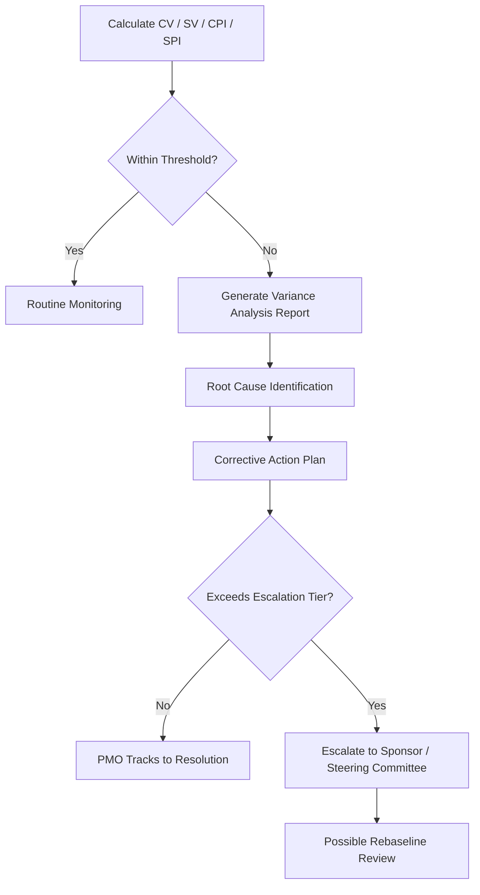

## Variance Thresholds and Reporting Triggers

### Definition

Variance thresholds are pre-defined tolerance limits set on Cost Variance (CV), Schedule Variance (SV), CPI, and/or SPI, beyond which a formal management response is required. Reporting triggers are the specific rules that convert a threshold breach into a mandatory action — such as escalation, a variance report, or a corrective action plan. Together they form the operational backbone of "management by exception" in EVM: routine monitoring for small fluctuations, active intervention only when performance crosses a defined line.

### Why Thresholds Are Necessary

Without thresholds, project teams face two failure modes:

- **Alarm fatigue**: reacting to every minor, statistically normal fluctuation wastes management attention and erodes trust in reporting
- **Complacency/drift**: absent a trigger, a slowly worsening variance can go unaddressed until it becomes unrecoverable

Thresholds convert continuous EVM data into discrete decision points, aligning project controls effort with actual risk.

### Common Threshold Formats

**1. Percentage of Baseline**

$$\left|\frac{CV}{BAC}\right| > x\%$$

A common convention is a ±10% threshold on cumulative CV or SV relative to BAC, though the specific percentage is organization- and risk-tolerance-dependent. [Inference — the ±10% figure is a frequently cited convention in program management practice, not a universal standard; actual thresholds vary by industry, contract type, and organizational risk appetite]

**2. Index-Based Thresholds**

$$CPI < 0.90 \quad \text{or} \quad SPI < 0.90$$

Triggers when the efficiency ratio falls outside an acceptable band (e.g., 0.90–1.10).

**3. Tiered/Escalating Thresholds**

Different variance magnitudes trigger different levels of response:

| Variance Band | Response Level |
| --- | --- |
| Within ±5% | Routine monitoring, no action |
| ±5% to ±10% | Flag in status report, watch trend |
| Beyond ±10% | Formal variance report + corrective action plan required |
| Beyond ±20% | Escalation to sponsor/steering committee, possible rebaseline review |

**4. Trend-Based Triggers**

Rather than (or in addition to) a single-period threshold, some frameworks trigger on a sustained pattern — e.g., CPI declining for three consecutive reporting periods — to catch developing problems before they cross an absolute threshold.

### Setting Thresholds — Key Factors

- **Contract type**: fixed-price contracts often demand tighter thresholds than cost-reimbursable contracts due to financial risk exposure
- **Project size and duration**: larger or longer projects may tolerate wider percentage bands, since normal statistical noise is proportionally larger
- **Organizational risk tolerance**: government/public-sector contexts (e.g., LGU-funded infrastructure or IT projects) frequently mandate stricter, contractually defined thresholds than internal corporate projects
- **WBS level**: thresholds are often tighter at the work-package level (to catch problems early) and looser at the total-project level (to avoid noise from offsetting variances)
- **Regulatory/standard requirements**: frameworks such as ANSI/EIA-748 (the U.S. EVMS standard) require documented variance analysis and thresholds as part of formal EVM system compliance for qualifying government contracts

### Worked Example

A project has $BAC = \$500{,}000$ and a defined threshold of ±10% on CV and SV.

$$\text{Threshold amount} = 0.10 \times 500{,}000 = \$50{,}000$$

At the reporting date: $EV = \$300{,}000$, $PV = \$320{,}000$, $AC = \$360{,}000$

$$CV = 300{,}000 - 360{,}000 = -\$60{,}000 \quad \rightarrow \quad |CV| > \$50{,}000 \text{ threshold} \Rightarrow \text{TRIGGERED}$$

$$SV = 300{,}000 - 320{,}000 = -\$20{,}000 \quad \rightarrow \quad |SV| < \$50{,}000 \text{ threshold} \Rightarrow \text{Not triggered}$$

Result: a formal cost variance report and corrective action plan is required, while schedule variance remains within acceptable tolerance and only requires routine monitoring.

### Reporting Trigger Workflow

Once a threshold is breached, a typical governance sequence follows:

1. **Automated or manual flag** in the EVM reporting tool/dashboard
2. **Variance analysis report (VAR)** prepared by the responsible manager, documenting root cause, impact, and proposed corrective action
3. **Review by project controls/PMO**, validating the analysis
4. **Escalation** to sponsor or steering committee if the variance exceeds a higher-tier threshold or remains unresolved after a defined period
5. **Corrective action plan approval and implementation**
6. **Re-forecast** of EAC/TCPI to reflect the revised outlook

### Common Pitfalls

- **Setting thresholds too tight**: generates excessive reports and dilutes attention from genuinely critical issues
- **Setting thresholds too loose**: allows real problems to go undetected until they are difficult to recover from
- **Uniform thresholds across dissimilar work packages**: a high-risk, novel work package may warrant a tighter threshold than a routine, well-understood one
- **No defined escalation path**: a threshold without a clear "then what happens" trigger produces reports that sit unactioned
- **Static thresholds never revisited**: as a project matures or risk profile changes, thresholds set at initiation may no longer be appropriate

### Visual: Threshold-Driven Reporting Logic

### Related Topics

- ANSI/EIA-748 EVM system compliance standards
- Variance analysis reports (VAR) structure and content
- Corrective action planning
- Rebaselining criteria and change control
- Management by exception as a governance principle
- Estimate at Completion (EAC) re-forecasting after a triggered variance