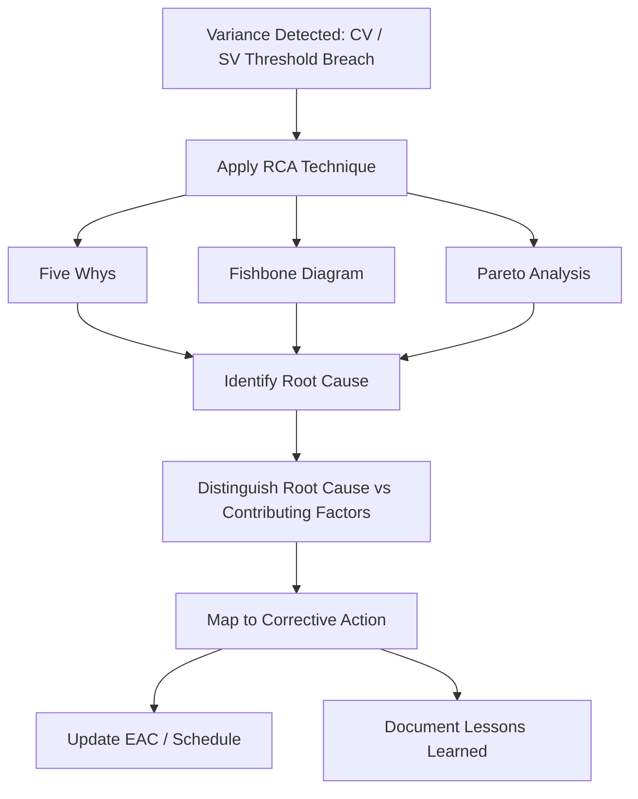

## Root Cause Analysis for Variances

### Purpose

Root cause analysis (RCA) is the process of tracing a detected Cost Variance (CV) or Schedule Variance (SV) back to its underlying driver, rather than stopping at the numeric symptom. EVM calculations tell a project manager *that* a variance exists and *how large* it is; RCA answers *why* it exists, which is the prerequisite for designing an effective corrective action plan. A variance report that states "CV is -$60,000" without cause analysis gives management a number but no lever to pull.

### Why RCA Matters in EVM Specifically

EVM's variance formulas are diagnostic, not causal — $CV = EV - AC$ and $SV = EV - PV$ are arithmetic outputs of a measurement system, not explanations. The same negative CV can result from completely different underlying problems (a pricing error vs. a productivity problem vs. scope creep), and each demands a different corrective response. Treating all negative CV the same way — e.g., defaulting to "cut costs" — can be actively counterproductive if the true cause is, for instance, unbudgeted scope that was never reflected in BAC.

### Common RCA Techniques Applied to Variances

**1. Five Whys**

Iteratively asking "why" to peel back symptom layers until reaching a systemic cause.

*Example trace for negative CV:*

- Why is CV negative? → Labor cost exceeded budget
- Why did labor cost exceed budget? → More overtime hours were used than planned
- Why was overtime needed? → The task fell behind schedule
- Why did the task fall behind? → A key resource was reassigned to another project
- Why was the resource reassigned? → Resource allocation conflict was not identified during planning

Root cause: inadequate resource capacity planning — not simply "labor cost overrun."

**2. Fishbone (Ishikawa) Diagram**

Organizes potential causes into categories, commonly adapted for project variances as:

- **People**: skill gaps, turnover, availability
- **Process**: unclear requirements, inefficient workflows, approval delays
- **Materials**: price escalation, supply delays, quality defects requiring rework
- **Equipment**: breakdowns, unavailability, wrong tooling
- **Environment**: weather, site access, regulatory/permitting delays (particularly relevant to public infrastructure and government-funded projects)
- **Management**: scope changes, unclear priorities, inadequate baseline planning

**3. Pareto Analysis (80/20)**

Applied when multiple variances exist across many WBS elements — ranks variance-contributing work packages by magnitude to focus RCA effort on the small number of items driving the majority of total variance, rather than distributing equal analytical effort across all of them.

### Categorizing Root Causes: Cost Variance

| Root Cause Category | Example |
| --- | --- |
| Estimating error | Original budget underestimated labor rates or material costs |
| Scope creep | Additional work performed without a corresponding BAC adjustment |
| Productivity loss | Rework, inefficient processes, learning curve on new methods |
| Rate/price escalation | Vendor price increases, currency fluctuation, inflation |
| Resource substitution | Higher-cost resource used than originally planned (e.g., senior staff covering for an unavailable junior role) |

### Categorizing Root Causes: Schedule Variance

| Root Cause Category | Example |
| --- | --- |
| Resource availability | Key personnel unavailable or reassigned |
| Dependency delays | Predecessor task or external deliverable delayed |
| Underestimated duration | Original schedule optimistic relative to actual task complexity |
| External factors | Weather, permitting, regulatory approval delays |
| Scope changes | Added scope not reflected in the schedule baseline |

### Distinguishing Root Cause from Contributing Factor

Effective RCA distinguishes the **root cause** (the underlying condition that, if corrected, prevents recurrence) from **contributing factors** (conditions that worsened the impact but weren't the origin). For example, if a permit delay is the root cause of an SV, a contributing factor might be that no schedule contingency was built in for permitting — worth noting for future planning, but not the primary corrective target for the current variance.

### Linking RCA to Corrective Action

RCA output should map directly to an actionable response:

| Root Cause | Typical Corrective Action |
| --- | --- |
| Resource capacity conflict | Reallocate resources, adjust task sequencing, add capacity |
| Estimating error | Update remaining work estimates, revise EAC methodology |
| Scope creep | Formalize change control, request BAC adjustment if approved |
| External/environmental delay | Fast-track successor tasks, evaluate schedule compression (crashing/fast-tracking) |
| Productivity/rework issue | Root-cause the quality process, add review checkpoints |

### Worked Example

A work package shows $SV = -\$30{,}000$ and $CV = -\$40{,}000$ cumulative.

- **Five Whys trace** reveals: a specialized inspection was delayed because the only qualified inspector was double-booked on another LGU project (schedule cause), and overtime pay was authorized afterward to compress the remaining timeline (cost cause, downstream of the schedule cause).
- **Root cause**: single point of failure in specialized resource availability — not independently a "cost problem" and a "schedule problem," but one root cause manifesting in both metrics.
- **Corrective action**: cross-train a backup inspector or engage a secondary qualified vendor, and formally note the single-resource dependency as a risk for future project planning.

This illustrates a key RCA principle: a negative CV and negative SV appearing together often share one upstream cause rather than being two unrelated problems requiring separate fixes.

### Common Pitfalls

- **Stopping at the first "why"**: treating the immediate proximate cause as root cause leads to superficial fixes that don't prevent recurrence
- **Blaming individuals instead of systems**: RCA aimed at "who" rather than "what process/condition allowed this" tends to produce defensive reporting and repeat issues
- **Analyzing cost and schedule variances in isolation**: as shown above, they frequently share a common root cause; siloed RCA misses this connection
- **No documentation/lessons-learned capture**: root causes not recorded are not available to prevent similar issues on future project phases or future projects
- **Confirmation bias**: assuming the cause before investigating, then selectively interpreting evidence to support that assumption

### Visual: RCA-to-Corrective-Action Flow

### Related Topics

- Variance thresholds and reporting triggers
- Corrective action planning and implementation tracking
- Estimate at Completion (EAC) re-forecasting after RCA
- Risk register integration with identified root causes
- Lessons learned documentation and knowledge management
- Schedule compression techniques (crashing and fast-tracking) as corrective responses