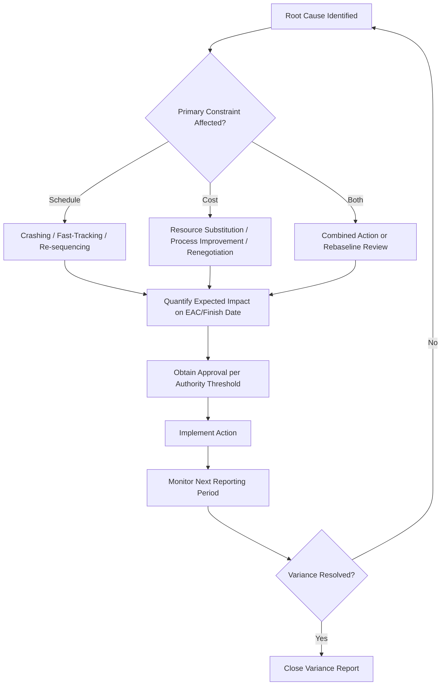

## Corrective Action Planning

### Definition

Corrective action planning is the structured process of designing, approving, and implementing specific interventions to bring a project's cost or schedule performance back within acceptable variance thresholds after a root cause has been identified. It is the operational output of variance analysis and root cause analysis (RCA) — the point where EVM diagnostics translate into actual management decisions and resource commitments.

### Position in the EVM Control Cycle

Corrective action planning sits at the end of a sequential control loop:

1. Measure performance (PV, EV, AC)
2. Calculate variances (CV, SV, CPI, SPI)
3. Compare against thresholds
4. Perform root cause analysis
5. **→ Develop and implement corrective action plan**
6. Re-forecast (EAC, TCPI) to validate expected effect
7. Monitor results in subsequent reporting periods

A corrective action plan without step 6 (re-forecasting) is incomplete — every proposed action should have a stated expected impact on the project's forecast so its effectiveness can be measured.

### Categories of Corrective Action

**Schedule recovery actions:**

- **Crashing**: adding resources to critical path activities to shorten duration, typically at increased cost
- **Fast-tracking**: performing activities in parallel that were originally planned sequentially, increasing risk but not necessarily cost
- **Re-sequencing**: reordering non-critical work to free up resources for critical path tasks
- **Scope reduction/deferral**: removing or postponing lower-priority scope (requires formal change control)

**Cost recovery actions:**

- **Resource substitution**: replacing higher-cost resources with lower-cost alternatives where feasible without quality impact
- **Process improvement**: addressing root-cause inefficiencies (e.g., rework reduction, workflow streamlining)
- **Vendor renegotiation**: revisiting contract terms, exploring alternative suppliers
- **Scope/quality trade-off review**: evaluating whether reduced scope or adjusted quality standards can restore budget alignment (with appropriate stakeholder approval)

**Combined/structural actions:**

- **Rebaselining**: formally revising BAC and the schedule baseline when the original baseline is no longer achievable or realistic — a significant governance decision, not a routine corrective action
- **Risk response activation**: drawing on contingency reserve or management reserve for issues covered by the risk register

### The Trade-off Triangle

Nearly every corrective action trades one constraint against another (the classic scope-cost-schedule-quality relationship):

| Action | Typically Improves | Typically Costs |
| --- | --- | --- |
| Crashing | Schedule | Cost (added resources) |
| Fast-tracking | Schedule | Risk (rework potential) |
| Scope reduction | Cost & Schedule | Scope/functionality |
| Resource substitution | Cost | Possibly quality/schedule |

A corrective action plan should explicitly state which constraint is being traded and by how much, so decision-makers approve with full visibility into the trade-off — not just the intended benefit.

### Structure of a Corrective Action Plan

A well-formed plan typically documents:

1. **Variance summary**: the specific CV/SV/CPI/SPI figures that triggered the plan
2. **Root cause**: from RCA, stated concisely
3. **Proposed action(s)**: specific, assigned, time-bound
4. **Expected impact**: quantified effect on EAC, schedule finish date, or both
5. **Resource/cost required to implement**: the action itself often has a cost (e.g., overtime pay, expedited shipping fees)
6. **Owner and timeline**: who is accountable and by when
7. **Approval**: sign-off from appropriate authority (PM, sponsor, or steering committee depending on magnitude)
8. **Monitoring checkpoint**: the next reporting period at which effectiveness will be evaluated

### Worked Example

A work package shows cumulative $CV = -\$40{,}000$, $SV = -\$30{,}000$, with $BAC = \$500{,}000$, $CPI = 0.85$.

**RCA finding**: schedule delay due to a single specialized resource bottleneck, driving overtime costs.

**Proposed corrective action**: engage a secondary vendor to add capacity for the remaining inspection work (a form of crashing).

- Estimated added cost: $15,000
- Estimated schedule recovery: 2 weeks on the critical path
- Expected effect on EAC: current $EAC = BAC / CPI = 500{,}000 / 0.85 \approx \$588{,}235$; with the corrective action's added $15,000 factored in against an anticipated CPI improvement to approximately 0.90 for remaining work, revised $EAC \approx AC + \frac{BAC - EV}{CPI_{new}}$, yielding a materially lower forecast than the uncorrected trajectory. [Inference — the specific revised EAC figure depends on the actual remaining-work CPI achieved after the action, which can only be confirmed in the subsequent reporting period]

**Approval**: since the added cost exceeds the work package's minor-variance authority threshold, this requires sponsor sign-off before implementation.

### Common Pitfalls

- **Proposing actions without quantifying expected impact**: makes it impossible to evaluate whether the action worked
- **Treating rebaselining as a routine corrective action**: rebaselining changes the measurement baseline itself and should be reserved for cases where the original baseline is genuinely no longer valid (e.g., approved major scope change), not used to "erase" a variance
- **Ignoring the cost of the corrective action itself**: crashing and expediting have real costs that must be weighed against the benefit of recovery
- **No follow-up monitoring**: a plan implemented but never checked against subsequent actuals cannot confirm whether it worked or needs adjustment
- **Single-constraint thinking**: optimizing schedule recovery while ignoring the cost impact (or vice versa) can trade one variance problem for another

### Visual: Corrective Action Decision Flow

### Related Topics

- Root cause analysis for variances
- Schedule compression techniques: crashing and fast-tracking
- Rebaselining criteria and change control
- Estimate at Completion (EAC) re-forecasting after corrective action
- Management reserve and risk response funding
- Change control board (CCB) processes