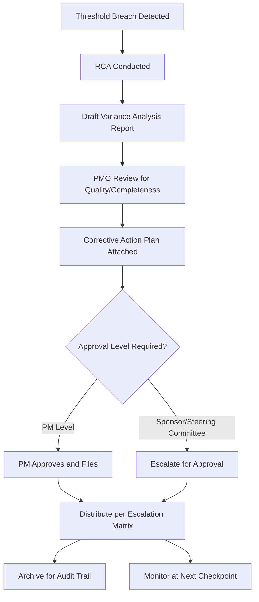

## Variance Analysis Reports

### Definition

A Variance Analysis Report (VAR) is the formal document produced when a cost or schedule variance breaches a defined threshold, capturing the variance data, its root cause, planned corrective action, and forecasted impact. It is the primary written artifact that connects EVM measurement to management decision-making and serves as the audit trail for how a project responded to performance deviations.

### Purpose Within the EVM Control Cycle

The VAR is the documentation output that follows threshold breach and root cause analysis (RCA), and precedes and justifies corrective action approval. It exists to:

- Provide management/sponsors with a structured, consistent basis for decisions
- Create an auditable record (particularly important on government-funded or contractually EVM-mandated projects, e.g., under ANSI/EIA-748 compliance requirements)
- Prevent informal or undocumented explanations for variances from substituting for rigorous analysis
- Support lessons-learned capture for future project planning

### Standard VAR Structure

A comprehensive VAR typically includes:

1. **Identification**: WBS element/work package, reporting period, report date, preparer
2. **Variance data**: CV, SV, CPI, SPI (both cumulative and period/incremental values)
3. **Threshold reference**: which specific threshold was breached and by how much
4. **Root cause narrative**: findings from RCA (Five Whys, Fishbone, etc.)
5. **Impact assessment**: effect on EAC, VAC, and projected completion date if uncorrected
6. **Corrective action plan**: proposed actions, expected effect, cost/schedule trade-offs
7. **Approval status**: sign-off level required and obtained
8. **Follow-up/monitoring plan**: next checkpoint for evaluating whether the action worked

### Cumulative vs. Period Variance in Reporting

A well-formed VAR distinguishes:

$$CV_{cumulative} = EV_{cumulative} - AC_{cumulative}$$

$$CV_{period} = EV_{period} - AC_{period}$$

Reporting only cumulative figures can mask a recent improving or worsening trend, since a large early variance can dominate the cumulative total for many subsequent periods even after corrective action has taken effect. Including both gives reviewers a trend view alongside the total-to-date picture.

### Worked Example — VAR Excerpt

**WBS Element**: 2.3 — Site Inspection Services

**Reporting Period**: August 2026 (cumulative through period 8)

| Metric | Value |
| --- | --- |
| BAC | $500,000 |
| Cumulative PV | $320,000 |
| Cumulative EV | $300,000 |
| Cumulative AC | $360,000 |
| CV | -$60,000 |
| SV | -$20,000 |
| CPI | 0.83 |
| SPI | 0.94 |

**Threshold breached**: CV exceeds the -10% of BAC threshold (-$50,000); SV remains within tolerance.

**Root cause**: Inspector resource bottleneck led to authorized overtime, increasing AC without a proportional EV gain (see linked RCA report).

**Corrective action**: Engage secondary inspection vendor; estimated added cost $15,000, expected CPI recovery to ~0.90 for remaining work.

**Revised EAC**: approximately $588,000 without action; approximately $560,000 with corrective action applied. [Inference — the precise revised EAC depends on actual CPI achieved in subsequent periods and is presented here as an illustrative forecast, not a guaranteed outcome]

**Approval required**: Project Sponsor (exceeds work-package-level authority threshold)

**Next checkpoint**: September 2026 reporting period

### Reporting Cadence and Distribution

VARs are typically generated:

- **Automatically flagged** by EVM software/dashboards when a threshold is crossed
- **Reviewed by project controls/PMO** before distribution, to validate data quality and RCA rigor
- **Distributed** according to a pre-defined escalation matrix — routine variances may stay at the project manager level, while high-magnitude or persistent variances escalate to sponsors or steering committees
- **Archived** as part of the project's formal record, especially where contractual EVM compliance requires an audit trail

### Common Pitfalls

- **Reporting numbers without narrative**: a VAR that lists CV/SV/CPI/SPI without root cause and corrective action is incomplete and provides no decision-support value
- **Inconsistent reporting format across periods or work packages**: makes trend analysis and cross-project comparison difficult
- **Delayed VAR production**: if reports lag significantly behind the reporting period they describe, corrective actions are delayed proportionally
- **Treating the VAR as a one-time document**: without a defined follow-up checkpoint, there's no mechanism to confirm whether the corrective action actually worked
- **Omitting period (incremental) data**: cumulative-only reporting can obscure whether a corrective action already implemented is showing early positive effect

### Visual: VAR Lifecycle

### Related Topics

- Variance thresholds and reporting triggers
- Root cause analysis for variances
- Corrective action planning
- ANSI/EIA-748 EVM system compliance requirements
- Estimate at Completion (EAC) and Variance at Completion (VAC) forecasting
- Project controls documentation and audit trail practices