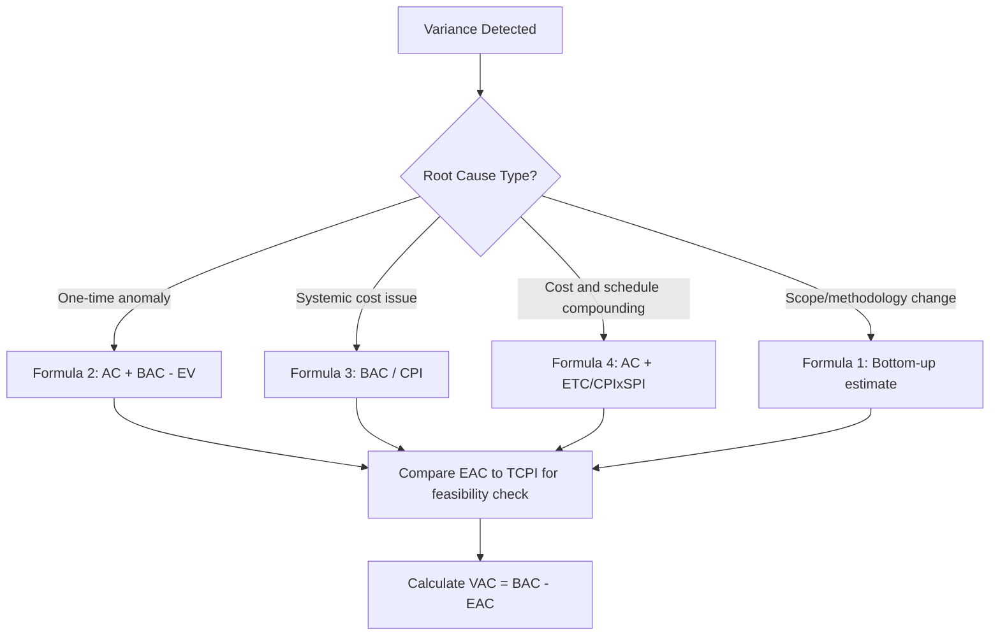

## Estimate at Completion Formulas and Scenarios

### Definition

Estimate at Completion (EAC) is a forecast of the total cost of a project or work package at completion, based on current performance data and assumptions about how remaining work will proceed. Unlike Budget at Completion (BAC), which is the fixed original plan, EAC is dynamic — recalculated each reporting period as actual performance data (EV, AC, CPI, SPI) accumulates.

$$EAC = AC + ETC$$

Where $ETC$ (Estimate to Complete) is the forecasted cost of the remaining work. The various EAC formulas differ primarily in how they estimate ETC.

### The Four Standard EAC Formulas

**1. EAC using a new, bottom-up estimate**

$$EAC = AC + \text{Bottom-Up ETC}$$

Used when the original estimating assumptions are no longer valid (e.g., a fundamental scope or methodology change) and the remaining work must be re-estimated from scratch by the responsible team. Most accurate but most resource-intensive to produce.

**2. EAC assuming atypical variance (one-time issue)**

$$EAC = AC + (BAC - EV)$$

Assumes the variance experienced so far was a one-time anomaly and remaining work will proceed exactly per the original budgeted rate. This is the most optimistic formula — it implicitly assumes $CPI = 1.0$ for all remaining work regardless of current performance.

**3. EAC assuming current CPI will continue (typical variance)**

$$EAC = \frac{BAC}{CPI}$$

The most commonly used formula. Assumes the cost efficiency observed to date will persist for the remainder of the project — a reasonable default assumption when the cause of variance is systemic (e.g., consistently higher labor rates) rather than a one-time event.

**4. EAC using a composite of cost and schedule performance**

$$EAC = AC + \frac{BAC - EV}{CPI \times SPI}$$

Assumes that both cost inefficiency and schedule pressure will compound to affect the cost of remaining work — for example, a project running behind schedule may face pressure to expedite remaining work at a premium. This is typically the most conservative (highest) forecast among the four.

### Choosing the Right Formula — Scenario Matching

| Scenario | Recommended Formula | Rationale |
| --- | --- | --- |
| A one-time cost spike (e.g., a single unusual material price surge) that is not expected to recur | Formula 2: $AC + (BAC - EV)$ | Assumes the anomaly won't repeat |
| Consistent, systemic cost overruns (e.g., persistently higher labor rates than budgeted) | Formula 3: $BAC / CPI$ | Assumes the trend continues |
| Both cost overruns and schedule delays, with schedule pressure likely to drive further cost increases (overtime, expediting) | Formula 4: $AC + \frac{BAC-EV}{CPI \times SPI}$ | Models compounding risk |
| Fundamental scope or methodology change invalidating original estimates | Formula 1: Bottom-up | Original assumptions no longer apply |

Selecting the appropriate formula requires judgment about *why* the current variance occurred — which is why root cause analysis typically precedes EAC selection, not just the raw CPI/SPI numbers.

### Worked Example — Comparing All Four Formulas

A project has $BAC = \$500{,}000$. At the current reporting date: $EV = \$300{,}000$, $AC = \$360{,}000$, $PV = \$320{,}000$.

$$CPI = \frac{300{,}000}{360{,}000} \approx 0.833$$

$$SPI = \frac{300{,}000}{320{,}000} = 0.9375$$

**Formula 1 (bottom-up)**: requires a fresh estimate from the team — not calculable from EVM data alone; assume the team estimates $210,000 for remaining work.

$$EAC_1 = 360{,}000 + 210{,}000 = \$570{,}000$$

**Formula 2 (atypical variance)**:

$$EAC_2 = 360{,}000 + (500{,}000 - 300{,}000) = 360{,}000 + 200{,}000 = \$560{,}000$$

**Formula 3 (typical variance, most common)**:

$$EAC_3 = \frac{500{,}000}{0.833} \approx \$600{,}240$$

**Formula 4 (composite cost-schedule)**:

$$EAC_4 = 360{,}000 + \frac{500{,}000 - 300{,}000}{0.833 \times 0.9375} = 360{,}000 + \frac{200{,}000}{0.781} \approx 360{,}000 + 256{,}057 \approx \$616{,}057$$

**Comparison**: The four formulas range from $560,000 (optimistic) to $616,057 (conservative/composite), illustrating why formula selection materially affects forecast communicated to stakeholders — a roughly $56,000 spread on this example alone.

### Relationship to Other Forecasting Metrics

$$VAC = BAC - EAC \quad \text{(Variance at Completion — positive means projected underrun, negative means overrun)}$$

$$TCPI = \frac{BAC - EV}{BAC - AC} \quad \text{(efficiency required on remaining work to hit BAC — compare against achievable CPI)}$$

Using the example above: $TCPI = \frac{500{,}000 - 300{,}000}{500{,}000 - 360{,}000} = \frac{200{,}000}{140{,}000} \approx 1.43$. Since the team's actual CPI trend is 0.833, achieving a required efficiency of 1.43 for all remaining work is statistically improbable without a significant performance change — reinforcing that Formula 3 or 4 is more realistic than assuming the original BAC is still achievable.

### Common Pitfalls

- **Defaulting to Formula 3 without considering cause**: applying the "typical variance" formula to a genuinely one-time anomaly overstates the forecast; applying the "atypical" Formula 2 to a systemic problem understates it
- **Not cross-checking EAC against TCPI**: a forecast that implies remaining-work efficiency far exceeds the CPI trend achieved so far should be treated skeptically
- **Presenting a single EAC as certain**: since EAC formulas embed assumptions, presenting a range (optimistic to conservative) alongside a primary recommended figure gives stakeholders better risk visibility than a single point estimate
- **Ignoring schedule performance entirely**: Formula 3 omits SPI, which can understate risk on schedule-constrained projects where late delivery drives cost premiums
- **Stale EAC**: failing to recalculate each reporting period means decisions are made on outdated forecasts

### Visual: EAC Formula Selection Logic

### Related Topics

- Variance at Completion (VAC)
- To-Complete Performance Index (TCPI) as a feasibility check
- Cost Performance Index (CPI) and Schedule Performance Index (SPI)
- Root cause analysis for variances (drives formula selection)
- Bottom-up estimating techniques
- Rebaselining criteria versus continued EAC forecasting