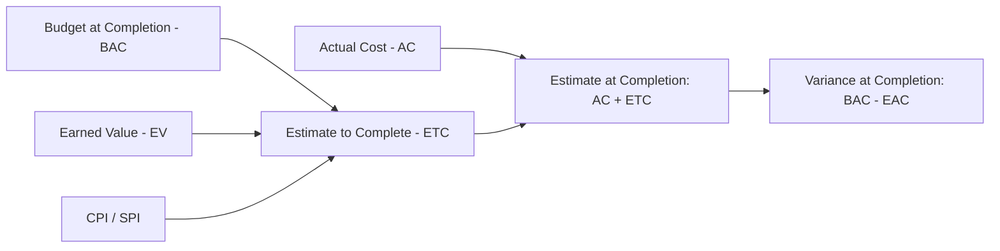

## Estimate to Complete

### Definition

Estimate to Complete (ETC) is the forecasted cost required to finish all remaining work on a project or work package, measured from the current reporting date forward. It is distinct from Estimate at Completion (EAC), which represents the *total* projected cost (past spending plus remaining spending):

$$EAC = AC + ETC$$

$$ETC = EAC - AC$$

Where AC is Actual Cost incurred to date. ETC answers the forward-looking question: **"From today, how much more will it cost to finish?"** — as opposed to EAC's question, "What will the whole project ultimately cost?"

### Methods for Calculating ETC

**1. Bottom-Up ETC (re-estimate remaining work)**

The responsible team re-estimates the cost of all remaining, not-yet-completed work packages or activities from scratch, using current knowledge, updated resource rates, and revised scope understanding.

$$ETC_{bottom-up} = \sum (\text{re-estimated cost of each remaining activity})$$

Most accurate when original assumptions are no longer valid, but the most labor-intensive method, since it requires detailed re-planning effort.

**2. ETC Assuming Atypical Variance (past variance is a one-time issue)**

$$ETC = BAC - EV$$

Assumes remaining work will proceed exactly at the originally budgeted rate, regardless of past performance. This is the optimistic assumption — it implies $CPI = 1.0$ going forward even if actual CPI to date is different.

**3. ETC Assuming Typical Variance (past performance will continue)**

$$ETC = \frac{BAC - EV}{CPI}$$

Assumes the cost efficiency observed so far will persist for remaining work — the most commonly applied default, particularly when the variance driver is systemic rather than a one-time event.

**4. ETC Using Composite Cost-Schedule Performance**

$$ETC = \frac{BAC - EV}{CPI \times SPI}$$

Incorporates schedule pressure as a compounding cost factor, appropriate when schedule delays are expected to drive additional cost on remaining work (e.g., overtime, expediting, resource premiums).

These map directly to the corresponding EAC formulas — ETC is simply the "remaining work" component isolated from AC.

### Worked Example

A project has $BAC = \$500{,}000$. At the current reporting date: $EV = \$300{,}000$, $AC = \$360{,}000$, $PV = \$320{,}000$.

$$CPI = \frac{300{,}000}{360{,}000} \approx 0.833$$

$$SPI = \frac{300{,}000}{320{,}000} = 0.9375$$

**Atypical variance ETC:**

$$ETC = 500{,}000 - 300{,}000 = \$200{,}000$$

**Typical variance ETC:**

$$ETC = \frac{500{,}000 - 300{,}000}{0.833} \approx \$240{,}096$$

**Composite ETC:**

$$ETC = \frac{200{,}000}{0.833 \times 0.9375} = \frac{200{,}000}{0.781} \approx \$256{,}057$$

The spread between $200,000 (optimistic) and $256,057 (conservative) reflects how differently the remaining work is projected to cost depending on what assumption is made about whether past performance will continue.

### ETC vs. Bottom-Up Reconciliation

A useful validation practice is comparing a formula-derived ETC against an independently produced bottom-up ETC from the responsible team:

- If the two are **close**, confidence in the forecast increases
- If the **bottom-up estimate is significantly higher** than the formula-derived ETC, it may indicate the team is aware of emerging risks or scope not yet reflected in the CPI/SPI trend
- If the **bottom-up estimate is significantly lower**, it may indicate overly optimistic team estimating, or alternatively that a genuine corrective action has already improved efficiency in ways not yet visible in cumulative CPI

This reconciliation is a standard project controls practice for validating forecast credibility. [Inference — the specific practice of reconciling formula-based and bottom-up ETC is a widely recommended EVM technique, though its formal name and rigor vary by organization]

### Common Pitfalls

- **Using the atypical-variance ETC by default**: this is the most optimistic formula and should only be used when there is a documented, specific reason to believe the past variance won't recur — not as a convenient default that produces a more favorable-looking forecast
- **Never reconciling with a bottom-up estimate**: relying solely on formula-derived ETC without periodic bottom-up validation can allow forecast drift to go undetected
- **Confusing ETC with EAC**: reporting ETC as if it were the total project cost (omitting AC already spent) understates the true financial picture to stakeholders
- **Static ETC not updated each period**: like EAC, ETC should be recalculated at each reporting cycle as new performance data becomes available
- **Ignoring remaining risk exposure**: ETC based purely on historical CPI/SPI trends doesn't account for known upcoming risks (e.g., an anticipated permit renewal cost) unless those are explicitly folded into a bottom-up estimate

### Visual: ETC Within the Forecasting Chain

### Related Topics

- Estimate at Completion (EAC) formulas and scenarios
- Variance at Completion (VAC)
- To-Complete Performance Index (TCPI)
- Bottom-up estimating and reconciliation practices
- Cost Performance Index (CPI) and Schedule Performance Index (SPI)
- Risk register integration into remaining-work forecasts