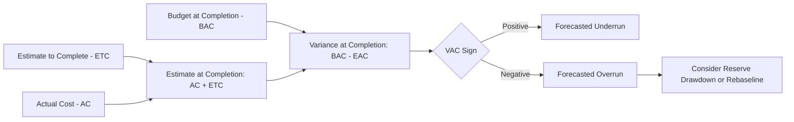

## Variance at Completion

### Definition

Variance at Completion (VAC) is the projected difference between the original total budget and the forecasted total cost at project completion. It measures how much a project is expected to be over or under budget once all work is finished, based on current performance trends.

$$VAC = BAC - EAC$$

Where BAC is the original Budget at Completion (fixed baseline) and EAC is the current Estimate at Completion (a dynamic forecast recalculated each reporting period).

### Purpose Within EVM

While Cost Variance (CV) tells you the budget performance *to date*, VAC tells you the projected budget performance *at the end of the project* — it is the forward-looking counterpart to CV. VAC answers: **"If current trends continue, will we finish under or over the original budget, and by how much?"**

$$CV = EV - AC \quad \text{(performance so far)}$$

$$VAC = BAC - EAC \quad \text{(projected performance at completion)}$$

Because EAC depends on which forecasting formula is used, VAC inherits that same dependency — a project can show different VAC figures depending on whether an optimistic or conservative EAC assumption is applied.

### Interpreting the Sign

| VAC Result | Interpretation |
| --- | --- |
| $VAC > 0$ | Project is forecasted to finish **under** the original budget |
| $VAC = 0$ | Project is forecasted to finish exactly **on** budget |
| $VAC < 0$ | Project is forecasted to finish **over** the original budget |

Note that VAC's sign convention is the mirror image of how CV is often discussed: a positive CV/VAC is favorable in both cases, but VAC is a completion-point forecast while CV is a to-date measurement — the two do not necessarily point the same direction. A project could have a currently improving CV trend but still show a negative VAC if the cumulative deficit built up earlier in the project is too large to fully recover.

### Worked Example

A project has $BAC = \$500{,}000$. At the current reporting date, cumulative $EV = \$300{,}000$, $AC = \$360{,}000$, giving $CPI \approx 0.833$.

Using the "typical variance continues" EAC formula:

$$EAC = \frac{BAC}{CPI} = \frac{500{,}000}{0.833} \approx \$600{,}240$$

$$VAC = BAC - EAC = 500{,}000 - 600{,}240 = -\$100{,}240$$

This indicates the project is currently forecast to finish approximately $100,240 over its original $500,000 budget if the current cost efficiency trend continues unchanged.

**Comparing across EAC assumptions:**

| EAC Formula | EAC Result | VAC Result |
| --- | --- | --- |
| Atypical variance: $AC + (BAC-EV)$ | $560,000 | -$60,000 |
| Typical variance: $BAC/CPI$ | $600,240 | -$100,240 |
| Composite: $AC + \frac{BAC-EV}{CPI \times SPI}$ | $616,057 | -$116,057 |

This range illustrates why VAC should typically be presented alongside a statement of which EAC assumption underlies it, rather than as a single unqualified figure — stakeholders need to understand whether they're looking at an optimistic or conservative projection.

### VAC as a Percentage

Expressing VAC as a percentage of BAC helps normalize comparisons across projects of different sizes:

$$VAC\% = \frac{VAC}{BAC} \times 100$$

Using the typical-variance example: $VAC\% = \frac{-100{,}240}{500{,}000} \times 100 \approx -20\%$, indicating a forecasted overrun of roughly 20% of the original budget — a magnitude that would likely exceed most organizations' escalation thresholds and warrant formal management attention.

### VAC and Decision-Making

VAC is a key input for several downstream management decisions:

- **Contingency/reserve drawdown decisions**: a significantly negative VAC may justify releasing management reserve to cover the projected overrun
- **Rebaselining triggers**: a persistently large negative VAC across multiple reporting periods, especially when supported by a bottom-up ETC reconciliation, is one of the standard justifications for a formal rebaseline
- **Stakeholder/sponsor reporting**: VAC is frequently one of the top-line metrics reported upward, since it translates technical EVM data into the business question stakeholders care most about — final cost outcome
- **Go/no-go and scope trade-off discussions**: a severely negative VAC may prompt a scope reduction, funding increase request, or project cancellation review, depending on organizational governance

### Common Pitfalls

- **Presenting VAC without disclosing the underlying EAC assumption**: since VAC is only as reliable as the EAC formula behind it, an unqualified VAC figure can be misleading, particularly if the reader assumes it reflects a bottom-up, validated estimate rather than a formula-derived projection
- **Treating VAC as certain rather than a forecast**: VAC updates every reporting period as new data comes in; early-project VAC figures carry more uncertainty than late-project figures, since less actual performance data has accumulated
- **Ignoring VAC trend over time**: a single period's VAC is a snapshot; tracking VAC across periods reveals whether the forecast is stabilizing, improving, or deteriorating
- **Confusing VAC with CV**: VAC is a completion-point forecast, CV is a to-date measurement — conflating the two leads to incorrect conclusions about current versus projected performance
- **No corresponding action tied to a significant VAC**: identifying a large negative VAC without triggering RCA, corrective action planning, or a rebaseline discussion leaves the forecast as information without a management response

### Visual: VAC Within the Forecasting Chain

### Related Topics

- Estimate at Completion (EAC) formulas and scenarios
- Estimate to Complete (ETC)
- To-Complete Performance Index (TCPI)
- Management reserve and contingency drawdown decisions
- Rebaselining criteria and change control
- Cost Variance (CV) as the to-date counterpart to VAC