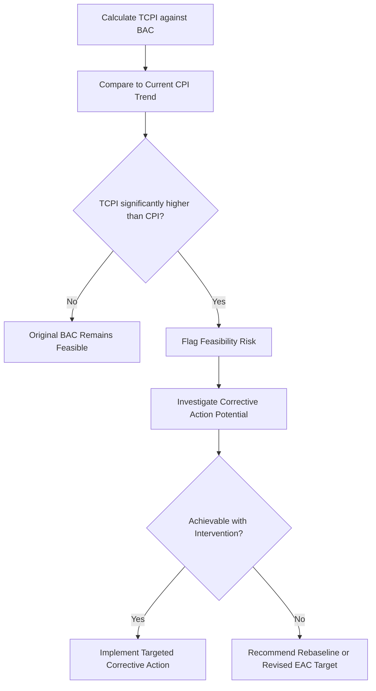

## To Complete Performance Index

### Definition

To-Complete Performance Index (TCPI) is the projected cost efficiency that must be achieved on all remaining work in order to meet a specified cost target — either the original Budget at Completion (BAC) or a revised Estimate at Completion (EAC). It answers a specific forward-looking question: **"How efficient does the team need to be from now on to hit the target?"**

$$TCPI_{BAC} = \frac{BAC - EV}{BAC - AC}$$

$$TCPI_{EAC} = \frac{BAC - EV}{EAC - AC}$$

The numerator in both formulas ($BAC - EV$) represents the remaining work still to be earned. The denominator represents the remaining budget available — either against the original BAC or against a revised, more realistic EAC.

### Purpose Within EVM

TCPI serves as a **feasibility check** rather than a forecast. Unlike EAC (which projects the most likely final cost) or CPI (which measures efficiency achieved so far), TCPI calculates the efficiency *required going forward* to hit a specific target, then invites comparison against what the project has actually demonstrated it can achieve.

$$\text{Compare: } TCPI_{BAC} \text{ vs. current } CPI$$

If $TCPI_{BAC}$ is significantly higher than the CPI trend the project has shown to date, hitting the original BAC becomes statistically improbable without a substantial, demonstrable change in performance — providing an objective basis for recommending a rebaseline or revised target rather than continuing to report against an unrealistic budget.

### Worked Example

A project has $BAC = \$500{,}000$. At the current reporting date: $EV = \$300{,}000$, $AC = \$360{,}000$.

$$CPI = \frac{300{,}000}{360{,}000} \approx 0.833$$

**TCPI to hit original BAC:**

$$TCPI_{BAC} = \frac{500{,}000 - 300{,}000}{500{,}000 - 360{,}000} = \frac{200{,}000}{140{,}000} \approx 1.43$$

**Interpretation**: The team needs to achieve a CPI of 1.43 on all remaining work — meaning $1.43 of earned value for every $1.00 spent — to still finish within the original $500,000 budget. Since the demonstrated CPI to date is only 0.833, and the required 1.43 represents roughly a 72% improvement over historical performance, hitting the original BAC without a fundamental change to the project's cost structure is highly unlikely. [Inference — the specific likelihood of achieving a large required efficiency jump is a judgment call informed by TCPI/CPI comparison, not a statistical guarantee; the widely cited rule of thumb is that a TCPI more than roughly 0.1–0.2 above current CPI signals low feasibility, though the exact threshold varies by source and context]

**TCPI against a revised EAC** (using $EAC = BAC/CPI \approx \$600{,}240$):

$$TCPI_{EAC} = \frac{500{,}000 - 300{,}000}{600{,}240 - 360{,}000} = \frac{200{,}000}{240{,}240} \approx 0.83$$

This second calculation, using the revised EAC as the target rather than the original BAC, yields a required TCPI of approximately 0.83 — nearly identical to the current CPI of 0.833. This confirms internal consistency: the EAC formula used ($BAC/CPI$) inherently assumes the current CPI trend continues, so the TCPI needed to hit that same EAC naturally converges to roughly the current CPI.

### TCPI Interpretation Table

| TCPI vs. Current CPI | Interpretation |
| --- | --- |
| TCPI ≈ current CPI | Target is realistic; current performance trend supports it |
| TCPI moderately > current CPI | Achievable but requires deliberate improvement effort |
| TCPI significantly > current CPI | Target likely unachievable without major corrective action or rebaseline |
| TCPI < current CPI | Team could underperform its recent trend and still hit the target (rare, favorable scenario) |

### Use Cases

- **Early warning for rebaseline discussions**: a consistently high TCPI-to-CPI gap across multiple reporting periods is one of the standard quantitative justifications for proposing a formal rebaseline
- **Performance target setting**: TCPI can be communicated to the project team as an explicit efficiency target for remaining work (e.g., "we need to operate at CPI 1.1 or better going forward")
- **Sponsor/stakeholder communication**: expressing feasibility in terms of "the team would need to be X% more efficient than they have been" is often more intuitive to non-technical stakeholders than raw EAC or VAC figures alone
- **Contract/claims contexts**: on some government or fixed-price contracts, TCPI feasibility analysis supports formal requests for schedule or budget relief by demonstrating the original target is no longer achievable through ordinary performance improvement

### Common Pitfalls

- **Calculating TCPI but never comparing it to actual CPI**: TCPI in isolation is just a number; its value comes entirely from the comparison against demonstrated performance
- **Using $TCPI_{BAC}$ when a rebaseline has already occurred**: once BAC is formally revised, TCPI calculations should typically reference the current approved baseline, not a superseded original figure
- **Treating a high TCPI as impossible rather than "improbable without specific intervention"**: a TCPI gap should prompt investigation into what specific corrective actions could close it, rather than automatic dismissal
- **Confusing TCPI with CPI**: CPI measures efficiency already achieved; TCPI measures efficiency still required — conflating the two produces confused reporting
- **Ignoring TCPI in early-project reporting**: while less reliable with limited data early on, tracking TCPI from early stages helps detect an unrealistic original budget sooner rather than later

### Visual: TCPI Feasibility Check Flow

### Related Topics

- Estimate at Completion (EAC) formulas and scenarios
- Variance at Completion (VAC)
- Cost Performance Index (CPI) as the historical benchmark for TCPI
- Rebaselining criteria and change control
- Corrective action planning
- Contract claims and schedule/budget relief justification