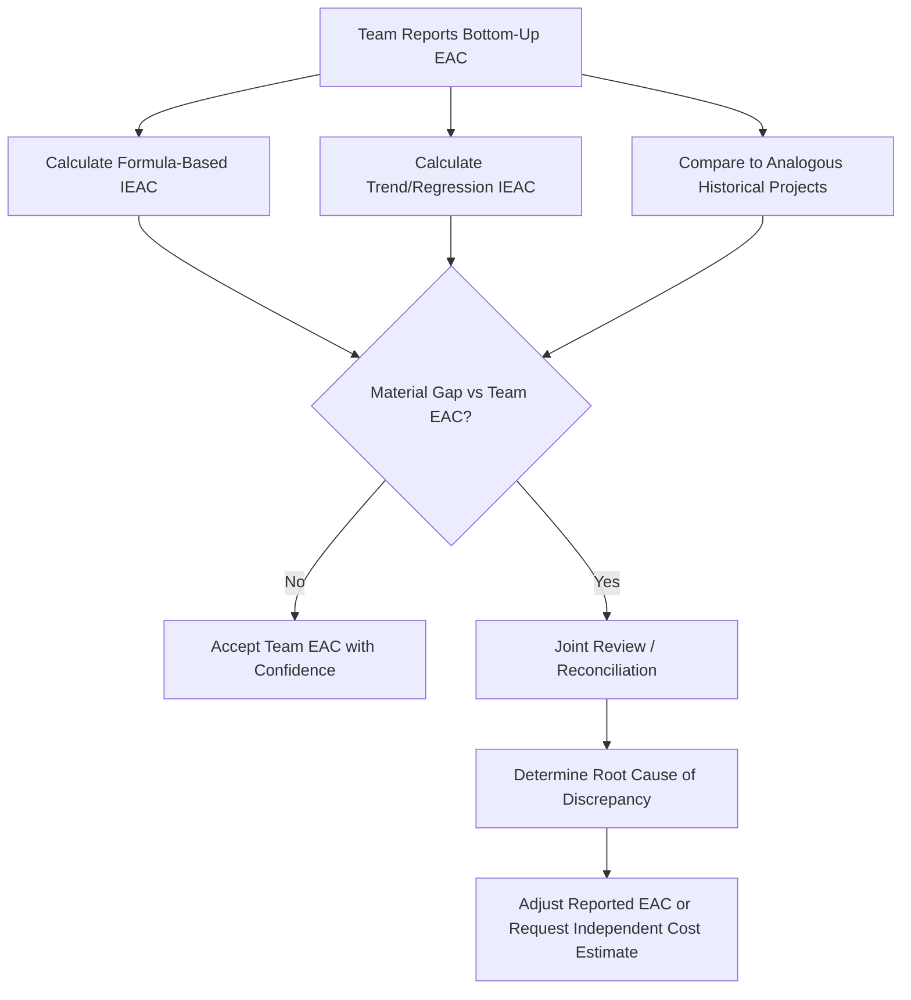

## Independent Estimate at Completion Techniques

### Definition

Independent Estimate at Completion (IEAC) techniques are methods for forecasting a project's final cost that are calculated separately from — and used to validate or challenge — the project team's own reported EAC. The core purpose is to provide an external check against optimism bias, estimating errors, or incomplete disclosure in a team-generated forecast, by deriving a comparable projection using an independent methodology or independent data source.

### Why Independence Matters

A project team's self-reported EAC carries inherent risk of bias:

- **Optimism bias**: teams may believe a corrective action will work better than historical data supports
- **Incentive misalignment**: a team facing schedule/budget pressure may be motivated to report a more favorable forecast than the data justifies
- **Incomplete information**: a bottom-up estimate reflects only what the team currently knows, which may omit emerging risks visible from a portfolio or historical-pattern perspective

Independent techniques counter these risks by relying on formulas, statistical patterns, or third-party analysis that are not subject to the same incentives as the team producing the primary EAC.

### Common Independent EAC Approaches

**1. Statistical/Formula-Based IEAC (as a cross-check, not the primary EAC)**

Using the standard $EAC = BAC/CPI$ or composite $EAC = AC + \frac{BAC-EV}{CPI \times SPI}$ formulas independently of whatever the project team reports, then comparing the two. A material gap between the formula-derived IEAC and the team's bottom-up EAC is itself a signal warranting investigation.

**2. Regression/Trend-Based IEAC**

Uses historical CPI and SPI trend lines (e.g., plotted across all prior reporting periods) to extrapolate a trajectory, rather than relying on a single current-period CPI snapshot. This smooths out short-term volatility and can reveal a longer-term deteriorating or improving pattern that a single-period formula might miss. [Inference — regression-based EAC extrapolation is a recognized technique in project controls practice, though its specific statistical methodology (linear vs. non-linear fitting) varies by implementation and is less standardized than the four core EAC formulas]

**3. Analogous/Historical Project Comparison**

Compares the current project's performance pattern against completed, similar historical projects (same type of work, similar organization, similar contract structure) to sanity-check whether the team's EAC assumptions are consistent with how comparable projects have actually turned out. Particularly useful in organizations with a mature project history database — common in government/LGU capital programs that execute similar infrastructure or IT projects repeatedly.

**4. Independent Cost Estimator (ICE) / Third-Party Review**

An estimator or cost analyst not embedded in the project team performs a fresh bottom-up or parametric estimate of remaining work, using the same scope documentation but without exposure to the team's existing assumptions. Common on large government contracts as a formal contractual or audit requirement (e.g., in U.S. federal EVM systems under ANSI/EIA-748, independent cost estimates are a recognized best practice for major program milestones).

**5. Parametric Estimating Cross-Check**

Applies statistical relationships between project characteristics and historical cost (e.g., cost per square meter for construction, cost per function point for software) to derive an independent estimate of remaining scope cost, compared against the team's EAC.

### Worked Comparison Example

A project reports a bottom-up team EAC of $560,000. Independent cross-checks:

| Method | Independent EAC | Gap vs. Team EAC |
| --- | --- | --- |
| Team bottom-up EAC | $560,000 | — |
| Formula-based IEAC ($BAC/CPI$) | $600,240 | +$40,240 |
| Composite formula IEAC | $616,057 | +$56,057 |
| Analogous project comparison | ~$605,000 (based on similar past project's final CPI) | +$45,000 |

**Interpretation**: All three independent methods project a higher final cost than the team's bottom-up estimate, converging in the $600,000–$616,000 range. This consistent gap across independent approaches suggests the team's $560,000 figure may be optimistic and warrants further scrutiny before being accepted as the reported forecast — rather than any single independent method being treated as automatically "more correct."

### When to Apply Independent EAC Techniques

- **High-value or high-risk projects**: where forecast accuracy has significant financial or contractual consequences
- **Contractually mandated milestones**: some government contracts require independent cost estimates at defined program gates
- **When team EAC shows unexplained improvement**: a sudden, unexplained jump in reported CPI or a lower-than-trend EAC should trigger independent validation
- **Portfolio-level reporting**: organizations managing multiple projects may apply a standardized independent formula across all projects for consistent, comparable executive reporting, separate from each project's individually reported EAC
- **Dispute or claims contexts**: independent estimates provide a defensible, methodologically transparent basis when project cost outcomes are contested

### Common Pitfalls

- **Treating the independent estimate as automatically correct**: independent techniques have their own assumptions and limitations; the goal is triangulation and informed discussion, not blind substitution
- **Using only one independent method**: relying on a single formula-based IEAC provides less robust validation than combining multiple independent approaches (formula, trend, analogous comparison)
- **Applying independent review too late**: independent checks are most valuable early enough in the deteriorating trend to inform corrective action, not merely to confirm a problem after it's unrecoverable
- **Ignoring context differences in analogous comparisons**: two projects that look similar on the surface may differ meaningfully in scope complexity, site conditions, or team experience, undermining the validity of the comparison
- **No process for reconciling disagreements**: when independent and team EAC diverge significantly, organizations need a defined process (e.g., joint review meeting, PMO mediation) rather than simply reporting both numbers without resolution

### Visual: Independent EAC Validation Flow

### Related Topics

- Estimate at Completion (EAC) formulas and scenarios
- To-Complete Performance Index (TCPI) as a feasibility check
- Bottom-up estimating and reconciliation practices
- ANSI/EIA-748 EVM system compliance requirements
- Parametric and analogous estimating techniques
- Rebaselining criteria and change control