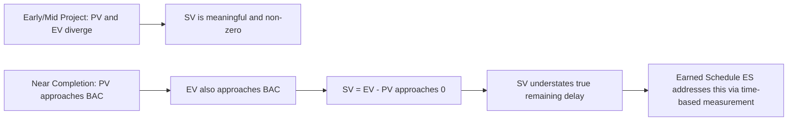

## Limitations of Traditional Schedule Variance in Time Units

### The Core Problem

Traditional Schedule Variance (SV), as used in classic EVM, is denominated in currency (or labor-hours) — not in time:

$$SV = EV - PV$$

This means SV tells you the *dollar-value gap* between what was planned and what was earned, not how many days or weeks a project is actually behind. Translating a dollar-based SV into an intuitive "we are X days late" statement is not mathematically valid using traditional EVM alone, yet stakeholders frequently want — and informally assume — exactly that interpretation. This mismatch between what SV actually measures and what people intuitively expect it to mean is the central limitation this topic addresses.

### Limitation 1: SV Converges to Zero Near Project Completion

The most well-documented flaw in traditional SV is its behavior as a project approaches its finish date. Since both $PV$ and $EV$ mathematically approach $BAC$ as the project nears completion (PV because the full schedule has elapsed; EV because all work is eventually completed and earned), the gap between them — SV — necessarily shrinks toward zero regardless of whether the project is actually finishing on time or is severely delayed.

$$\lim_{t \to \text{finish}} SV = \lim_{t \to \text{finish}} (EV - PV) = BAC - BAC = 0$$

This means a project that is, in reality, several weeks late can show an SV close to zero in its final reporting periods — precisely when accurate schedule status matters most. This is widely cited in EVM literature as SV's most significant structural weakness. [Inference — the mathematical convergence itself is a direct consequence of the SV formula and is not in dispute; characterizing it as the "most significant" weakness reflects a common but not universal emphasis in the literature]

### Limitation 2: SV Cannot Express "How Late" in Calendar Terms

Even mid-project, a given SV dollar figure doesn't translate cleanly into a day/week delay figure, because:

- The relationship between dollar-value of work and calendar time is not linear or constant — it depends on the specific mix of activities in progress and their individual cost-to-duration ratios
- A large SV on a low-cost-intensity phase (e.g., planning/design) may represent a very different calendar delay than the same dollar SV during a high-cost-intensity phase (e.g., major construction/procurement)
- Stakeholders asking "how many days behind are we?" cannot be answered directly from SV without additional schedule network analysis

### Limitation 3: Level of Effort (LOE) Tasks Distort Aggregated SV

For tasks measured using the Level of Effort (LOE) technique — common for project management overhead, ongoing support, or other tasks without a discrete measurable deliverable — EV is defined to equal PV by convention. This means LOE tasks always show $SV = 0$, by design, not because they are actually on schedule. When LOE tasks are rolled up into total project SV alongside discrete-effort tasks, they can dilute or mask real schedule variance occurring elsewhere in the project.

### Limitation 4: Negative SV Doesn't Indicate Critical Path Impact

A negative SV tells you that less value has been earned than planned, but it does not distinguish between:

- Delay on the **critical path** (directly threatens the project finish date)
- Delay on **non-critical activities with available float** (may have zero impact on the finish date)

Two work packages with identical negative SV can carry entirely different schedule risk depending on where they sit relative to the critical path — information that traditional EVM's SV formula does not capture. This is one of the key motivations for integrating EVM with Critical Path Method (CPM) schedule network analysis rather than relying on SV in isolation.

### Worked Example — The End-of-Project Distortion

A project with $BAC = \$500{,}000$ is running significantly behind schedule but is now near its planned finish date.

- Cumulative $PV = \$480{,}000$ (96% of budget planned to be spent by now)
- Cumulative $EV = \$460{,}000$ (92% of work actually earned — the project is genuinely behind)

$$SV = 460{,}000 - 480{,}000 = -\$20{,}000$$

At first glance, a $20,000 SV on a $500,000 project (a 4% gap) appears mild. But this masks the fact that the remaining 8% of work ($BAC - EV = \$40,000$ worth) may take substantially longer than the small dollar gap suggests, if that remaining work sits on the critical path and involves activities with long durations relative to their cost. Traditional SV, taken at face value in the final stretch, understates the real schedule risk.

### Why This Motivates Earned Schedule (ES)

These limitations are the primary justification for the **Earned Schedule (ES)** technique, which recasts schedule performance in actual time units (weeks, months) rather than dollars, and does not suffer from the same end-of-project convergence-to-zero problem. Earned Schedule derives a "when did we earn the value we've earned" time-based metric, enabling a genuine time-based schedule variance ($SV(t) = ES - AT$, where AT is actual time elapsed) instead of a dollar-value proxy for schedule performance.

### Common Pitfalls in Practice

- **Reporting SV as if it were a day-count**: stating "SV of -$20,000 means we're 2 weeks behind" without a valid conversion methodology is a common and misleading shorthand
- **Relying solely on SV near project completion**: given the mathematical convergence to zero, SV should be supplemented with critical path status and remaining-work analysis in the final project phases
- **Ignoring LOE dilution in rolled-up reporting**: aggregate SV across a WBS that mixes discrete and LOE-measured tasks can present a falsely reassuring picture
- **Not cross-referencing SV with CPM float**: treating all negative-SV work packages as equally urgent, without checking which ones threaten the critical path

### Visual: Why SV Converges Near Completion

### Related Topics

- Earned Schedule (ES) method and SV(t) calculation
- Critical Path Method (CPM) integration with EVM
- Level of Effort (LOE) measurement technique
- Schedule Performance Index (SPI) and its analogous end-of-project limitation
- Float and critical path analysis
- Schedule network analysis techniques